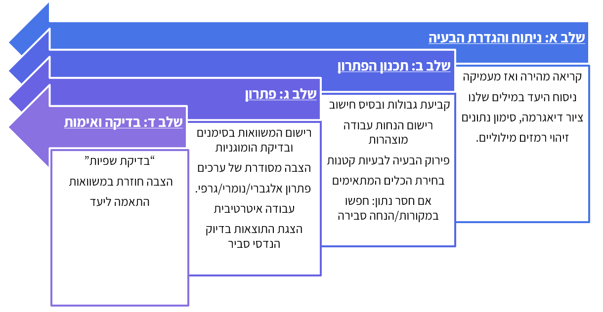

# [פרק 1 -- מבוא להנדסת תהליכים]{dir="rtl"}

## [מהי הנדסת תהליך]{dir="rtl"}?

[הנדסת תהליך היא תחום הנדסי-מדעי רחב, העוסק בהמרת חומרי גלם למוצרים בעלי ערך כלכלי או חברתי, באמצעות תהליכים מתוכננים ומבוקרים. בניגוד למדע \"טהור\", שמבקש להבין תופעות טבע, מטרתה של הנדסת תהליך היא **לרתום את הידע המדעי לצורך יישום מעשי**]{dir="rtl"}. [מהנדסי תהליך שואלים לא רק *מהי* תגובה כימית או ביולוגית, אלא גם *כיצד ניתן לתרגם אותה לייצור תעשייתי* - יציב, בטוח, כלכלי ובר-קיימא]{dir="rtl"}.

[התחום משלב ידע ממדעים בסיסיים -- כימיה, ביולוגיה, פיזיקה ומתמטיקה -- יחד עם כלים הנדסיים ותפיסה מערכתית. השאלה המרכזית היא תמיד מערכתית: איך הופכים תהליך מקומי או תופעה מדעית לתהליך כולל, שבו חומרי גלם מוזרמים, מומרצים, עוברים שינוי, מופרדים, ומניבים מוצר איכותי]{dir="rtl"}?

[כיוון שהנדסת תהליך עוסקת *בדרכים* ולא רק *בתוצרים*]{dir="rtl"}, [היא מיושמת במגוון עצום של תחומים]{dir="rtl"}.

[בתעשייה הכימית, לדוגמה, הנדסת תהליך מאפשרת ייצור של פולימרים, דשנים ומתכות בקנה מידה עולמי. בתחום הביוטכנולוגיה היא מאפשרת הפקה של חלבונים, חיסונים ותרופות, לעיתים באמצעות תאים חיים או אנזימים, תוך שמירה על תנאים אופטימליים לריאקציה הביולוגית]{dir="rtl"}. [מעבר לכך, הנדסת תהליך נוגעת גם באנרגיה -- למשל בפיתוח דלק ביולוגי מאצות]{dir="rtl"}; [בסביבה -- באמצעות טיפול בשפכים תעשייתיים בעזרת ביוריאקטורים]{dir="rtl"}; [ובמזון -- למשל בייצור יוגורט תעשייתי]{dir="rtl"}, [שבו שליטה בתנאי התסיסה היא קריטית]{dir="rtl"}.

[בכל התחומים הללו חוזרת אותה לוגיקה הנדסית[: פירוק הבעיה ליחידות פעולה (חימום, קירור, ערבוב, זרימה, ספיגה, הפרדה) ושילובן לתהליך כולל]{.underline}]{dir="rtl"}[.]{.underline}

### [מה מבדיל בין ביוטכנולוגים למהנדסי ביוטכנולוגיה]{dir="rtl"}?

[ביוטכנולוגים וביוטכנולוגיות מתמקדים בחקר מערכות ביולוגיות בקנה מידה קטן: הם מפתחים שיטות מעבדתיות חדשות, מאפיינים תאים וחלבונים, ומגלים דרכים לנצל מנגנונים ביולוגיים ליצירת חומרים ותרופות. עבודתם עוסקת בשאלה *האם תהליך ביולוגי מסוים מתרחש וכיצד ניתן להשתמש בו לרווחתנו*]{dir="rtl"}*?*

[מהנדסי ומהנדסות ביוטכנולוגיה, לעומת זאת, לוקחים את הממצאים הללו ומתרגמים אותם למערכות בקנה מידה תעשייתי. הם מתמודדים עם האתגר של הפיכת תהליכים עדינים ורגישים, כמו גידול תאים, ייצור חלבונים רקומביננטיים או תסיסה מיקרוביאלית, למערכות יציבות, מבוקרות ורווחיות]{dir="rtl"}.\
[המשימה שלהם אינה רק להבין את התהליך, אלא להפוך אותו ליישים במפעל ביוטכנולוגי]{dir="rtl"}.

[אתגרים מרכזיים בעבודת מהנדס ביוטכנולוגיה כוללים]{dir="rtl"}:

- [**אספקת חומרי גלם ביולוגיים**]{dir="rtl"} -- [תאים, מצעי גידול, אנזימים]{dir="rtl"}.

- [**תכנון ביוריאקטורים**]{dir="rtl"} -- [שליטה בלחץ, טמפרטורה]{dir="rtl"}, pH, [רמות חמצן והזנה לקבלת מערכת הומוגנית]{dir="rtl"}

- [**הפרדת תוצרים**]{dir="rtl"} -- [טיהור חלבונים, סינון תאים, הפרדת תרכובות מורכבות]{dir="rtl"}.

- [**בטיחות ביולוגית**]{dir="rtl"} -- [מניעת זיהומים, עבודה בתנאים סטריליים, מניעת שחרור מיקרואורגניזמים]{dir="rtl"}.

[במילים אחרות: הביוטכנולוג שואל]{dir="rtl"} *"[האם התא מייצר את החלבון?\" ]{dir="rtl"}*[מהנדס הביוטכנולוגיה שואל]{dir="rtl"} *"[איך אני מייצר מיליון מנות תרופה בצורה יציבה, בטוחה ורווחית]{dir="rtl"}?"*

### [היבטים משלימים: כלכלה, רגולציה וסביבה]{dir="rtl"}

[כדי שתהליך ביוטכנולוגי יהפוך ממחקר מעבדתי לייצור תעשייתי, יש לשקלל שלושה ממדים נוספים מעבר לצד הטכני-מדעי]{dir="rtl"}:

- [**כלכלה**]{dir="rtl"} -- [ייצור בקנה מידה גדול דורש חישוב עלויות של מצעי גידול, מערכות סטריליזציה, אנרגיה ותפעול. אם שלב הטיהור של חלבון יקר מדי -- המוצר לא יוכל לצאת לשוק]{dir="rtl"}.

- [**רגולציה**]{dir="rtl"} -- [מוצרי ביוטכנולוגיה (כמו חיסונים או תרופות מבוססות תאים) כפופים לסטנדרטים מחמירים של רשויות בריאות. נדרש תיעוד מלא, בקרת איכות רציפה ותהליכי ייצור נקיים]{dir="rtl"} (GMP).

- [**סביבה**]{dir="rtl"} -- [תהליכים ביוטכנולוגיים יוצרים פסולת ביולוגית ושפכים תעשייתיים. יש צורך בשיטות טיפול, ניטרול והשבה כדי למזער נזקים סביבתיים ולשמור על קיימות]{dir="rtl"}.

[האיזון בין שלושת ההיבטים הללו -- כלכלה, רגולציה וסביבה -- לצד הידע המדעי וההנדסי, הוא שמאפשר למהנדסי ביוטכנולוגיה להפוך תגלית ביולוגית למערכת ייצור תעשייתית שמספקת ערך אמיתי לחברה]{dir="rtl"}.

## [איך נראית עבודת מהנדס ומהנדסת התהליך]{dir="rtl"}?

[עבודתם של מהנדסי ומהנדסות התהליך מורכבת ממספר שלבים עיקריים. שלבים אלו אינם תמיד לינאריים -- לעיתים חוזרים אחורה, בוחנים חלופות חדשות או משנים פרמטרים בהתאם לנתונים שמתקבלים]{dir="rtl"}.

**[שלבים מרכזיים בהנדסת תהליך:]{dir="rtl"}**

  ---------------------------------------------------------------------------------------------------------------------------------------------------------------------------------------------------------------------------------------------------------------------------------------------------------------
  **[שלב]{dir="rtl"}**                              **[תיאור]{dir="rtl"}**                                                                      **[דוגמא]{dir="rtl"}**
  ------------------------------------------------- ------------------------------------------------------------------------------------------- -----------------------------------------------------------------------------------------------------------------------------------------------------------------
  **[אפיון הבעיה והגדרת מטרות]{dir="rtl"}**         [זיהוי הצורך: האם מדובר בייצור מוצר חדש, בשיפור תהליך קיים או בהפחתת עלויות]{dir="rtl"}?\   [חברת ביוטכנולוגיה המעוניינת לייצר חיסון חדש נדרשת להגדיר מראש כמה מנות יש לייצר בשנה, מהו טווח הטמפרטורה לשימור, ואילו תקנים רפואיים יש לעמוד בהם]{dir="rtl"}.
                                                    [קביעת יעדים כמותיים ואיכותיים (כמות ייצור, רמת טוהר, דרישות רגולציה)]{dir="rtl"}.          

  **[פיתוח ראשוני של התהליך]{dir="rtl"}**           [בחירת מסלול תגובה או שיטה ביוטכנולוגית (כימית/אנזימטית/ביולוגית)]{dir="rtl"}.\             [בייצור בירה, התהליך הביוכימי המרכזי הוא התססת סוכרים להפקת אלכוהול. מהנדס התהליך בוחר את תנאי התסיסה -- סוג השמרים, טמפרטורה וזמן]{dir="rtl"}
                                                    [בחינת תנאים פיזיקליים]{dir="rtl"} [(טמפרטורה, לחץ]{dir="rtl"}, pH, [ריכוזים)]{dir="rtl"}   

  **[תכנון יחידות פעולה]{dir="rtl"}**               [קביעת סוג הריאקטור (רציף/אצווה, ביוריאקטור עם ערבוב או ללא)]{dir="rtl"}.\                  [בייצור אתנול מדלק ביולוגי נדרשים ריאקטורים לתסיסה, אך גם שלב זיקוק להפרדת האתנול מהמים]{dir="rtl"}
                                                    [תכנון שלבי הפרדה (סינון, זיקוק, מיצוי)]{dir="rtl"}.\                                       
                                                    [תכנון מערכות תומכות: חימום, קירור, ערבוב, אוורור]{dir="rtl"}.                              

  **[התייחסות לשיקולי כלכלה ובטיחות]{dir="rtl"}**   [בחינת עלות חומרי גלם, אנרגיה ותפעול]{dir="rtl"}.\                                          [במפעל לייצור אמוניה (תהליך הבר--בוש), נדרש לחץ גבוה מאוד. מהנדסי התהליך מתכננים מערכות בטיחות כדי למנוע פיצוצים ולשמור על יציבות הכלים]{dir="rtl"}.
                                                    [עמידה בתקני בטיחות ותכנון למניעת כשלים (לחץ יתר, טמפרטורה חריגה)]{dir="rtl"}.              

  **[בקרה ואופטימיזציה]{dir="rtl"}**                [הטמעת מערכות בקרה בזמן אמת]{dir="rtl"}.\                                                   [בייצור אינסולין רקומביננטי, בקרה רציפה של רמות ה-]{dir="rtl"}pH [והריכוזים בתרביות התאים מאפשרת למקסם את תפוקת החלבון ולהפחית הפסדים]{dir="rtl"}
                                                    [ניתוח נתוני תהליך ושיפורים מתמשכים]{dir="rtl"}.                                            
  ---------------------------------------------------------------------------------------------------------------------------------------------------------------------------------------------------------------------------------------------------------------------------------------------------------------

## [פתרון בעיות בהנדסת תהליך]{dir="rtl"}

[פתרון בעיות הוא ליבת ההנדסה, ובמיוחד בהנדסת תהליך. אך חשוב להדגיש: בניגוד לבעיות מתמטיות \"טהורות\", בעיות הנדסיות עוסקות במציאות, והמציאות אינה ניתנת לתיאור מושלם]{dir="rtl"}.

### [מודלים כקירוב למציאות]{dir="rtl"}

[בהנדסת תהליך אנו עושים שימוש במודלים מתמטיים -- משוואות מאזני חומר, אנרגיה ותנע, משוואות קינטיות, מודלים אמפיריים ועוד -- כדי לתאר תהליכים מורכבים. המודל מאפשר חישוב, חיזוי ואופטימיזציה]{dir="rtl"}.\
[אולם, המודלים הם תמיד **קירוב**]{dir="rtl"}:

- [הם מתבססים על הנחות (לדוגמה: זרימה למינרית, מצב יציב, תגובה חד-שלבית)]{dir="rtl"}.

- [הם מפשטים מצבים מורכבים (למשל, מניחים שהתערובת אידיאלית או שהתנאים אחידים בכל המערכת)]{dir="rtl"}.

- [הם מתעלמים לעיתים מגורמים \"קטנים\" שבמציאות עשויים להיות משמעותיים (למשל, זיהום זעיר שמוביל לשינוי התוצאה)]{dir="rtl"}.

[למרות זאת, מודלים טובים משמשים לחיסכון בזמן ומשאבים. תיאור מתמטי מלא של מערכת פיזיקלית או ביולוגית יהיה בדרך כלל כה מורכב, עד שלא ניתן לפתור אותו באופן אנליטי. גם אם נכתוב את המודל \"המדויק ביותר\", בסופו של דבר ניאלץ להשתמש בקירובים נומריים שמכניסים שגיאות משלהם. לכן, לעיתים דווקא מודל פשוט יותר מספק תובנות שימושיות יותר -- מפני שקל יותר לחשב אותו ולבצע עליו ניתוחים]{dir="rtl"}.

[במילים אחרות, המודל אינו \"האמת\", אלא כלי עבודה שמאפשר לנו להתקדם. כפי שצוטט הסטטיסטיקאי ג'ורג' אי. פ. בוקס]{dir="rtl"} (George E. P. Box)[:]{dir="rtl"}

*\"All models are wrong, but some are useful.\"*

[המהנדס חייב לדעת **להשתמש במודל בלי ליפול לאשליה שהוא המציאות עצמה-** לדעת מתי המודל מספיק שימושי, ואילו שגיאות הוא מכניס לתמונה]{dir="rtl"}. [לכן חלק מהבעיה הוא גם לשאול: *עד כמה הפתרון רלוונטי? מהי רמת הדיוק הדרושה*]{dir="rtl"}*?*

### [אסטרטגיות לפתרון בעיות]{dir="rtl"}

[פתרון בעיות בהנדסה איננו חד-כיווני. קיימות מספר גישות שיכולות לסייע]{dir="rtl"}:

1.  **[גישה מההתחלה לסוף]{dir="rtl"} (forward problem solving)**\
    [מתחילים מהנתונים הידועים ומתקדמים שלב אחר שלב באמצעות המודלים עד לתוצאה המבוקשת]{dir="rtl"}. [זה נוח כאשר יש שיטה מסודרת או שיש לנו את כל הנתונים מלאים. אבל]{dir="rtl"} [אם יש נתון חסר או טעות בהתחלה -- אנחנו עלולים להתקע במקום, או להתפזר לחישובים שאינם רלוונטיים.]{dir="rtl"}

2.  **[גישה מהסוף להתחלה]{dir="rtl"} []{dir="rtl"}(backward problem solving)**\
    [מתחילים מהתוצאה הרצויה (מה אנחנו רוצים לדעת או לחשב) וחושבים לאחור: אילו משתנים דרושים כדי להגיע לשם? אילו משוואות עלינו להפעיל]{dir="rtl"}? []{dir="rtl"}

3.  **[גישה מהאמצע]{dir="rtl"} (identifying the bottleneck)**\
    [לעיתים הבעיה נתקעת סביב שלב מסוים -- למשל חוסר נתון קריטי, או משוואה שאיננו יודעים כיצד ליישם. במקרה כזה כדאי להתחיל דווקא מהנקודה הבעייתית ביותר, לפרק אותה, ולהמשיך ממנה קדימה ואחורה]{dir="rtl"}.

4.  **[גישה אינטגרטיבית]{dir="rtl"} []{dir="rtl"}(mixed strategies)**\
    [לרוב הפתרון אינו מתבצע בגישה אחת בלבד אלא בשילוב: מתחילים מהנתונים הידועים, מזהים את החסר, חושבים לאחור מהתוצאה, ולעיתים עוצרים באמצע כדי להתמודד עם מכשול נקודתי]{dir="rtl"}.

[כאשר נתקלים בשאלה ארוכה או מורכבת, לא ניגשים מיד לחישובים. פתרון בעיות בהנדסה דורש סדר מחשבתי, ארגון מידע והסקת מסקנות מבוססות. התרשים הבא מציג תהליך שיטתי --- מעין \"אלגוריתם הנדסי\" --- המסייע לגשת לכל שאלה בצורה מסודרת: לקרוא, לנתח, לבחור כלים, להציב נתונים ולבדוק את סבירות התוצאה]{dir="rtl"}.

::: callout-tip
**[[שלב א: ניתוח והגדרת הבעיה]{.underline}]{dir="rtl"}**

1.  [קריאה מהירה לסריקה כללית, ואז קריאה מדויקת של השאלה]{dir="rtl"}.
    

2.  [ניסוח היעד במילים שלך: מה בדיוק נדרש לחשב/להראות]{dir="rtl"}.
    
3.  [ציור דיאגרמה של המערכת; סימון נתונים ידועים (עם יחידות) ובלתי־ידועים (אותיות)]{dir="rtl"}.
    
4.  [זיהוי רמזים מילוליים (למשל "גדול/קטן מאוד", "בקירוב", "בהשוואה ל--") ושיוכם לתובנות הנדסיות]{dir="rtl"}.
    

**[[שלב ב: תכנון הפתרון]{.underline}]{dir="rtl"}**

1.  [קביעת גבולות המערכת ובחירת בסיס חישוב (אם רלוונטי)]{dir="rtl"}.
    

2.  [רישום הנחות עבודה מוצהרות (מצב יציב/לא יציב, הזנחות, אידיאליזציות)]{dir="rtl"}.
    

3.  [פירוק הבעיה לבעיות קטנות]{dir="rtl"}
    

4.  [בחירת הכלים המתאימים: מאזני מסה/אנרגיה/תנע, משוואות מצב, קורלציות/טבלאות (קיטור, פסיכרומטרי וכו\')]{dir="rtl"}.
    

5.  [אם חסר נתון: חפשו במקורות/גרפים; ואם עדיין חסר --- הציעו הנחה סבירה וציינו אותה במפורש]{dir="rtl"}.
    

**[[שלב ג: פתרון]{.underline}]{dir="rtl"}**

1.  [רישום המשוואות בסימנים תחילה (ללא מספרים) ובדיקת הומוגניות יחידות]{dir="rtl"}.

2.  [הצבה מסודרת של ערכים (עם יחידות!), פתרון אלגברי/נומרי/גרפי.]{dir="rtl"}

3.  [עבודה איטרטיבית: אם מתגלה חסר/סתירה --- חזרה לשלב ב' לעדכון הנחות/בחירת מסלול חלופי]{dir="rtl"}.
  
4.  [הצגת התוצאות בדיוק הנדסי סביר]{dir="rtl"}
   

**[[שלב ד: בדיקה ואימות]{.underline}]{dir="rtl"}**

1.  [בדיקת שפיות": יחידות נכונות, סדרי גודל סבירים, תחומים פיזיקליים הגיוניים]{dir="rtl"}.
   
2.  [הצבה חוזרת במשוואות]{dir="rtl"} (Back-Substitution) [ובמידת האפשר בדיקה בדרך חלופית קצרה]{dir="rtl"}.
    
3.  [וידוא שעניתם בדיוק על מה שהתבקש (הגדרה, יחידות, דיוק/ספרות משמעותיות)]{dir="rtl"}
:::

{width="6.5in" height="3.3673611111111112in"}

::: {custom-style="caption"}
Figure [1 - שלבים בפתרון בעיות]{dir="rtl"}
:::

### [פתרון בעיות כמיומנות נרכשת]{dir="rtl"}

[מעבר לגישות, חשוב לזכור כי פתרון בעיות הוא מיומנות שמתפתחת עם תרגול. הטעויות הן החלק הכי חשוב בלמידה. הן מאפשרות לנו להבין היכן ההנחות לא היו נכונות, היכן המודל לא התאים, או אילו נתונים נדרשו ולא נלקחו בחשבון]{dir="rtl"}. [כאשר פתרון מצליח מיד, אנו נוטים לעבור הלאה מבלי לשים לב מדוע הוא הצליח. דווקא כאשר מתרחשת טעות אנו נדרשים לעצור, לנתח את מקור הבעיה, ולהבין את המגבלות של דרך החשיבה שלנו. במובן זה,]{dir="rtl"}

::: callout-note
[טעות היא לא כישלון אלא מקור לתובנות חדשות]{dir="rtl"}
:::

[היא מאלצת אותנו לשכלל את המיומנות, ומביאה אותנו לפתרונות עמוקים ויצירתיים יותר]{dir="rtl"}. [יכולת ההנדסה אינה נמדדת רק בפתרון \"נכון\", אלא גם (שלא לומר, בעיקר) ביכולת להסביר למה פתרון מסוים שגוי, ולשפר אותו]{dir="rtl"}.

[חשוב לזכור שפתרון בעיות זהו תהליך אינטראקטיבי ולא לינארי, התהליך כולל שלבים של זיהוי הבעיה, פירוק לגורמים, שילוב ידע מתמטי וכימי, ו\"בדיקת שפיות\" (בדיקה של סבירות הפתרון המתקבל). אך מעבר לכך יש שונות מאוד גדולה בין המערכות השונות והדרכים להתמודד איתן. המטרה היא לפתח דרך מתודית להתמודדות עם בעיות חדשות ולזהות באילו שלבים אנו נתקעים. תהליך זה כולל שלבים כמו זיהוי הבעיה, הבנתה, שליפת מידע רלוונטי, סינתזה של הנתונים, והערכת התוצאה תוך בדיקת יחידות, סדרי גודל ורמת הדיוק הנדרשת.]{dir="rtl"}

#### [אימות התוצאות (]{dir="rtl"}validating results[)]{dir="rtl"}

[יש שלוש דרכים עיקריות לבצע אימות כזה]{dir="rtl"}:

1.  **[הצבה חוזרת]{dir="rtl"} (Back-Substitution)** -- [לאחר מציאת הפתרון, מציבים אותו בחזרה במשוואות המקוריות ובודקים אם הוא אכן מקיים אותן]{dir="rtl"}. [זוהי דרך ישירה לוודא שהפתרון מתמטי תקין]{dir="rtl"}.

2.  **[בדיקת סדר גודל]{dir="rtl"} (Order of Magnitude Estimation)** -- [מבצעים חישוב גס עם מספרים פשוטים או חזקות של 10 כדי להעריך את גודל התוצאה הצפוי]{dir="rtl"}. [אם התוצאה המדויקת שונה בסדרי גודל -- סביר שנפלה טעות. אם היא קרובה -- זה נותן ביסוס לתוצאה שלא התרחקנו מהאמת]{dir="rtl"}.

3.  **[מבחן ההיגיון]{dir="rtl"} (Test of Reasonableness)** -- [שואלים האם התוצאה אפשרית פיזיקלית: האם היא עומדת בתחומי המציאות]{dir="rtl"}? [לדוגמה, אם קיבלנו טמפרטורה גבוהה מהשמש או מהירות גדולה ממהירות האור -- יש לשוב ולבדוק את הדרך]{dir="rtl"}.

[בדיקה עצמית היא אחת מאבני היסוד של החשיבה ההנדסית]{dir="rtl"}. [מהנדס או מהנדסת טובים אינם רק פותרים בעיות -- הם גם יודעים לזהות מתי הפתרון שלהם לא סביר ולתקן בהתאם]{dir="rtl"}.

#### [מחסומים בפתרון בעיות: זיהוי וכלים להתמודדות]{dir="rtl"}

[במקרים רבים סטודנטים וסטודנטיות נתקלים בקשיים שונים בתהליך הפתרון -- לעיתים בשל חוסר ידע, אך לרוב בשל עבודה לא שיטתית. טעויות שכיחות כוללות קריאה שטחית של השאלה, בחירת משוואות לא מתאימות, בלבול ביחידות, או חישובים מרושלים. לעיתים הקושי נובע ממתח ולחץ, או ממחשבה חד-כיוונית שמובילה להיתקעות בפתרון אחד בלבד. ההתקדמות בלמידה מתחילה בזיהוי הסיבה האמיתית לקושי -- האם מדובר בבעיה בהבנת הנתונים, בתכנון הדרך, או בהערכת התוצאה -- ורק אז ניתן לשפר את המיומנות המתאימה.]{dir="rtl"}

[כדי להתגבר על מחסומים בפתרון בעיות חשוב לפתח הרגלי חשיבה יעילים: לקרוא את השאלה כמה פעמים ולנסח אותה במילים שלנו, לצייר דיאגרמה מסודרת של הנתונים, לתכנן מראש את דרך הפתרון ולחזות תוצאה סבירה. בתחילת הדרך אנו נעבוד עם מערכות פשוטות כך שעלולה להווצר נטייה לדלג על שלבים, חשוב לזכור שהמטרה היא לא הפתרון של המערכת הספציפית, אלא פיתוח שיטות להתמודדות עם מערכות מסובכות יותר בעתיד, ועל כן הדגש הוא על שימוש נכון בשיטות ולא על התוצאה הסופית.]{dir="rtl"}

## [סיכום]{dir="rtl"}

[הנדסת תהליך היא תחום רחב שמאחד עקרונות מדעיים, שיקולים הנדסיים וכלכלה יישומית לכדי מסגרת אחת. היא גשר בין מעבדה לתעשייה, בין רעיונות חדשניים ליישום בקנה מידה גדול. המהות שלה היא היכולת להמיר ידע לכדי תהליך מתוכנן -- כזה שמשרת את החברה, מייצר ערך כלכלי, ושומר על בטיחות האדם והסביבה]{dir="rtl"}.

[\
]{dir="rtl"}
