# [מבוא לחישובים הנדסיים]{dir="rtl"}

## [מה נלמד בפרק הזה]{dir="rtl"}?

- ::: {custom-style="List Paragraph"}
  [**להמיר** גדלים פיזיקליים בין מערכות יחידות שונות בעזרת מקדמי המרה]{dir="rtl"}.
  :::

- ::: {custom-style="List Paragraph"}
  [**לזהות** יחידות מקובלות למסה ולמשקל במערכות]{dir="rtl"} SI, CGS [ואמריקאיות]{dir="rtl"}; [**לחשב** משקל מתוך מסה ביחידות טבעיות או מוגדרות]{dir="rtl"}.
  :::

- ::: {custom-style="List Paragraph"}
  [**לקבוע** מספר ספרות משמעותיות בערך נתון]{dir="rtl"}; [**להחיל** כללים לקביעת ספרות משמעותיות בתוצאות של פעולות חשבון]{dir="rtl"}.
  :::

- ::: {custom-style="List Paragraph"}
  [**לאמת** פתרון באמצעות הצבה חוזרת, בדיקת סדרי גודל ובחינת סבירות]{dir="rtl"}.
  :::

- ::: {custom-style="List Paragraph"}
  [**לחשב** ממוצע, טווח, שונות וסטיית תקן מנתוני מדגם, ו**לפרש** את משמעותם]{dir="rtl"}.
  :::

- ::: {custom-style="List Paragraph"}
  [**להסביר** את עקרון ההומוגניות הממדית של משוואות ו**להחיל** אותו על איברים לא ידועים]{dir="rtl"}.
  :::

- ::: {custom-style="List Paragraph"}
  [**לבצע** אינטרפולציה ליניארית בין נתוני טבלה, ו**לנתח** מצבים שבהם השיטה עלולה להטעות]{dir="rtl"}.
  :::

- ::: {custom-style="List Paragraph"}
  [**לגזור** משוואת קו ישר משתי נקודות נתונות, ו**להתאים** קו ישר לנתונים ניסיוניים]{dir="rtl"}.
  :::

- ::: {custom-style="List Paragraph"}
  [**לזהות** ייצוגים גרפיים מתאימים (רגיל, חצי-לוגריתמי, לוגריתמי) עבור קשרים מסוג חזקה או אקספוננט]{dir="rtl"}; [**לקבוע** פרמטרים מתוך גרף ליניארי]{dir="rtl"}.
  :::

## [מימדים ויחידות]{dir="rtl"}

[כל תחום המדע וההנדסה בנוי על היכולת שלנו **לתאר תופעות באופן מספרי ומדויק**]{dir="rtl"}. [ברגע שאנחנו מתארים תופעה באמצעות מספר ויחידה, אנחנו יכולים להשוות אותה לתופעות אחרות, לחשב חישובים מתמטיים, לבצע ניבויים ואף לתכנן מערכות מורכבות. אבל כדי שכל זה יעבוד, עלינו להשתמש בשפה משותפת -- שפה של יחידות ומימדים]{dir="rtl"}.

[אי-הבנה או חוסר הקפדה בהמרת יחידות עלול להוביל לשגיאות חמורות. דוגמה מפורסמת לכך היא תאונת ה-]{dir="rtl"}*Gimli Glider*[, טיסה של חברת אייר קנדה שבה המטוס המריא עם חצי מכמות הדלק הדרושה, עקב בלבול בין ליטרים לבין פאונדים. חוסר תשומת לב לשאלה באיזו יחידת מידה מבטאים את כמות הדלק כמעט הסתיים באסון. המקרה הזה מדגים עד כמה חיוני להבין היטב מהי מדידה ואיך מבצעים המרה נכונה בין יחידות]{dir="rtl"}.

### [מהי מדידה]{dir="rtl"}?

[מדידה היא אחת הפעולות הבסיסיות ביותר במדע ובהנדסה. כאשר אנו מבצעים מדידה, אנו מבקשים לקבוע כמה גדול מאפיין מסוים של תופעה או עצם, ולבטא את התוצאה בצורה מספרית. במילים אחרות]{dir="rtl"}, **[מדידה היא תהליך של השוואת גודל פיזיקלי ליחידת מידה מוסכמת, והבעת התוצאה במספר וביחידה]{dir="rtl"}**.

[כדי להבין טוב יותר, כדאי להבחין בין שלושת המושגים]{dir="rtl"}:

::: definition
**[מידה]{dir="rtl"} (Quantity):** [התכונה הפיסיקלית שניתנת למדידה ולהשוואה, כמו מסה, אורך, לחץ, טמפרטורה או הספק.]{dir="rtl"}
:::

::: definition
**[מימד]{dir="rtl"} (Dimension):** [המאפיין הפיזיקלי הבסיסי של אותה מידה-- למשל אורך, מסה, זמן,]{dir="rtl"} [או שילובים שלהם (למשל אורך ליחידת זמן). הממד מתאר את סוג הגודל הפיזיקלי הנמדד.]{dir="rtl"}
:::

::: definition
**[יחידה]{dir="rtl"} (Unit):** [קנה המידה שבו משתמשים כדי לבטא את הממד. למשל, אורך אפשר למדוד במטרים, סנטימטרים או אינצ'ים. זמן אפשר למדוד בשניות, דקות או שעות]{dir="rtl"}.
:::

[לדוגמה: אם נאמר שהתאוצה היא]{dir="rtl"} $10\frac{m}{s^{2}}$ [, המידה היא התאוצה, המימדים הם אורך ליחידת זמן בריבוע, והיחידות הן מטר לשנייה בריבוע.]{dir="rtl"}

[חשוב לשים לב להבדל בין מימד ליחידה]{dir="rtl"}:

::: callout-note
- [**המימד** עונה על השאלה *מה אנחנו מודדים*]{dir="rtl"} -- [אורך, זמן, מסה, טמפרטורה]{dir="rtl"}.
- [**היחידה** עונה על השאלה מהו הגודל המוסכם אליו אנו משווים -]{dir="rtl"} [מטרים, שניות, קילוגרמים, מעלות צלזיוס]{dir="rtl"}.
:::

### [יחידות מידה -- מסע קצר בהיסטוריה]{dir="rtl"}

[לפני שהיה סטנדרט בינלאומי, כל תרבות השתמשה ביחידות שונות. רבות מהן היו מבוססות על גוף האדם או על צורכי היומיום. למשל]{dir="rtl"}:

- **[אמה]{dir="rtl"} (Cubit):** [המרחק מהמרפק עד קצה האצבעות, ששימש במצרים העתיקה לבנייה]{dir="rtl"}.

- **פאתום (Fathom):** אורך של שישה צעדי רגל, בערך ‎1.8‎ מטר, ששימש למדידת עומק מים.

- **מיל רומי (Roman Mile):** מקור השם *מייל* הוא מהמילה הלטינית *mille passus* — כלומר “אלף צעדים”.  
  אצל הרומאים צעד נחשב לשני פסיעות (צעד שמאל וצעד ימין יחד), ולכן המיל הרומי היה שווה לאלף זוגות צעדים — בערך ‎1480‎ מטר.  
  יחידת מדידה זו שימשה את הלגיונות הרומיים לסימון דרכים ונשארה בסיס לחלק מהיחידות שהתפתחו מאוחר יותר באירופה.
- **[מייל ימי]{dir="rtl"}:** [כ-1.852 ק\"מ, נבעה מחיבור בין מפות הכוכבים למרחקים על פני הים, באמצעות מדידות סקסנט ומחישובים של הימאים. היום מייל ימי מוגדר כ\"דקת קשת\" המרחק שמקבלים כאשר מחלקים את היקף כדור הארץ ל360 מעלות ו60 דקות בכל מעלה.]{dir="rtl"}

- **[סמאוט]{dir="rtl"} (Smoot):** [יחידת מידה הומוריסטית שהומצאה ב]{dir="rtl"}MIT [ושווה לאורך גופו של סטודנט בשם אוליבר סמאוט (כ]{dir="rtl"}-[1.70 מ\')]{dir="rtl"}.

[יחידות אלו אולי נראות לנו מוזרות או מגוחכות היום, אך הן היו הגיוניות בתקופתן. היתרון הגדול בשימוש ביחידות המבוססות על גוף האדם הוא נוחות וזמינות: לכל אחד יש יד, רגל או אמה, ולכן לא צריך כלי מדידה מיוחד כדי לקבוע מרחקים או גדלים. כך למשל, חקלאי יכול היה למדוד שדה בצעדים, ובנאי יכול היה למדוד קורות לפי אמות ידיו. עם זאת, יחידות כאלו סובלות מבעיה מרכזית -- הן אינן אחידות. אורך הזרוע של אדם אחד שונה מזה של אחר, ואפילו אצל אותו אדם המדידה אינה מדויקת לאורך זמן. חוסר האחידות הזה מקשה מאוד על תקשורת מדעית וטכנית: מה שאצל אחד הוא \"אמה\" של 45 ס\"מ יכול אצל אחר להיות 50 ס\"מ. לכן, ככל שהמדע והטכנולוגיה התקדמו, התעורר צורך ביחידות מוסכמות, קבועות ומוגדרות היטב. השימוש ביחידות בינלאומיות מאפשר לנו לתקשר ידע בצורה אמינה וברורה, לבצע חישובים עקביים, ולמנוע טעויות שנובעות מפרשנויות שונות של אותה מידה]{dir="rtl"}.

### [מעבר בין יחידות]{dir="rtl"}

[הצורך ביחידות מוסכמות אינו נובע רק מהיסטוריה של בלבול או נוחות, אלא מכך שאין כל משמעות פיזיקלית לחיבור בין גדלים מימדים שונים]{dir="rtl"}. [אי אפשר לחבר שלושה מטרים לחמש שניות, משום שמדובר בגדלים השייכים לקטגוריות שונות לגמרי. כמו כן, כאשר עובדים עם אותו מימד אפשר לבצע חיבור והשוואה -- אך ורק אם כל הערכים מבוטאים באותה יחידה. אם הערכים נתונים ביחידות שונות, למשל מטרים וסנטימטרים, תחילה נמיר את כולם ליחידה אחידה ורק אז נוכל לחבר או להשוות ביניהם. רק כאשר כל הגדלים באותו ממד ובאותה יחידה, ניתן לבצע פעולות של חיבור, חיסור והשוואה בין ערכים.]{dir="rtl"}

[מצד שני, בעוד שחיבור וחיסור אפשריים רק כאשר מדובר באותו ממד ובאותה יחידה (או לאחר המרה ליחידה אחידה), הרי שבכפל ובחילוק היחידות מתנהגות ממש כמו גורמים אלגבריים: ניתן להכפיל אותן, לחלק אותן ואף לצמצם ביניהן]{dir="rtl"}. [בצורה זו אנו יכולים לעבור בין יחידות שונות באותו מימד, ואף ליצור יחידות חדשות המייצגות גדלים פיזיקליים חדשים.]{dir="rtl"}

[במילים פשוטות]{dir="rtl"}

::: callout-tip
  - [אי אפשר לחבר גדלים ממימדים שונים:]{dir="rtl"} $1\text{ }m + 3\text{ }L = \text{undefined}$❌
  - [אפשר לחבר רק כשיש אותו מימד ואותה יחידה:]{dir="rtl"} $10\text{ }cm + 5\text{ }cm = 15\text{ }cm$✅
  - [אם היחידות שונות -- חייבים להמיר:]{dir="rtl"} $10\text{ }m + 20\text{ }ft = ?$[← המרה ליחידה אחידה]{dir="rtl"}
  - [בכפל ובחילוק היחידות מתנהגות כמו ביטוי אלגברי:]{dir="rtl"}
    - [ניתן להכפיל, לחלק ולצמצם יחידות]{dir="rtl"} [באותו המימד]{dir="rtl"}
    - [בצורה זו ניתן להגדיר יחידות נגזרות (כוח, אנרגיה, לחץ).]{dir="rtl"}
:::

[המהירות מוגדרת על ידי חלוקת המרחק בזמן ולכן]{dir="rtl"}

$$\frac{30km}{3h} = 10\frac{km}{h}$$

[אלו הן יחידות נגזרות, ואנו נדון בהן בהרחבה בהמשך הפרק.]{dir="rtl"}

[על מנת לעבור מיחידה אחת ליחידה אחרת, נשתמש בפקטור מעבר]{dir="rtl"}

::: definition
[פקטור מעבר]{dir="rtl"} **(Conversion Factor) []{dir="rtl"}**[-\
יחס בין שתי יחידות השייכות לאותו המימד ומייצגות את אותה הכמות.]{dir="rtl"}
:::

[זהו יחס מתמטי בין שתי יחידות של אותו ממד, שמבחינה פיסיקלית שווה ל]{dir="rtl"}-[1. פקטור המעבר מאפשר לשנות את היחידות מבלי לשנות את הגודל עצמו]{dir="rtl"}.

$$1m = 100cm\  \rightarrow \ \ \frac{1m}{100cm}\ \ \ \ \ or \ \ \ \ \frac{100cm}{1m}$$

$$1h = 3600s\  \rightarrow \ \ \ \ \frac{1h}{3600s}\ \ \ \ \ or \ \ \ \frac{3600s}{1h}$$

[כאשר נכפיל גודל פיזיקלי בפקטור מעבר]{dir="rtl"}, **[המספר ישתנה, היחידות יתעדכנו, אבל הגודל הפיזיקלי עצמו יישאר זהה]{dir="rtl"}**. [לדוגמה, אם נאמר שאורך מסוים הוא 1.5 מטר, אפשר לבטא אותו גם כ]{dir="rtl"}-[150 סנטימטר -- שתי הצורות נכונות, והגודל האמיתי לא השתנה]{dir="rtl"}. [היחסים בין הגדלים השונים הם קבועים וניתן למצוא אותן בספרים.]{dir="rtl"}

<figure>
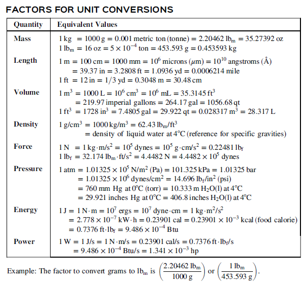
<figcaption>

Figure 2 - גדלים לצורך העברת יחידות. הטבלה מתוך 
Felder, R.M., Rousseau, R.W., &amp; Bullard, L.G. (2016). Elementary Principles of Chemical Processes (4th ed.). Wiley

</figcaption>
</figure>

::: exercise
[השתמשו בטבלה על מנת להגדיר את פקטורי המעבר הבאים]{dir="rtl"}

  - [ליטר לגלון (]{dir="rtl"}L-\>gal[)]{dir="rtl"}

  - [מטר לפיט (]{dir="rtl"}m-\>ft[)]{dir="rtl"}
:::

::: example
[כעת נוכל להשתמש בפקטור המעבר על מנת לפתור את המשוואה]{dir="rtl"}
$$10m + 20ft = ?$$
[לצורך כך נמצא את פקטור המעבר בין מטר לפיט. על פי הטבלה]{dir="rtl"} 1m=3.28ft [ולכן נוכל להגדיר את פקטורי המעבר]{dir="rtl"}
$$\frac{1m}{3.28ft}\ \ \ \ \ or\ \ \ \frac{3.28ft}{1m}$$
[וכך נוכל לחשב]{dir="rtl"}
$$20ft\  \times \frac{1m}{3.028ft} = 6.1m$$
:::

[שימו לב שניתן לצמצם את היחידות הישנות כך שאנו נשארים רק עם היחידות החדשות.]{dir="rtl"}

[בתחום שלנו נהוג לכתוב מעבר זה באמצעות שימוש **בסרגל מעבר יחידות** הנראה כך]{dir="rtl"}

<figure>
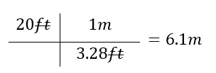
</figure>

1.  ::: {custom-style="List Paragraph"}
    [הוא מאפשר לנו לראות בצורה יותר ברורה שלא נעשתה טעות במעבר היחידות.\
    אם בטעות היינו כותבים]{dir="rtl"}
    :::

<figure>
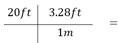
</figure>

::: {custom-style="List Paragraph"}
[היינו רואים שהיחידות לא מצטמצמות כפי שרצינו ומתקנים את ההצבה]{dir="rtl"}
:::

2. הוא מאפשר לנו לשרשר מספר מעברי יחידות אחד אחרי השני, ללא חישובי ביניים כך שהסיכוי לטעות חישובית במהלך המעברים מצטמצם משמעותית.  
   כך למשל, אם נרצה לעבור מיחידות של **ft/h** ליחידות של **m/min**, נגדיר את פקטורי המעבר הנדרשים באמצעות הטבלה:

   $$
   \frac{1h}{60min} \quad \text{or} \quad \frac{60min}{1h} \quad ; \quad \frac{1m}{3.28ft} \quad \text{or} \quad \frac{3.28ft}{1m}
   $$

<figure>
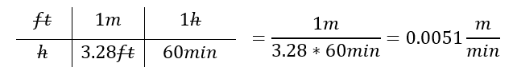
</figure>

**[שימוש בסרגל יחידות הוא כלי מרכזי להמרות נכונות ולמניעת טעויות]{dir="rtl"}*.*** [השיטה מחייבת להציב את הכמות הנתונה בצד שמאל, ולצידה סדרה של גורמי המרה הכתובים כשברים. כל גורם נבחר כך שיבטל את היחידות הלא רצויות ויחליף אותן ביחידות המבוקשות. ברגע שמציבים את היחידות בתוך השברים ומצמצמים אותן באופן אלגברי, נותרת בסוף רק היחידה הרצויה]{dir="rtl"}*.*

[חשוב להכיר בכך שזו אינה שיטה אינטואיטיבית עבור רוב הסטודנטים בתחילת הדרך: בהתחלה היא עשויה להיראות מסורבלת או מלאכותית. עם זאת, לאחר שמתרגלים לעבוד כך, מתגלה יתרון גדול -- לא רק שהשיטה כמעט מבטלת טעויות בסיסיות, אלא היא גם מספקת כלי להתמודדות עם מצבים חדשים ולא מוכרים. כאשר מופיעה בעיה שלא ראינו בעבר, עצם העבודה עם היחידות מובילה אותנו בצעדים מסודרים אל הפתרון]{dir="rtl"}*.*

::: exercise
[משאית נסעה מרחק של]{dir="rtl"} 25mile [במשך 20 דקות. מהי המהירות של המשאית במטר לשנייה?]{dir="rtl"}
:::

### [סיכום]{dir="rtl"}

::: {custom-style="summary"}
[בפרק זה הכרנו את המושגים הבסיסיים של עולם המדידה:]{dir="rtl"}

- [**מדידה** (]{dir="rtl"}measurement[) היא פעולה של השוואת גודל ליחידת מידה מוסכמת.]{dir="rtl"}

- [**מידה** (]{dir="rtl"}quantity[) היא תכונה פיסיקלית אותה ניתן לכמת.]{dir="rtl"}

- [**מימד** (]{dir="rtl"}dimention[) הוא סוג הגודל (אורך, מסה, זמן\...).]{dir="rtl"}

- [**יחידה** (]{dir="rtl"}unit[) היא קנה המידה (מטר, קילוגרם, שנייה).]{dir="rtl"}

- [**פקטור מעבר** (]{dir="rtl"}conversion factor[) הוא יחס בין שתי יחידות השייכות לאותו המימד ומייצגות את אותה הכמות]{dir="rtl"}

[בנוסף למדנו גם כיצד לבצע המרות באמצעות **סרגל היחידות** (]{dir="rtl"}simple dimensional analysis[). שיטה זו מבטיחה עבודה עקבית עם היחידות, מונעת טעויות נפוצות ומסייעת להבין מצבים חדשים ולא מוכרים.]{dir="rtl"}
:::

## [מערכות יחידות]{dir="rtl"}

מערכת יחידות היא מסגרת מוסכמת של יחידות בסיס ונגזרות, המאפשרת למדוד ולחשב גדלים פיזיקליים בצורה עקבית. כל מערכת יחידות מורכבת משלושה מרכיבים – יחידות בסיס, יחידות מרובות, ויחידות נגזרות.  
בעולם המדע וההנדסה נעשה שימוש בכמה מערכות יחידות שונות. המערכת המרכזית והמוסכמת כיום היא **המערכת הבינלאומית (SI)**, המבוססת על המטר, הקילוגרם והשנייה, והיא המערכת הרשמית ברוב מדינות העולם.  
לצד ה־**SI** קיימת גם **מערכת ה־CGS**, שהייתה נפוצה יותר בעבר ובה יחידות הבסיס הן הסנטימטר, הגרם והשנייה.   בארצות הברית מקובלת בעיקר **המערכת האמריקאית (American Engineering System – AES)**, שבה יחידות הבסיס הן הרגל, הפאונד־מסה והשנייה.  
ההבדלים בין מערכות אלו מתבטאים בעיקר בבחירת יחידות הבסיס ובמורכבות ההמרות ביניהן, אך כולן מבוססות על אותם עקרונות של מדידה עקבית.

### [מידות בסיסיות]{dir="rtl"}

ישנן 7 מידות בסיסיות אשר מהוות את המימדים הבסיסיים מהם יוגדרו כל שאר המידות. בכל מערכות היחידות המידות הבסיסיות הן זהות, אך היחידות בהן מודדים מידות אלו משתנות. יחידות אלו אינן מוגדרות מתוך יחידות אחרות אלא מהוות נקודת מוצא מוסכמת למדידה. 

**יחידות בסיס במערכות מדידה שונות**

::: {.rtl-table}
| **מידה** | **ביטוי מימדי** | **SI (סימן / שם)** | **CGS (סימן / שם)** | **AES (סימן / שם)** |
|:---:|:---:|:---:|:---:|:---:|
| אורך | [L] | m meter | cm centimeter | ft foot |
| מסה | [M] | kg kilogram | g gram | lbₘ pound |
| זמן | [T] | s second | s second | s second |
| טמפרטורה | [Θ] | K kelvin | K kelvin | °F fahrenheit |
| זרם חשמלי | [I] | A ampere | A ampere | A ampere |
| כמות חומר | [N] | mol mole | mol gram-mole | lb-mol pound-mole |
| עוצמת אור | [J] | Cd candela | Cd candela | Cd candela |
:::
Figure [3]{dir="rtl"} - [היחידות הבסיסיות עבור כל מערכת יחידות]{dir="rtl"}

### [יחידות מרובות]{dir="rtl"}

[**יחידות מרובות** הן יחידות שמוגדרות כשבר או כמכפלה של יחידות בסיס. לדוגמא -- יחידת הבסיס של זמן היא שנייה אך אנו נוהגים להתייחס לזמן גם בדקות, שעות, ימים או שנים. מבחינה עקרונית כל גודל פיסיקלי ניתן להביע ביחידות הבסיס עצמן, אך הדבר אינו נוח: מה היה קורה לו היינו צריכים וצריכות לתאר את הגיל שלנו בשניות?]{dir="rtl"} [לכן, יחידות מרובות משמשות אותנו לא מתוך הכרח מתמטי אלא כדי לאפשר הצגה יעילה ונוחה יותר של כמויות גדולות או קטנות במיוחד]{dir="rtl"}.

 דוגמאות לכך ניתן למצוא בכל מערכת יחידות: את משקל המשאית ב SI אנו נעדיף לתאר בטונות (Ton) ולא בק\"ג, ואת המרחק בין ישראל ללונדון ב AES נתאר במייל (mile) ולא ברגל (ft).

שיטה נוספת לייצוג פשוט של גדלים פיזיקליים היא באמצעות שימוש בקידומות (prefixes), אשר מהוות דרך נוחה להציג ערכים גדולים או קטנים מאוד מבלי להכביד במספרים ארוכים.
כל קידומת מייצגת מכפלה או שבר של יחידת הבסיס, והיא נצמדת לסימול היחידה עצמה.

לדוגמה, הקידומת k (קילו) מציינת מכפלה של $10^3$ – כלומר אלף יחידות:
$1~\text{km} = 1000~\text{m}$  $1~\text{kg} = 1000~\text{g}$  $1~\text{kJ} = 1000~\text{J}$

באופן דומה, הקידומת μ (מיקרו) מציינת שבר של $10^{-6}$ – כלומר מיליונית מהיחידה:
$1~\text{μm} = 10^{-6}~\text{m}$  $1~\text{μs} = 10^{-6}~\text{s}$  $1~\text{μL} = 10^{-6}~\text{L}$

השימוש בקידומות התפתח במסגרת מערכת ה־SI, אך כיום הן מקובלות גם במערכות יחידות אחרות, כגון AES, ולכן הפכו לסטנדרט אוניברסלי.
עבור מהנדסים ומהנדסות, שליטה בקידומות אלו חיונית, שכן הן כלי מרכזי להצגה מדויקת, קריאה ויעילה של נתונים מדעיים והנדסיים.

<figure>
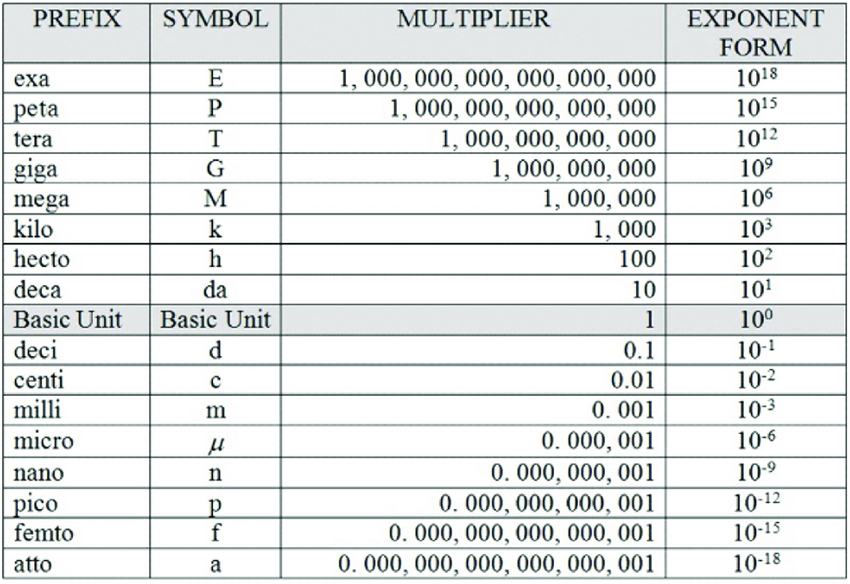
<figcaption>

Figure 4 - קידומות מוכרים ליחידות, מתוך 
García, José. (2025). Dimensional Analysis in Chemistry Textbooks 1900-2020 and an Algebraic Alternative. Educación Química. 36. 82-108. 10.22201/fq.18708404e.2025.1.88260

</figcaption>
</figure>

::: exercise
[השלימו באמצעות טבלת הקידומות]{dir="rtl"}
$$\begin{matrix}
\mathbf{1}\mathbf{Mg} & = & \_\_\_\_\_\_\_\_\_\_\mathbf{g}\_\_ \\
\_\_\_\_\_\_\_\_\_\_\_\_\_\_ & = & \mathbf{1.5*1}\mathbf{0}^{\mathbf{- 6}}\mathbf{s} \\
\mathbf{1}\mathbf{nm} & & \_\_\_\_\_\_\_\_\_\_\_\_\_\mathbf{m}
\end{matrix}$$
:::

### [יחידות נגזרות]{dir="rtl"}

יחידות נגזרות הן יחידות שמתקבלות משילוב מתמטי של יחידות הבסיס — באמצעות כפל או חילוק. בעוד יחידות הבסיס נבחרות כמוסכמות בינלאומיות שאינן תלויות זו בזו, יחידות נגזרות מתארות גדלים פיזיקליים מורכבים יותר, כמו מהירות, תאוצה, כוח, אנרגיה ולחץ.

יחידות נגזרות הן ביטוי מתמטי פשוט של יחידות הבסיס. כך למשל,
מהירות נמדדת במטר לשנייה ($m/s$),
תאוצה במטר לשנייה בריבוע ($m/s^{2}$),
כוח בניוטון ($N = kg \cdot m/s^{2}$),
ואנרגיה בג׳אול ($J = kg \cdot m^{2}/s^{2}$).

טבלה זו מדגימה כיצד כל גודל פיזיקלי מורכב מתפרק תמיד לשילוב של המידות היסודיות: במקרים אלו - מסה, אורך וזמ
[כך לדוגמא במערכת]{dir="rtl"} SI

::: {.rtl-table}
| **גודל פיזיקלי** | **סימול יחידה** | **יחידה** | **ביטוי ביחידות בסיס** | **ביטוי במימדים** |
|:---:|:---:|:---:|:---:|:---:|
| מהירות | $m/s$ | מטר לשנייה | $m/s$ | $[\mathbf{L}]/[\mathbf{T}]$ |
| תאוצה | $m/s^2$ | מטר לשנייה² | $m/s^2$ | $[\mathbf{L}]/[\mathbf{T}]^{\mathbf{2}}$ |
| כוח | $N$ | ניוטון | $kg \cdot m/s^2$ | $[\mathbf{M}]\cdot[\mathbf{L}]/[\mathbf{T}]^{\mathbf{2}}$ |
| אנרגיה | $J$ | ג'אול | $kg \cdot m^2/s^2$ | $[\mathbf{M}]\cdot[\mathbf{L}]^{\mathbf{2}}/[\mathbf{T}]^{\mathbf{2}}$ |
| לחץ | $Pa$ | פסקל | $kg/(m \cdot s^2)$ | $[\mathbf{M}]/([\mathbf{L}]\cdot[\mathbf{T}]^{\mathbf{2}})$ |
| הספק | $W$ | וואט | $kg \cdot m^2/s^3$ | $[\mathbf{M}]\cdot[\mathbf{L}]^{\mathbf{2}}/[\mathbf{T}]^{\mathbf{3}}$ |
:::

[מעבר ליחידות הנגזרות שמוגדרות ישירות מתוך יחידות הבסיס (כמו ניוטון או ג'אול), קיימות גם **יחידות מורכבות נוספות** שנקבעו לשימוש נוח יותר בתחומים שונים. יחידות אלו מבטאות את אותם המימדים הפיזיקליים -- אך בערכים מספריים נוחים או ביחידות מותאמות למדידות מעשיות]{dir="rtl"}.\
[כך, למשל, לחץ ניתן למדידה הן ב]{dir="rtl"}-[פסקל]{dir="rtl"} (Pa) [והן ב]{dir="rtl"}-[אטמוספירה]{dir="rtl"} (atm), [ואנרגיה יכולה להימדד בג'אול]{dir="rtl"} (J) [או בארג]{dir="rtl"} (erg). [הבחירה ביחידה תלויה בהקשר]{dir="rtl"}: [ניסויי מעבדה, תעשייה או מערכת המדידה הנהוגה, אך כולן שקולות מבחינת המימדים שהן מייצגות]{dir="rtl"}.

::: {.rtl-table}
| **מערכת** | **גודל פיזיקלי** | **שם יחידה** | **סימול** | **ערך היחידה** |
|:---:|:---:|:---:|:---:|:---:|
| **SI** | לחץ | אטמוספירה | atm | $\mathbf{1\ atm = 101{,}325\ Pa}$ |
| **SI** | נפח | ליטר | L | $\mathbf{1\ L = 10^{-3}\ m^{3}}$ |
| **SI** | מסה | טון | T | $\mathbf{1\ T = 10^{3}\ kg}$ |
| **CGS** | כוח | דיין | dyne | $\mathbf{1\ dyne = 1\ \frac{g \cdot cm}{s^{2}}}$ |
| **CGS** | אנרגיה | ארג | erg | $\mathbf{1\ erg = 1\ g \cdot cm^{2}/s^{2}}$ |
| **AES / U.S. customary** | הספק | כוח סוס (Horsepower) | hp | $\mathbf{1\ hp \approx 550\ \frac{ft \cdot lb_{f}}{s}}$ |
| **AES / U.S. customary** | נפח | גלון | Gal | $\mathbf{1\ gal \approx 231\ in^{3}}$ |
:::

::: exercise
[מה פקטור המעבר בין]{dir="rtl"} dyne [ל-]{dir="rtl"}N[? חשבו באמצעות יחידות הבסיס.]{dir="rtl"}
[(רמז- התחילו בביטוי ביחידות הבסיס של אחד מהם, והשתמשו במעברי יחידות על מנת להמיר אותן כך שיתאימו ליחידות הבסיס של השני)]{dir="rtl"}
:::

### [כוח ומשקל]{dir="rtl"} 

במערכת ה־SI כל יחידות הבסיס הוגדרו כך שהקשרים ביניהן עקביים ומדויקים, ולכן נגזרות כמו ניוטון או ג׳אול אינן דורשות מקדם תיקון - היחידות “מסונכרנות” באופן טבעי.
לעומת זאת, במערכת ה־AES יחידות הבסיס אינן מוגדרות כך, ולכן כאשר מחשבים כוח או גדלים נגזרים אחרים נדרש להשתמש בקבוע תיקון נומרי ($g_{c}$) כדי לשמור על עקביות מימדית.

[נזכר כי מתוך החוק השני של ניוטון אנו יודעים ש]{dir="rtl"}

$$F = ma$$

[במערכת]{dir="rtl"} SI [יחידת הכח הוגדרה כך שהיא שווה מבחינה נומרית למכפלת יחידות הבסיס המרכיבות אותה.]{dir="rtl"}

$$1N \equiv 1Kg*\frac{m}{s^{2}}$$

[ובאופן דומה במערכת]{dir="rtl"} *CGS* [הוגדרה יחידת הכח]{dir="rtl"} *dyne* [כך ש]{dir="rtl"}

$$1dyne \equiv 1g*\frac{cm}{s^{2}}$$

[לעומת זאת, ביחידות]{dir="rtl"} *AES* [כח של]{dir="rtl"} $1lb_{f}$ [לא הוגדרה מתוך יחידות הבסיס אלא הוגדרה היסטורית כמשקלו של פאונד מסה אחד בתנאי כבידה סטנדרטיים, ז\"א]{dir="rtl"}

$$1lbf \equiv 32.174\frac{lb_{m}ft}{s^{2}}$$

[לכן, במערכת היחידות האמריקאית הגדירו מחדש את החוק השני של ניוטון כך ש]{dir="rtl"}

$$F = \frac{ma}{g_{c}}\ \ \ \ \ ;\ \ \ \ \ g_{c} = 32.174\frac{lb_{m}ft}{lb_{f}s^{2}}$$

#### יישום חוקי ניוטון ושימוש ב- $g_c$ (SI ו-AES)

**מטרת הדוגמה:** להמחיש את השימוש העקבי בחוק השני של ניוטון באמצעות קבוע ההמרה $g_c$, ולהראות כיצד הוא מגשר בין יחידות המסה ליחידות הכוח בכל שיטה.

::: example

גוף בעל מסה $M$ מונח על משטח אופקי חסר חיכוך. תאוצת הכובד המקומית היא $g$.
עליכם לחשב:

1.  **חישוב סטטי ($W$):** כוח הכבידה (המשקל) הפועל על הגוף.
2.  **חישוב דינמי ($a$):** התאוצה שיקבל הגוף כתוצאה מהפעלת כוח אופקי חיצוני $F$.

בצעו את החישובים עבור שני המקרים הבאים:

* **מקרה א' (מערכת SI):** המסה $M=100 \text{ kg}$, תאוצת הכובד $g=9.81 \text{ m/s}^2$, והכוח $F=500 \text{ N}$.
* **מקרה ב' (מערכת AES):** המסה $M=100 \text{ lb}_m$, תאוצת הכובד $g=32.2 \text{ ft/s}^2$, והכוח $F=50 \text{ lb}_f$.

המשוואה הכללית לחוק השני של ניוטון, כאשר המסה מופרדת, היא:

$$
F = M \cdot \frac{a}{g_c}
$$

עבור משקל ($W$), התאוצה היא $g$:

$$
W = M \cdot \frac{g}{g_c}
$$

*חלק א': מערכת יחידות בינלאומית (SI)*

במערכת זו, נהוג לרוב להשמיט את $g_c$ כי ערכו הוא 1, אך כדי להבין כיצד היחידות משתנות מקילוגרם לניוטון, נציב אותו במפורש.
ערך הקבוע הוא:
$$g_c = 1 \frac{kg \cdot m}{N \cdot s^2}$$

**1. חישוב המשקל:**

$$
W = 100 \text{ kg} \cdot \frac{9.81 \frac{\text{m}}{\text{s}^2}}{1 \frac{\text{kg} \cdot \text{m}}{\text{N} \cdot \text{s}^2}}
$$

נסדר את היחידות כדי לראות את הצמצום: ה-$kg$, ה-$m$ וה-$s^2$ מצטמצמים כולם, וה-$N$ (שנמצא במכנה של המכנה) עולה למונה:

$$
W = 100 \cdot \frac{9.81}{1} \text{ N} = \mathbf{981 \text{ N}}
$$

**2. חישוב התאוצה:**

נבודד את $a$ מהמשוואה: $a = \frac{F \cdot g_c}{M}$

$$
a = \frac{500 \text{ N} \cdot 1 \frac{\text{kg} \cdot \text{m}}{\text{N} \cdot \text{s}^2}}{100 \text{ kg}}
$$

כאן ניתן לראות בבירור שהניוטון ($N$) מצטמצם, והקילוגרם ($kg$) מצטמצם, ונותרנו רק עם יחידות תאוצה:

$$
a = \frac{500}{100} \frac{\text{m}}{\text{s}^2} = \mathbf{5 \frac{\text{m}}{\text{s}^2}}
$$

 *חלק ב': מערכת יחידות הנדסית (AES)*

במערכת זו, השימוש ב-$g_c$ הוא קריטי לא רק ליחידות אלא גם לערך המספרי.
ערך הקבוע הוא:
$$g_c = 32.2 \frac{lb_m \cdot ft}{lb_f \cdot s^2}$$

**1. חישוב המשקל:**

נציב בנוסחה כאשר המסה מוכפלת ביחס התאוצות:

$$
W = 100 \text{ lb}_m \cdot \frac{32.2 \frac{\text{ft}}{\text{s}^2}}{32.2 \frac{\text{lb}_m \cdot \text{ft}}{\text{lb}_f \cdot \text{s}^2}}
$$

הערכים המספריים $32.2$ מצטמצמים ל-1. מבחינת יחידות: ה-$lb_m$, $ft$, ו-$s^2$ מצטמצמים, וה-$lb_f$ עולה למונה:

$$
W = 100 \cdot 1 \text{ lb}_f = \mathbf{100 \text{ lb}_f}
$$

**2. חישוב התאוצה:**

נשתמש שוב בנוסחה $a = \frac{F \cdot g_c}{M}$:

$$
a = \frac{50 \text{ lb}_f \cdot 32.2 \frac{\text{lb}_m \cdot \text{ft}}{\text{lb}_f \cdot \text{s}^2}}{100 \text{ lb}_m}
$$

כאן ה-$lb_f$ וה-$lb_m$ מצטמצמים, ואנו נשארים עם יחידות אורך וזמן בלבד:

$$
a = \frac{50 \cdot 32.2}{100} \frac{\text{ft}}{\text{s}^2} = \frac{1610}{100} \frac{\text{ft}}{\text{s}^2} = \mathbf{16.1 \frac{\text{ft}}{\text{s}^2}}
$$
:::

::: {.callout-tip}
## תובנה לסיכום

ההשוואה בין המקרים מחדדת נקודה חשובה:

* ב-**SI**, המעבר הוא ישיר. ניתן לחשוב על ניוטון ($N$) פשוט כקיצור ל-$kg \cdot m/s^2$.
* ב-**AES**, לעולם אין להשוות ישירות בין כוח למסה ללא התיווך של $g_c$. בחישוב הדינמי (סעיף 2), השמטת ה-$g_c$ הייתה מובילה לתוצאה שגויה של $0.5 ft/s^2$ במקום התוצאה הנכונה שהיא $16.1 ft/s^2$.
:::

::: exercise
[צפיפות המים היא]{dir="rtl"}$62.4\frac{lb_{m}}{ft^{3}}$\
[מה יהיה המשקל של]{dir="rtl"} $500ft^{3}$ [מים?]{dir="rtl"}
:::

### [סיכום -- מערכות יחידות]{dir="rtl"}

::: {custom-style="summary"}
 - [חישובים פיזיקליים והנדסיים מחייבים שימוש במערכת יחידות עקבית. **מערכת יחידות** מוגדרת כאוסף מוסכם של יחידות בסיס, יחידות נגזרות וכללי המרה ביניהן, שמאפשר לבצע מדידות והשוואות באופן אחיד.]{dir="rtl"}
 - [בעולם קיימות שלוש מערכות עיקריות:]{.underline}
   - SI – המערכת הבינלאומית, המבוססת על מטר, קילוגרם ושנייה.
   - CGS – דומה למערכת SI אך מבוססת על סנטימטר, גרם ושנייה.
   - AES / U.S. customary – יחידות הבסיס הן רגל ($ft$), פאונד־מסה ($lb_m$) ושנייה ($s$).
 - [בכל מערכת יש שלושה סוגים של יחידות:]{.underline}   
    - [**יחידות בסיסיות** הן אבני היסוד של כל מערכת יחידות. קיימות 7 מידות בסיסיות כאשר במערכת ה]{dir="rtl"}SI [מוגדרות: מטר (אורך), קילוגרם (מסה), שנייה (זמן), קלווין (טמפרטורה), מול (כמות חומר), אמפר (זרם חשמלי) וקנדלה (עוצמת אור). כל גודל פיזיקלי אחר ניתן להבעה כשילוב מתמטי של יחידות בסיס.]{dir="rtl"}
    - [**יחידות מרובות** הן שברים או מכפלות של יחידות בסיס, שנועדו לנוחות שימוש. כך, זמן נמדד לא רק בשניות אלא גם בדקות, שעות או שנים; מסות גדולות מתוארות בטונות ולא בקילוגרמים ובמערכת האמריקאית במיילים במקום ברגל למדידת מרחקים גדולים.]{dir="rtl"}
    - [**יחידות נגזרות**: מתקבלות משילוב מתמטי של יחידות בסיס -- לדוגמא]{dir="rtl"}\
    [מהירות (]{dir="rtl"}$m/s$[), כוח (]{dir="rtl"}$N = kg \cdot m/s^{2}$[), אנרגיה (]{dir="rtl"}$J = kg \cdot m^{2}/s^{2}$[).]{dir="rtl"}
- [**חשוב לזכור**: ב-]{dir="rtl"}SI [אין צורך בקבועי תיקון, אך ב]{dir="rtl"} AES[, אנו משתמשים ב]{dir="rtl"}g~c~ [על מנת לשמור על עקביות בין]{dir="rtl"} lb~m~[ל --]{dir="rtl"} lb~f~[.]{dir="rtl"}
:::

## [הומגניות של משוואות ומספרים חסרי מימד]{dir="rtl"}

### [הומוגניות של משוואות ]{dir="rtl"}Dimensional Homogeneity[]{dir="rtl"}

[לאורך הדיון ביחידות ובממדים ראינו שגדלים פיזיקליים ניתנים לחיבור או לחיסור **רק כאשר היחידות שלהם זהות**]{dir="rtl"}. [אם היחידות זהות, נובע מכך שגם **המימדים** של כל אחד מהאיברים חייבים להיות זהים. לדוגמה, אם שני גדלים ניתנים לביטוי ביחידות של גרם לשנייה]{dir="rtl"} ($g/s$), [הרי שלשניהם יש ממד של מסה לזמן]{dir="rtl"} $(M/T)$. [מכאן נובע כלל חשוב]{dir="rtl"}:

::: definition
[**כל משוואה פיזיקלית תקפה חייבת להיות הומוגנית ממדית\**
]{dir="rtl"} -- [כלומר, לכל האיברים הניתנים לחיבור בשני צדי המשוואה חייבים להיות אותם ממדים]{dir="rtl"}.
:::

::: {.example}
**במשוואה:**

$$
V = V_{0} + a t
$$

ננתח את המימדים של כל אחד מהאיברים:

$$
V, V_{0} \Longrightarrow \frac{length}{time} = \frac{[L]}{[T]} \quad ; \quad
a \Rightarrow \frac{length}{time^{2}} = \frac{[L]}{[T]^{2}} \quad ; \quad
t \Rightarrow time = [T]
$$

ונראה אילו מימדים כלל האיברים במשוואה:

$$
V \frac{[L]}{[T]} = V_{0} \frac{[L]}{[T]} + a \frac{[L]}{[T]^{2}} t [T]
$$

ניתן לראות שכל האיברים במשוואה מתכנסים ליחידות של **length/time**, ולכן המשוואה **הומוגנית מימדית**.
:::

[לעומת זאת, המשוואה]{dir="rtl"}

$$V\frac{\lbrack L\rbrack}{\lbrack T\rbrack} = V_{0}\frac{\lbrack L\rbrack}{\lbrack T\rbrack} + t\lbrack T\rbrack\ \ \ \ \ \mathbf{}$$

[איננה הומוגנית מימדית ולכן אינה יכולה להיות פיזיקלית, , ז\"א היא לא מתארת קשר אפשרי במציאות.]{dir="rtl"}

[גם כאשר משוואה עומדת בכלל ההומוגניות המימדית, עדיין נדרש שכל האיברים יהיו באותן יחידות בפועל.]{dir="rtl"} [לדוגמא, עבור המשוואה הבאה]{dir="rtl"}

$$V\left( \frac{m}{s} \right) = V_{0}\left( \frac{m}{s} \right) + a\left( \frac{m}{s^{2}} \right)t(s)$$

[אם התאוצה ניתנת לנו ביחידות של]{dir="rtl"} $\left( \frac{m}{s^{2}} \right)$ [אבל הזמן נתון לנו בדקות]{dir="rtl"} $t(min)$[, יש לבצע המרה ליחידה אחידה לפני הצבה במשוואה, ז\"א קודם כל נמיר את הזמן לשניות ולאחר מכן נציב במשוואה.\
\
עיקרון זה אינו רק דרישת תקינות מתמטית -- הוא גם כלי משמעותי בניתוח תוצאות ניסוי ובהסקת חוקים חדשים]{dir="rtl"}. [כאשר אנו בוחנים את הקשר בין גדלים נמדדים, ניתוח המימדים מאפשר לבדוק אם המשוואה המוצעת אפשרית מבחינה פיזיקלית, ולהסיק את המימדים והיחידות של קבועים ניסיוניים]{dir="rtl"}. [לדוגמא הפיזיקאי גֵּיי-לוסאק ערך בתחילת המאה ה-19 סדרת ניסויים שבהם חימם גזים בכלי סגור -- כך שכמות הגז והנפח נותרו קבועים. הוא הבחין בתופעה עקבית]{dir="rtl"}: [ככל שהטמפרטורה עלתה]{dir="rtl"}, [הלחץ של הגז על דפנות הכלי עלה ביחס ישר לטמפרטורה המוחלטת]{dir="rtl"}. [מתוך המדידות הניסיוניות הללו הוא ניסח את הקשר]{dir="rtl"}:

$$P = kT$$
[כאשר הלחץ נמדד ביחידות של]{dir="rtl"} Pa [והטפ\' ביחידות של]{dir="rtl"} K[.]{dir="rtl"}

[מתוך הומוגניות המשוואה ניתן להסיק את יחידות הקבוע]{dir="rtl"} *\*
$$P(Pa) = k(?)T(K)\ \  = > k\left( \frac{Pa}{K} \right)$$

ופיזיקלית, קיבלנו ערך המייצג את מידת השינוי בלחץ ביחידות של פסקל (Pa) לכל שינוי של מעלה אחת קלווין (K).

::: {.exercise}
ידוע כי עבור מערכת מסוימת היחס בין הלחץ לטמפרטורה הוא  
$P(\text{Pa}) = 300 \times T(\text{K})$  

1. מהו $k$? רשמו את ערכו המלא, כולל יחידות.  
2. הסבירו באופן מילולי מה משמעותו של הקבוע — איזה שינוי מתואר במערכת?  
3. במקרים רבים נהוג למדוד לחץ ביחידות של אטמוספירה. ברצוננו לנסח את המשוואה כך שהתוצאה תתקבל באטמוספירות באופן ישיר. מה יהיה ערכו הנומרי החדש של $k$ במקרה זה? מה יהיו היחידות שלו?  
:::

### [מספרים חסרי מימד]{dir="rtl"}

::: definition
[מספר חסר מימד]{dir="rtl"} (dimensionless number) [הוא מספר שאינו נושא יחידות מידה]{dir="rtl"}
:::

[הוא המתקבל כתוצאה מחלוקה של גדלים בעלי אותן יחידות, כך שהיחידות מתבטלות והתוצאה היא גודל טהור. מספרים חסרי מימד חשובים במיוחד בתכנון ובהבנה של תהליכים הנדסיים: הם מאפשרים להקטין את מספר המשתנים הדרושים לתיאור תופעה, להשוות בין מערכות שונות שנמדדות ביחידות שונות, ולבנות תמונה כללית של ההתנהגות הפיזיקלית של מערכת בלי תלות בקנה המידה או ביחידות]{dir="rtl"}.

[דוגמה פשוטה למספר חסר מימד היא השבר המסתי (]{dir="rtl"}mass fraction[) שמבטא את החלק היחסי של רכיב מסוים במערכת הכוללת. אם נסמן את מסת הרכיב ב]{dir="rtl"}-$m(x)$ [ואת מסת המערכת הכוללת ב]{dir="rtl"}-$m(total)$, [נקבל]{dir="rtl"}:

$$\frac{w}{w} = \frac{m(x)}{m(total)} = \frac{\lbrack M\rbrack}{\lbrack M\rbrack}$$

[היחידות מתבטלות, ולכן השבר המסתי הוא מספר חסר מימד]{dir="rtl"}.

::: {.exercise}
במעבדה לפיתוח משקאות אנרגיה עובדים שני צוותים במקביל, וכל אחד מהם פיתח נוסחה שונה למשקה חדש.  
החומר הפעיל במשקה הוא **קפאין (A)**, והשאר הוא תמיסה מתוקה.

הצוות הראשון, מישראל, מדווח כי מסת הקפאין במשקה שלו היא **80mg** על כל **250g** של משקה.  
הצוות השני, מארצות הברית, מדווח כי מסת הקפאין במשקה שלו היא **0.02 lbₘ** על כל **0.5 lbₘ** של משקה.

שני הצוותים טוענים שהמשקה שלהם "חזק יותר" — כלומר, שיש בו יותר קפאין באופן יחסי לתמיסה הכוללת.

**השאלה:**  
בלי להמיר את היחידות ל־ק"ג או לפאונדים — מי צודק?  
באיזה משקה יש אחוז גבוה יותר של קפאין?
:::

[אחד היתרונות הגדולים של שימוש במספרים חסרי מימד הוא היכולת להשוות בין מערכות בעלות קני מידה שונים]{dir="rtl"}. [אם שתי מערכות שונות מתוארות על-ידי אותם מספרים חסרי מימד, נוכל לצפות שהן יתנהגו באופן דומה מבחינה פיזיקלית -- גם אם אחת מהן קטנה פי אלף מהשנייה. עיקרון זה מאפשר למהנדסים ולחוקרים לבנות מודלים מוקטנים במעבדה כדי לבדוק תהליכים שיתרחשו במתקנים אמיתיים, יקרים או מסוכנים]{dir="rtl"}.

[אחד המספרים חסרי המימד המפורסמים במיותר הוא מספר ריינולדס. מספר מאוד חשוב בהנדסת תהליכים המבטא את היחס בין כוחות האינרציה והצמיגות ומשמש לאפיון פרופיל הזרימה בצינור.]{dir="rtl"}

$$\mathbf{Re =}\frac{\mathbf{D \bullet v \bullet \rho}}{\mathbf{\mu}}$$

D[- קוטר הצינור]{dir="rtl"} $(m)$

$\mathbf{v}$ [-- מהירות הזורם]{dir="rtl"} $\left( \frac{m}{s} \right)$

$\mathbf{\rho}$ [-- צפיפות הזורם]{dir="rtl"} $\left( \frac{Kg}{m^{3}} \right)$

$\mathbf{\mu}$ [-- צמיגות הזורם]{dir="rtl"} $\left( \frac{Kg}{m\ s} \right)$

[הראו שמספר ריינולדס הוא חסר יחידות.]{dir="rtl"}

<figure>
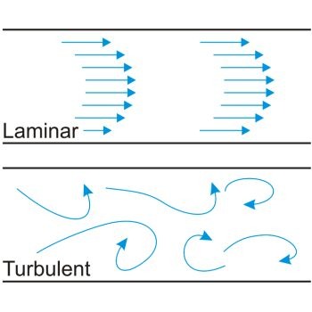
<figcaption>

Figure 5 - אפיון פרופילי זרימה באמצעות מספר ריינולדס. 
הזרימה תהיה לינרית כאשר Re&lt;2100, ותהיה טורבולנטית כאשר Re&gt;4000.

</figcaption>
</figure>

[מהנדסי אווירונאוטיקה משתמשים בין השאר במספר ריינולדס כדי לבחון דגמים מוקטנים של מטוסים. כל עוד הדגם והמטוס האמיתי פועלים תחת אותו מספר ריינולדס]{dir="rtl"}, [היחס בין כוחות האינרציה והצמיגות זהה -- ולכן תבנית הזרימה סביבם תהיה דומה. בדרך זו ניתן לחזות כיצד ישפיע שינוי בצורה או בזווית הכנף על המטוס המלא, על ידי בנייה של דגם מוקטן בלבד.]{dir="rtl"}

### [סיכום: הומוגניות של משוואות ומספרים חסרי מימד]{dir="rtl"}

::: {custom-style="summary"}
  - [**הומוגניות מימדית** היא תנאי הכרחי לכל משוואה פיזיקלית תקפה -- כל האיברים במשוואה חייבים להיות באותם מימדים]{dir="rtl"}.
  - [בדיקת הומוגניות מאפשרת לגלות טעויות נפוצות, לבדוק אם משוואה "פיזיקלית", ולמצוא את היחידות של קבועים ניסיוניים]{dir="rtl"}.
  - [**ניתוח מימדי** הוא כלי עוצמתי להסקת קשרים בין גדלים גם בלי לדעת את הנוסחה המלאה]{dir="rtl"}.
  - [**מספרים חסרי מימד** נוצרים מחלוקה של גדלים בעלי אותן יחידות -- היחידות מתבטלות, והתוצאה היא גודל טהור]{dir="rtl"}.
  - [באמצעותם ניתן להשוות בין מערכות שונות, לבנות מודלים בקנה מידה מוקטן, ולתאר תופעות באופן כללי ואוניברסלי]{dir="rtl"}.
  - [דוגמאות נפוצות: מספר ריינולדס (זרימה), מספר פראוד (כובד), מספר נוסלט (מעבר חום)]{dir="rtl"}.
  - [בסופו של דבר, הבנה של הומוגניות ושל מספרים חסרי מימד היא **בסיס להבנה פיזיקלית עמוקה ולחשיבה הנדסית נכונה**]{dir="rtl"}.
:::

## [דיוק, הדירות וספרות משמעותיות]{dir="rtl"}

כשאנחנו מודדים משהו - טמפרטורה של תמיסה, משקל של דגימה או אורך של צינור - אנחנו נוטים לחשוב שהתוצאה שמופיעה על המסך או על הצג היא “הערך האמיתי”.אבל במציאות, כל מדידה היא רק הערכה של הגודל הפיזיקלי.
נניח ששני אנשים מודדים את אותה טמפרטורת מים: האחד משתמש במדחום דיגיטלי שמציג ‎$37.2^\circ\text{C}$‎, והשני במדחום זכוכית ישן שמראה בערך ‎$37^\circ\text{C}$‎. שניהם צודקים, אך לא באותה מידה. הראשון יודע את התוצאה בדיוק של עשירית מעלה, ואילו השני רק בקירוב של מעלה אחת.
[אם נחזור על המדידה שוב ושוב, נקבל אולי 37.2, 37.3 או 37.1 -- כלומר, גם במכשיר הטוב יותר נראה תמיד סטייה מסויימת בין מדידה למדידה, ההבדל הוא בשאלה עד כמה גדולה התנודה בין המדידות.]{dir="rtl"}

[שינויים קטנים כאלה נובעים ממגבלות של המכשיר, מתנאי הסביבה או מהאופן שבו בוצעה המדידה]{dir="rtl"}.\
[לכן בכל תוצאה יש טווח קטן של אי-ודאות -- טווח שבתוכו סביר להניח שהערך האמיתי נמצא]{dir="rtl"}.\
[כשנרשום את התוצאה, נרצה לשקף את רמת הוודאות שלנו, ולשם כך נשתמש רק במספר הספרות **המשמעותיות**]{dir="rtl"} -- [כלומר, הספרות שיש להן משמעות פיזיקלית אמיתית, ולא רק תוצאה של חישוב במחשבון]{dir="rtl"}.

[כדי להבין עד כמה מדידה מסוימת אמינה, אנו בוחנים אותה משתי זוויות שונות]{dir="rtl"}:

::: definition
**[דיוק]{dir="rtl"} (Accuracy)** -- [עד כמה המדידה קרובה לערך האמיתי]{dir="rtl"}.
:::

::: definition
**[הדירות/עקביות]{dir="rtl"} (Precision)** -- [עד כמה המדידות חוזרות על עצמן כשמבצעים אותן שוב]{dir="rtl"}.
:::

<figure>
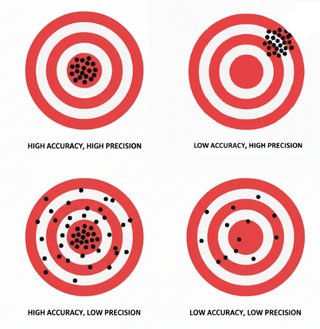
<figcaption>

Figure 6 - דיוק והדירות

</figcaption>
</figure>

[כאשר אנחנו רושמים תוצאה מדעית או הנדסית, המספר שאנו כותבים צריך לשקף את רמת האמינות של המדידה]{dir="rtl"}. [אין טעם לכתוב 54.44183 גרם אם המאזניים שלנו מסוגלות למדוד רק עד עשירית הגרם -- זו אשליה של דיוק שאינו קיים באמת]{dir="rtl"}. [מספר הספרות שאנו כוללים בתוצאה הוא בעצם דרך לתקשר את רמת הדיוק והחזרתיות של המדידה]{dir="rtl"}.

::: definition
[**ספרות משמעותיות** (]{dir="rtl"}significant figures[) הן כל הספרות במספר המעידות על רמת הדיוק של המדידה]{dir="rtl"}. [הן כוללות את כל הספרות שאנו בטוחים בהן]{dir="rtl"}, [ועוד ספרה אחת נוספת שאנו מעריכים]{dir="rtl"}.
:::

לדוגמה, אם שקלתי דגימה מסוימת וקיבלתי תוצאה של ‎2.36‎ גרם - שתי הספרות הראשונות (2 ו־3) הן ודאיות, ואילו השלישית (6) מייצגת את חוסר הוודאות במדידה, כלומר הערכה של הגודל הקטן ביותר שאנו רגישים אליו.
אם נמדוד את אותה הדגימה שוב, ייתכן שהפעם נקבל ‎2.35 g‎ או ‎2.37 g‎.
[כך הספרות המשמעותיות הופכות לגשר בין החישוב המתמטי לבין העולם הפיזי]{dir="rtl"}:\
[הן מבטאות לא רק את המספר עצמו, אלא גם כמה אנחנו סומכים עליו]{dir="rtl"}.

::: {.callout-note}
[**חשוב לזכור — רק לערכים שנמדדו יש ספרות משמעותיות.**]{.underline}  
כאשר אנו מבצעים מדידה, כל ספרה בתוצאה משקפת את רמת הוודאות של המכשיר ושל התהליך – ולכן יש לה משמעות פיזיקלית אמיתית.  
לעומת זאת, קבועים והמרות יחידות (כמו ‎1 kg = 2.20462 lb‎) נחשבים כבעלי אינסוף ספרות משמעותיות, משום שאנו יכולים להתחייב על נכונותם בכל רמת דיוק שנרצה.  
אם נצטרך לדעת את הספרות הבאות, נוכל למצוא ערכים מדויקים יותר בספרות המדעית. כך למשל, מהירות האור נחשבת בדרך כלל בקירוב ל־‎300,000,000 m/s‎ — ערך נוח לשימוש יומיומי או לרוב החישובים.  
עם זאת, הערך המדויק הוא ‎299,792,458 m/s‎.
:::

[גם מספרים שלמים שמקורם בספירה - למשל חמישה חתולים או שלושה מיכלים - הם מדויקים לחלוטין, כי אין בהם אי-ודאות כלל]{dir="rtl"}. [במילים אחרות, אנחנו יכולים "להתחייב" על 5.000000 בדיוק]{dir="rtl"}. [ההבחנה הזו חשובה במיוחד בעת חישובים: רק המספרים הנמדדים קובעים כמה ספרות משמעותיות תופיע בתוצאה הסופית, בעוד הקבועים או המספרים השלמים אינם מגבילים את רמת הדיוק]{dir="rtl"}.

### [כללי ספרות משמעותיות]{dir="rtl"}

[כאשר אנו רואים מספר כתוב, עולה השאלה]{dir="rtl"}: **[כיצד נדע כמה ספרות משמעותיות יש בו]{dir="rtl"}?**\
[כמובן שכל הספרות שאינן אפס הן משמעותיות, אך האפסים דורשים תשומת לב מיוחדת]{dir="rtl"}. [לפעמים הם מציינים ערך מדוד אמיתי, ולפעמים הם רק "ממלאים מקום" כדי להראות היכן נמצאת הנקודה.\
אם אני אומרת שבכלי מסויים יש לי 1000 ליטר, האם זה אומר שאני מתחייבת עד רמת המיליליטר, או שהכוונה היא לסדר גודל של 1000 ליטר (שיכול להיות כל מספר בטווח של 950-1050 ליטר) והאפסים נמצאים שם רק כדי לייצג את סדר הגודל של הדגימה? כדי להבדיל ביניהם, ניעזר בכמה כללים פשוטים שיעזרו לנו לקבוע אילו ספרות נחשבות משמעותיות ואילו לא.]{dir="rtl"}

::: {.rtl-table}
| **כלל** | **דוגמה** | **מספר הספרות המשמעותיות** | **הערות** |
|:---:|:---:|:---:|:---:|
| כל הספרות שאינן אפס נחשבות משמעותיות | ‎347‎ | 3 | — |
|  | ‎58.26‎ | 4 | — |
| אפסים בין ספרות שאינן אפס נחשבים משמעותיים | ‎205‎ | 3 | — |
|  | ‎1003‎ | 4 | — |
| אפסים מובילים אינם משמעותיים | ‎0.0045‎ | 2 | האפסים רק ממקמים את הנקודה העשרונית |
|  | ‎0.000300‎ | 3 | האפסים שאחרי הספרה 3 נחשבים משמעותיים |
| אפסים בסוף מספר עם נקודה עשרונית נחשבים משמעותיים | ‎2.300‎ | 4 | כל האפסים שאחרי הספרה 3 נחשבים |
|  | ‎0.050‎ | 2 | — |
| אפסים בסוף מספר שלם בלי נקודה עשרונית אינם בהכרח משמעותיים | ‎1500‎ | לא ניתן לדעת | יש לכתוב בכתיב מדעי כדי להבהיר |
|  | ‎1.5 × 10³‎ | 2 | — |
|  | ‎1.50 × 10³‎ | 3 | — |
| מספרים מדויקים (ספירה או קבועים) נחשבים כבעלי אינסוף ספרות משמעותיות | 5 מבחנות, 60 שניות בדקה | ∞ | אינם מגבילים את הדיוק בחישוב |
:::

::: {.exercise}
**כמה ספרות משמעותיות יש בכל אחד מהמספרים הבאים?**

1. $0.0045$  
2. $205$  
3. $1.50 \times 10^{3}$  
4. $1500$  
5. $0.000300$
:::
[כאשר אנו מבצעים חישובים המבוססים על נתונים מדודים, עלינו לזכור שכל אחד מהנתונים כולל רמת דיוק מוגבלת]{dir="rtl"}. [אין טעם להציג תוצאה ארוכה ומדויקת יותר מהמידע שנמדד בפועל -- זו תהיה **אשליה של דיוק שאינו קיים**]{dir="rtl"}. [לכן נקבעו כללים ברורים כיצד לקבוע כמה ספרות משמעותיות מותר לשמור בתוצאה של חישוב]{dir="rtl"}.

1.  ::: {custom-style="List Paragraph"}
    [רמת הדיוק של התוצאה הסופית נקבעת לפי **הנתון הפחות מדויק** שבחישוב]{dir="rtl"}.\
    [עם זאת, הדרך ליישם כלל זה שונה בין **כפל/חילוק** לבין **חיבור/חיסור**]{dir="rtl"}.
    :::

2.  ::: {custom-style="List Paragraph"}
    [בכפל או בחילוק, מספר הספרות המשמעותיות בתוצאה צריך להיות שווה למספר הספרות המשמעותיות שבנתון הפחות מדויק]{dir="rtl"}. [דוגמה]{dir="rtl"}:[\
    ]{dir="rtl"}$$2.3 \times 1.245 = 2.8635$$
    [הנתון הראשון (2.3) כולל שתי ספרות משמעותיות בלבד, ולכן גם התוצאה תיכתב כך]{dir="rtl"}:
    :::

$$2.3 \times 1.245 = \mathbf{2.9}$$

3.  ::: {custom-style="List Paragraph"}
    [בחיבור או חיסור, יש לשים לב למיקום הנקודה העשרונית]{dir="rtl"}:[\
    התוצאה צריכה לכלול ספרות עד אותה רמת דיוק (אותו מקום עשרוני) כמו הנתון הפחות מדויק]{dir="rtl"}. [דוגמה]{dir="rtl"}: [\
    ]{dir="rtl"}$$345.2 + 1.353 = 346.553$$
    [מכיוון של-345.2 יש ספרה אחת אחרי הנקודה, נכתוב את התוצאה כך]{dir="rtl"}:[\
    ]{dir="rtl"}$$345.2 + 1.353 = \mathbf{46.6}$$
    :::

4.  ::: {custom-style="List Paragraph"}
    [כאשר יש צורך לעגל מספר, נשתמש בכלל הבא]{dir="rtl"}:
    :::

- [אם הספרה הראשונה שמושמטת **קטנה מ-5**]{dir="rtl"}, [נשאיר את הספרה האחרונה כפי שהיא (נעגל כלפי מטה)]{dir="rtl"}

- [אם היא **גדולה מ-5**]{dir="rtl"}, [נוסיף 1 לספרה האחרונה שנשמרת (נעגל כלפי מעלה)]{dir="rtl"}

- אם היא בדיוק **5**, נשמור את הספרה האחרונה **זוגית** (כדי להימנע מהטיה שיטתית במאגרי נתונים):
  $$
  2.845 \rightarrow 2.84 \\
  2.855 \rightarrow 2.86
  $$

- [חישובים ארוכים מומלץ **לא לעגל בכל שלב**]{dir="rtl"}, [אלא לשמור ערכים ארוכים יותר לאורך הדרך ולעגל רק בסוף]{dir="rtl"}. [כך נמנע מהצטברות של שגיאות עיגול ביניים]{dir="rtl"}.

::: {.exercise}
**כתבו כל תוצאה ברמת הדיוק המתאימה:**

1. $2.3 \times 1.245 = \; ?$  
2. $45.2 \div 1.2 = \; ?$  
3. $0.056 \times 3.12 = \; ?$  
4. $45.2 + 1.35 = \; ?$  
5. $2.06 - 0.142 = \; ?$  
6. $0.230 + 1.2 = \; ?$
:::

### [כתיבה מדעית של מספרים ]{dir="rtl"}(Scientific notation)[]{dir="rtl"}

[אחת הדרכים הברורות ביותר לבטא על אילו ספרות אנחנו מוכנים "להתחייב\" היא באמצעות כתיבה מדעית]{dir="rtl"}. [במקום למנות אינסוף אפסים או להסתבך עם נקודות עשרוניות ארוכות, אנחנו מבטאים את המספר כרצף הספרות עליהן אנחנו מוכנים להתחייב כפול סדר הגודל של המספר המיוצג על ידי עשר בחזקת מספר שלם כלשהו.]{dir="rtl"}

::: definition
[בכתיבה מדעית המספר נכתב בצורה]{dir="rtl"}:
$$a \times 10^{n}$$
[כאשר]{dir="rtl"} $a$ [הוא מספר עשרוני בטווח בין 1 ל-10, המכיל את כל הספרות המשמעותיות ורק אותן\
ו-]{dir="rtl"}$n$ [הוא מספר שלם (חיובי או שלילי) המציין את סדר הגודל]{dir="rtl"}.
:::

::: example
  - [ מהירות האור]{dir="rtl"} $3.00 \times 10^{8}\text{ m/s}$ [במקום]{dir="rtl"} 300,000,000[.]{dir="rtl"}
  - [מסת מולקולת מים]{dir="rtl"} $2.99 \times 10^{- 26}\text{ kg}$ [במקום]{dir="rtl"} ‎0.0000000000000000000000000299‎
:::

[הצורה הזו מאפשרת להציג בבירור גם **את סדר הגודל** וגם **את רמת הדיוק**]{dir="rtl"}

::: callout-tip
[איך ממירים לכתיבה מדעית]{dir="rtl"}?[\
1. מזיזים את הנקודה העשרונית כך שתשאר ספרה אחת בלבד משמאל לה]{dir="rtl"}.[\
2. סופרים כמה מקומות הזזנו את הנקודה -- זה יהיה ערך המעריך]{dir="rtl"} $n$.[\
אם הזזנו שמאלה]{dir="rtl"} []{dir="rtl"}$\ n \leftarrow$[חיובי]{dir="rtl"}.[\
אם הזזנו ימינה]{dir="rtl"} $n \leftarrow \ $ [שלילי]{dir="rtl"}.
:::

::: callout-tip
$${0.0045 = 4.5 \times 10^{- 3}
}{72000 = 7.2 \times 10^{4}
}$$[הכתיבה המדעית חשובה כי היא מאפשרת להשוות מספרים בקלות לפי סדרי גודל]{dir="rtl"}.[ היא מונעת בלבול בקריאת אפסים מיותרים והיא שומרת על המשמעות הפיזיקלית של הספרות כך שנוכל לזהות בקלות את הספרות שאנו מוכנים להתחייב עליהן.]{dir="rtl"}
:::

::: {.exercise}
**המירו את המספרים הבאים לכתיבה מדעית, ושמרו על מספר הספרות המשמעותיות שניתן לפי הנתון:**

::: {.rtl-table}
| **מספר רגיל** | **כתיבה מדעית** | **כמה ספרות משמעותיות יש?** |
|:---:|:---:|:---:|
| 0.00056 |  |  |
| 82300 |  |  |
| 0.0120 |  |  |
| 6,450,000 |  |  |
| 0.00450 |  |  |
:::
:::
### [לסיכום]{dir="rtl"}

- כל מדידה כוללת **אי־ודאות**, ולכן הספרות בתוצאה מייצגות את **רמת הדיוק** של המדידה.  
- הספרות המשמעותיות הן כל הספרות **שאנחנו בטוחים בהן**, ועוד אחת **מוערכת** לפי יכולת המכשיר.  
- כדי לזהות ספרות משמעותיות:  
  - כל ספרה שאינה אפס — משמעותית.  
  - אפסים עשויים להיות משמעותיים או לא — תלוי במיקומם ובנקודה העשרונית.  
- בחישובים:  
  - **כפל/חילוק** — שמרו את מספר הספרות המשמעותיות של **הנתון הפחות מדויק**.  
  - **חיבור/חיסור** — שמרו את רמת הדיוק (המיקום העשרוני) של **הנתון הפחות מדויק**.  
- **המטרה:** להציג תוצאה אמינה — לא מדויקת מדי, ולא גסה מדי.  
- כדי להימנע משורה של אפסים, נשתמש ב־**כתיבה מדעית**:  
  $a \times 10^{n}$, כאשר $a$ הוא מספר בין 1 ל־10 ו־$n$ הוא מעריך שלם.

## [ניתוח והצגת נתוני תהליך]{dir="rtl"}

### [הערכה של נתונים ניסיוניים -- ממוצע וסטיית תקן]{dir="rtl"}

[בכל ניסוי הנדסי שבו מבצעים מדידות חוזרות, לעולם לא נקבל את אותה תוצאה בדיוק. תנאי העבודה, איכות הדגימה, דיוק המדידה ואפילו הבדל של שנייה אחת בזמן הדגימה -- כולם גורמים לפיזור בתוצאות. לכן כל גודל מדוד נחשב [משתנה מקרי]{custom-style="Strong"}]{dir="rtl"}, [והתוצאה שאנו רושמים היא רק [אומדן]{custom-style="Emphasis"} לערך האמיתי]{dir="rtl"}.

[כדי להעריך את הערך "האמיתי" ביותר משתמשים ב-[ממוצע המדגם]{custom-style="Strong"}]{dir="rtl"}:

::: definition
[[ממוצע המדגם]{dir="rtl"}]{custom-style="Strong"}

$$\overset{ˉ}{X} = \frac{1}{N}\sum_{i = 1}^{N}X_{i}$$

[זהו הערך הנותן אומדן לערך המשתנה במערכת על בסיס כלל המדידות שנערכו]{dir="rtl"}
:::

::: example
[[דוגמה 1 -- מד זרימה בתהליך תעשייתי]{dir="rtl"}:]{custom-style="Strong"}\
[בבדיקות חוזרות של ספיקה בצינור התקבלו הערכים \[10.2, 9.8, 10.1, 9.9, 10.0\] ליטר/דקה]{dir="rtl"}.\
[הממוצע הוא]{dir="rtl"} $\overset{ˉ}{X} = 10.0\text{ L/min}$.\
[זהו האומדן הסביר ביותר לספיקה האמיתית, גם אם בפועל כל מדידה מעט שונה]{dir="rtl"}.
:::

אך ערך הממוצע עצמו לא עוזר לנו לדעת עד כמה המדידות הדירות. כאשר יש לנו רק מדידה אחת, או שאין מידע נוסף, נניח שהשגיאה היא חצי מהספרה האחרונה — ‎$132.4 \pm 0.5$‎. עם זאת, כדי לדעת מהי רמת הדיוק האמיתית של המדידה נבדוק את הפיזור סביב הממוצע. נעשה זאת באמצעות חישוב סטיית תקן ($\sigma$) ו־שונות ($s^2$).

$$s^{2} = \frac{1}{N - 1}\sum_{i = 1}^{N}{(X_{i} - \overset{ˉ}{X})^{2}}\text{     ;      }\sigma = \sqrt{s^{2}}$$

[ככל שהערכים רחוקים יותר מהממוצע, השונות וסטיית התקן גדלות -- כלומר, יש לנו פחות בטחון בכך שהממוצע אכן משקף לנו את הערך ה\"אמיתי\".]{dir="rtl"}

::: {.exercise}
תרגיל – צפיפות ביומסה במערכת תסיסה (fermenter):
נמדדו ריכוזי תאים בשתי מערכות שונות.

- **מערכת א׳:** נמדדו ריכוזי תאים [1.83, 1.81, 1.79, 1.85, 1.80] גרם/ליטר.  
- **מערכת ב׳:** נמדדו ריכוזי תאים [1.90, 1.75, 1.84, 1.78, 1.87] גרם/ליטר.  

איזו מערכת יציבה יותר?
:::

### [מדידה עקיפה וכיול נתונים]{dir="rtl"}

[בכל תהליך הנדסי אנו נשענים על נתונים ניסיוניים --]{dir="rtl"} [מדידות של טמפרטורה, לחץ, ספיקה, ריכוז וכדומה. הנתונים הללו הם הבסיס להבנה, לבקרה ולתכנון]{dir="rtl"}.\
[עם זאת, ברוב המקרים איננו יכולים למדוד ישירות את הגודל שאנו באמת מעוניינים בו. במקום זאת אנו מודדים גודל אחר, נלווה]{dir="rtl"}, [שקל למדוד אותו (למשל מוליכות חשמלית או בליעת אור), ומשתמשים בקשר הידוע ביניהם כדי לחשב את המשתנה הרצוי]{dir="rtl"}. [כדי להגדיר קשר זה נבצע **ניסוי כיול**]{dir="rtl"} -- [נמדוד את המשתנה הנלווה עבור ערכים ידועים של המשתנה האמיתי, ונשתמש בתוצאות כדי למצוא משוואה או גרף כיול. משם נוכל, בכל מדידה עתידית, לחשב את הערך המבוקש]{dir="rtl"}. [לדוגמה, איננו יכולים למדוד ישירות את **ריכוז החומר בתמיסה**]{dir="rtl"}, [אך אנו יודעים שלכל חומר יש נטייה לבלוע אור באורכי גל מסוימים, וככל שריכוז החומר גבוה יותר -- בליעת האור גדולה יותר. קשר זה מוכר בשם **חוק ביר--למבר**]{dir="rtl"}. [ערך הבליעה שמתקבל במכשיר נמדד ביחידות]{dir="rtl"} [שרירותיות (]{dir="rtl"}a.u. -- arbitrary units[) יחידה חסרת ממד הנובעת הנובעת מההגדרה הלוגריתמית של הבליעה. ככל שהבליעה גדולה יותר, כך ריכוז החומר בתמיסה גבוה יותר]{dir="rtl"}. [ליחידה זו אין משמעות פיסיקלית ישירה אך מה שחשוב לנו הוא ההבדלים בין הערכים השונים, שבעזרתם יבנה גרף הכיון.]{dir="rtl"}

[לכן נפעל בשלבים]{dir="rtl"}:

1.  [נאתר (על סמך ספרות או מדידה) את **אורך הגל** שבו בליעת החומר מרבית]{dir="rtl"}.

2.  [נמדוד את **בליעת האור** עבור סדרת תמיסות שריכוזן ידוע]{dir="rtl"}.

3.  [נבנה **עקומת כיול** --]{dir="rtl"} [גרף של בליעה לעומת ריכוז]{dir="rtl"}.

4.  [נמדוד את בליעת האור של **תמיסת הנעלם**]{dir="rtl"}, [ובעזרת עקומת הכיול נסיק את ריכוזה]{dir="rtl"}.

[]{dir="rtl"}{width="2.950353237095363in" height="1.7932195975503062in"} []{dir="rtl"}{width="3.262154418197725in" height="1.79208552055993in"}

<figure>

<figcaption>

Figure 7- מציאת ריכוז תמיסת נעלם בשיטות ספקטרוסקופיות - שלב ראשון מציאת אורך הגל המקסימלי, שלב שני בניית גרף כיול, ושלב שלישי – מדידת הבליעה של תמיסת נעלם והסקת הערך המהגרף. 
כל התמונות מתוך הלומדה "ספקטרוסקופיה, מבוא למשוואת ביר למברט", ד"ר אלינה גולדשטיין לויטין, היחידה לקידום איכות ההוראה והלמידה באוניברסיטת בן גוריון

</figcaption>
</figure>

[לאחר שביצענו כיול וקיבלנו גרף המתאר את הקשר בין המשתנה הנמדד למשתנה הרצוי, נרצה להשתמש בו כדי לחשב ערכים חדשים]{dir="rtl"}. [עם זאת]{dir="rtl"}, **[לא כל מצב מחושב באותה דרך]{dir="rtl"}**: [לעיתים יש לנו רק שתי נקודות כיול סמוכות, ולעיתים סדרת נתונים שלמה שנראית לינארית או מתפזרת סביב קו מגמה. במקרים אחרים הקשר בין המשתנים כלל אינו לינארי, ולכן נידרש לבצע **לינאריזציה**]{dir="rtl"} -- [הגדרה מחדש של המשתנים, או שימוש בגרפים לוגריתמים/חצי לוגריתמים, על מנת שנוכל לעבד את הגרפים כגרפים ישרים.]{dir="rtl"}

### [אינטרפולציה ואקסטרפולציה]{dir="rtl"}

[במדידות ניסיוניות אנו אוספים נקודות נתונים המתארות את הקשר בין שני משתנים, אך לא תמיד נוכל למדוד את כל הערכים האפשריים. לעיתים נרצה להעריך את ערכו של המשתנה עבור נקודה **שלא נמדדה ישירות** --]{dir="rtl"} [בין שתי נקודות ידועות או מחוץ לתחום הנתונים]{dir="rtl"}

::: {.definition}
**אינטרפולציה (Interpolation)** — תהליך הערכת ערכו של משתנה בנקודה הנמצאת *בתוך* טווח הנתונים הידועים.  
ההנחה היא שהקשר בין הנקודות בתחום זה נשמר, ולכן ההערכה נחשבת אמינה יחסית.
:::

::: {.definition}
**אקסטרפולציה (Extrapolation)** — תהליך הערכת ערכו של משתנה *מחוץ* לטווח הנתונים הידועים.  
האמינות של האומדן פוחתת ככל שמתרחקים מטווח הנתונים, שכן אין ודאות שהמגמה שנצפתה בתחום הנמדד נשמרת גם מעבר לו.
:::

[שתי השיטות מבוססות על ההנחה שהקשר שנמצא בין המשתנים נמשך גם בנקודות שלא נמדדו, אך חשוב לזכור כי באקסטרפולציה גדל הסיכון לשגיאה]{dir="rtl"} -- [אין ודאות שהמגמה תישמר מעבר לגבולות הנתונים שנמדדו בפועל]{dir="rtl"}. [כדי לבצע חיזויים כאלה נדרש מודל מתמטי המתאר את הקשר בין המשתנים. מודל זה יכול להיות פשוט -- כמו קו ישר בין שתי נקודות -- או מורכב יותר, כמו עקומה לא ליניארית המותאמת לנתונים. במקרים אחרים נשתמש בטריקים מתמטיים כמו לינאריזציה או גרפים לוגיים כדי להציג קשרים מורכבים בצורה פשוטה וברורה]{dir="rtl"}.

{width="3.2085269028871393in" height="1.867361111111111in"} 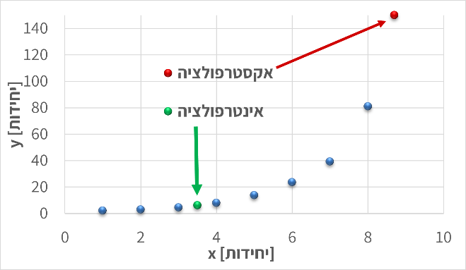{width="3.174060586176728in" height="1.8474529746281714in"}

::: {custom-style="caption"}
Figure [8 - בשני הגרפים מוצגות דוגמאות למדידה של ערכים שלא נמדדו ישירות: הנקודות הכחולות הן הערכים שנמדדו, הנקודות הירוקות מייצגות חיזוי בתוך תחום המדידות (אינטרפולציה), והנקודות האדומות -- חיזוי מחוץ לתחום המדידות (אקסטרפולציה), שבו גובר הסיכון לסטות מהמגמה האמיתית]{dir="rtl"}.
:::

### [אינטרפולציה מקומית]{dir="rtl"}

[כאשר נרצה להעריך את ערכו של משתנה בנקודה שנמצאת בין שתי מדידות ידועות]{dir="rtl"}, [נשתמש ב-**אינטרפולציה מקומית**]{dir="rtl"} **(Local Interpolation)**.\
[הרעיון פשוט: אם שתי נקודות סמוכות מראות מגמה כמעט ישרה, ניתן להניח שהקשר ביניהן ליניארי בטווח הצר הזה. כך נוכל לחשב את ערך המשתנה המבוקש לפי קו ישר המחבר בין שתי הנקודות]{dir="rtl"}.

[אם הנקודות הן]{dir="rtl"} $(x_{1},y_{1})$[ו-]{dir="rtl"}$(x_{2},y_{2})$, [ניתן לחשב את]{dir="rtl"} $y$ [עבור ערך ביניים של]{dir="rtl"} $x$[לפי]{dir="rtl"}:

$$y = y_{1} + \frac{x - x_{1}}{x_{2} - x_{1}}(y_{2} - y_{1})$$

[שיטה זו נוחה במיוחד בגרפים ניסיוניים או בטבלאות כיול, שבהם נרצה למצוא ערך חסר *בתוך* התחום שנמדד]{dir="rtl"}. [עם זאת, יש לזכור כי ההנחה הליניארית תקפה רק **בקרבת הנקודות, ובהנחה שהמדידות מדוייקות באופן יחסי.**]{dir="rtl"} [כאשר המרווחים גדולים, המדידות רועשות, ו/או הנתונים מתנהגים באופן שאינו לינארי, יש לעבור לשיטות מדויקות יותר כגון התאמת קו או התאמת עקומה]{dir="rtl"}.

<figure>
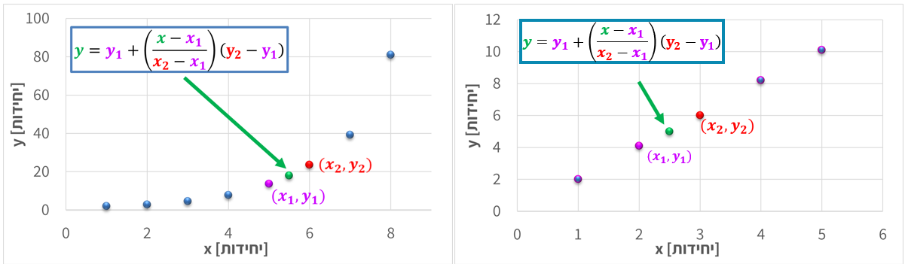
<figcaption>

Figure 9 - חישוב אינטרפולציה לינארית בין שתי נקודות מדידה סמוכות לצורך הערכת ערך החסר בתוך טווח הנתונים.

</figcaption>
</figure>

### [התאמת קו ישר]{dir="rtl"} (Linear Fit)[.]{dir="rtl"}

[כאשר ברשותנו מספר נקודות מדידה המתארות קשר כמעט ליניארי בין שני משתנים, נוכל לתאר את הנתונים באמצעות התאמת קו ישר]{dir="rtl"} (Linear Fit)[.]{dir="rtl"} [במקרה זה, אנו לא מסתכלים רק על האזור המסויים בו נמצא הערך שלנו, אלא משתמשים בנקודות על הגרף על מנת לייצר משוואת קו ישר]{dir="rtl"}.

[המודל המתמטי הוא]{dir="rtl"}:

$$y = ax + b$$
[אם נבחר כל שתי נקודות על הקו]{dir="rtl"}, $(x_{1},y_{1})$[ו-]{dir="rtl"}$(x_{2},y_{2})$, [נוכל לחשב את מקדמי המשוואה לפי]{dir="rtl"}:

$$a = \frac{y_{2} - y_{1}}{x_{2} - x_{1}},b = y_{1} - ax_{1}$$
[במקרה זה משוואת הקו מבוססת על הנקודות אותן בחרנו, לפי ההנחה שאלו שתי הנקודות שמייצגות את הישר בצורה הטובה ביותר (\"לפי העין\"). לאחר שמצאנו את משוואת הקו, נוכל להשתמש בה גם לצורך אינטרפולציה וגם לצורך אקסטרפולציה. עם זאת, חשוב לזכור כי ככל שנצא רחוק יותר מתחום המדידות]{dir="rtl"}, [האמינות של האקסטרפולציה פוחתת]{dir="rtl"}. [כאשר הנתונים מצייתים באופן הדוק לקו ישר, ניתן להתאים את הקו "בעין" או על סמך שתי נקודות בלבד. אך כאשר קיים פיזור או רעש מדידה, יש להיעזר בכלים סטטיסטיים מדויקים יותר.]{dir="rtl"}

<figure>
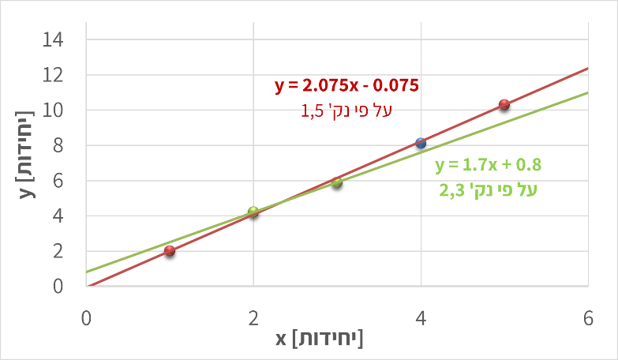
<figcaption>

Figure 10 הגרף מציג שתי התאמות לינאריות לסט נתונים זהה, כאשר כל אחת מבוססת על זוג נקודות שונה. 
השוואת הקווים מדגימה כיצד בחירת נקודות שונות משפיעה על שיפוע ונקודת החיתוך של המשוואה

</figcaption>
</figure>

### [רגרסיה לינארית]{dir="rtl"} (Linear Regression)

[במדידות אמיתיות כמעט תמיד קיימות שגיאות מדידה ורעש אקראי. לכן, גם אם הקשר בין המשתנים ליניארי באופן עקרוני, הנקודות בפועל אינן נופלות בדיוק על קו אחד אלא מפוזרות סביבו]{dir="rtl"}. [במצב כזה, לא ניתן לבחור שתי נקודות ולבנות מהן קו מייצג -- יש צורך בשיטה שתמצא את הקו "הכי מתאים]{dir="rtl"}" [לכל הנתונים יחד]{dir="rtl"}. [שיטה זו נקראת רגרסיה ליניארית]{dir="rtl"}, [והיא מבוססת על עיקרון ה-]{dir="rtl"}Least Squares[, \"שיטת הריבועים הפחותים\".]{dir="rtl"}\
[לפי עיקרון זה, נבחר את השיפוע]{dir="rtl"} $a$ [והחיתוך]{dir="rtl"} $b$ [של הקו]{dir="rtl"} $y = ax + b$ [כך שסכום הריבועים של ההפרשים בין הערכים הנמדדים]{dir="rtl"} $y_{i}$ [לערכים החזויים לפי הקו יהיה הקטן ביותר]{dir="rtl"}:

$$\text{minimal\:\,\:\,}\sum_{i}^{}{(y_{i} - (ax_{i} + b))^{2}}$$
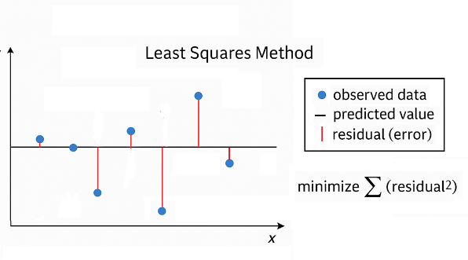{width="2.690751312335958in" height="1.2792563429571304in"}

[כלומר, הקו שנבחר הוא זה שמייצג בצורה הטובה ביותר את כלל הנתונים, גם אם כל נקודה בודדת סוטה ממנו מעט]{dir="rtl"}.

[רגרסיה ליניארית אינה רק דרך ציור מדויקת יותר של קו; היא גם מספקת **מדדים כמותיים** לאיכות ההתאמה, כמו מקדם הקורלציה]{dir="rtl"} $R^{2}$, [המעיד עד כמה הקו מתאר את הנתונים היטב]{dir="rtl"}.

[במעבדות ובתעשייה, רגרסיה ליניארית משמשת לעיתים קרובות ליצירת **עקומות כיול אמינות**]{dir="rtl"} -- [למשל, במכשירי ספקטרופוטומטר, שבהם נבנה קו כיול על סמך מדידות רועשות ומחשבים את ריכוז הדגימה הלא ידועה לפי משוואת הקו שהתקבלה]{dir="rtl"}.

<figure data-custom-style="List Paragraph">
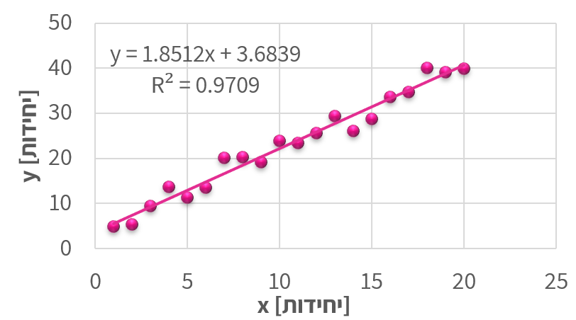
<figcaption>

Figure 11 - הנקודות המייצגות נתונים ניסיוניים, והקו מציג את קו הרגרסיה שנקבע לפי שיטת הריבועים הפחותים.

</figcaption>
</figure>

### [התאמת עקומה לא ליניארית]{dir="rtl"} (Nonlinear Curve Fitting)

[לא כל קשר בין משתנים הוא ליניארי. במקרים רבים -- במיוחד בתהליכים כימיים, ביולוגיים או פיזיקליים -- הנתונים מראים **עקומה ברורה**]{dir="rtl"}: [הקצב משתנה עם הזמן, הבליעה מתקרבת לערך רוויה, או הלחץ תלוי בריבוע הטמפרטורה. במצבים כאלה, קו ישר כבר אינו מתאים, ונדרש לבצע **התאמת עקומה לא ליניארית**]{dir="rtl"}.

[במקום להשתמש במשוואה מהצורה]{dir="rtl"} $y = ax + b$, [נבחר פונקציה שתואמת את האופי של הנתונים, למשל]{dir="rtl"}:

$$y = ae^{bx},y = ax^{b},y = a(x - x_{0})^{2} + c$$

[נחשב את הפרמטרים]{dir="rtl"} $a,b,c$[כך שהעקומה תתאים בצורה הטובה ביותר למדידות -- לעיתים בעזרת חישוב ממוחשב (למשל בשיטת הריבועים המינימליים הלא-ליניארית)]{dir="rtl"}. [לעיתים נבחר את הצורה של הפונקציה לפי ידע פיזיקלי מוקדם (למשל תגובה אקספוננציאלית או קצב תלוי חזקתית), ובמקרים אחרים פשוט נבחן איזו פונקציה מתאימה טוב יותר לנתונים]{dir="rtl"}.

<figure>

<figcaption>

Figure 12 – הגרף מציג נתונים המתואמים לעקומה מהצורה 
$y = 2x^{3}$ 
, כדוגמה למקרה שבו הקשר בין המשתנים אינו ליניארי.

</figcaption>
</figure>

עם זאת, התאמות לא־ליניאריות קשות יותר להערכה אינטואיטיבית: בעקומה מורכבת קשה לעין האנושית להבחין אם ההתאמה “מדויקת” או לא, במיוחד כשיש כמה פרמטרים חופשיים. לכן חשוב להיעזר גם בידע הפיזיקלי על התהליך וגם במדדים מספריים (כמו $R^{2}$ או סטיות התקן של הפרמטרים) כדי לוודא שההתאמה סבירה ולא רק מתמטית. לבסוף, ככל שמספר הפרמטרים גדל, כך גם הסיכון ל־התאמת יתר (overfitting) — מצב שבו הפונקציה “מתאימה” את עצמה לכל נקודה אך מאבדת משמעות פיזיקלית.

::: {.example}

[
סימולציה: המחשת שיטת הריבועים המינימליים](simulations/leastsquares.html){target="_blank"}
:::

### **[לינאריזציה]{dir="rtl"}** (Linearization)

[במקרים רבים נעדיף להמיר קשר לא ליניארי לקשר **ליניארי**]{dir="rtl"}, [כדי להקל על ניתוח הנתונים או על התאמת קו ישר. פעולה זו נקראת **לינאריזציה**]{dir="rtl"} -- [הפיכת המשוואה לצורה ישרה על-ידי שינוי המשתנים או הצירים]{dir="rtl"}.

<figure>

<figcaption>

Figure 13 – לינאריזציה עבור הגרף מתמונה 11. לאחר החלפת המשתנה 
x 
במשתנה 
$z = x^{3}$ 
, התקבל גרף ליניארי.

</figcaption>
</figure>

הרעיון פשוט: אם ניתן לכתוב את המשוואה כך שתתקבל הצגה מהצורה  

$$
f(x) = a\,g(x) + b
$$

אז גרף של \( f(x) \) לעומת \( g(x) \) יניב **קו ישר**, שממנו ניתן לחשב את השיפוע \( a \) והחיתוך \( b \).

::: example

$$
y = 3x^{3}
$$

נגדיר משתנה חדש \( u = x^{3} \).  
גרף של \( y \) מול \( u \) הוא קו ישר עם שיפוע \( 3 \) וחיתוך \( 0 \).

דוגמה נוספת:

$$
y = a e^{bx}
$$

נחיל לוג טבעי על שני צידי המשוואה:

$[\ln y = \ln a + b x]$

גרף של $\ln y$ מול $x$ הוא קו ישר:  
השיפוע הוא $b$, והחיתוך עם הציר הוא $\ln a$.
:::

[השימוש בלינאריזציה מקל מאוד על זיהוי מגמות, על חישוב פרמטרים, ועל הערכת איכות ההתאמה בעין -- מאחר שקל לנו יותר לזהות "ישרות" של קו מאשר עקמומיות של עקומה]{dir="rtl"}.\
[עם זאת, יש לזכור שלינאריזציה משנה את יחידות הצירים ואת משמעות המשתנים, ולכן יש **להחזיר את התוצאה למשתנים המקוריים** בסיום הניתוח]{dir="rtl"}.

::: {.callout-tip}
#### טיפ: דפי עבודה אינטראקטיביים לריבועים המינימליים

רוצים לתרגל צעד-אחר-צעד את חישוב קו הרגרסיה אחרי לינאריזציה של מודל לא-ליניארי?  
הקישורים הבאים מובילים לדפי עבודה אינטראקטיביים (הסימולציה תיפתח בעמוד חדש):

- [דף עבודה 1 – חישוב קו הרגרסיה צעד-אחר-צעד](simulations/LeastSquaresCalc.html){target="_blank"}
- [דף עבודה 2 – הדגמה, מציאת הקשר בין הזמן לכמות חלבון](simulations/LeastSquaresCalc2.html){target="_blank"}

מומלץ לפתוח את דפי העבודה בלשונית נפרדת, ולחזור לפרק תוך כדי פתרון.
:::

### [שימוש בגרפים לוגיים וסמילוגיים]{dir="rtl"}

[לפני עידן המחשבים, אחת הדרכים הנפוצות לנתח נתונים ניסיוניים הייתה שימוש בגרפים לוגיים]{dir="rtl"} (Log-- []{dir="rtl"}Log) [ו-סמילוגיים]{dir="rtl"} (Semi--Log)[. גרפים אלה שימשו להמחשה גרפית של קשרים מתמטיים לא ליניאריים -- בעיקר קשרים אקספוננציאליים ו-חזקתיים --]{dir="rtl"} [והיו כלי בסיסי בעבודתו של כל מהנדס או חוקר]{dir="rtl"}. []{dir="rtl"}

<figure>
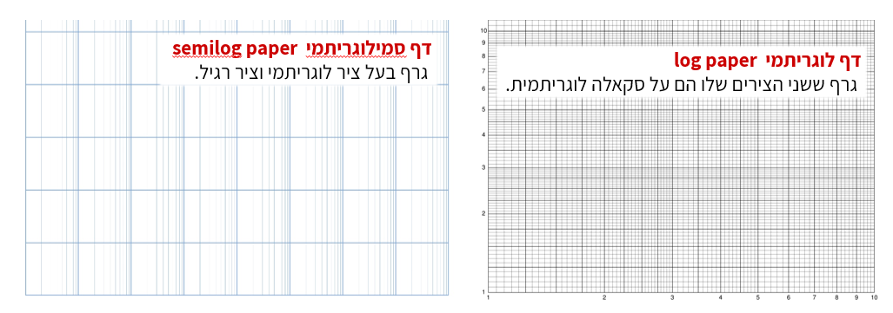
<figcaption>

Figure 14 - דפים לוגריתמים וסמי לוגריתמים. שימוש בגרפים מסוג זה מאפשר להציג קשרים אקספוננציאליים וחזקתיים כקווים ישרים, ולזהות בקלות את טיב הקשר בין המשתנים.

</figcaption>
</figure>

<figure>
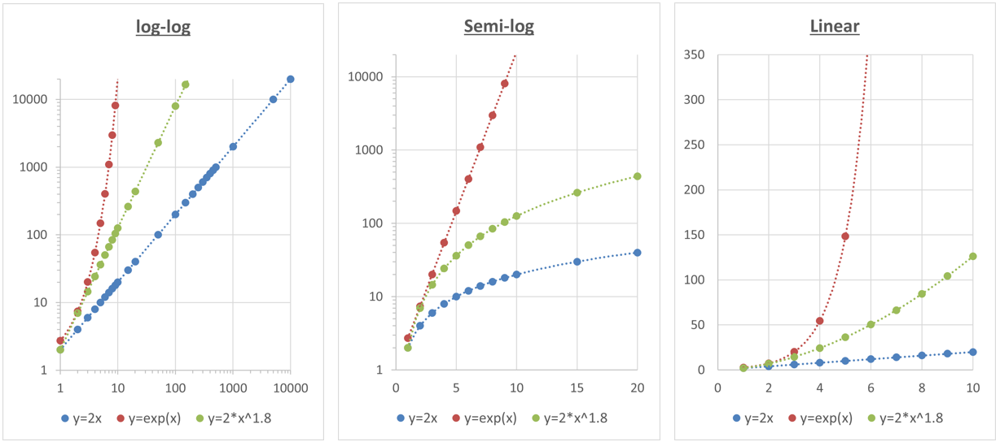
<figcaption>

Figure 15השוואה בין גרף ליניארי, סמי-לוגריתמי ולוגריתמי-לוגריתמי.

</figcaption>
</figure>

| **סוג גרף** | **ליניארי** | **סמי־לוגריתמי** | **לוג־לוגריתמי** |
|:---:|:---:|:---:|:---:|
| **צירי הסקאלה** | שני הצירים ליניאריים | ציר אחד (בדרך כלל $y$) לוגריתמי, והשני ליניארי | שני הצירים לוגריתמיים |
| **סוג הקשר** | קשר ישר | קשר אקספוננציאלי | קשר חזקתי |
| **צורת המשוואה** | $y = a + bx$ | $y = a e^{bx}$ | $y = a x^{b}$ |
| **פירוש השיפוע ($m$)** | קצב שינוי קבוע של $y$ ביחס ל־$x$ | קצב הגידול או הדעיכה האקספוננציאלי | המעריך ($b$) בקשר החזקתי |
| **חישוב השיפוע בפועל** | $m = \dfrac{\Delta y}{\Delta x}$ | $b = \dfrac{\ln(y_2) - \ln(y_1)}{x_2 - x_1}$ | $b = \dfrac{\log(y_2) - \log(y_1)}{\log(x_2) - \log(x_1)}$ |
| **משמעות פיזיקלית** | השיפוע הוא השינוי המוחלט (כמו מהירות, קצב זרימה וכו׳) | מציין שיעור שינוי יחסי קבוע (למשל קצב דעיכה רדיואקטיבית) | מתאר יחס קנה־מידה — כיצד $y$ משתנה כאשר $x$ מוכפל פי ערך קבוע |

[כיום, בעידן התוכנות והחישובים הדיגיטליים, כמעט ואין צורך לצייר גרפים לוגריתמיים באופן ידני]{dir="rtl"}.\
[עם זאת]{dir="rtl"}, [הבנה של הצגה לוגית חשובה מאוד -- היא מאפשרת לנו להעריך בצורה נכונה שינויים לוגריתמיים או אקספוננציאליים (למשל גידול מעריכי או דעיכה מהירה), ולפרש נכונה גרפים מדעיים שבהם קני מידה כאלה עדיין נפוצים]{dir="rtl"}.

::: {.exercise}
**בטבלת הכיול הבאה נמדדה בליעת אור (y, ביחידות a.u.) עבור ריכוזים שונים של חומר (x, ביחידות mol/L):**

::: {.rtl-table}
| x (mol/L) | **0.10** | **0.20** | **0.30** | **0.40** | **0.50** |
|:---:|:---:|:---:|:---:|:---:|:---:|
| y (a.u.) | 0.48 | 0.96 | 1.45 | 1.94 | 2.44 |
| יחידות שרירותיות |  |  |  |  |  |
:::

1. השתמשו באינטרפולציה מקומית כדי להעריך את ערך הבליעה עבור **y=1.70a.u.**  
2. מצאו את משוואת הקו המתארת את הנתונים, בהנחה שהקשר ליניארי.  
3. השתמשו במשוואה שמצאתם כדי למצוא את הריכוז עבור **y=2.85a.u.**  
4. אילו היה מספר רב של נקודות מדידה, באיזו מן השיטות המוזכרות בפרק היה כדאי להשתמש?
:::

### סט תרגילים: בחירת שיטת הערכה מנתונים גרפיים

כאשר אנו רוצים להעריך נתונים, אנחנו ננסה לעשות את זה מצד אחד מדוייק ומצד שני מהר. לכן ננסה לחפש את השיטה שתתן לנו את התוצאה הכי קרובה במינימום מאמץ. 
נסו לענות על השאלות הבאות ולנמק מדוע בחרתם כל שיטה. יכולות להיות תשובות רבות, מה שחשוב הוא הנימוק. התשובות פה ממחישות נימוקים אפשריים לבחירה מסויימת. 

::: {.exercise}

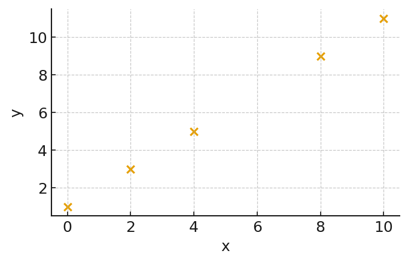{#fig-ex1 width="60%" fig-align="center"}

בגרף מוצגים נתונים של \(y\) כפונקציה של \(x\). הנקודות כמעט מסודרות על קו ישר. אין ברשותינו מחשב זמין, אלא רק מחשבון פשוט יחסית. 

נרצה להעריך את הערך של \(y\) עבור ערך ביניים של \(x\).

באיזו שיטה כדאי להשתמש?

:::

::: {.callout-note collapse="true" title="פתרון"}
יש לנו נקודות שיוצרות קו שנראה ישר יחסית כשהנקודה נמצאת בתוך הטווח, אבל רחוקה מנקודות אחרות, ולכן כדאי להשתמש בשיטה של התאמה פשוטה של קו ישר.
:::

::: {.exercise}

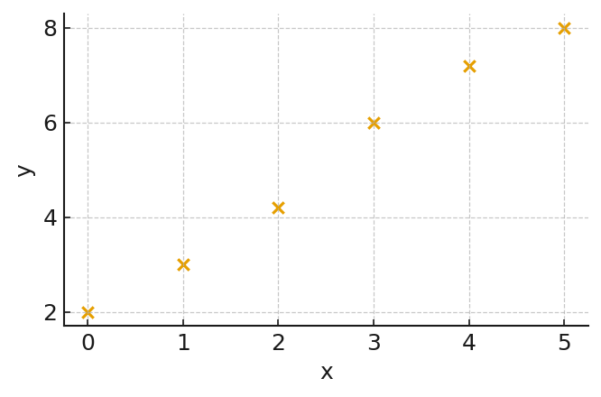{#fig-ex2 width="60%" fig-align="center"}

בגרף מוצגים ערכי \(y\) כפונקציה של הזמן \(t\) בין \(t=0\) לבין \(t=5\). נרצה להעריך את ערך \(y\) בזמן \(t=8\), מחוץ לטווח המדידה.

איזו שיטה מתאימה ביותר כדי להעריך את \(y\) בזמן \(t=8\)?
:::

::: {.callout-note collapse="true" title="פתרון"} 

הגרף נראה יחסית לינארי, אבל עם סטיות למעלה ולמטה, כמו כן, באקסטרפולציה השגיאה גדלה ולכן נרצה ישר מדוייק ככל האפשר, ולכן נעשה רגרסיה לינארית
:::

::: {.exercise}

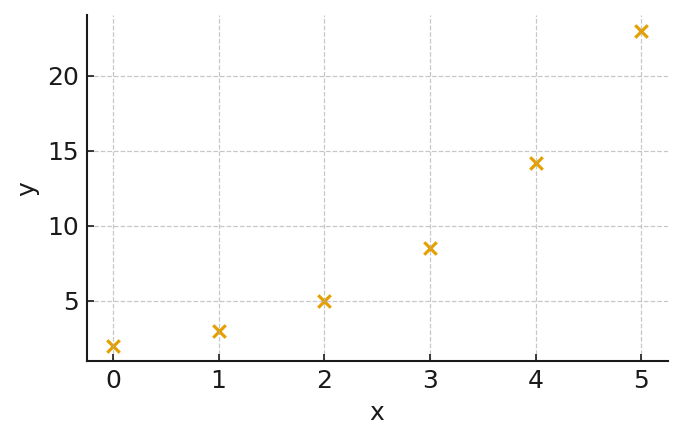{#fig-ex4 width="60%" fig-align="center"}

בגרף מוצגת גדילה שנראית אקספוננציאלית של \(y\) כפונקציה של הזמן \(t\). הקשר מתואר על ידי מודל פיסיקלי מהצורה \(y = Ce^{kt}\).

כיצד נבנה את המשוואה ונמצא את הקבועים המתאימים למודל?

:::

::: {.callout-note collapse="true" title="פתרון"}
 עבור מודל \(y = Ce^{kt}\) נפעיל ln על שני האגפים, ונקבל קשר לינארי בין \(\ln y\) לבין \(t\), ואז נעשה רגרסיה לינארית על הנתונים.
מאחר ומדובר במציאת קבועים לתיאור מערכת פיסיקלית נבחר בשיטה הכי מדוייקת שיש לנו.
ברמה העקרונית ניתן להשתמש גם בשיטת הריבועים המינימלים עבור רגרסיה שאינה לינארית, אך במקרה זה החישוב הוא משמעותית יותר מסובך ולא ניתן לפתור אותו באופן ישיר אלא רק בצורה נומרית.
:::

::: {.exercise}
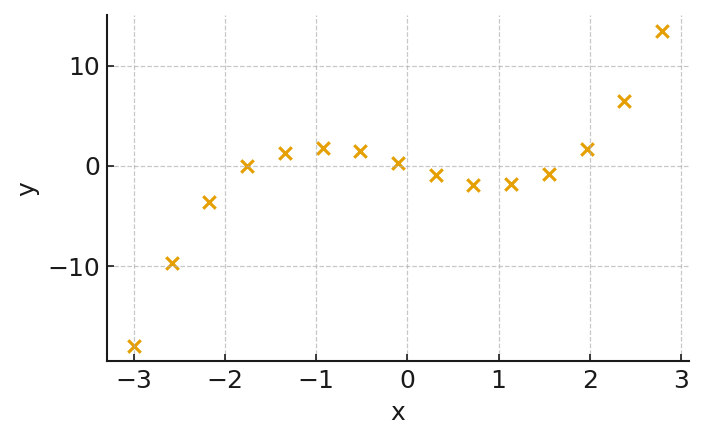{#fig-ex5 width="60%" fig-align="center"}

בגרף מוצגת פונקציה כללית של \(y\) מול \(x\). נרצה להעריך את ערך \(y\) ב-\(x=1.8\),אך אין לנו מודל פיסיקלי המתאר את המערכת
איזו שיטה עדיפה?
:::

::: {.callout-note collapse="true" title="פתרון"}
 כאן מעניינת אותנו התנהגות מקומית באזור קטן, ולא מודל גלובלי לכל התחום. הנקודות קרובות יחסית, ורואים מגמה עקבית ולא רועשת, כך שסביר מאוד שהפונקציה עצמה פועלת באופן מאוד קרוב לנתונים, וכי המשתנים בין כל שתי נקודות סמוכות מתנהגים כקו ישר. לכן נבחר באינטרפולציה מקומית
:::

### [סיכום]{dir="rtl"}
בעבודה הנדסית וניסויית אנו כמעט תמיד נדרשים להסיק מסקנות מתוך מדידות חלקיות.  
האתגר הוא לייצג את הנתונים בדרך שתאפשר לנבא ערכים חדשים ולבדוק אם הם סבירים מבחינה פיזיקלית.  
לשם כך עומדים לרשותנו כלים ברמות שונות של מורכבות:

- **אינטרפולציה מקומית** מאפשרת להעריך ערכים *בין* שתי נקודות סמוכות.  
- **התאמת קו ישר** יוצרת מודל פשוט שמתאר את המגמה הכללית של נתונים שנראים ליניאריים באופן יחסי.  
- **רגרסיה ליניארית** מחשבת קו מייצג סטטיסטי כאשר קיימות סטיות ורעש מדידה.  
- **התאמת עקומה לא־ליניארית** מרחיבה את השיטה למקרים שבהם הקשר בין המשתנים מתואר בעזרת פונקציה מורכבת יותר.
- **ליניאריזציה וגרפים לוגריתמיים** מאפשרים להפוך קשרים לא־ליניאריים לייצוגים ישרים שקל לנתח בעין ובחישוב.

בין אם מדובר בקו פשוט או בעקומה מורכבת, המטרה המשותפת היא אחת -  
למצוא תיאור מתמטי אמין של הנתונים ולבחון עד כמה הוא מייצג את המציאות.  
גם בעידן שבו תוכנות מבצעות עבורנו את כל ההתאמות בלחיצת כפתור, חשוב להבין את העקרונות שמאחורי השיטות:  
רק כך נוכל להעריך את אמינות התוצאות, לזהות מתי חיזוי הוא סביר ומתי מדובר באקסטרפולציה מסוכנת,  
ולשלב בין ניתוח מתמטי לבין שיקול הנדסי ופיזיקלי נכון.

