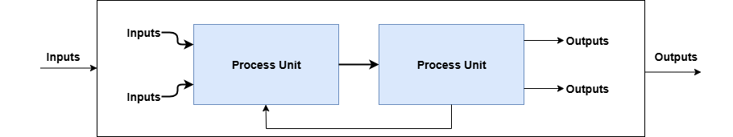
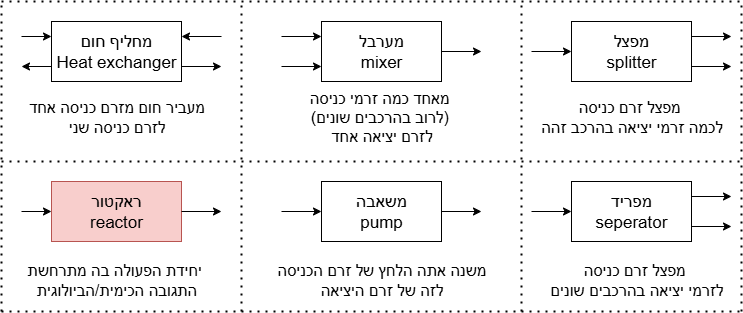
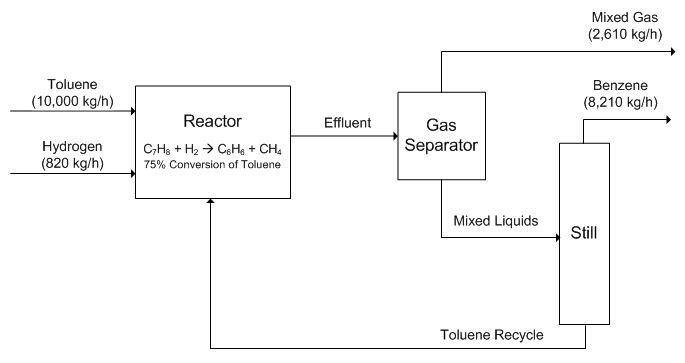
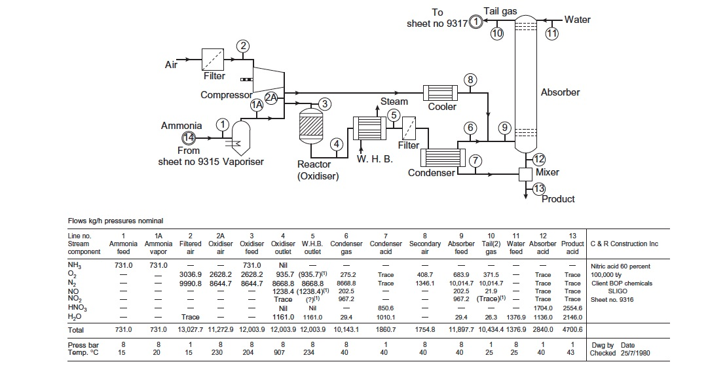
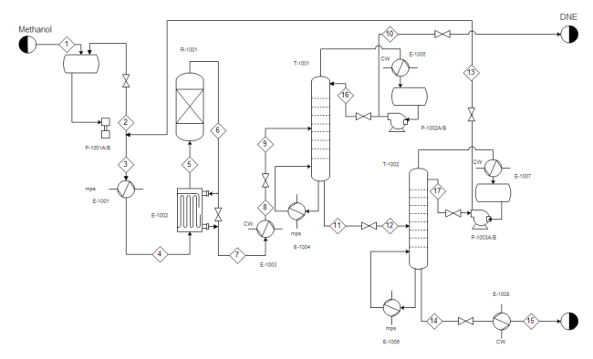
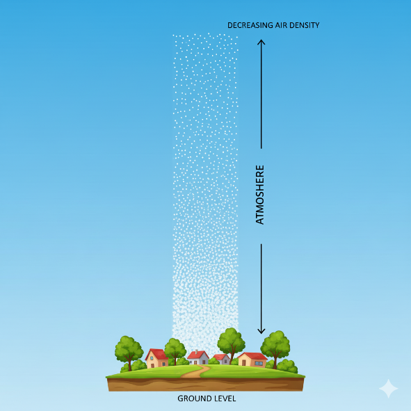
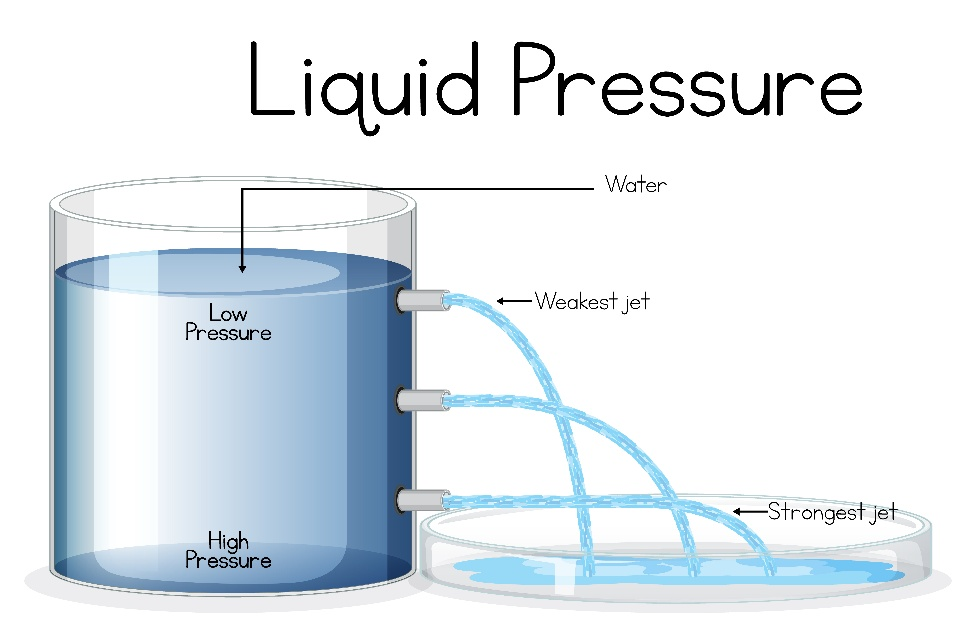
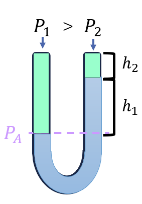
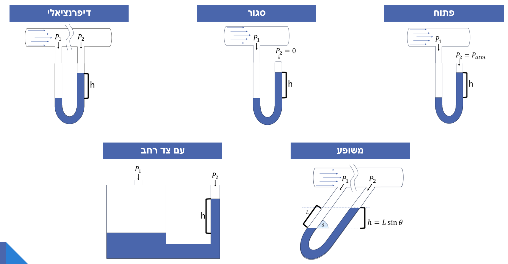

# [תהליכים ומשתני תהליך]{dir="rtl"}

## [מה נלמד בפרק הזה]{dir="rtl"}?

- ::: {custom-style="List Paragraph"}
  [[להגדיר ולהסביר]{custom-style="Strong"} את המושגים הבסיסיים של צפיפות, משקל סגולי, יחידות מוליות]{dir="rtl"} [(]{dir="rtl"}mole gram-mole, pound-mole[), וגדלי טמפרטורה ולחץ]{dir="rtl"}.
  :::

- ::: {custom-style="List Paragraph"}
  [[להמחיש ולזהות]{custom-style="Strong"} משתנים בתרשים תהליך - זרמים, משתני מצב והרכב - ולתאר את תפקידם בתהליך הנדסי]{dir="rtl"}.
  :::

- ::: {custom-style="List Paragraph"}
  [[להבדיל ולהשוות]{custom-style="Strong"} בין סוגי לחצים (מוחלט, נמדד ואטמוספרי), ולנתח מצבים בהם הלחץ נמדד בעזרת מנומטר או עמוד נוזל]{dir="rtl"}.
  :::

- ::: {custom-style="List Paragraph"}
  [[לבצע ולנמק]{custom-style="Strong"} חישובים המקשרים בין מסה, נפח ומולים, בהתבסס על צפיפות ומשקל מולקולרי]{dir="rtl"}.
  :::

- ::: {custom-style="List Paragraph"}
  [[להמיר ולפרש]{custom-style="Strong"} הרכב תערובת בין שברי מסה לשברי מולים, ולחשב משקל מולקולרי ממוצע של תערובת מרובת רכיבים]{dir="rtl"}.
  :::

- ::: {custom-style="List Paragraph"}
  [[להמיר ולהעריך]{custom-style="Strong"} יחידות טמפרטורה בין קלווין, צלזיוס, פרנהייט וראנקין, ולהבין את משמעות הבחירה ביחידת מידה בתיאור תהליך פיזיקלי או ביוטכנולוגי]{dir="rtl"}.
  :::

## [מהו תהליך הנדסי?]{dir="rtl"}

[תהליך הוא רצף של פעולות פיזיקליות או כימיות שבמהלכן חומרי גלם עוברים שינוי]{dir="rtl"} [בהרכבם, בצורתם או באנרגיה שלהם.]{dir="rtl"}

[לעבודתם של מהנדסי ומהנדסות התהליך שלושה היבטים: תכנון, תפעול ואופטימיזציה של תהליכים במפעלי הייצור השונים, כך שהתהליכים יהיו יציבים, בטוחים, רווחיים ויעילים לאורך זמן.]{dir="rtl"}

::: definition
**[תכנון התהליך]{dir="rtl"} (Process Design)** - [הגדרה של יחידות הפעולה, תנאי ההפעלה והציוד הדרוש כך שהתהליך יעמוד במטרות הייצור ובדרישות הבטיחות]{dir="rtl"}.
:::

::: definition
**[תפעול התהליך]{dir="rtl"} (Process Operation)** - [פיקוח יומיומי על תהליך קיים, ניטור נתונים בזמן אמת, וזיהוי חריגות או תקלות בתפקוד המערכת]{dir="rtl"}.
:::

::: definition
**[אופטימיזציה של התהליך]{dir="rtl"} (Process Optimization)** - [ניתוח ביצועים וחיפוש מתמיד אחר דרכים לשפר יעילות, להפחית צריכת אנרגיה ולהגדיל תפוקה]{dir="rtl"}.
:::

[שלושת השלבים הללו משקפים את עיקר העשייה של מהנדס ומהנדסת תהליך: לא רק להבין מה קורה במערכת, אלא גם **לדעת לשלוט בה ולכוון אותה**]{dir="rtl"}.

[כל תהליך בנוי מיחידות פעולה]{dir="rtl"} (Unit Operations)

::: definition
[יחידות פעולה]{dir="rtl"}- (Unit Operations) [רכיבים נפרדים שכל אחד מהם מבצע שינוי מסוים בחומר]{dir="rtl"}:
:::

<figure>

<figcaption><div data-custom-style="caption">
<p>Figure <span dir="rtl">16- תיאור כללי של תהליך בדיאגרמת בלוקים</span></p>
</div></figcaption>
</figure>

[יש סוגים רבים של יחידות פעולה, אך הבסיסיות ביותר, בהן נשתמש בספר זה, הן -]{dir="rtl"}

::: definition
{width="6.5in" height="2.7375in"}
Figure [17 - יחידות פעולה בסיסיות בתהליך הכימי/ביולוגי]{dir="rtl"}
:::

### [דיאגרמות לתכנון תהליך]{dir="rtl"}

[מהנדסים משתמשים בתרשימים שונים כדי לתאר תהליכים - כל תרשים מתאים לרמת פירוט אחרת של התכנון]{dir="rtl"}.

1.  ::: {custom-style="List Paragraph"}
    **Block Flow Diagram (BFD)**
    :::

תרשים כללי ופשוט המתאר את מבנה התהליך ברמת המאקרו. הוא מציג את שלבי העיבוד העיקריים ואת כיווני זרימת החומר ביניהם, ללא פירוט של ציוד, נתונים תרמודינמיים או יחידות מדידה.
תרשימי BFD משמשים להבנת עקרון הפעולה של התהליך ולתקשורת ראשונית בין צוותים הנדסיים בשלב התכנון המוקדם.

<figure>

<figcaption><div data-custom-style="caption">
<p>Figure <span dir="rtl">18</span> <span dir="rtl">-</span> Block flow process diagram for the production of benzene (Turton et al., 2012)</p>
</div></figcaption>
</figure>

2.  ::: {custom-style="List Paragraph"}
    **Process Flow Diagram (PFD)**
    :::

תרשים המשמש לתכנון הנדסי מפורט של תהליך. הוא כולל את כל יחידות הפעולה העיקריות, קווים לכל זרמי החומר והאנרגיה, ונתוני פעולה בסיסיים כגון טמפרטורה (T), לחץ (P) וספיקות. לעיתים מוצג בו גם ציוד עזר חשוב.
תרשימי PFD משמשים לביצוע חישובי מאזן חומר ואנרגיה ולשלבי התכנון הראשוניים של תהליך תעשייתי.

<figure>

<figcaption><div data-custom-style="caption">
<p>Figure <span dir="rtl">19-</span> Process Flow Diagram Detailing the Nitric Acid Process (Towler and Sinnott, 2013)</p>
</div></figcaption>
</figure>

**Piping and Instrumentation Diagram (P&ID)**

התרשים המפורט ביותר בתכנון התהליך. הוא כולל את כל קווי הצנרת, השסתומים, החיישנים, מכשירי המדידה, יחידות הבקרה והאזעקות.
תרשימי P&ID משמשים מהנדסי מכשור, בקרה ותפעול בשלבי הבנייה, ההפעלה והתחזוקה של מתקנים תעשייתיים.

<figure>

<figcaption><div data-custom-style="caption">
<p>Figure <span dir="rtl">20 - תזרים צנרת ומכשור.</span> Copyright © 2025 Edrawsoft</p>
</div></figcaption>
</figure>

[[כיצד נצייר תהליך?]{.underline}]{dir="rtl"}

כדי לנתח תהליך, נייצג אותו באופן סכמטי כתרשים בלוקים (Block Flow Diagram - BFD).
כל בלוק מייצג יחידת פעולה אחת, וחצים מייצגים את זרמי החומר או האנרגיה הנכנסים והיוצאים מן הבלוקים. ליד כל חץ נציין את שם הזרם ואת המשתנים הפיזיקליים החשובים: טמפרטורה (T), לחץ (P), ספיקת מסה (ṁ), והרכב (xᵢ). לעיתים מסמנים גם מסגרת גבולות מערכת (System Boundary), המגדירה מה נכלל בתהליך ומה לא. כך נוצר ייצוג גרפי של תהליך מורכב, שממנו ניתן בהמשך לגזור את משוואות מאזן החומר והאנרגיה.

::: example
[תהליך תסיסה]{dir="rtl"} (Fermentation Process)
[כדי להמחיש את רעיון התרשים, נבחן תהליך פשוט של ייצור בירה]{dir="rtl"}. [בתהליך זה מוזרמים שני חומרים למיכל תסיסה]{dir="rtl"} (Fermentation Reactor):[\
- תמיסת סוכר]{dir="rtl"} (Substrate Feed) [מהווה את מקור האנרגיה לשמרים]{dir="rtl"}.[\
- תמיסת שמרים]{dir="rtl"} (Cell Suspension) [מכילה תאים חיים המבצעים את התגובה הביולוגית]{dir="rtl"}.
[בתוך המיכל מתרחשת תגובה ביוכימית]{dir="rtl"}: [השמרים ממירים את הסוכרים ל-אתנול (מוצר רצוי) ו-פחמן דו-חמצני (תוצר לוואי) מהמיכל יוצא זרם אחד ובו תערובת של מים, אתנול ותאים מתים]{dir="rtl"}. [וזרם נוסף של פחמן דו חמצני במצב גזי]{dir="rtl"}
[תרשים התהליך ייראה כך]{dir="rtl"}:
{width="5.9375in" height="2.6041666666666665in"}
Figure [21 - תרשים בלוקים - מערכת תסיסה]{dir="rtl"}
:::

## [משתני תהליך]{dir="rtl"}

[אחר שזיהינו את שלבי התהליך ואת יחידות הפעולה המרכיבות אותו, נוכל להתחיל לבחון אותו לעומק. כל אחת מהיחידות בתהליך - בין אם מדובר במיכל ערבוב, במחליף חום או במגדל ספיגה - מאופיינת על-ידי משתני תהליך]{dir="rtl"} (process variables)[.]{dir="rtl"}

::: definition
**[משתני תהליך]{dir="rtl"} (Process Variables)** [הם גדלים פיזיקליים או כימיים הנמדדים או נשלטים במהלך פעולה של מערכת תהליכית, ומשמשים לתיאור מצבה בזמן נתון.]{dir="rtl"}
:::

[משתנים אלה כוללים גדלים כמו טמפרטורה, לחץ, ספיקה, ריכוז והרכב כימי]{dir="rtl"}, [והם אלה שמאפשרים לנו לכמת את מה שקורה בכל שלב של התהליך. במילים אחרות, אם תרשים הבלוקים מציג לנו את "מה קורה" בתהליך, משתני התהליך הם **השפה הכמותית** שבאמצעותה מהנדסים ומהנדסות מתארים מה מתרחש בתוך כל יחידת פעולה, וכיצד שינוי באחד מהם משפיע על שאר מרכיבי המערכת]{dir="rtl"}.

**דוגמאות למשתני תהליך**

::: {.rtl-table}
| **סוג המשתנה** | **דוגמאות** | **מה הוא מתאר** |
|:---:|:---:|:---:|
| תרמודינמי | טמפרטורה (T), לחץ (P) | מצבי אנרגיה והתנהגות חומרים |
| זרימה | ספיקה מסה / נפח | כמה חומר עובר ביחידת זמן |
| הרכב | ריכוז, אחוז מסה, שבר מולרי | תכולת חומרים בתערובת |
:::

## [מסה ונפח]{dir="rtl"}

כאשר אנו ניגשים לתאר מערכת, שני הגדלים הראשונים שבהם נשתמש כמעט בכל תהליך הם מסה (Mass) ו-נפח (Volume). הם מתארים כמה חומר יש לנו וכמה מקום הוא תופס. הכמות שלהם תלויה בגודל המערכת שבה אנו עוסקים: אם נבחן כוס שתייה, נפח המים (ובהתאם גם מסת המים) יהיה קטן מזה שבדלי או בבריכה. לכן אלו תכונות התלויות בגודל המערכת, או במונחים הנדסיים - תכונות אקסטנסיביות (Extensive Properties).

[עם זאת, תכונות כאלה אינן נוחות כשאנחנו רוצים להשוות בין מערכות שונות או לתאר התנהגות של חומר שאינה תלויה בגודל המתקן. לצורך כך אנו מחפשים תכונות שאינן תלויות במערכת, תלויות אשר קבועות עבור חומר מסויים ללא תלות במערכת. אם נשווה טיפת מים, כוס מים ודלי מלא מים - נראה שכמות המים משתנה, אבל היחס בין המסה לנפח נשאר כמעט קבוע]{dir="rtl"}. [למשל, ליטר אחד של מים שוקל בקירוב קילוגרם אחד]{dir="rtl"}. [גם אם נכפיל את הכמות פי עשרה או פי אלף, היחס הזה לא ישתנה: בכל פעם נקבל בערך קילוגרם לכל ליטר]{dir="rtl"}.

[כאשר היחס בין שני גדלים אקסטנסיביים נשאר קבוע עבור חומר מסוים, אפשר להגדיר ממנו **תכונה אינטנסיבית** ]{dir="rtl"}**(Intensive Properties)** []{dir="rtl"}- [תכונה שמאפיינת את החומר עצמו, בלי קשר לגודל או לכמות]{dir="rtl"}. [לדוגמא - היחס בין המסה לנפח של חומר מסויים בתנאי לחץ וטמפ\' מסויימים.\
]{dir="rtl"}

### [צפיפות]{dir="rtl"} []{dir="rtl"}(Density) [ונפח סגולי]{dir="rtl"} (Specific Volume)[.]{dir="rtl"}

::: {.definition}
היחס בין **מסה** ל־**נפח** נקרא **צפיפות**, ומסומן באות היוונית ρ (rho):

$$
\rho = \frac{m}{V} \quad ; \quad [\rho] = \frac{[M]}{[L]^3} \quad \Longrightarrow \quad \frac{kg}{m^3}, \; \frac{g}{cm^3}, \; \frac{lb_m}{ft^3}
$$
:::

[הצפיפות היא בעצם המסה של יחידת נפח אחת של חומר. זהו גודל **אינטנסיבי,** מפני שהוא אינו תלוי בגודל המערכת אלא באופי החומר ובתנאים שהוא נמצא בהם (למשל בטמפרטורה ובלחץ)]{dir="rtl"}. [במילים אחרות - בין אם ניקח גרם אחד של מים או קילוגרם שלם, הצפיפות שלהם תישאר זהה, כל עוד התנאים זהים]{dir="rtl"}. [למשל, הצפיפות של מים בטמפרטורה של]{dir="rtl"} $4℃$ [היא]{dir="rtl"}


$$\rho_{H_{2}O} = 1.000\frac{g}{cm^{3}} = 1000\frac{kg}{m^{3}} = 0.0624\frac{lb_{m}}{ft^{3}}$$

::: definition
[ הנפח הסגולי ]{dir="rtl"} (Specific Volume) [ מגדיר מהו הנפח ליחידת מסה - ההיפוך של הצפיפות ]{dir="rtl"}
$$v = \frac{V}{m} = \frac{1}{\rho}$$
:::

[תכונות פיזיקליות כמו צפיפות]{dir="rtl"}, [נקודת רתיחה]{dir="rtl"}, [טמפרטורת התכה]{dir="rtl"}, [מקדם שבירה ועוד - אינן נמדדות בכל פעם מחדש, אלא נלקחות לרוב ממקורות אמינים של נתונים ניסיוניים]{dir="rtl"}. [כמו]{dir="rtl"} [[CRC Handbook of Chemistry and Physics,]{custom-style="Hyperlink"}](https://hbcp-chemnetbase-com.bengurionu.idm.oclc.org/contents/ContentsSearch.xhtml?dswid=-9306) [ו-]{dir="rtl"} [[*Perry's Chemical Engineers' Handbook*]{custom-style="Hyperlink"}](https://primo.bgu.ac.il/discovery/fulldisplay?docid=alma990020411320204361&context=L&vid=972BGU_INST:972BGU&lang=he&search_scope=MyInst_and_CI&adaptor=Local%20Search%20Engine&tab=Everything&query=any,contains,Perry%E2%80%99s%20Chemical%20Engineers%E2%80%99%20Handbook&facet=tlevel,include,online_resources&mode=basic&offset=0).[, בהם מופיעים ערכים מדויקים של תכונות עבור אלפי חומרים - אורגניים ואי-אורגניים כאחד. הספרים כולל טבלאות של צפיפויות בטמפרטורות שונות, מקדמי התפשטות תרמית, צמיגויות, חום סגולי ותכונות נוספות החיוניות לחישובים הנדסיים]{dir="rtl"}. []{dir="rtl"}

::: exercise
[בעזרת]{dir="rtl"} CRC Handbook of Chemistry and Physics [או]{dir="rtl"} *Perry's Chemical Engineers' Handbook*[. מצאו את ערכי הצפיפות (]{dir="rtl"}ρ[) בטמפרטורת החדר עבור החומרים הבאים:]{dir="rtl"}

  - **[ אתנול ]{dir="rtl"}(Ethanol)[]{dir="rtl"}**
  - **[ בנזן ]{dir="rtl"}(Benzene)[]{dir="rtl"}**
  - **[ כלורופורם ]{dir="rtl"}(Chloroform)[]{dir="rtl"}**
  - **[ גליצרול ]{dir="rtl"}(Glycerol)[]{dir="rtl"}**

[**א.** ציינו את יחידות הצפיפות כפי שהן מופיעות בטבלה.]{dir="rtl"}\
[**ב.** המירו את הערכים ליחידות מערכת]{dir="rtl"} SI (kg/m³)[.]{dir="rtl"}\
[**ג.** השוו בין החומרים: מי מהחומרים צפוף יותר ממי, ומה ניתן להסיק על כך מבחינת הציפה במים?]{dir="rtl"}
:::

### [משקל סגולי]{dir="rtl"} (Specific Gravity)

[לעיתים קרובות נוח להשוות את צפיפותו של חומר לצפיפות של חומר ייחוס]{dir="rtl"}, [במקום להשתמש בערכים מוחלטים]{dir="rtl"}. [לצורך כך משתמשים בגודל חסר-ממדים משקל סגולי (]{dir="rtl"}Specific gravity[)]{dir="rtl"}

::: {.definition}
**משקל סגולי** (*Specific gravity*, SG) - היחס בין צפיפות של חומר לצפיפות של חומר ייחוס ידוע:

$$
SG = \frac{\rho_{\text{material}}}{\rho_{\text{reference}}}
$$
:::

ברוב המקרים, החומר המשמש כייחוס הוא **מים נוזליים** בטמפרטורה של \(4^\circ C\) ולחץ של ‎1‎atm, אשר הצפיפות שלהם במערכת ‎SI‎ היא:  

$$
\rho_{H_2O} = 1.000\frac{g}{cm^{3}} = 1000\frac{kg}{m^{3}} = 62.43\frac{lb_{m}}{ft^{3}}
$$

היות ש־**SG** הוא יחס בין שתי צפיפויות, הוא חסר יחידות.  
ניתן לראות שבעת חישוב צפיפות באמצעות הצפיפות הסגולית במערכת ‎SI‎ או במערכת ‎GCS‎, הערך הנומרי של צפיפות החומר שווה לערך המשקל הסגולי שלו.

::: {.example}
עבור \( SG = 0.85 \):

$$
SG = 0.85 = \frac{\rho_{\text{material}}}{\rho_{\text{reference}}}
\;\Rightarrow\;
\rho_{\text{material}} = 0.85 \times \rho_{\text{reference}} = 0.85 \times 1.000\frac{g}{cm^{3}}
$$

$$
\rho_{\text{material}} = 0.85\frac{g}{cm^{3}}
$$


צפיפות החומר היא **0.85 גרם לסמ״ק**.
:::

במערכת היחידות האמריקאית (AES), הצפיפות של מים נמדדת כשווה ל־  $62.43\ \frac{lb_{m}}{ft^{3}}$.  

לכן הערך המספרי של הצפיפות **אינו שווה** לערך ה־$SG$, מאחר שערך הייחוס שונה.  
יש להמיר תחילה את הצפיפות ליחידות המתאימות לפני שמחשבים את ה־$SG$, לפי:

$$
SG = \frac{\rho_{\text{material}}}{62.43\ \frac{lb_{m}}{ft^{3}}}
$$

::: {.example}
אם הצפיפות של נוזל מסוים היא \(78.0\ \frac{lb_{m}}{ft^{3}}\), המשקל הסגולי שלו יהיה:

$$
SG = \frac{78.0\ \frac{lb_{m}}{ft^{3}}}{62.43\ \frac{lb_{m}}{ft^{3}}} = 1.25
$$
:::

::: {.exercise}
ערכי הצפיפות של חומר מסוים הם:

$$
\rho = 800\ \frac{kg}{m^{3}} \quad \text{(SI)}
$$

$$
\rho = 49.9\ \frac{lb_{m}}{ft^{3}} \quad \text{(AES)}
$$

חשבּו את ערך $SG$ על פי כל אחד מהנתונים בנפרד.  
מה ניתן להסיק מהתוצאות?

```{=html}
<div class="live-exercise">
  <div class="le-row"><span class="le-prompt">SG (לפי SI) =</span>
    <input class="le-input" type="text" inputmode="decimal" data-answer="0.80" data-tol="0.02" placeholder="?" aria-label="SG לפי SI"></div>
  <div class="le-row"><span class="le-prompt">SG (לפי AES) =</span>
    <input class="le-input" type="text" inputmode="decimal" data-answer="0.80" data-tol="0.02" placeholder="?" aria-label="SG לפי AES"></div>
  <div class="le-actions"><button class="le-check" type="button">בדיקה</button></div>
  <div class="le-feedback" role="status"></div>
  <details class="le-solution"><summary>הצגת פתרון</summary>
    <div class="le-steps">
      <div>המשקל הסגולי הוא יחס בין צפיפות החומר לצפיפות המים (חומר הייחוס):</div>
      <div class="le-eq">SI:  SG = 800 / 1000 = 0.80</div>
      <div class="le-eq">AES:  SG = 49.9 / 62.4 = 0.80</div>
      <div>שתי התוצאות זהות — SG הוא גודל חסר-ממד ואינו תלוי במערכת היחידות.</div>
    </div>
  </details>
</div>
```
:::

מכיוון שהמשקל הסגולי (*Specific Gravity*) מוגדר כיחס בין שתי צפיפויות - צפיפות החומר וצפיפות חומר הייחוס - הוא **אינו תלוי ביחידות המדידה**.  
כל שינוי ביחידות ישפיע באותו יחס על המונה והמחנה, ולכן הערך הנומרי של $SG$ יישאר זהה בכל מערכת יחידות.   במילים אחרות, מדובר בגודל **חסר ממדים** (*dimensionless*), המבטא השוואה טהורה בין צפיפויות, וניתן להשתמש באותו הערך ללא תלות במערכת היחידות שבה אנו עובדים.


כמו כן, מאחר שה־$SG$ מבוסס על יחס, הוא מאפשר להעריך בקלות את התנהגות החומר ביחס לחומר הייחוס.  
כאשר ערך ה־$SG$ קטן מ־1, המשמעות היא שהחומר קל יותר מהייחוס (לרוב מים) והוא ייטה לצוף;  
כאשר הוא גדול מ־1, החומר צפוף יותר וייטה לשקוע.   תכונה זו הופכת את המשקל הסגולי לכלי שימושי ומהיר לזיהוי חומרים ולהבנה אינטואיטיבית של התנהגותם,  
מבלי להזדקק לחישובי צפיפות מפורטים בכל מערכת יחידות.

::: {.callout-note}
בכל טבלה של תכונות פיזיקליות חשוב לשים לב לתנאי המדידה של הנתונים.  
בעמודות המציינות משקל סגולי ($SG$) מופיעה לעיתים הכותרת **SG (20°/4°)** שפירושה הוא: **המשקל הסגולי של החומר בטמפרטורה של** $\mathbf{20^\circ C}$ **ביחס למים בטמפרטורה של** $\mathbf{4^\circ C}$. עבור חלק מהחומרים ערכי ה- $SG$ נמדדו בטמפרטורות שונות, ולכן מופיע ליד המספר סימון קטן. 
לדוגמה: $SG = {0.783}^{18}$ מציין שהמדידה בוצעה ב־$18^\circ C$, ואילו $SG = {1.266}^{15}$ נמדדה ב־$15^\circ C$.   
המספר הקטן אינו חזקה מתמטית, אלא מציין **את טמפרטורת המדידה**. מכיוון שהצפיפות - ובהתאם גם המשקל הסגולי - משתנים מעט עם הטמפרטורה, יש לוודא תמיד שהנתונים נלקחים באותם תנאים לפני שמשווים בין חומרים או מבצעים חישובי המרה.
:::

### [ספיקות]{dir="rtl"} (Flow rate)

[כאשר נתחיל לדבר על מערכות יהיו מקרים בהם תהיה לנו תנועה קבועה של חומר לתוך ומחוץ למערכת. על מנת לאפיין את התהליך נצטרך לדעת באיזה קצב חומרים נכנסים ויוצאים מהמערכת]{dir="rtl"}. [הגודל המתאר זאת נקרא ספיקה]{dir="rtl"} (Flow rate)[. ובהתאם:]{dir="rtl"}

::: {.definition}
**ספיקה מסה** (*Mass flow rate*) - כמות המסה העוברת בנקודה מסוימת ליחידת זמן.  
מסומנת בדרך כלל כ-$\dot{m}$ (m-dot) ומוגדרת על פי:
$$
\dot{m} = \frac{dm}{dt}
$$
:::

::: {.definition}
**ספיקה נפחית** (*Volumetric flow rate*) - הנפח העובר ליחידת זמן.  
מסומנת כ-$\dot{V}$ ומוגדרת על פי:
$$
\dot{V} = \frac{dV}{dt}
$$
:::

> [שני סוגי הספיקה קשורים זה לזה דרך הצפיפות]{dir="rtl"}: []{dir="rtl"}$\rho = \frac{m}{V} = \frac{\overset{.}{m}}{\overset{.}{V}}$ []{dir="rtl"}
>
> [כמו כן, כאשר נדבר על מולים נוכל להגדיר גם ספיקה מולרית]{dir="rtl"}

::: definition
**[ספיקה מולרית -]{dir="rtl"} (Molar flow rate)** [כמות המולים העוברת יחידת זמן]{dir="rtl"} $\dot{n} = \frac{dn}{dt}$
:::

::: exercise
[בצינור זורמים מים בטמפרטורה של]{dir="rtl"} $25℃$\
[הספיקה הנפחית הנמדדת היא]{dir="rtl"} $\dot{V} = 2.0 \times 10^{- 3}\text{ m³/s}$\
[וצפיפות המים בטמפרטורה זו היא]{dir="rtl"} $\rho = 997\text{ kg/m³}$\
[א. חשבו את **ספיקת המסה** של הזרימה.]{dir="rtl"}

[ב. כמה זמן יידרש למלא מיכל בנפח של]{dir="rtl"} $0.5m^{3}$

```{=html}
<div class="live-exercise">
  <div class="le-row"><span class="le-prompt">א) ṁ =</span>
    <input class="le-input" type="text" inputmode="decimal" data-answer="1.99" data-tol="0.05" placeholder="?" aria-label="ספיקת מסה">
    <span class="le-unit">kg/s</span></div>
  <div class="le-row"><span class="le-prompt">ב) t =</span>
    <input class="le-input" type="text" inputmode="decimal" data-answer="250" data-tol="5" placeholder="?" aria-label="זמן מילוי">
    <span class="le-unit">s</span></div>
  <div class="le-actions"><button class="le-check" type="button">בדיקה</button></div>
  <div class="le-feedback" role="status"></div>
  <details class="le-solution"><summary>הצגת פתרון</summary>
    <div class="le-steps">
      <div>א) ספיקת המסה = צפיפות × ספיקה נפחית:</div>
      <div class="ruler-calc">
        <div class="rc-term"><div class="rc-num">997 kg</div><div class="rc-den">1 <span class="rc-cancel">m³</span></div></div>
        <div class="rc-term"><div class="rc-num">2.0×10⁻³ <span class="rc-cancel">m³</span></div><div class="rc-den">1 s</div></div>
        <div class="rc-eq">= 1.99 kg/s</div>
      </div>
      <div>ב) זמן מילוי = נפח / ספיקה נפחית:</div>
      <div class="le-eq">t = 0.5 / (2.0×10⁻³) = 250 s</div>
    </div>
  </details>
</div>
```
:::

## [הרכב כימי]{dir="rtl"}

[רוב החומרים בטבע ובמערכות תהליך הם תערובות. לתרכובת ולהרכב התערובת יש השפעה ישירה על תכונות פיזיקליות (צפיפות, צמיגות, נקודת רתיחה) ועל אופן החישוב ההנדסי. בפרק זה נסקור דרכי ייצוג נפוצות של הרכב, ונראה כיצד לעבור בין ייצוגים שונים.]{dir="rtl"}

### [מול ומשקל אטומי ומולקולרי]{dir="rtl"}

[כאשר אנו מאפיינים חומר הכי קל להתחיל מהמאפיין המוחשי ביותר שלו - המסה. המסה מספרת לנו כמה "חומר" יש במערכת אבל היא אינה אומרת לנו כמה צורונים שונים יש בתוך המערכת. בדיוק כמו שאם יגידו לנו שבכיתה מסויימת יש 1,000 ק\"ג של תלמידים, לא נוכל לדעת כמה תלמידים יש לנו בפועל. מאחר וכמות הצורונים (אטומים/מולקולות/יונים/אלקטרונים/וכו\...) היא עצומה, היה צריך להגדיר יחידת מידה שתאפשר לנו לספור את כמות הצורונים בנוחות.]{dir="rtl"}

מול (*mol*) הוא יחידת מידה לכמות חומר - דרך לספור צורונים במספרים עצומים שאי אפשר לספור ישירות. במערכת ה־SI יחידת כמות החומר היא **מול (mol)**, המוגדרת כך שמול אחד מכיל בדיוק:

$$N_{A} = 6.02214076 \times 10^{23}\frac{particles}{mol}$$
[צורונים. המספר הזה נקרא מס\' אבוגדרו.]{dir="rtl"}

::: {.definition}
לכל מערכת יחידות יש יחידת כמות מותאמת לשאר היחידות במערכת:

  - **במערכת CGS** (יחידות גרם-מול): $1\,g\!-\!mol = 1\,mol$ (למעשה ההגדרה מקבילה ל-mol המוכר מכימיה)  
  - **במערכת SI** (יחידות קילוגרם-מול): $1\,kg\!-\!mol = 1\,kmol = 1000\,mol$  
  - **במערכת AES** (יחידות פאונד-מול): $1\,lb_{m}\!-\!mol = 1\,lbmol = 453.592\,mol$
:::

[כדי להשוות בין חומרים שונים ומערכות שונות, עלינו למצוא את התכונה אשר נשארת זהה עבור אותו החומר במערכות שונות*.*]{dir="rtl"} [תכונה זו נקראת משקל אטומי (לאטומים) או משקל מולקולרי (למולקולות), והיא מייצגת את המסה של מול אחד של אותם צורונים. זוהי תכונה אינטנסיבית, כלומר קבועה לחומר מסוים ואינה משתנה עם גודל המערכת.]{dir="rtl"}

[שימו לב- למרות שבספרות נהוג לדבר על משקל או]{dir="rtl"} weight [הכוונה היא למסת החומר ולא להגדרה הפיזיקלית של משקל - הכח המופעל על גוף באמצעות שדה הכבידה. נוכל לדעת בודאות האם מדובר במסה או במשקל על ידי היחידות.]{dir="rtl"}

[על מנת להפוך מס\' מולים למסה אנו משתמשים במשקל מולקולרי. את המשקלים האטומיים ניתן למצוא בטבלה המחזורית. באופן פורמלי, המספרים המופיעים בטבלה המחזורית מוגדרים כ**מסות אטומיות יחסיות** -]{dir="rtl"} [כלומר, יחסים חסרי ממד בין המסה של אטום אחד של היסוד לבין 1/12 מהמסה של אטום פחמן-12. לכן, מבחינה פורמלית, הם אינם בעלי יחידות.]{dir="rtl"}

::: definition
[עבור כל מערכת יחידות המשקל המולקולרי מוגדר כמסה האטומים היחסית עם יחידות התואמות למערכת בה אנחנו משתמשים]{dir="rtl"}
$$Mw\left\lbrack \frac{g}{gmol} \right\rbrack = Mw\left\lbrack \frac{kg}{kgmol} \right\rbrack = Mw\left\lbrack \frac{lb_{m}}{lbmol} \right\rbrack$$
:::

::: definition
[מסה מולרית של תרכובת - כסכום המסות האטומיות של האטומים שמרכיבים אותה]{dir="rtl"}, [והיא מייצגת את המסה של מול אחד של מולקולות מהתרכובת.]{dir="rtl"}
:::

::: example
[כך לדוגמא, המסה המולקולרית של גלוקוז]{dir="rtl"}

[]{dir="rtl"}$Mw\left( C_{6}H_{12}O_{6} \right) = 6*Mw(C) + 12*Mw(H) + 6*Mw(O)$

$$Mw\left( C_{6}H_{12}O_{6} \right) = 6*Mw(12.01) + 12*Mw(H1.01) + 6*Mw(15.99) = 180.18$$

[והיחידות תלויות במערכת היחידות בה אנו משתמשים]{dir="rtl"}

$$Mw\left( C_{6}H_{12}O_{6} \right) = 180.18\left\lbrack \frac{g}{gmol} \right\rbrack = 180.18\left\lbrack \frac{kg}{kgmol} \right\rbrack = 180.18\left\lbrack \frac{lb_{m}}{lbmol} \right\rbrack$$
:::

::: {.exercise}
א. מהי המסה המולרית של אלומיניום ביחידות SI?  

ב. מהי המסה המולרית של אלומיניום ביחידות AES?  

ג. כמה מול אטומי אלומיניום יש ב־$100\,g$ של אלומיניום?  

ד. כמה פאונד־מול ($lb\!-\!mol$) יש ב־$100\,g$ של אלומיניום?

```{=html}
<div class="live-exercise">
  <div class="le-row"><span class="le-prompt">א) M<sub>w</sub> (SI) =</span>
    <input class="le-input" type="text" inputmode="decimal" data-answer="26.98" data-tol="0.05" placeholder="?" aria-label="מסה מולרית SI">
    <span class="le-unit">kg/kmol</span></div>
  <div class="le-row"><span class="le-prompt">ב) M<sub>w</sub> (AES) =</span>
    <input class="le-input" type="text" inputmode="decimal" data-answer="26.98" data-tol="0.05" placeholder="?" aria-label="מסה מולרית AES">
    <span class="le-unit">lb<sub>m</sub>/lbmol</span></div>
  <div class="le-row"><span class="le-prompt">ג) n =</span>
    <input class="le-input" type="text" inputmode="decimal" data-answer="3.71" data-tol="0.05" placeholder="?" aria-label="מספר מולים">
    <span class="le-unit">mol</span></div>
  <div class="le-row"><span class="le-prompt">ד) n =</span>
    <input class="le-input" type="text" inputmode="decimal" data-answer="8.17e-3" data-tol="0.0002" placeholder="?" aria-label="מספר פאונד-מול">
    <span class="le-unit">lb-mol</span></div>
  <div class="le-actions"><button class="le-check" type="button">בדיקה</button></div>
  <div class="le-feedback" role="status"></div>
  <details class="le-solution"><summary>הצגת פתרון</summary>
    <div class="le-steps">
      <div>המסה המולרית (האטומית) של אלומיניום היא M<sub>w</sub> = 26.98. הערך המספרי זהה בכל מערכות היחידות — משתנה רק שם היחידה:</div>
      <div class="le-eq">א) M<sub>w</sub> = 26.98 kg/kmol   (= 26.98 g/mol)</div>
      <div class="le-eq">ב) M<sub>w</sub> = 26.98 lb<sub>m</sub>/lbmol</div>
      <div>ג) מספר המולים = מסה / מסה מולרית:</div>
      <div class="ruler-calc">
        <div class="rc-term"><div class="rc-num">100 <span class="rc-cancel">g</span></div><div class="rc-den">1</div></div>
        <div class="rc-term"><div class="rc-num">1 mol</div><div class="rc-den">26.98 <span class="rc-cancel">g</span></div></div>
        <div class="rc-eq">= 3.71 mol</div>
      </div>
      <div>ד) המרה לפאונד־מול (1 lb-mol = 453.6 mol):</div>
      <div class="ruler-calc">
        <div class="rc-term"><div class="rc-num">3.71 <span class="rc-cancel">mol</span></div><div class="rc-den">1</div></div>
        <div class="rc-term"><div class="rc-num">1 lb-mol</div><div class="rc-den">453.6 <span class="rc-cancel">mol</span></div></div>
        <div class="rc-eq">= 8.17×10⁻³ lb-mol</div>
      </div>
    </div>
  </details>
</div>
```
:::

### [תערובות והרכבן]{dir="rtl"}

[רוב החומרים בטבע ובמערכות תהליך אינם טהורים, אלא מורכבים ממספר חומרים שונים]{dir="rtl"}. [כאשר שני חומרים או יותר מצויים יחד במצב פיזיקלי אחיד (גז, נוזל או מוצק), אנו מכנים את המערכת תערובת]{dir="rtl"} (mixture)[. לדוגמה, אוויר הוא תערובת של גזים (חנקן, חמצן, ארגון ועוד), ומיץ פטל הוא תערובת נוזלית]{dir="rtl"}. [על מנת לתאר הרכב כימי של תערובתף לא מספיק להגדיר את כמות החומר הכוללת, אלא לתאר *כמה יש מכל מרכיב* יחסית לאחרים]{dir="rtl"}. [תיאור זה יכול להיעשות בדרכים שונות, בהתאם למה שנוח למדידה או לחישוב]{dir="rtl"}.

#### [שבר מסתי/מולרי (Mass/Mole Fraction) ואחוז מסתי/מולרי (Mass/Mole Percentage)]{dir="rtl"}

::: {.definition}
**שבר מסתי** (*Mass Fraction*) - היחס בין מסת רכיב מסוים למסה הכוללת של התערובת:
$$
x_{A} = \frac{m_{A}}{\sum m_{i}}
$$
:::

::: {.definition}
**שבר מול** (*Mole Fraction*) - היחס בין מספר המולים של רכיב למספר הכולל של מולים בתערובת:
$$
y_{A} = \frac{n_{A}}{\sum n_{i}}
$$
:::

[בשני המקרים נקבל ערך הנע בין 0-1 (1 מייצג את התערובת המלואה). אם נעדיף להציג את הערך באחוזים, ניתן לכפול את השבר ב100%. אין הבדל עקרוני בין הצגה של הרכב התערובת כשבר (ערך בין 0 ל־1) לבין הצגה באחוזים (ערך בין 0 ל־100%). שתי הדרכים **אקוויולנטיות לחלוטין מבחינה חישובית**]{dir="rtl"}, [אך חשוב להקפיד על עקביות לאורך כל החישוב - כלומר, לא לערבב בין אחוזים לשברים באותה משוואה]{dir="rtl"}. [שני סוגי השברים, מסה ומול, הם גדלים חסרי מימד ויחסיים בלבד, ומאפשרים לתאר בדיוק את הרכב התערובת בלי קשר לגודלה]{dir="rtl"}.

#### [משקל מולקולרי ממוצע של תערובת]{dir="rtl"}

[כאשר תערובת מורכבת ממספר חומרים שונים, לכל אחד מהם יש **משקל מולקולרי שונה**]{dir="rtl"}.\
[אם נרצה לתאר את התערובת כולה בעזרת גודל יחיד, שיהיה אפשר להשתמש בו לחישובים עבור כלל המערכת, נשתמש ב־**משקל מולקולרי ממוצע**]{dir="rtl"}

::: definition
**[משקל מולקולרי ממוצע-]{dir="rtl"}** [גודל שמייצג את המסה הממוצעת של מול אחד של תערובת החומרים]{dir="rtl"}.
:::

[ניתן לחשב את את המשקל המולקולרי הממוצע במספר אופנים. אם אנו יודעים מהו **שבר המול** של כל רכיב]{dir="rtl"} ($y_{i}$) - [כלומר, איזה חלק מהמולים בתערובת שייך לכל חומר - נסכום את מכפלת השברים המוליים עם המסות המולריות של כל רכיב.]{dir="rtl"}

$$\overset{ˉ}{M} = \sum_{i}^{}{y_{i}{Mw}_{i}}$$

[אם במקום זאת נתון **שבר המסה** של כל רכיב (]{dir="rtl"}$x_{i}$[), כלומר איזה חלק מהמסה הכוללת שייך לכל חומר נוכל לחשב את הממוצע המשוקלל לפי המסות של הרכיבים.]{dir="rtl"}

$$\frac{1}{\overset{ˉ}{M}} = \sum_{i}^{}\frac{x_{i}}{M_{i}}$$
[שתי הדרכים נותנות את אותו ערך בסופו של דבר - רק נקודת המוצא שונה (מולית או מסתית)]{dir="rtl"}.

::: example
[אוויר יבש הוא תערובת של בערך 79% חנקן]{dir="rtl"} (N₂) [ו־21% חמצן]{dir="rtl"} (O₂) [לפי שברי מול]{dir="rtl"}.\
[המשקלים המולקולריים הם 28 ו־32 בהתאמה, ולכן]{dir="rtl"}:
$$\overset{ˉ}{M} = (0.79)\left( 28\frac{g}{mol} \right) + (0.21)\left( 32\frac{g}{mol} \right) = 29\frac{g}{mol}$$
[כלומר, נוכל להתייחס אל האוויר כולו כאילו \"מול אחד\" שלו שוקל בממוצע 29 גרם]{dir="rtl"}.
:::

::: exercise
[מה יהיה המשקל המולקולרי הממוצע של אויר ביחידות]{dir="rtl"} AES[?]{dir="rtl"}

```{=html}
<div class="live-exercise">
  <div class="le-row"><span class="le-prompt">M̄ =</span>
    <input class="le-input" type="text" inputmode="decimal" data-answer="28.9" data-tol="0.35" placeholder="?" aria-label="משקל מולקולרי ממוצע">
    <span class="le-unit">lb/lb-mol</span></div>
  <div class="le-actions"><button class="le-check" type="button">בדיקה</button></div>
  <div class="le-feedback" role="status"></div>
  <details class="le-solution"><summary>הצגת פתרון</summary>
    <div class="le-steps">
      <div>מהרכב האוויר (בקירוב 21% O₂ ו-79% N₂ מולרי):</div>
      <div class="le-eq">M̄ = 0.21×32 + 0.79×28 ≈ 28.8 g/mol</div>
      <div>המשקל המולקולרי הוא אותו ערך נומרי בכל מערכת יחידות — ולכן ב-AES: ≈ 28.8–29.0 lb/lb-mol.</div>
    </div>
  </details>
</div>
```
:::

::: {.callout-note}
<span class="underline">כיצד חושבה הנוסחה לחישוב מסה מולרית של תערובת באמצעות שברים מסתיים?</span>

מאחר ואנו מחפשים תכונה שאינה תלויה בכמות, נשתמש בבסיס חישוב.  
**בסיס חישוב** - מאחר ואנחנו מחפשים יחס בין ערכים, נוכל לבצע את הניתוח על כל כמות של חומר, ולכן נבחר את הכמות שהכי נוחה לנו לחישוב.

נניח שבחרנו בסיס נוח של $1\,kg$ תערובת. אז:

המסה של כל רכיב תהיה  
$$
m_{i} = x_{i} \times 1\,kg
$$

מספר המולים של כל רכיב הוא  
$$
n_{i} = \frac{m_{i}}{M_{i}} = \frac{x_{i}}{M_{i}}
$$

מספר המולים הכולל הוא  
$$
n_{\text{total}} = \sum_{i} n_{i} = \sum_{i} \frac{x_{i}}{M_{i}}
$$

כעת, נזכור שהתחלנו את החישוב עם מסה כוללת של $1\,kg$, ולכן אם נחשב את המסה הכוללת חלקי מספר המולים הכולל - נקבל את המשקל המולקולרי הממוצע:

$$
\overline{M}\left[\frac{kg}{kmol}\right] = \frac{m_{\text{total}}}{n_{\text{total}}} = \frac{1\,kg}{\sum_{i} \frac{x_{i}}{M_{i}}\,kmol}
$$

וזה בדיוק מביא אותנו לצורה של הנוסחה:

$$
\boxed{\frac{1}{\overline{M}} = \sum_{i} \frac{x_{i}}{M_{i}}}
$$
:::

#### [ריכוזים]{dir="rtl"}

[כאשר תיארנו את הרכב התערובת באמצעות שברים מסתיים או שברים מולריים]{dir="rtl"}, [תיארנו *את היחס* בין הרכיבים בתערובת, אך לא *את הפיזור* של החומר במרחב]{dir="rtl"}. [שבר מולרי של 0.2 אומר שרכיב]{dir="rtl"} A [מהווה חמישית מהתערובת - אבל לא אומר האם מדובר במערכת דלילה מאוד (למשל תערובת גזים בלחץ נמוך) או במערכת מרוכזת מאוד (תמיסה סמיכה או נוזל דחוס)]{dir="rtl"}. []{dir="rtl"}

[ההבדל הזה הוא קריטי בתהליכים הנדסיים]{dir="rtl"}:

- [קצב תגובה כימית תלוי בכמה מולקולות יש בנפח נתון]{dir="rtl"}.

- [מעבר מסה תלוי בהפרשי ריכוזים במרחב, לא ביחסי מסה]{dir="rtl"}.

- [תכנון זרימה דורש לדעת כמה קילוגרמים או מולים זורמים לשנייה דרך צינור נתון]{dir="rtl"}.

[על כן, במקרים מקרים אנחנו נעדיף להשתמש ביחידות של ריכוז לתיאור כמותי של חומר ביחס למרחב הפיזי]{dir="rtl"}.

::: {.definition}
<span class="underline">ריכוז מסתי</span> (*Mass Concentration*) - הריכוז המסתי של רכיב בתערובת מתאר את **כמות המסה** של אותו רכיב ביחס **לנפח הכולל** של המערכת.  

$$
c_{A} = \frac{m_{A}}{V} \quad ; \quad [c_{A}]: \ \frac{kg}{m^{3}},\ \frac{g}{L},\ \frac{lb_{m}}{ft^{3}}
$$

כאשר $m_{A}$ היא המסה של רכיב $A$, ו־$V$ הוא הנפח הכולל של התערובת.
:::

::: {.example}
לדוגמה, בתמיסה שבה $10\,g$ מלח מומסים בתמיסה בנפח $200\,mL$, הריכוז המסתי של המלח הוא:  

$$
c_{salt} = \frac{10\,g}{0.2\,L} = 50\,\frac{g}{L}
$$

כלומר, בכל ליטר תמיסה יש $50\,g$ מלח.
:::

::: {.definition}
**ריכוז מולרי** (*Molar Concentration*) - מספר המולים של רכיב ביחס לנפח:

$$
C_{A} = \frac{n_{A}}{V} \quad ; \quad [C_{A}]:\ \frac{kmol}{m^{3}}\ ;\ \frac{mol}{L}\ ;\ \frac{lbmol}{ft^{3}}
$$

כלומר, אם אנו יודעים שתמיסה מסוימת מכילה $0.5$ מול של NaOH על כל ליטר תמיסה, הריכוז המולרי יהיה:

$$
C_{NaOH} = \frac{0.5\,mol}{1\,L} = 0.5\,\frac{mol}{L} = 0.5\,M
$$
:::

דרך נוספת לתאר את התמיסה היא באמצעות מולר ($M = \frac{mol}{L}$). במקרה זה נאמר שהריכוז בתמיסה הוא $0.5\,M$.

#### [תמיסות מהולות מאוד]{dir="rtl"} (Dilute Solutions)

[במקרים רבים בהרבה, אחד הרכיבים בתערובת נמצא בריכוז נמוך מאוד ביחס לאחרים - למשל מזהמים באוויר, מלחים במי שתייה או חלבונים בתמיסות ביולוגיות]{dir="rtl"}. [בתערובות כאלה, שבהן הרכיב המבוקש מהווה חלק קטן מאוד מהמערכת, נוח להשתמש ביחידות ייחודיות המתאימות לתיאור ריכוזים קטנים במיוחד]{dir="rtl"}. []{dir="rtl"}

::: definition
[יחידות]{dir="rtl"} **ppm (parts per million) []{dir="rtl"}**[ו -]{dir="rtl"}**ppb (parts per billion)** [מבטאות כמה חלקים מהרכיב קיימים לכל מיליון או לכל מיליארד חלקים של התערובת]{dir="rtl"}.\
[הן ניתנות להגדרה על בסיס מסה או על בסיס מולים - בהתאם לסוג המערכת]{dir="rtl"}:
$${\text{ppm}_{A} = y_{A} \times 10^{6\ \ }\text{or}{\ \ \ \ \ x}_{A} \times 10^{6}
}{\text{ppb}_{A} = y_{A} \times 10^{9}\text{or}{\ \ \ \ x}_{A} \times 10^{9}
}$$
[כאשר]{dir="rtl"} $y_{A}$[הוא שבר מולרי ו]{dir="rtl"}-$x_{A}$ [הוא שבר מסתי]{dir="rtl"}.
:::

לדוגמה, אם באוויר נמדדו $15\,ppm$ של גז מסוים, המשמעות היא שבכל מיליון מולים של אוויר יש $15$ מולים של אותו גז. באופן דומה, אם דם מכיל $68\,ppm$ של קריאטינין על בסיס מסה, המשמעות היא שבכל קילוגרם דם יש $68\,mg$ של קריאטינין.

[יחידות]{dir="rtl"} ppm [ ו-]{dir="rtl"}ppb []{dir="rtl"} [נפוצות במיוחד בתחומים שבהם יש חשיבות רבה גם לכמויות זעירות של חומר]{dir="rtl"}:

- [ניטור איכות אוויר ומים (מזהמים, מתכות כבדות, תרכובות נדיפות)]{dir="rtl"}.

- [בקרה ביוטכנולוגית וביוכימית (ריכוזי אנזימים, חלבונים או תוצרים)]{dir="rtl"}.

- [תעשיות פרמצבטיות ומזון, שבהן יש להקפיד על עקבות של מזהמים]{dir="rtl"}.

[יחידות אלו נוחות מפני שהן מאפשרות להביע ריכוזים קטנים מאוד בערכים קריאים וברורים - מבלי להשתמש במערכות יחידות גדולות או במספרים מדעיים]{dir="rtl"}.

### [סיכום]{dir="rtl"}

בפרק זה עברנו מהתיאורים הפשוטים של "כמה יש" (מסה ונפח) לתיאורים שמאפשרים להשוות מערכות שונות - מול, משקל מולקולרי וריכוזים.  

- **גדלים בסיסיים:**  
  - מסה (m) - כמה חומר יש במערכת שלנו.  
  - נפח (V) - כמה מקום הוא תופס.  
  - צפיפות ($\rho = \frac{m}{V}$) - כמה חומר ביחידת נפח; תכונה של החומר עצמו.  
  - צפיפות יחסית (SG) - יחס בין צפיפות החומר לצפיפות המים; חסרת מימד.  

- **כמות חומר ברמת חלקיקים:**  
  - מול (mol) - יחידת "ספירה" של $6.022 \times 10^{23}$ חלקיקים.  
  - יחידות מותאמות למערכת: $\mathbf{kmol\ (SI)},\ \mathbf{gmol\ (CGS)},\ \mathbf{lbmol\ (AES)}$.  
  - משקל מולקולרי (M) - המסה של מול אחד של חומר ($g/mol$, $kg/kmol$, $lbm/lbmol$).  

- **תערובות והרכב:**  
  - שבר מסתי (x) - חלקו של רכיב לפי מסה.  
  - שבר מולרי (y) - חלקו של רכיב לפי מולים.  
  - משקל מולקולרי ממוצע - מייצג את המסה של מול אחד של תערובת.  

- **ריכוזים:**  
  - ריכוז מסתי - מסה של רכיב ביחידת נפח.  
  - ריכוז מולרי - מולים של רכיב ביחידת נפח.  
  - ppm / ppb - יחידות לריכוזים קטנים מאוד (חלקים למיליון / מיליארד).

## [טמפרטורה]{dir="rtl"}

[ביומיום אנחנו משתמשים במילים *חום* ו־*טמפרטורה* כמעט באותו מובן אומרים \"היום חם\" או \"המרק איבד חום\". אבל מבחינה פיזיקלית, אלו שני מושגים שונים לגמרי]{dir="rtl"}. [טמפרטורה היא מדד למצב האנרגיה של הגוף - כמה אנרגיה קינטית יש *בממוצע* לחלקיקיו]{dir="rtl"}. [חום,]{dir="rtl"} [לעומת זאת, הוא אנרגיה בתנועה -]{dir="rtl"} [הכמות הכוללת של אנרגיה תרמית שעוברת מגוף אחד לאחר בגלל הפרש טמפרטורות]{dir="rtl"}. [כאשר אנו מחממים מים, אנחנו *מעבירים חום* מהגז/חשמל למים, כתוצאה מכך הטמפרטורה של המים עולה]{dir="rtl"}.

[מבחינה מיקרוסקופית, כל חומר מורכב מחלקיקים, אטומים או מולקולות, הנמצאים בתנועה מתמדת]{dir="rtl"}. [בגז הם נעים בחופשיות ומתנגשים זה בזה; בנוזל הם רוטטים ומחליקים זה לצד זה; ובמוצק הם רוטטים סביב מיקומם הקבוע בסריג]{dir="rtl"}. [המהירות והעוצמה של תנועות אלה קובעות את **האנרגיה הקינטית** של החלקיקים, וזו בדיוק מה שהטמפרטורה מודדת]{dir="rtl"}. [כאשר אנו אומרים שחומר "חם יותר", המשמעות היא שחלקיקיו נעים מהר יותר, כלומר האנרגיה הקינטית הממוצעת שלהם גבוהה יותר]{dir="rtl"}. [כאשר הוא "קר יותר", תנועת החלקיקים מואטת והאנרגיה קטנה]{dir="rtl"}. [במילים אחרות]{dir="rtl"}:

::: definition
[הטמפרטורה היא מדד לרמת התנועה המולקולרית במערכת - ככל שהתנועה מהירה יותר, כך הטמפרטורה גבוהה יותר]{dir="rtl"}.
:::

[לאורך ההיסטוריה, בני האדם רצו למדוד "כמה חם" או "כמה קר", אבל לא הייתה דרך מוחלטת לעשות זאת]{dir="rtl"}. [החוויה האנושית של חום וקור היא יחסית: מה שנעים לנו בקיץ עשוי להיראות קפוא בחורף]{dir="rtl"}.\
[לכן נדרש היה סולם מוסכם שיתרגם את התחושה הסובייקטיבית למספר אובייקטיבי]{dir="rtl"}. [הניסיונות הראשונים נעשו עוד במאה ה־17, כשחוקרים גילו שחומרים שונים (כמו כספית, אלכוהול או אוויר) מתפשטים באופן עקבי כאשר הם מתחממים ומתכווצים כשהם מתקררים]{dir="rtl"}. [הם השתמשו בשינוי הגודל הזה כדי ליצור מד טמפרטורה]{dir="rtl"} - [צינור זכוכית דק ובו נוזל שמתפשט או מתכווץ]{dir="rtl"}. [אבל כדי להשתמש במד חום כזה באופן עקבי, היה צורך להגדיר נקודות ייחוס קבועות: טמפרטורות שכולם יוכלו לשחזר]{dir="rtl"}.

### [סולמות טמפ\' יחסיים - צלזיוס ופרנהייט]{dir="rtl"}

[כאן נכנסו לתמונה סולמות הטמפרטורה הראשונים]{dir="rtl"}:

- **דניאל פרנהייט** (*Fahrenheit*) בחר במאה ה־18 שתי נקודות שנראו לו יציבות - הקפאת תערובת של מלח וקרח ($0^\circ F$) וטמפרטורת הגוף של אדם בריא ($96^\circ F$), וחילק את הסקאלה ל־96 חלקים שווים.

- **אנדרס צלזיוס** (*Celsius*) בחר בשתי נקודות אחרות: $0^\circ C$ לקיפאון מים, ו־$100^\circ C$ לרתיחה. המרווח בין שתי הנקודות חולק ל־100 חלקים שווים.

[שני הסולמות הללו הם יחסיים - האפס שלהם לא סימן "אין חום בכלל\"]{dir="rtl"}; [הם מבוססים על נקודות ייחוס נוחות, אך לא על עקרון פיזיקלי מוחלט]{dir="rtl"}. [רק בהמשך, עם התפתחות הפיזיקה התרמודינמית, נבנה סולם שבו נקודת האפס משקפת גבול פיזיקלי ממשי - המקום שבו נפסקת כמעט כל תנועה של חלקיקים]{dir="rtl"}.

### [סולמות טמפ\' מוחלטים - קלוין וראנקין]{dir="rtl"}

[במאה ה־19, עם התפתחות התרמודינמיקה]{dir="rtl"}, [גילו מדענים כי קיים גבול תחתון לטמפרטורה - נקודה שבה כמעט כל תנועה מולקולרית נפסקת]{dir="rtl"}. [נקודה זו נקראת האפס המוחלט]{dir="rtl"}: [הטמפרטורה שבה לא ניתן עוד להוציא אנרגיה קינטית מן המערכת]{dir="rtl"}. [לא ניתן להגיע אליה בפועל, אך אפשר להתקרב אליה מאוד באמצעים ניסיוניים]{dir="rtl"}.

[על בסיס עיקרון זה פיתח הלורד קלווין]{dir="rtl"} (Lord Kelvin) [בשנת 1848 סולם חדש]{dir="rtl"} - **[סולם קלווין]{dir="rtl"} (K)** - [שבו האפס מייצג את האפס המוחלט, וכל יחידת קלווין שווה בדיוק למעלת צלזיוס אחת]{dir="rtl"}.\
[כלומר, השינוי של טמפרטורה נשמר, אך נקודת האפס הוזזה]{dir="rtl"}:

$$T(K) = T({^\circ}C) + 273.15\ \ \ \ \ \ ;\ \ \ 1℃ = 1K$$
בהתאם, טמפרטורת הקיפאון של מים היא $273.15\,K$ וטמפרטורת הרתיחה היא $373.15\,K$.

[מאחר שבשלב זה סולם צלזיוס כבר היה בשימוש נרחב במדע ובתעשייה]{dir="rtl"}, [קלווין ביקש לשמור על תאימות מלאה עמו]{dir="rtl"}. [לכן נקבע כי גודל השינוי בין שתי טמפרטורות]{dir="rtl"} ΔT [יישאר זהה בשני הסולמות]{dir="rtl"}.\
[במילים אחרות, שינוי של מעלה אחת בקלווין שקול בדיוק לשינוי של מעלה אחת בצלזיוס, ורק נקודת האפס שונתה]{dir="rtl"}. [משמעות הדבר היא שכל הנוסחאות הפיזיקליות שתלויות [בשינוי טמפרטורה]{.underline} (הפרש בין טמפרטורות) נותרו נכונות ללא צורך בשינוי יחידות.]{dir="rtl"}

[באופן דומה, המהנדס הסקוטי ויליאם ראנקין הציע גרסה אבסולוטית לסולם פרנהייט, שנועדה לשמור על אותה נוחות חישובית במערכת היחידות האמריקאית]{dir="rtl"}. [ב־סולם ראנקין]{dir="rtl"} (R°)[,]{dir="rtl"} [נקודת האפס היא שוב האפס המוחלט, אך המרווח בין דרגות נשמר זהה למעלת פרנהייט]{dir="rtl"}:

$$T({^\circ}R) = T({^\circ}F) + 459.67\ \ \ \ \ \ ;\ \ \ \ \ \ 1\ ℉ = 1\ {^\circ}R$$
[סולמות קלווין וראנקין, אשר הוגדרו על בסיס עקרון פיסיקלי (האפס המוחלט), תוכננו כך שיישארו תואמים לסולמות היחסיים שקדמו להם]{dir="rtl"}. []{dir="rtl"}

### [שימוש בסולמות טמפ\' השונים]{dir="rtl"}

| מאפיין              | צלזיוס (°C)                   | קלווין (K)                                | פרנהייט (°F)                     | ראנקין (°R)                              |
|----------------------|--------------------------------|--------------------------------------------|----------------------------------|-------------------------------------------|
| סוג הסולם           | יחסי                           | אבסולוטי                                  | יחסי                             | אבסולוטי                                 |
| נקודת אפס           | קיפאון מים = $0^\circ C$       | אפס מוחלט = $0\,K$                        | קיפאון תערובת מלח־קרח = $0^\circ F$ | אפס מוחלט = $0^\circ R$                  |
| קיפאון מים          | $0^\circ C$                    | $273.15\,K$                                | $32^\circ F$                     | $491.67^\circ R$                          |
| רתיחת מים           | $100^\circ C$                  | $373.15\,K$                                | $212^\circ F$                    | $671.67^\circ R$                          |
| גודל השינוי (ΔT)    | $1^\circ C$                    | $\Delta 1\,K = \Delta 1^\circ C$           | $1^\circ F$                      | $\Delta 1^\circ R = \Delta 1^\circ F$     |

<figure>

<figcaption><div data-custom-style="caption">
<p>Figure <span dir="rtl">22</span>- <span dir="rtl">השוואה בין שלושת סרגלי טמפרטורה - פרנהייט, צלזיוס וקלווין<br />
מתוך</span> LibreTexts Physics<span dir="rtl">,</span> <span dir="rtl">לפי רישיון</span> Creative Commons BY-NC-SA 4.0.</p>
</div></figcaption>
</figure>

::: {.callout-tip}
כאשר מדברים על טמפרטורה עצמה - למשל *"הטמפרטורה בחדר היא* $25^\circ C$" - המשמעות תלויה בסולם שנבחר. אותו מצב פיזיקלי יתואר בערכים שונים בכל סולם, למשל:  

$$
25^\circ C = 298.15\,K = 77^\circ F = 536.7^\circ R
$$

אבל כאשר מדברים על **שינוי טמפרטורה** (למשל עלייה של $10^\circ C$, או ירידה של $5^\circ F$), המרווחים בסולמות קלווין וצלזיוס זהים, ולכן  
$\Delta T(K) = \Delta T(^\circ C)$ , $\Delta T(^\circ R) = \Delta T(^\circ F)$.

כלומר, אם חומר מתחמם $10^\circ C$ - זה שקול לעלייה של $10\,K$, ואם הוא יורד $5^\circ F$ - זה שווה ערך לירידה של $5^\circ R$.  

על כן, חשוב להבחין בין **ערך מוחלט של טמפרטורה**, המשפיע על חישובי אנרגיה או נפח, לבין **שינוי טמפרטורה**, הקובע זרימת חום, העברת אנרגיה או קצב תגובה.  
רוב המשוואות התרמודינמיות דורשות שימוש בסולמות אבסולוטיים כמו $K$ או $^\circ R$, בעוד שבחישובים יחסיים או במדידות שדה מקומיות ניתן להשתמש גם בצלזיוס או פרנהייט - כל עוד מבצעים את ההמרות הנכונות.
:::

::: {.exercise}
נתונה טמפרטורה של $200^\circ R$. מה יהיה ערכה של הטמפרטורה בצלזיוס, בפרנהייט ובקלווין?

```{=html}
<div class="live-exercise">
  <div class="le-row"><span class="le-prompt">K =</span>
    <input class="le-input" type="text" inputmode="decimal" data-answer="111.11" data-tol="0.6" placeholder="?" aria-label="קלווין">
    <span class="le-unit">K</span></div>
  <div class="le-row"><span class="le-prompt">°C =</span>
    <input class="le-input" type="text" inputmode="decimal" data-answer="-162.04" data-tol="0.6" placeholder="?" aria-label="צלזיוס">
    <span class="le-unit">°C</span></div>
  <div class="le-row"><span class="le-prompt">°F =</span>
    <input class="le-input" type="text" inputmode="decimal" data-answer="-259.67" data-tol="0.6" placeholder="?" aria-label="פרנהייט">
    <span class="le-unit">°F</span></div>
  <div class="le-actions"><button class="le-check" type="button">בדיקה</button></div>
  <div class="le-feedback" role="status"></div>
  <details class="le-solution"><summary>הצגת פתרון</summary>
    <div class="le-steps">
      <div>ראנקין היא סקאלה אבסולוטית (כמו קלווין), ולכן ההמרה לקלווין היא יחס בלבד:</div>
      <div class="le-eq">K = 200 × 5/9 = 111.11 K</div>
      <div class="le-eq">°C = K − 273.15 = 111.11 − 273.15 = −162.04 °C</div>
      <div class="le-eq">°F = °R − 459.67 = 200 − 459.67 = −259.67 °F</div>
    </div>
  </details>
</div>
```
:::

### טמפרטורה בסרגל מעבר יחידות - מה מיוחד כאן?

רוב היחידות עוברות המרה בעזרת יחס פשוט: כפל או חילוק. בטמפרטורה זה שונה, כי בין צלזיוס לקלווין (למשל) יש חיבור של קבוע, וברגע שיש חיבור, אי אפשר לייצר "יחס המרה" קבוע לשימוש בסרגל מעבר יחידות. לכן חייבים להבחין בין מצבים שבהם נדרש מעבר מלא לבין מצבים שבהם מותר להישאר ביחסי המרה בלבד. אנו נדגים כאן באמצעות שימוש בצלזיוס וקלווין, אך הנאמר נכון לכלל מעברי הטמפרטורה.
בסרגל מעבר יחידות אנחנו משתמשים רק במעברים מהצורה:

$$
y = ax
$$

כלומר יחס קבוע שאינו תלוי בערך.

אבל כאשר אנחנו מנסים לעבוד עם טמפרטורות אבסולוטיות, המעבר כולל הוספה של קבוע (למשל: $273.15$ במעבר לטמפרטורת קלווין):

$$
T_K = T_{^\circ C} + 273.15
$$

וכשננסה להציב את זה כיחס נקבל:

$$
\frac{T_K}{T_{^\circ C}} = \frac{T_{^\circ C} + 273.15}{T_{^\circ C}} = 1 + \frac{273.15}{T_{^\circ C}}
$$

אם נציב נראה שהתוצאה משתנה כתלות בטמפרטורה אותה אנחנו מנסים לגלות, ולכן אי אפשר להגדיר יחס המרה קבוע המשמש לכל המקרים.

לעומת זאת, מה קורה בהפרשי טמפרטורה? אם נסתכל על שני ערכים במעלות צלזיוס $T_1, T_2$.

מה שמעניין אותנו זה ההפרש שלהם:

$$
\Delta T_{^\circ C} = T_2 - T_1
$$

ואם נרצה להעביר לקלווין? המעבר לקלווין יוסיף $273.15$ לשניהם. בהפרש:

$$
\Delta T_K = (T_2 + 273.15) - (T_1 + 273.15)
$$

הקבוע מתבטל, ולכן:

$$
\Delta T_K = T_2 - T_1 = \Delta T_{^\circ C}
$$

כלומר: בהפרשי טמפרטורות ניתן לייצג את השינוי באמצעות יחס קבוע, ולכן כאן אפשר להשתמש בסרגל מעבר יחידות.

::: {.callout-tip}
איך יודעים מתי צריך טמפרטורה אבסולוטית ומתי מספיק הפרש?

אם המשוואה שואלת "מה הטמפרטורה שהמערכת נמצאת בה" אנו צריכים ערך אבסולוטי. במקרה זה, אם נרצה לעשות מעבר יחידות נעשה אותו מחוץ לסרגל מעבר היחידות ונציב את הערך אחרי ההמרה. דוגמאות אופייניות: משוואת הגז האידיאלי, משוואות קינטיות, חישוב אנרגיה פנימית, חישובי שיווי־משקל של פאזה.

אם המשוואה שואלת "מה השינוי בטמפ'" או "כמה השתנה עבור יחידת טמפרטורה?" המודל תלוי רק בגודל הפער בין שתי טמפרטורות ולא בטמפרטורה עצמה. במקרה זה אנחנו עובדים בתוך סרגל מעבר היחידות ומציבים את גורם ההמרה. זה יקרה לרוב במשוואות העוסקות בזרימת חום, העברת חום, קירור, בידוד או הולכת חום.
:::

### [שיטות שונות למדידת וחישוב טמפרטורה]{dir="rtl"}

[לא ניתן למדוד ישירות את "האנרגיה הקינטית הממוצעת" של חלקיקי החומר - אין מכשיר שמודד תנועה מולקולרית אחת לאחת]{dir="rtl"}. [לכן מדידת טמפ\' מבוססת על **תכונה פיזיקלית אחרת** של חומר שמשתנה באופן קבוע עם הטמפרטורה]{dir="rtl"}. [ברגע שהקשר בין התכונה לבין הטמפרטורה ידוע, אפשר לחשב ממנה את ערך הטמפרטורה הנדרש]{dir="rtl"}.

[באופן כללי קיימות **ארבע משפחות עיקריות של שיטות מדידה**]{dir="rtl"}**:**

#### [מדידת התפשטות תרמית]{dir="rtl"} (Thermal Expansion)

[אחת השיטות הוותיקות והפשוטות ביותר למדידת טמפרטורה היא באמצעות **מדחום נוזלי**]{dir="rtl"}.
[מדחום כזה, שבו נוזל (בדרך כלל כספית או אלכוהול) כלוא בצינור זכוכית צר, מבוסס על התפשטות הנוזל עם עליית הטמפרטורה והתכווצותו כשהוא מתקרר]{dir="rtl"}.
[השינוי בנפח מתורגם ישירות לשינוי בגובה עמוד הנוזל, שמסומן בסולם טמפרטורה]{dir="rtl"}.\
[מדחומים כאלה אמינים וזולים, ואינם דורשים מקור חשמל או תחזוקה מיוחדת, ולכן משמשים למדידות פשוטות ולבקרת טמפרטורה כללית]{dir="rtl"}.
[עם זאת, הם מתאימים רק לטווח טמפרטורות מצומצם יחסית, מגיבים באיטיות, ושבירים - ולכן כמעט ואינם בשימוש בתעשייה מודרנית]{dir="rtl"}.

#### [שינוי התנגדות חשמלית]{dir="rtl"} (Resistance Thermometry)

[שיטה מדויקת בהרבה מבוססת על **שינוי התנגדות חשמלית של חומרים**]{dir="rtl"}. [במכשירים כמו תרמיסטור או]{dir="rtl"} RTD (Resistance Temperature Detector) [מנצלים את העובדה שהתנגדותם של חומרים מסוימים, ובמיוחד של מתכות כגון פלטינה או ניקל, משתנה באופן צפוי עם שינוי הטמפרטורה]{dir="rtl"}. [ב]{dir="rtl"}RTD [השינוי כמעט ליניארי, מה שמאפשר מדידה מדויקת ויציבה לאורך זמן; בתרמיסטור השינוי חד יותר, ולכן הוא רגיש במיוחד לשינויים קטנים אך פחות מדויק בטווח רחב]{dir="rtl"}. [מכשירים אלו מתאימים למדידות רציפות ובקרה עדינה, ומשמשים למשל בבקרת תסיסות ביולוגיות, במערכות קירור או במכשור מעבדתי]{dir="rtl"}.\
[הם דורשים כיול ומיגון מפני רעשים חשמליים, אך מצטיינים בדיוק ובאמינות גבוהה]{dir="rtl"}.

#### [מדידת מתח תרמי]{dir="rtl"} (Thermocouple)

[במקרים שבהם נדרשת מדידה בתנאים קיצוניים או בתגובה מהירה, נעשה שימוש ב-**תרמוקפל**]{dir="rtl"} **(Thermocouple)**[. מכשיר זה מורכב משתי מתכות שונות המחוברות בקצה אחד]{dir="rtl"}. [כאשר הקצה המחובר נחשף לטמפרטורה שונה מהקצה החופשי, נוצר ביניהם מתח חשמלי קטן שתלוי בהפרש הטמפרטורות]{dir="rtl"}. [המתח הזה נמדד ומומר לטמפרטורה באמצעות כיול ידוע מראש]{dir="rtl"}. [תרמוקפלים אמנם פחות מדויקים מטווחים נמוכים, אך הם עמידים, מהירים, וזולים לייצור - ולכן מתאימים במיוחד לתהליכים תעשייתיים, לתנורי בעירה, ולמדידות שבהן נדרש תגובה מהירה לשינויי טמפרטורה]{dir="rtl"}.

#### [מדידת קרינה תרמית]{dir="rtl"} (Radiation / Pyrometry)

[לבסוף, כאשר לא ניתן למדוד את הטמפרטורה במגע ישיר - למשל בתנורים בטמפרטורות גבוהות במיוחד, במתכות מותכות או במערכות בתנועה - משתמשים ב־**פירומטר (**]{dir="rtl"}**Pyrometer[). ]{dir="rtl"}**[פירומטרים מודדים את הקרינה האלקטרומגנטית הנפלטת מהגוף, בדרך כלל בתחום האינפרא־אדום, וממירים את עוצמת הקרינה או את אורך הגל לאומדן של טמפרטורה]{dir="rtl"}. [מדידה כזו מאפשרת להעריך את הטמפרטורה ללא מגע, אך היא מושפעת ממאפייני פני השטח של הגוף (כמו צבע וברק) ומן הסביבה שבה מתבצעת המדידה]{dir="rtl"}. [פירומטרים הם הכלי המועדף למדידות מרחוק, בייחוד בתעשיית המתכות, בזכוכית ובחומרים קרמיים]{dir="rtl"}.

| סוג המכשיר | עיקרון פעולה | יתרונות | חסרונות | שימושים עיקריים |
|-------------|----------------|-----------|------------|-------------------|
| **מדחום נוזלי** | התפשטות נוזל (כספית או אלכוהול) עם שינוי טמפרטורה | מבנה פשוט, אמין, אינו דורש מקור חשמל | טווח טמפרטורות מוגבל, תגובה איטית, שביר | מדידות בסיסיות, טמפרטורת סביבה ונוזלים בטמפרטורה נמוכה |
| **RTD / תרמיסטור** | שינוי ההתנגדות החשמלית של מתכת או חומר קרמי כתלות בטמפרטורה | מדויק מאוד, יציב לאורך זמן, מתאים למדידות רציפות | רגיש לרעשים חשמליים, דורש כיול תקופתי | מערכות בקרה, ביוריאקטורים, מעבדות |
| **תרמוקפל** | יצירת מתח חשמלי קטן עקב הפרש טמפרטורה בין שתי מתכות שונות (אפקט סיבק) | טווח מדידה רחב מאוד, תגובה מהירה, עמיד בתנאים קיצוניים | דיוק מוגבל בטמפרטורות נמוכות, דורש נקודת ייחוס | תנורים תעשייתיים, בעירה, תהליכי מעבר חום |
| **פירומטר** | מדידת הקרינה האלקטרומגנטית הנפלטת מהגוף החם (בד״כ אינפרא־אדום) | מדידה ללא מגע, מתאימה לטמפרטורות גבוהות במיוחד | מושפעת ממאפייני פני השטח ומהסביבה, יקרה יחסית | תעשיית מתכות וזכוכית, מדידות מרחוק, תנורי התכה |

  : Table [1 - השוואה בין שיטות למדידת חום]{dir="rtl"}

[הבחירה באיזו שיטה להשתמש תלויה בדרישות הדיוק, בטווח הטמפרטורות, במהירות התגובה ובאופי הסביבה התעשייתית שבה מתבצעת המדידה]{dir="rtl"}. [לעיתים נשלב כמה שיטות באותה מערכת]{dir="rtl"}: [למשל, תרמוקפל למדידת קצה ריאקטור ו-]{dir="rtl"}RTD[, למדידה רציפה באזור הבקרה]{dir="rtl"}.

### [סיכום]{dir="rtl"}

- טמפרטורה היא **מדד לאנרגיה הקינטית הממוצעת** של חלקיקי החומר, והיא מתארת את מידת החום או הקור של גוף. יש להבחין בין **טמפרטורה** (מצב של מערכת) לבין **חום** (אנרגיה העוברת בין גופים עקב הפרש טמפרטורות).

- קיימים ארבעה סולמות מרכזיים למדידת טמפרטורה:
  - **צלזיוס (C°)** ו־**פרנהייט (F°)** - סולמות יחסיים המבוססים על נקודות שרירותיות.
  - **קלווין (K)** ו־**ראנקין (R°)** - סולמות אבסולוטיים המבוססים על האפס המוחלט.

- קלווין וראנקין שומרים על אותו מרווח בין דרגות כמו צלזיוס ופרנהייט, כדי להבטיח **תאימות נומרית** עם הסולמות הקודמים. שינוי טמפרטורה זהה בין קלווין וצלזיוס ($\Delta K = \Delta^\circ C$), ובין ראנקין ופרנהייט ($\Delta^\circ R = \Delta^\circ F$).

- מדידת טמפרטורה מתבצעת באופן עקיף באמצעות **תכונה פיזיקלית משתנה** של חומר: נפח, התנגדות, מתח חשמלי או קרינה. ארבעת המכשירים העיקריים למדידת טמפרטורה הם:
  - **מדחום נוזלי** - מבוסס על התפשטות נוזל; פשוט אך מוגבל לטווחים צרים.
  - **RTD / תרמיסטור** - מבוסס על שינוי התנגדות; מדויק ויציב למדידות רציפות.
  - **תרמוקפל** - מודד מתח תרמי; מתאים לטווחים רחבים ולתהליכים מהירים.
  - **פירומטר** - מודד קרינה תרמית; מאפשר מדידה ללא מגע בטמפרטורות גבוהות מאוד.
  - הבחירה במכשיר המדידה תלויה בטווח הטמפרטורות, ברמת הדיוק הנדרשת, במהירות התגובה ובאפשרות למדידה ישירה או מרחוק.

## [לחץ]{dir="rtl"}

[כאשר נוזל או גז כלואים במיכל, הם אינם "שקטים". חלקיקי החומר נעים ומתנגשים ללא הרף בדפנות. כל התנגשות מפעילה דחיפה קטנה, וביחד נוצר כוח מצטבר על פני שטח הדופן - זהו בדיוק **הלחץ**]{dir="rtl"}. [הלחץ מתאר עד כמה החומר "דוחף" את סביבתו - כמה כוח הוא מפעיל *ליחידת שטח*. כאשר אותו כוח מתפזר על שטח גדול, הלחץ קטן; וכשהוא מתרכז בשטח קטן - הלחץ גדל. בהנדסת תהליכים, הלחץ הוא אחד הגדלים המרכזיים שמתארים את מצב החומר במערכת: הוא קובע אם נוזל יזרום או יישאר במקומו, כמה כוח נדרש כדי להזרים אותו, ואילו עומסים יפעלו על הציוד]{dir="rtl"}.

[נניח שזורם - נוזל או גז - כלוא במיכל סגור. בכל רגע, חלקיקי הזורם נעים ומתנגשים בדפנות. התוצאה הכוללת של כל ההתנגשויות האלה היא כוח שמופעל על שטח הדופן]{dir="rtl"}. [כדי לתאר את הכוח הזה באופן עצמאי מגודל המיכל או הצינור, אנו מחשבים כמה כוח פועל **על כל יחידת שטח** של הדופן.]{dir="rtl"}

::: definition
[גודל זה נקרא **לחץ** ומסומן]{dir="rtl"} $P$:

$$P = \frac{F}{A}$$

כאשר $F$ הוא הכוח המינימלי שיש להפעיל על פקק חסר חיכוך כדי למנוע מהזורם לפרוץ החוצה דרך חור ששטחו $A$.
:::

*[.]{dir="rtl"}*{width="1.8400328083989501in" height="2.3000415573053368in"} []{dir="rtl"}{width="3.8591601049868767in" height="1.6629636920384951in"}

::: {.caption}
**איור 23 - אטימת חור במיכל עם לחץ מים.** מקור: *Flex Seal*.
:::

[הלחץ הוא **מאפיין של הזרם עצמו**]{dir="rtl"}, [ולא רק של נקודת המגע. במצב מנוחה, המולקולות דוחפות אחת את השנייה כך שהלחץ בכל נקודה באותו עומק או באותו מצב זרימה הוא זהה - גם אם אין שם פתח או פקק ממשיים. לכן ניתן לדבר על "הלחץ במערכת" או "הלחץ בצינור", כאילו היה זה גודל אחיד המתאר את כל הזורם]{dir="rtl"}.

::: {.definition}
יחידות הלחץ הן יחידות של כוח חלקי שטח. במערכת SI נהוג למדוד לחץ בפסקל (Pa), כאשר  

$$
1\,Pa = 1\,\frac{N}{m^{2}} = 1\,\frac{kg}{m\cdot s^{2}}
$$

יחידות נוספות נפוצות הן torr, atm ו־psi $\left(\frac{lb_{m}}{in^{2}}\right)$.
:::

#### [לחץ אטמוספירי]{dir="rtl"}

[באותו האופן האוויר שסביבנו מפעיל עלינו לחץ. האוויר הוא תערובת של גזים שחלקיקיהם נעים ומתנגשים כל הזמן והתנגשויות אלה מפעילות כח עלינו ועל כל מה שנמצא סביבנו.]{dir="rtl"}

::: definition
[הכוח הכולל שמפעילה האטמוספירה על כל יחידת שטח של פני הקרקע או של גוף כלשהו נקרא **לחץ אטמוספירי**]{dir="rtl"}.
:::

[הלחץ האטמוספירי בגובה פני הים הוא בערך]{dir="rtl"}:

$$P_{atm} = 1.013*10^{5}Pa = 1atm$$

[כלומר, האוויר שסביבנו מפעיל על כל מטר מרובע של הגוף שלנו כוח של כקילוגרם אחד - ואיננו מרגישים זאת רק משום שהלחץ בתוך גופנו שווה לזה שבחוץ]{dir="rtl"}. [אם נסתכל על פחית שתייה פתוחה \"ריקה\", אנו יודעים שהיא לא באמת ריקה, אלא מכילה אוויר באותו הלחץ כמו האוויר שסביבנו. אם נחבר פחית זו למשאבת ואקום כאשר נשאב את האויר מתוך הפחית, כבר לא תהיה התנגדות ללחץ שהאויר שמחוץ לפחית מפעיל, והפחית תקרוס פנימה.]{dir="rtl"}

<figure>

</figure>
::: {.caption}
**איור 24 - פחית מחוברת למשאבת ואקום.** הוצאת האוויר גורמת ללחץ האטמוספירי למעוך את הפחית פנימה.  
נוצר בעזרת בינה מלאכותית (*Nano Banana*, 2025).
:::

[הלחץ האטמוספירי איננו קבוע בכל מקום]{dir="rtl"}. [ככל שעולים לגובה רב יותר - על פני הר, במטוס או בבלון מזג אוויר - יש **פחות שכבות אוויר מעלינו**]{dir="rtl"}, [ולכן גם **פחות משקל של אוויר הלוחץ כלפי מטה**]{dir="rtl"}.\
[התוצאה היא ירידה הדרגתית בלחץ האטמוספירי עם העלייה בגובה. לכן הלחץ בגובה פני הים הוא כ-1 אטמוספירה, אך בגובה של כ־5 ק\"מ (בערך מחצית גובה האוורסט) הלחץ יורד כמעט למחצית מערכו]{dir="rtl"}.[\
כאשר אומרים לנו שאנו נמצאים בתנאים של לחץ אטמוספירי הכוונה היא]{dir="rtl"} P=1atm

<figure>

</figure>
::: {.caption}
**איור 25 - האטמוספירה בנויה משכבות של אוויר.** כל שכבה מפעילה משקל על השכבות שמתחתיה, ולכן ככל שיורדים לגובה נמוך יותר - המולקולות נדחסות והלחץ עולה בהתאם.  
נוצר בעזרת בינה מלאכותית (*Nano Banana*, 2025).
:::

### [לחץ הידרוסטטי]{dir="rtl"}

[בדומה לאטמוספירה, גם בתוך נוזל או גז הנמצא במנוחה הלחץ משתנה עם הגובה. כל שכבה של זורם נושאת את משקל השכבות שמעליה, ולכן ככל שיורדים לעומק גדול יותר - כך גדל המשקל המצטבר מעל הנקודה, והלחץ עולה]{dir="rtl"}. []{dir="rtl"}

<figure>

<figcaption><div data-custom-style="caption">
<p>Figure <span dir="rtl">26- לחץ הידרוסטטי של מים, ככל שהחריר בנקודה יותר נמוכה, הלחץ גבוה יותר ולכן הזרימה החוצה מאותו החריר תהיה חזקה יותר.</span></p>
</div></figcaption>
</figure>

::: {.definition}
נניח עמוד זורם שגובהו $h$, צפיפותו $\rho$, והוא פתוח לאוויר.  
הלחץ בראש העמוד יהיה הלחץ האטמוספירי ($P_{0}$), והלחץ בתחתית העמוד יהיה:

$$
P = P_{0} + \frac{\rho g h}{g_{c}}
$$

זהו **הלחץ ההידרוסטטי** - הלחץ הנובע ממשקל הזורם עצמו.
:::

[הנוסחה תקפה לכל זורם במנוחה, בין אם מדובר בשמן במיכל, במים בצינור או באוויר בשכבות התחתונות של האטמוספירה]{dir="rtl"}. [עיקרון זה מסביר תופעות רבות שאנו פוגשים בחיי היומיום ובהנדסה]{dir="rtl"}:\
[מדוע צוללים חשים בלחץ גדל עם העומק, מדוע סכר נבנה עבה יותר בבסיסו, ומדוע תחתית מיכל תעשייתי חייבת לעמוד בעומסים גדולים בהרבה מחלקו העליון]{dir="rtl"}.

#### [ע֫ומד (במלעיל)]{dir="rtl"}

אחת הדרכים לביטוי לחץ היא לא ביחידות של כוח ליחידת שטח, אלא כ**גובה שקול של זורם** שהיה מפעיל את אותו לחץ. נניח עמוד זורם בגובה $h$, בצפיפות $\rho$. הלחץ בתחתיתו הוא $P = \rho g h$. ניתן להביע את הלחץ בתחתית העמוד באמצעות גובה נוזל מסוים (לרוב כספית או מים) שהיה גורם לאותו הלחץ.

::: definition
[[עומד לחץ]{custom-style="Strong"} או [גובה שקול ללחץ (]{custom-style="Strong"}]{dir="rtl"}[head[), ]{dir="rtl"}]{custom-style="Strong"}[והוא מבטא את הלחץ ביחידות של אורך של נוזל.]{dir="rtl"}
:::

::: {.example}
לחץ של ‎1‎ אטמוספירה ניתן לביטוי כעומד של ‎10.3‎ מטר מים או ‎760‎ מילימטר כספית:  

$$
1\,atm = 101325\,Pa = 760\,mmHg = 10.3\,mH_{2}O = 29.92\,inHg
$$
:::

[אנו יכולים למצוא את העומד על ידי חלוקת הלחץ בצפיפות הנוזל הרצוי]{dir="rtl"}

$$P_{head} = \frac{\rho_{fluid\ }\frac{g}{g_{c}}}{P\ \left( \frac{force}{area} \right)}$$

::: callout-note
[יחידות העומד]{dir="rtl"} (Head) [נראות במבט ראשון זהות ליחידות של **אורך -** למשל מטרים או סנטימטרים - אך משמעותן הפיזיקלית שונה לחלוטין]{dir="rtl"}. [כאשר אנו אומרים "גובה של 2 מטרים", הכוונה היא למרחק פיזי במרחב]{dir="rtl"}. [לעומת זאת, כשאנחנו אומרים "עומד לחץ של 2 מטר מים", אין מדובר במרחק ממשי, אלא ב**גובה שקול של עמוד מים שהיה יוצר את אותו לחץ**]{dir="rtl"}.
$$P(mmHg) = P_{0}(mmHg) + h(mmHg)$$
[כיצד נזהה שמדובר בעומד ולא באורך אמיתי]{dir="rtl"}?\
[נבחן את **ההקשר הפיזיקלי** אם הגודל מופיע כחלק מביטוי של לחץ]{dir="rtl"} $(P = \rho gh)$ [ויחד עימו מוזכר נוזל מסויים (לרוב מים או כספית) - מדובר בעומד]{dir="rtl"}. [אם הוא מתאר מיקום במרחב (כמו גובה מיכל, אורך צינור או מרחק בין נקודות) - מדובר באורך]{dir="rtl"}.
:::

### [הבדלים בין גזים לנוזלים: צפיפויות והפרשי גובה]{dir="rtl"}

ראינו כי בזורמים, הלחץ משתנה כתלות בעומק לפי המשוואה ההידרוסטטית:

$$P = P_0 + \rho g h$$

עם זאת, בהנדסת תהליכים נהוג לעיתים קרובות להניח כי הלחץ בתוך מכל המלא בגז הוא אחיד בכולו, ללא תלות בגובה. מדוע אנו עושים זאת עבור גזים אך לא עבור נוזלים?

ההבדל טמון ב**צפיפות ($\rho$)**.
צפיפותם של גזים נמוכה בדרך כלל בסדרי גודל מצפיפותם של נוזלים (לרוב פי 1,000 בקירוב). כאשר אנו מציבים ערך נמוך של צפיפות במשוואה ההידרוסטטית, התוספת ללחץ ($\rho g h$) הופכת להיות קטנה מאוד, עד כדי כך שהיא זניחה עבור הפרשי גובה האופייניים לציוד תעשייתי (מטרים בודדים עד עשרות מטרים).

::: {.callout-tip title="כלל אצבע הנדסי"}
* **בנוזלים:** השינוי בלחץ עם הגובה הוא משמעותי וחובה להתחשב בו.
* **בגזים:** במערכות תעשייתיות סטנדרטיות, נזניח את השינוי בלחץ כתלות בגובה ונניח כי הלחץ אחיד בכל נפח הגז (אלא אם מדובר בהפרשי גובה אטמוספריים או במדידות מדויקות במיוחד).
:::
 
::: exercise
 השוואה כמותית - מיכל דו-פאזי
כדי להבין את סדרי הגודל ולהצדיק את ההזנחה של עמוד הגז, נבחן מיכל אחסון גבוה המכיל נוזל וגז.

**תיאור המערכת:**
מיכל אחסון בגובה כולל של $20$ מטרים מכיל מים בחציו התחתון וחנקן ($N_2$) בחציו העליון.

* גובה עמוד המים: $10$ מטרים.
* גובה עמוד הגז (חנקן): $10$ מטרים.
* הלחץ הנמדד בראש המיכל (בנקודה הגבוהה ביותר) הוא $P_{top} = 2 \text{ atm}$.

**נתונים:**

* צפיפות המים: $\rho_{water} = 1000 \frac{kg}{m^3}$
* צפיפות החנקן (בתנאים אלו): $\rho_{gas} \approx 1.2 \frac{kg}{m^3}$

חשבו:
א. מהו הלחץ במרכז המיכל (בממשק שבין הגז לנוזל)?
ב. מהו הלחץ בתחתית המיכל?
ג. השוו את תוספת הלחץ שתרם עמוד הגז לעומת תוספת הלחץ שתרם עמוד הנוזל.

```{=html}
<div class="live-exercise">
  <div class="le-row"><span class="le-prompt">א) P<sub>ממשק</sub> =</span>
    <input class="le-input" type="text" inputmode="decimal" data-answer="2.00" data-tol="0.01" placeholder="?" aria-label="לחץ בממשק">
    <span class="le-unit">atm</span></div>
  <div class="le-row"><span class="le-prompt">ב) P<sub>תחתית</sub> =</span>
    <input class="le-input" type="text" inputmode="decimal" data-answer="2.97" data-tol="0.03" placeholder="?" aria-label="לחץ בתחתית">
    <span class="le-unit">atm</span></div>
  <div class="le-actions"><button class="le-check" type="button">בדיקה</button></div>
  <div class="le-feedback" role="status"></div>
  <div class="le-hint">סעיף ג' (השוואה איכותית) — ראו הפתרון המלא למטה.</div>
</div>
```
:::

::: {.callout-note collapse="true" title="פתרון"}

**א. חישוב הלחץ בממשק (תרומת עמוד הגז):**

נחשב את תוספת הלחץ ההידרוסטטי של הגז לאורך 10 מטרים:
$$\Delta P_{gas} = \rho_{gas} \cdot \frac{g}{g_c} \cdot h = 1.2 \frac{kg}{m^3} \cdot \frac{9.81 \frac{m}{s^2}}{1} \cdot 10 m = 117.7 \text{ Pa}$$

נמיר לאטמוספירות כדי להשוות ללחץ בראש המיכל:
$$\Delta P_{gas} = \frac{117.7}{101325} \approx 0.0011 \text{ atm}$$

הלחץ בממשק הוא הלחץ בראש המיכל ועוד התוספת:
$$P_{interface} = 2 + 0.0011 = 2.0011 \text{ atm}$$

*אנו רואים שהשינוי בכלל לא נכנס בטווח הספרות המשמעותיות שאנו מתייחסים אליהם.*

**ב. חישוב הלחץ בתחתית (תרומת עמוד הנוזל):**

כעת נחשב את תוספת הלחץ של עמוד המים (גם הוא בגובה 10 מטרים):
$$\Delta P_{liquid} = \rho_{water} \cdot \frac{g}{g_c} \cdot h = 1000 \frac{kg}{m^3} \cdot \frac{9.81 \frac{m}{s^2}}{1} \cdot 10 m = 98,100 \text{ Pa}$$

נמיר לאטמוספירות:
$$\Delta P_{liquid} = \frac{98100}{101325} \approx 0.968 \text{ atm}$$

הלחץ בתחתית הוא הלחץ בממשק ועוד תוספת הנוזל:
$$P_{bottom} = 2.0011 + 0.968 \approx 2.97 \text{ atm}$$

**ג. מסקנה:**

עבור אותו גובה בדיוק ($10$ מטרים), עמוד הנוזל הוסיף כמעט **1 אטמוספירה** ללחץ, בעוד עמוד הגז הוסיף כ-**אלפית אטמוספירה** בלבד.
:::

::: {.callout-warning title="ומה קורה כשהזורמים בתנועה?"}
חשוב להדגיש: ההזנחה שביצענו כעת מתייחסת לשינוי הלחץ הנובע מ**משקל עמוד הגז בלבד** (הלחץ ההידרוסטטי, $\rho g h$).
במערכות שבהן הגז **זורם** בצינורות (במיוחד במהירויות גבוהות או למרחקים ארוכים), הלחץ עשוי להשתנות באופן משמעותי בגלל **חיכוך** עם דפנות הצינור.
בשלב זה של הקורס אנו מתמקדים בלחצים סטטיים (מנוחה). כאשר נלמד על זרימה, נראה כיצד לחשב גם את מפלי הלחץ הנובעים מזרימה של זורם.
אולם הכלל נשאר תקף: תרומת **הפרשי הגובה** ללחץ של גז היא כמעט תמיד זניחה, בין אם הוא עומד ובין אם הוא זורם.
:::


### [לחץ אטמוספירי, לחץ מוחלט ולחץ יחסי]{dir="rtl"}

[עד עתה כשדיברנו על לחץ, התייחסנו ללחץ מוחלט - כלומר, לחץ שנמדד ביחס לואקום - מצב בו אין צורונים כלל, ולכן אין התנגשויות ולא מופעל כח. אבל למעט מקרים נדירים מופעל עלינו לחץ חיצוני קבוע - הלחץ האטמוספירי. במרבית המדידות המכשירים יראו לנו את הלחץ היחסי]{dir="rtl"} *(Gauge Pressure)* [- הלחץ הנמדד ביחס ללחץ האטמוספירי]{dir="rtl"}*.* [כאשר מד הלחץ מחובר לאוויר החופשי, הוא מציג ערך אפס, מפני שהלחץ שבתוכו שווה בדיוק ללחץ האטמוספירה שמחוצה לו]{dir="rtl"}*.* [רק כאשר הלחץ במערכת גדול או קטן מהלחץ החיצוני, המד מראה ערך חיובי או שלילי בהתאמה]{dir="rtl"}*.*

[הקשר בין שני סוגי הלחץ הוא פשוט]{dir="rtl"}*:*

::: definition
$$P_{abs} = P_{\text{gauge}} + P_{\text{atmospheric}}$$
[כאשר]{dir="rtl"} $P_{\text{gauge}} = 0$, [פירושו שהלחץ במערכת שווה ללחץ האטמוספירי]{dir="rtl"}.
:::

כאשר הערך שלילי, משמעות הדבר שהלחץ במערכת קטן מהלחץ האטמוספירי - מצב הנקרא **ואקום חלקי**. במקרה זה מכשיר המדידה יראה ערך שלילי, והערך הזה מייצג את "עוצמת הואקום". לדוגמה, אם המכשיר מראה ערך של $-100\,mmHg$, המשמעות היא שהלחץ האבסולוטי הוא $660\,mmHg$, ויש לנו ואקום של 10 ס"מ כספית.

::: {.callout-note}
- יחידות המיועדות רק ללחץ אבסולוטי: **atma**, **psia**  
- יחידות המיועדות רק ללחץ יחסי: **atmg**, **psig**  
- שאר היחידות (למשל **Pa** או **mmHg**) דורשות ציון מפורש  
- אם אין ציון מפורש, ניתן להניח שמדובר בלחץ אבסולוטי
:::

#### [ברומטר ולחץ ברומטרי]{dir="rtl"}

[כשאין מידע נוסף אנו מעריכים את הלחץ החיצוני המופעל עלינו כלחץ של]{dir="rtl"} 1atm[. אך הלחץ המדוייק תלוי בתנאים שבהם אנו נמצאים כמו הגובה מעל (או מתחת) פני הים והטמפ\' שאנו נמצאים בה. על מנת למדוד את הלחץ המופעל עלינו על ידי האטמוספירה בפועל בנקודה מסויימת בזמן מסויים,]{dir="rtl"} [נשתמש במכשיר שנקרא [ברומטר ]{custom-style="Strong"}]{dir="rtl"}[(Barometer)[.]{dir="rtl"}]{custom-style="Strong"} []{dir="rtl"}

[ברומטר כספית הוא מכשיר פשוט אך מדויק למדידת הלחץ על פני השטח. הוא מורכב מצינור זכוכית ארוך (בדרך כלל באורך של כ־90 ס״מ), שצידו האחד אטום וסגור]{dir="rtl"}, [והצד השני פתוח ומוטבל בתוך כלי המכיל כספית נוזלית]{dir="rtl"}. [את הצינור ממלאים לחלוטין בכספית, סוגרים את קצהו העליון, והופכים אותו כך שקצהו הפתוח ייטבל במיכל]{dir="rtl"}. [כאשר הצינור מונח כך, חלק מהכספית מחליקה החוצה אל המיכל, אך רובה נותרת בצינור]{dir="rtl"}. [בחלק העליון של הצינור נוצר חלל כמעט ריק]{dir="rtl"} - [ואקום כמעט מושלם]{dir="rtl"} - [משום שאין בו אוויר כלל]{dir="rtl"}. [במצב זה נוצר שיווי משקל בין שני כוחות]{dir="rtl"}: [הלחץ שמפעיל האוויר האטמוספירי על פני הכספית שבמיכל]{dir="rtl"} ,[ומשקל עמוד הכספית שבתוך הצינור]{dir="rtl"}. [שיווי המשקל מתואר על ידי]{dir="rtl"}:

$$P_{\text{barometer}} = \frac{\rho_{\text{Hg}}gh}{g_{c}}$$

כאשר h הוא גובה עמוד הכספית הנותר בצינור.

[מאחר והחלל שבחלק העליון של הצינור הוא למעשה וואקום, הלחץ בראש עמוד הכספית כמעט אפסי]{dir="rtl"}.\
[מכאן שהלחץ הנמדד בברומטר הוא לחץ מוחלט ביחס לוואקום זה, וניתן להשתמש בו כערך הייחוס (לחץ ברומטרי) לכל חישוב של לחצים יחסיים במכשירים אחרים]{dir="rtl"}.

$$P_{abs} = P_{\text{gauge}} + P_{\text{barometer}}$$

::: {.exercise}
הסטודנטית החרוצה סתוונית אחראית על בדיקת תקינות מיכל גז במפעל בו היא עובדת.  
מד הלחץ (*Gauge*) המותקן על המכל מראה $200\,kPa$.  
הלחץ האטמוספירי באותו היום נמדד בברומטר כספית ועמד על $720\,mmHg$.  
ידוע כי המכל מתוכנן לעמוד בלחץ אבסולוטי מרבי של $310\,kPa$.  

האם המכל נמצא בתחום התקין או שקיים חשש לחריגה מהלחץ המותר?

```{=html}
<div class="live-exercise">
  <div class="le-row"><span class="le-prompt">P (אבסולוטי) =</span>
    <input class="le-input" type="text" inputmode="decimal" data-answer="296" data-tol="3" placeholder="?" aria-label="לחץ אבסולוטי">
    <span class="le-unit">kPa</span></div>
  <div class="le-actions"><button class="le-check" type="button">בדיקה</button></div>
  <div class="le-feedback" role="status"></div>
  <details class="le-solution"><summary>הצגת פתרון</summary>
    <div class="le-steps">
      <div>לחץ אבסולוטי = לחץ gauge + לחץ אטמוספירי. נמיר תחילה את הברומטר ל-kPa:</div>
      <div class="ruler-calc">
        <div class="rc-term"><div class="rc-num">720 <span class="rc-cancel">mmHg</span></div><div class="rc-den"></div></div>
        <div class="rc-term"><div class="rc-num">101.325 kPa</div><div class="rc-den">760 <span class="rc-cancel">mmHg</span></div></div>
        <div class="rc-eq">= 96.0 kPa</div>
      </div>
      <div class="le-eq">P_abs = 200 + 96.0 = 296 kPa</div>
      <div>296 kPa &lt; 310 kPa ⟵ <b>המיכל תקין</b> (בתוך הטווח המותר).</div>
    </div>
  </details>
</div>
```
:::

### . [מכשירים למדידת לחץ]{dir="rtl"}

[קיימות שיטות רבות למדידת לחץ, השונות זו מזו בעקרון הפעולה, בטווחי הלחצים המתאימים ובדיוק הנדרש]{dir="rtl"}. [לפי]{dir="rtl"} *Perry's Chemical Engineers' Handbook[,]{dir="rtl"}* [ניתן לחלק את מכשירי המדידה לשלוש קבוצות עיקריות]{dir="rtl"}:

1.  **[שיטות מבוססות עמוד נוזל]{dir="rtl"} (liquid-column methods)** - [כמו המנומטר, שבהן הלחץ נמדד באמצעות גובה נוזל המאזן את הלחץ הפועל עליו. שיטות אלו פשוטות, מדויקות יחסית ומתאימות במיוחד למדידות לחץ נמוך]{dir="rtl"}.

2.  **[שיטות אלסטיות]{dir="rtl"} (elastic-element methods)** - [מבוססות על עיוות מכני של רכיב מתכתי אלסטי, כמו בצינור בורדון, בדיאפרגמה או במפוח. הלחץ גורם לעיוות מבוקר שמומר לתנועה מכנית הניתנת לקריאה על גבי סקלת מד. שיטות אלו נפוצות בתעשייה למדידת לחצים בינוניים וגבוהים]{dir="rtl"}.

3.  **[שיטות חשמליות]{dir="rtl"} (electrical methods)** - [משתמשות בחיישנים אלקטרוניים]{dir="rtl"} ([כגון]{dir="rtl"} strain gauges [או חיישנים פייזו־אלקטריים]{dir="rtl"}), [הממירים את העיוות המכני לאות חשמלי. שיטות אלו מאפשרות מדידה מדויקת ורציפה, ומתאימות במיוחד למערכות בקרה אוטומטיות]{dir="rtl"}.

[שלוש הקטגוריות הללו מתבססות על עקרון משותף: הפיכת הלחץ הפועל לגודל מדיד - גובה נוזל, תזוזה מכנית, או אות חשמלי - הניתן לכיול ביחידות של פסקל, בר או אטמוספירה]{dir="rtl"}.

#### [שיטות אלסטיות למדידת לחץ]{dir="rtl"}

[בשיטות אלסטיות נמדד הלחץ באמצעות [עיוות מכני של רכיב מתכתי אלסטי]{custom-style="Strong"}]{dir="rtl"}**.** [כאשר נוזל או גז מפעילים לחץ על רכיב גמיש - כמו צינור דק, קרום מתכת או מפוח - הלחץ גורם לשינוי בצורתו. שינוי זה מומר לתנועה מדידה, לרוב באמצעות מנגנון מכני פשוט המחובר למחוג או חיישן]{dir="rtl"}. [השיטה הנפוצה ביותר היא [צינור בורדון  ]{custom-style="Strong"}]{dir="rtl"}[ (Bourdon tube)]{custom-style="Strong"}[**.** צינור זה בנוי מצינור מתכתי קעור בעל חתך אליפטי, המעוקל בצורת חצי עיגול או סליל. הקצה הפתוח של הצינור מחובר אל מקור הלחץ, בעוד שהקצה השני סגור ויכול לנוע בחופשיות]{dir="rtl"}. [כאשר הלחץ הפנימי בצינור עולה, דפנות הצינור נמתחות והצורה הקמורה נוטה להתיישר. תנועה קטנה זו מועברת באמצעות מנגנון של מנוף וגלגל שיניים אל מחוג המורה את הלחץ על גבי סקלת המד]{dir="rtl"}.

{width="2.0508759842519684in" height="2.565670384951881in"} []{dir="rtl"}{width="1.9857545931758531in" height="2.584763779527559in"}

::: {.caption}
**איור 27 - מד לחץ מסוג בורדון (Bourdon Gauge).** מימין: מראה חיצוני של מד הלחץ, שבו תנועת המחוג מציגה את ערך הלחץ על גבי סולם מכויל.  
משמאל: מבט פנימי של מנגנון המדידה - צינור מתכתי קמור בצורת C (צינור בורדון) המחובר לקו הלחץ.
מקור: ויקיפדיה
:::

[מדי לחץ מסוג בורדון פשוטים, אמינים, ואינם דורשים מקור אנרגיה חיצוני. הם מתאימים למדידה של [לחץ מדומה]{custom-style="Strong"}]{dir="rtl"} [(Gauge Pressure)]{custom-style="Strong"} [ומספקים תוצאות מדויקות בטווח רחב מאוד של לחצים, החל ממאות קילו־פסקל ועד מאות מגה־פסקל]{dir="rtl"}. [חסרונם העיקרי הוא רגישות לשינויים מהירים בלחץ ולבלאי מכני לאורך זמן]{dir="rtl"}. [בזכות פשטותם ואמינותם, מדי בורדון נחשבים עד היום לאחד המכשירים הנפוצים ביותר למדידת לחץ במערכות תעשייתיות, במעבדות ובמתקני בקרה]{dir="rtl"}.

[מלבד צינור בורדון, קיימות שיטות נוספות למדידת לחץ המבוססות על אותו עיקרון של עיוות אלסטי של רכיב מתכתי]{dir="rtl"}. [במכשירי דיאפרגמה הלחץ מפעיל כוח על קרום מתכתי דק המתעוות בהתאם לעוצמת הלחץ, ובמכשירי מפוח]{dir="rtl"} (bellows) [הלחץ גורם להתפשטות או כיווץ של גליל מתקפל דק]{dir="rtl"}. [בכל המקרים מדובר בהמרה של שינוי מכני קטן - כיפוף, מתיחה או התרחבות - לתנועה מדידה, אשר מתורגמת להצגה אנלוגית או לאות חשמלי]{dir="rtl"}. [מכשירים אלה מאפשרים מדידה מדויקת גם בטווחי לחץ שונים מאוד, החל מהפרשי לחץ זעירים ועד ללחצים גבוהים בתעשייה, והם מהווים את הבסיס למרבית מדי הלחץ המכניים המודרניים]{dir="rtl"}.

#### [שיטות חשמליות למדידת לחץ]{dir="rtl"}

[בשיטות חשמליות נמדד הלחץ בעזרת חיישנים ההופכים עיוות מכני לאות חשמלי מדיד]{dir="rtl"}. [בכל השיטות העיקרון זהה: לחץ הפועל על רכיב גמיש גורם לשינוי פיזי (כיפוף, מתיחה או דחיסה), והמערכת האלקטרונית מתרגמת שינוי זה לשינוי במתח, בזרם או במטען]{dir="rtl"}. [היתרון המרכזי של שיטות אלו הוא האפשרות לשלב אותן במערכות בקרה ממוחשבות, ולקבל מדידה רציפה, מדויקת ומהירה של לחצים גם בתנאים משתנים]{dir="rtl"}. [קיימים שלושה סוגים עיקריים של חיישנים חשמליים]{dir="rtl"}:

- []{dir="rtl"}Strain Gauge [- חוט מתכתי דק או סרט מוליך שההתנגדות החשמלית שלו משתנה בהתאם למידת המתיחה או הדחיסה. שינוי ההתנגדות מומר ישירות לשינוי במתח החשמלי ומאפשר מדידת לחצים סטטיים לאורך זמן]{dir="rtl"}.

- Piezo-resistive Sensor [- מבוסס על שינוי בהתנגדות החשמלית של חומרים מוליכים למחצה (כמו סיליקון) כתוצאה מלחץ מכני. חיישנים אלה רגישים במיוחד ומתאימים למערכות מדידה מדויקות, כולל יישומים רפואיים ותעשייתיים]{dir="rtl"}.

- Piezo-electric Sensor [-]{dir="rtl"} [מבוסס על תופעת הפייזואלקטריות, שבה גבישים מסוימים (כמו קוורץ או חומרים קרמיים) מייצרים מטען חשמלי חדש כשהם נתונים ללחץ. המטען מומר לאות חשמלי באמצעות מעגל הגברה, ומאפשר מדידה של לחצים דינמיים מאוד - כמו פיצוצים, רטט או פעימות מהירות במנועים]{dir="rtl"}. []{dir="rtl"} [יש לציין כי חיישנים אלו אינם מתאימים למדידת לחץ סטטי (קבוע) לאורך זמן, כיוון שהמטען החשמלי נוטה להתפוגג.]{dir="rtl"}

[החיישנים החשמליים משלבים בין רגישות גבוהה]{dir="rtl"}, [מהירות תגובה ויכולת אינטגרציה במערכות בקרה מתקדמות]{dir="rtl"}. [עם זאת, יש להבחין בין חיישנים המתאימים ללחצים קבועים לבין כאלה המשמשים למדידות רגעיות בלבד - בהתאם לעקרון הפעולה של כל טכנולוגיה]{dir="rtl"}.

### [מנומטרים]{dir="rtl"}

**[מנומטרים]{dir="rtl"} (Manometers)** [הם מהמכשירים הפשוטים והמדויקים ביותר למדידת לחץ]{dir="rtl"}. [הם פועלים על עקרון בסיסי של שיווי משקל הידרוסטטי: כאשר עמודת נוזל נמצאת במנוחה, הפרש הגבהים בין שני צדדים של הצינור משקף את הפרש הלחצים ביניהם]{dir="rtl"}. [מנומטר טיפוסי הוא צינור בצורת]{dir="rtl"} U [המכיל נוזל מדידה (כמו כספית או מים). כאשר שני צדדיו חשופים ללחצים שונים, הנוזל נע עד שהפרשי הלחצים משתווים להפרש המשקלים של עמודות הנוזל בשני הצדדים. גובה עמודת הנוזל מהווה מדד ישיר להפרש הלחצים בין הנקודות]{dir="rtl"}.

#### [משוואת המנומטר הכללית]{dir="rtl"}

העיקרון הפיזיקלי הבסיסי הוא שהלחץ זהה בכל שתי נקודות הנמצאות באותו גובה באותו נוזל רציף.  
נניח שני לחצים בשני הקצוות, $P_{1}$ ו־$P_{2}$, ושני זורמים בצינור - נוזל מדידה בצפיפות $\rho_{1}$ וזורם (לרוב אוויר) בצפיפות $\rho_{2}$.

{width=1.41in height=2.02in}

::: {.caption}
**איור 28 - משוואת המנומטר הכללית.** נוזל המדידה מסומן בכחול (לרוב מים או כספית), הזורם העליון בירוק (לרוב אוויר, זניח), והלחצים החיצוניים הם $P_{1}$ ו־$P_{2}$.
:::

[אם נעקוב לאורך הצינור מצד 1, דרך נוזל המדידה, ועד לצד 2 - נוכל להשוות את הלחצים בנקודות שבאותו גובה]{dir="rtl"}.\
[נכתוב את הלחץ בכל זרוע ונשווה ביניהם]{dir="rtl"} [וקיבלנו את]{dir="rtl"}

::: definition
[משוואת המנומטר הכללית]{dir="rtl"}
$$P_{1} + \rho_{2}\frac{g}{g_{c}}(h_{1} + h_{2}) = P_{2} + \rho_{1}\frac{g}{g_{c}}h_{1} + \rho_{2}\frac{g}{g_{c}}h_{2}$$
[המתארת את הקשר בין הלחצים, צפיפויות הנוזלים והפרשי הגבהים בצינור]{dir="rtl"}.
:::

[במרבית היישומים הזורם העליון הוא גז (לרוב אוויר), שצפיפותו קטנה בהרבה מצפיפות נוזל המדידה]{dir="rtl"}.\
[במקרה זה ניתן להזניח את תרומתו, ואז נקבל את]{dir="rtl"}

::: definition
[משוואת המנומטר כאשר הצפיפות של הזורם העליון זניחה:]{dir="rtl"}
$$P_{1} - P_{2} = \rho\frac{g}{g_{c}}h$$
כאשר $\rho$ היא צפיפות נוזל המדידה בלבד.
:::

אם $h > 0$ - הלחץ בצד 1 גבוה יותר; אם $h < 0$ - הלחץ בצד 2 גבוה יותר.

נוסחה זו היא הצורה הפשוטה והנפוצה של **משוואת המנומטר**. אם אחד הצדדים של המנומטר פתוח לאטמוספירה, ניתן להשתמש בו למדידת לחץ יחסי (*Gauge Pressure*), ואם שני הצדדים מחוברים לנקודות שונות במערכת - הוא מודד **הפרש לחצים** (*Differential Pressure*). מנומטרים משמשים בעיקר ביישומים שבהם נדרש דיוק גבוה בטווחי לחץ נמוכים, כמו כיול חיישנים, ניסויי זרימה במעבדה או מדידות בפרויקטים חינוכיים. לעומת זאת, במערכות תעשייתיות בלחצים גבוהים משתמשים לרוב במדי לחץ אלסטיים או אלקטרוניים, שהם קומפקטיים ועמידים יותר.

::: exercise
[נתונה המערכת הבאה:\
{width="2.010462598425197in" height="1.621340769903762in"}
1. באיזה צד הלחץ יותר גבוה?\
2. מהו]{dir="rtl"} h[?]{dir="rtl"}
:::

#### [סוגי מנומטרים]{dir="rtl"}

<figure>

<figcaption><div data-custom-style="caption">
<p>Figure <span dir="rtl">29</span>- <span dir="rtl">סוגי מנומטרים</span></p>
</div></figcaption>
</figure>

**[מנומטר פתוח]{dir="rtl"} *(Open-End Manometer)***

במנומטר פתוח צד אחד של הצינור חשוף לאטמוספירה, והצד השני מחובר לנקודה במערכת שבה נרצה למדוד את הלחץ. אם הלחץ במערכת גדול מהלחץ האטמוספירי - מפלס הנוזל בצד הפתוח יעלה; ואם הוא קטן - יירד.

- מאחר והמנומטר פתוח לאטמוספירה, הוא מראה את הלחץ היחסי (*gauge*):  
  $P_{1g} = \rho \frac{g}{g_{c}} h$

- אם נרצה לדעת את הלחץ האבסולוטי בצינור, נצטרך להוסיף את הלחץ האטמוספירי:  
$$P_{1a} = P_{atm} + P_{1g} = P_{atm} + \rho\frac{g}{g_{c}}h$$


{width="1.5080818022747156in" height="1.7115955818022748in"}

**[מנומטר סגור]{dir="rtl"} *(Sealed-End Manometer)***

[במנומטר סגור צד אחד של הצינור אטום ומכיל ריק כמעט מוחלט]{dir="rtl"} *(Vacuum)*[,]{dir="rtl"} [והצד השני מחובר למערכת. מכיוון שבצד האטום הלחץ אפסי בקירוב, הלחץ הנמדד הוא לחץ מוחלט]{dir="rtl"}

$$P_{1a} = 0 + \rho\frac{g}{g_{c}}h$$
{width="1.348231627296588in" height="1.698153980752406in"}

**[מנומטר דיפרנציאלי]{dir="rtl"} *(Differential Manometer)***

[במנומטר דיפרנציאלי שני הצדדים מחוברים לשתי נקודות שונות במערכת]{dir="rtl"}*.\*
[המכשיר מודד ישירות את **הפרש הלחצים** בין שתי הנקודות, ללא קשר ללחץ האטמוספרי]{dir="rtl"}*.\*

{width="1.5571347331583552in" height="1.73623031496063in"}

$$P_{1} + \rho\frac{g}{g_{c}}h = P_{2} + \rho_{f}\frac{g}{g_{c}}h\ \ \ \  \Longrightarrow \ \ \ \ \ \ \boxed{\mathrm{\Delta}P = P_{1} - P_{2} = \left( \rho_{f} - \rho \right)\frac{g}{g_{c}}h\text{~}}$$
כאשר $\rho_{f}$ היא צפיפות נוזל המדידה ו־$\rho$ היא צפיפות הזורם במערכת.  
אם צפיפות הזורם נמוכה משמעותית מצפיפות נוזל המנומטר (למשל אם מדובר באוויר), נקבל:

$$
P_{1} - P_{2} = \rho \frac{g}{g_{c}} h
$$

**[מנומטר משופע]{dir="rtl"} *(Inclined Manometer)***

במנומטר משופע אחת הזרועות של הצינור איננה אנכית אלא מונחת בזווית קטנה ביחס לאופק. העיקרון הפיזיקלי זהה לזה של מנומטר רגיל, אך השיפוע מאפשר למדוד שינויים קטנים מאוד בלחץ בדיוק גבוה יותר.  

על כן, בהנחה שצפיפות הזורם במערכת זניחה:

$$
\Delta P = \rho \frac{g}{g_{c}} h = \rho \frac{g}{g_{c}} L \sin(\theta)
$$

כאשר $L$ הוא המרחק הנמדד לאורך הצינור ו־$\theta$ היא זווית ההטיה. ככל ש־$\theta$ קטנה יותר, נוכל להבחין בשינויים קטנים יותר בלחץ.


[]{dir="rtl"}{width="2.146560586176728in" height="1.958814523184602in"}

**[מנומטר עם צד רחב]{dir="rtl"} *(Large-Reservoir Manometer)***

[במנומטר זה אחת הזרועות רחבה בהרבה מהשנייה]{dir="rtl"}*.\*
[כאשר הלחץ משתנה, מפלס הנוזל בצד הצר נע מעלה או מטה באופן מורגש, בעוד שהשינוי במאגר הרחב קטן משמעותית. לכן, יש להתחשב ביחס בין שטחי החתך של שני הצדדים]{dir="rtl"}*,* $A_{1}$[ו־]{dir="rtl"}$A_{2}$ [כדי לתקן את החישוב]{dir="rtl"}*.*

{width="3.1321052055993in" height="2.40290135608049in"}

[אנו יודעים כי המסה שירדה בצד אחד חייבת להיות שווה למסה שעלתה בצד השני. לכן, אם נסתכל על הנפח שעלה וירד ביחס לקו האדום -]{dir="rtl"}

$$m_{1} = m_{2}\ \ ;\ \ \ m = \rho V$$

$$V_{1} = A_{1}h_{1}\ \ \ \ \ \ V_{2} = A_{2}h_{2}$$

$$m_{1} = \rho A_{1}h_{1}\ \ \ \ ;\ \ \ m_{2} = \rho A_{2}h_{2}\  \Rightarrow \ \rho A_{1}h_{1} = \rho A_{2}h_{2}\  \Rightarrow h_{1} = h_{2}\frac{A_{2}}{A_{1}}$$

*\*
[כדי לחשב את הלחץ]{dir="rtl"} $P_{1}$ [נניח כי צפיפות האויר זניחה, וכי הצד השני של המנומטר פתוח לאטמוספירה]{dir="rtl"}

$$P_{1} = P_{2} + \rho\frac{g}{g_{c}}\left( h_{1} + h_{2} \right)$$

$$\boxed{P_{1} = P_{atm} + \rho\frac{g}{g_{c}}h_{2}\left( 1 + \frac{A_{2}}{A_{1}} \right)}$$

[אם המאגר רחב מאוד יחסית לצינור הצר, ניתן להגיד ש]{dir="rtl"} $A_{1} \gg A_{2},\ h_{1} \ll h_{2}$ [והמשוואה מתלכדת עם המשוואה של מנומטר רגיל.]{dir="rtl"}

$$P_{1} = P_{atm} + \rho\frac{g}{g_{c}}h_{2}\left( 1 + \frac{A_{2}}{A_{1}} \right) = P_{atm} + \rho\frac{g}{g_{c}}h_{2}$$

[מבנה זה מאפשר **מדידה נוחה וקריאה מדויקת של הפרש גבהים**]{dir="rtl"}*,* [כיוון שהשינוי מתרכז כולו בצינור הצר]{dir="rtl"}*.* [מנומטרים כאלה נפוצים במעבדות ובמדידות כיול, שבהן נדרשת רגישות גבוהה אך שינוי לחץ מוגבל]{dir="rtl"}*.*

#### [סיכום מנומטרים]{dir="rtl"}

[מנומטרים הם מהמכשירים הפשוטים, המדויקים והמהימנים ביותר למדידת לחצים והפרשי לחצים]{dir="rtl"}.\
[הם מבוססים על עקרון **שיווי המשקל ההידרוסטטי**]{dir="rtl"}, [שלפיו הלחץ בנוזל במנוחה תלוי רק בצפיפותו, בתאוצת הכובד ובגובה עמודת הנוזל]{dir="rtl"}.\
[הפרש הגבהים בין פני הנוזל בשתי זרועות הצינור מתורגם ישירות להפרש לחצים על־פי המשוואה]{dir="rtl"}:
$$\Delta P = \rho gh$$
[צורתו של המנומטר - פתוח, סגור, דיפרנציאלי, משופע או עם צד רחב - נקבעת לפי סוג המדידה הרצויה: לחץ מוחלט, לחץ יחסי או הפרש לחצים בין שני מקומות במערכת]{dir="rtl"}.
[למרות פשטותם, מנומטרים משמשים עד היום במעבדות, בבדיקות כיול ובמערכות בקרה, בזכות רמת הדיוק הגבוהה והיכולת לספק מדידה ישירה וברורה של לחץ באמצעות גובה עמודת נוזל]{dir="rtl"}.


::: exercise
[במכון הנדסי נתון מיכל מלבני ברוחב]{dir="rtl"} $1.0\text{~}m$ [ואורך]{dir="rtl"} $3.0\text{~}m$[.]{dir="rtl"}\
[המיכל מלא עד לגובה]{dir="rtl"} $5.0\text{~}m$ [בחומר]{dir="rtl"} Methyl Ethyl Ketone (MEK)[.]{dir="rtl"}\
[נתון:]{dir="rtl"} $S.G = 0.805$[.\
הלחץ האטמוספירי באותו יום הוא]{dir="rtl"} $772\text{~}mmHg$[.]{dir="rtl"}

  1.  חשבו את הכח הפועל על תחתית המיכל  
  2.  מהו העומד ביחידות של mMEK?  
  3.  באחד הימים ירד גשם ונכנסו מים למיכל. יש לנו מד לחץ בתחתית הכלי, כיצד ניתן לחשב כמה מים נכנסו למיכל?  
  4.  כיצד ניתן להחזיר את המיכל למצבו המקורי (ללא המים)?

```{=html}
<div class="live-exercise">
  <div class="le-row"><span class="le-prompt">1) F<sub>תחתית</sub> =</span>
    <input class="le-input" type="text" inputmode="decimal" data-answer="4.3e5" data-tol="20000" placeholder="?" aria-label="כוח על התחתית">
    <span class="le-unit">N</span></div>
  <div class="le-row"><span class="le-prompt">2) עומד =</span>
    <input class="le-input" type="text" inputmode="decimal" data-answer="5.0" data-tol="0.1" placeholder="?" aria-label="עומד ביחידות mMEK">
    <span class="le-unit">mMEK</span></div>
  <div class="le-actions"><button class="le-check" type="button">בדיקה</button></div>
  <div class="le-feedback" role="status"></div>
  <div class="le-hint">סעיפים 3–4 (רעיוניים) — ראו הפתרונות המלאים למטה.</div>
</div>
```
:::

::: {.callout-note title="פתרון סעיף א" collapse="true"}

נתונים: 
מיכל מלבני: רוחב $W = 1.0 \text{ m}$, אורך $L = 3.0 \text{ m}$ ולכן שטח תחתית $A = WL = 3.0 \text{ m}^2$

גובה נוזל: $H = 5.0 \text{ m}$

נוזל (MEK):
$$SG = 0.805 \Rightarrow \rho_{MEK} = 0.805 \cdot 1000 \text{ kg/m}^3 = 805 \text{ kg/m}^3$$

תאוצת הכובד: $g = 9.8 \text{ m/s}^2$

לחץ אטמוספרי:
$$
P_{atm} = 772 \text{ mmHg} \times \frac{101325 \text{ Pa}}{760 \text{ mmHg}} = 1.029 \times 10^5 \text{ Pa}
$$
 א. הכוח על תחתית המיכל

הלחץ בתחתית (מוחלט): $P_b = P_{atm} + \rho_{MEK} g H$

הכוח על התחתית: $F = P_b \cdot A$

חישוב הלחץ ההידרוסטטי:
$$
\Delta P = \rho_{MEK} g H = \frac{805 \text{ kg}}{\text{m}^3} \cdot 9.8 \frac{\text{m}}{\text{s}^2} \cdot 5.0 \text{ m} = 3.9485 \times 10^4 \frac{\text{kg}}{\text{m s}^2} = 3.9485 \times 10^4 \frac{\text{N}}{\text{m}^2}
$$

חישוב הלחץ בתחתית:
$$
P_b = 1.029 \times 10^5 + 3.9485 \times 10^4 = 1.424 \times 10^5 \text{ Pa}
$$

חישוב הכוח הסופי:
$$
\boxed{F = P_b A = 1.424 \times 10^5 \frac{\text{N}}{\text{m}^2} \cdot 3.0 \text{ m}^2 = 4.3 \times 10^5 \text{ N}}
$$

:::


::: {.callout-note collapse="true" title="פתרון סעיף ב"}
לחץ gauge בתחתית ביחידות של $m\text{MEK}$

לחץ $gauge$ בתחתית ביחידות של $m\text{MEK}$. לחץ $gauge$ הוא למעשה תרומת עמודת הנוזל בלבד.
אנחנו רוצים להביע את העומד באמצעות יחידות של $m\text{MEK}$. במילים אחרות אנו עונים על השאלה מהו הגובה של $\text{MEK}$ שמפעיל לחץ כזה? הגובה הוא $5.0\text{m}$ ולכן עומד הלחץ הוא $5.0\text{mMEK}$ (שווה ערך ל-$3.95 \times 10^4 \text{ Pa}$).
:::


::: {.callout-note collapse="true" title="פתרון סעיף ג"}

מה $SG$ אנו יודעים שמים צפופים יותר מה-$\text{MEK}$ ו לכן ייווצרו שתי שכבות: מים בתחתית, $\text{MEK}$ למעלה. מד הלחץ בתחתית מודד את ה $gauge$ הנוצר מסך הנוזל שמעליו. אנו יודעים מהו הלחץ שה $\text{MEK}$ יוצר, ולכן ההפרש בין ה $gauge$ ללחץ של ה$\text{MEK}$ יתן לנו בדיוק את הלחץ של עמודת המים.
מאחר ואנו יודעים את צפיפות המים ואת השטח של המיכל נוכל לחשב את גובה המים היוצר את הלחץ הזה. או לחילופין, לחשב את עומד המים הנובע מהפרש זה.
:::


::: {.callout-note collapse="true" title="פתרון סעיף ד"}

לצורך הוצאת המים מהמיכל, אנו יודעים מהפרש הצפיפויות שהמים הם השכבה התחתונה, ולכן ניתן לרוקן בעדינות דרך פתח ניקוז תחתון את כל המים עד שמגיעים לתחילת שכבת ה$\text{MEK}$.

:::

### [סיכום]{dir="rtl"}

- לחץ הוא הכוח הפועל בניצב ליחידת שטח: $P = \frac{F}{A}$
- לחץ בזורם הוא הכוח שהנוזל או הגז מפעיל בניצב על כל יחידת שטח שבתוכו או על גבולות הכלי המכיל אותו.
- לחץ נוזל במנוחה עולה עם העומק בהתאם לצפיפות הנוזל ולכוח הכובד: $\Delta P = \rho \frac{g}{g_{c}} h$
- **עומד (Head)** הוא הגובה השקול של עמודת נוזל שמייצרת לחץ נתון - כלומר, גובה עמוד הנוזל שהיה יוצר את אותו לחץ במנוחה.
- **סוגי לחצים:**
  - **לחץ מוחלט (Absolute Pressure):** נמדד מה־*Vacuum*.
  - **לחץ אטמוספירי (Atmospheric Pressure):** לחץ האוויר שמסביבנו.
  - **לחץ יחסי (Gauge Pressure):** ההפרש בין הלחץ המוחלט ללחץ האטמוספירי.  
    $P_{\text{abs}} = P_{\text{gauge}} + P_{\text{atm}}$
- **מכשירים למדידת לחץ:**
  - **ברומטר (Barometer):** מודד את הלחץ האטמוספירי בעזרת עמוד כספית סגור.
  - **מנומטר (Manometer):** מודד הפרשי לחצים באמצעות עמודת נוזל בצורת U:
    - פתוח → לחץ יחסי  
    - סגור → לחץ מוחלט  
    - דיפרנציאלי → הפרש לחצים  
    - משופע / צד רחב → דיוק גבוה למדידות קטנות
- **עקרונות מרכזיים לזכור:**
  - הלחץ שווה בכל נקודה באותו גובה באותו נוזל.
  - הפרש לחצים ניתן לחישוב לפי הפרש גבהים במנוחה.
  - לרוב ניתן להזניח את צפיפות האוויר שבתוך המנומטר.
  - מדידות לחץ הן הבסיס להבנת זרימה, מעבר חום ובקרה בתהליכים הנדסיים.
