[מבוא להנדסת תהליכים]{dir="rtl"}

[ד\"ר ענבל צרפתי-ברעד]{dir="rtl"}

[אוקטובר 2025\
]{dir="rtl"}

#  [הקדמה]{dir="rtl"}

[בשנת 2020 התפרצה מגפת הקורונה והציבה בפני האנושות אתגר חסר תקדים: בתוך פרק זמן קצר מאוד נדרש היה לפתח, לייצר ולחלק מיליארדי מנות חיסון ברחבי העולם. מצד אחד, ההישג המדעי היה דרמטי -- בתוך פחות משנה פותחו חיסונים חדשניים, חלקם בטכנולוגיות שלא נוסו קודם בקנה מידה עולמי. מצד שני, האתגר לא הסתיים ברמת המחקר במעבדה: השלב הקריטי בקביעת קצב ההתחסנות של האוכלוסיות היה אתגר של **העברה מפתרון ניסויי לייצור תעשייתי בקנה מידה עצום**]{dir="rtl"}.

[חברות התרופות נאלצו להקים קווי ייצור חדשים או להרחיב מתקנים קיימים במהירות מסחררת. תהליכים שנמשכים בדרך כלל שנים ארוכות -- בניית מפעלים, התאמת ציוד, והבטחת איכות קפדנית -- התרחשו תוך חודשים ספורים. כל שלב דרש תיאום הדוק בין מהנדסי ומהנדסות תהליכים, מהנדסי ומהנדסות ביוטכנולוגיה, אנשי ונשות רגולציה וגם כלכלנים וכלכלניות. מעבר לכך, יצרנים התמודדו עם מחסור עולמי בציוד, בחומרי גלם ובכוח אדם מיומן]{dir="rtl"}. [הרגולטורים נדרשו אף הם להתאים את עצמם: במקום מסלול אישור ארוך ומדורג, נבנו מנגנוני \"אישור חירום\" שעדיין שמרו על רמות בטיחות גבוהות אך איפשרו הפעלה מהירה של מתקנים. ועדיין, לא כל הבעיות נפתרו בבת אחת. קצב ההתחסנות הושפע לא רק מפיתוח החיסונים והוכחת יעילותם, אלא גם מיכולת הייצור, מהאישורים הלוגיסטיים, ומהאתגרים של הפצה בקירור עמוק לכל נקודה על פני הגלובוס]{dir="rtl"}.

[בחורף 2020--2021, עם תחילת מתן החיסונים נגד קורונה, הכמות שהגיעה לכל מדינה הייתה מוגבלת מאוד. החיסונים הראשונים נשמרו בקפידה לקבוצות בסיכון גבוה: צוותי רפואה, קשישים, וחולים כרוניים. רוב הציבור נאלץ להמתין בסבלנות, כשברקע התפרסמו שוב ושוב תמונות של תורים ארוכים למנות חיסון עודפות, שהיו עומדות לפוג תוך שעות ספורות. עבור רבים זו הייתה החוויה הראשונה של \"מחסור רפואי גלובלי\": להבין שיש תרופה או חיסון שיכול להציל חיים -- אבל היכולת לייצר ולהפיץ אותו מוגבלת מאוד]{dir="rtl"}. [המצב הזה השתנה בהדרגה. בתוך חודשים ספורים, ייצור החיסונים הפך לפרויקט תעשייתי עצום בקנה מידה עולמי. אם בתחילת הדרך נספרו כל קרטון וכל בקבוקון, הרי שבסוף 2021 כבר יוצרו מעל 10 מיליארד מנות חיסון -- קצב שלא נראה כמותו בהיסטוריה של התעשייה התרופתית. המעבר ממחסור חריף לשפע יחסי התרחש בזכות שילוב של טכנולוגיות חדשות, הרחבת קווי ייצור, רגולציה מואצת ושיתוף פעולה בינלאומי]{dir="rtl"}.

[הסיפור הזה מדגיש היטב את תפקידה של הנדסת תהליכים: היא זו שמאפשרת להפוך הישג מדעי נקודתי להישג מעשי בקנה מידה עולמי -- במהירות, באמינות, ובעלות סבירה. ללא ההתרחבות הדרמטית של יכולות הייצור, החיסונים היו נשארים במעבדות ובמרכזי מחקר, רחוקים מן האנשים שהיו זקוקים להם ביותר]{dir="rtl"}. [מהנדסי ומהנדסות תהליכים הם מי שמתרגמים ידע מדעי לתשתית תעשייתית ברת-קיימא, והם ממלאים תפקיד קריטי בכל תחום שבו נדרשת הנדסה בקנה מידה גדול -- מתעשיית המזון והתרופות ועד לאנרגיה ולכימיה מתקדמת]{dir="rtl"}.

[במובן זה, מגפת הקורונה שימשה \"שיעור חי\" לעולם כולו: היא המחישה כיצד אתגרים גלובליים תלויים לא רק במדע, אלא גם בהנדסה שמאפשרת להפוך רעיון למציאות]{dir="rtl"}. [הנדסת תהליכים היא הסיפור הזה -- איך מולקולה שנבדקה במעבדה הופכת לחיסון שמציל חיים. איך חדשנות הופכת לאוכל על המדף, לאנרגיה נקייה, או לשבב מחשב שמניע את הטלפון שלכם]{dir="rtl"}. [הספר שלפניכם לא בא רק ללמד חוקים, משוואות או דיאגרמות. הוא בא לספר את הסיפור של תחום שמחבר בין מדע לבין חיים אמיתיים. תחום שנמצא בכל מקום -- גם אם לפעמים לא שמים לב.]{dir="rtl"}

# [פרק 1 -- מבוא להנדסת תהליכים]{dir="rtl"}

## [מהי הנדסת תהליך]{dir="rtl"}?

[הנדסת תהליך היא תחום הנדסי-מדעי רחב, העוסק בהמרת חומרי גלם למוצרים בעלי ערך כלכלי או חברתי, באמצעות תהליכים מתוכננים ומבוקרים. בניגוד למדע \"טהור\", שמבקש להבין תופעות טבע, מטרתה של הנדסת תהליך היא **לרתום את הידע המדעי לצורך יישום מעשי**]{dir="rtl"}. [מהנדסי תהליך שואלים לא רק *מהי* תגובה כימית או ביולוגית, אלא גם *כיצד ניתן לתרגם אותה לייצור תעשייתי* - יציב, בטוח, כלכלי ובר-קיימא]{dir="rtl"}.

[התחום משלב ידע ממדעים בסיסיים -- כימיה, ביולוגיה, פיזיקה ומתמטיקה -- יחד עם כלים הנדסיים ותפיסה מערכתית. השאלה המרכזית היא תמיד מערכתית: איך הופכים תהליך מקומי או תופעה מדעית לתהליך כולל, שבו חומרי גלם מוזרמים, מומרצים, עוברים שינוי, מופרדים, ומניבים מוצר איכותי]{dir="rtl"}?

[כיוון שהנדסת תהליך עוסקת *בדרכים* ולא רק *בתוצרים*]{dir="rtl"}, [היא מיושמת במגוון עצום של תחומים]{dir="rtl"}.

[בתעשייה הכימית, לדוגמה, הנדסת תהליך מאפשרת ייצור של פולימרים, דשנים ומתכות בקנה מידה עולמי. בתחום הביוטכנולוגיה היא מאפשרת הפקה של חלבונים, חיסונים ותרופות, לעיתים באמצעות תאים חיים או אנזימים, תוך שמירה על תנאים אופטימליים לריאקציה הביולוגית]{dir="rtl"}. [מעבר לכך, הנדסת תהליך נוגעת גם באנרגיה -- למשל בפיתוח דלק ביולוגי מאצות]{dir="rtl"}; [בסביבה -- באמצעות טיפול בשפכים תעשייתיים בעזרת ביוריאקטורים]{dir="rtl"}; [ובמזון -- למשל בייצור יוגורט תעשייתי]{dir="rtl"}, [שבו שליטה בתנאי התסיסה היא קריטית]{dir="rtl"}.

[בכל התחומים הללו חוזרת אותה לוגיקה הנדסית[: פירוק הבעיה ליחידות פעולה (חימום, קירור, ערבוב, זרימה, ספיגה, הפרדה) ושילובן לתהליך כולל]{.underline}]{dir="rtl"}[.]{.underline}

### [מה מבדיל בין ביוטכנולוגים למהנדסי ביוטכנולוגיה]{dir="rtl"}?

[ביוטכנולוגים וביוטכנולוגיות מתמקדים בחקר מערכות ביולוגיות בקנה מידה קטן: הם מפתחים שיטות מעבדתיות חדשות, מאפיינים תאים וחלבונים, ומגלים דרכים לנצל מנגנונים ביולוגיים ליצירת חומרים ותרופות. עבודתם עוסקת בשאלה *האם תהליך ביולוגי מסוים מתרחש וכיצד ניתן להשתמש בו לרווחתנו*]{dir="rtl"}*?*

[מהנדסי ומהנדסות ביוטכנולוגיה, לעומת זאת, לוקחים את הממצאים הללו ומתרגמים אותם למערכות בקנה מידה תעשייתי. הם מתמודדים עם האתגר של הפיכת תהליכים עדינים ורגישים, כמו גידול תאים, ייצור חלבונים רקומביננטיים או תסיסה מיקרוביאלית, למערכות יציבות, מבוקרות ורווחיות]{dir="rtl"}.\
[המשימה שלהם אינה רק להבין את התהליך, אלא להפוך אותו ליישים במפעל ביוטכנולוגי]{dir="rtl"}.

[אתגרים מרכזיים בעבודת מהנדס ביוטכנולוגיה כוללים]{dir="rtl"}:

- [**אספקת חומרי גלם ביולוגיים**]{dir="rtl"} -- [תאים, מצעי גידול, אנזימים]{dir="rtl"}.

- [**תכנון ביוריאקטורים**]{dir="rtl"} -- [שליטה בלחץ, טמפרטורה]{dir="rtl"}, pH, [רמות חמצן והזנה לקבלת מערכת הומוגנית]{dir="rtl"}

- [**הפרדת תוצרים**]{dir="rtl"} -- [טיהור חלבונים, סינון תאים, הפרדת תרכובות מורכבות]{dir="rtl"}.

- [**בטיחות ביולוגית**]{dir="rtl"} -- [מניעת זיהומים, עבודה בתנאים סטריליים, מניעת שחרור מיקרואורגניזמים]{dir="rtl"}.

[במילים אחרות: הביוטכנולוג שואל]{dir="rtl"} *"[האם התא מייצר את החלבון?\" ]{dir="rtl"}*[מהנדס הביוטכנולוגיה שואל]{dir="rtl"} *"[איך אני מייצר מיליון מנות תרופה בצורה יציבה, בטוחה ורווחית]{dir="rtl"}?"*

### [היבטים משלימים: כלכלה, רגולציה וסביבה]{dir="rtl"}

[כדי שתהליך ביוטכנולוגי יהפוך ממחקר מעבדתי לייצור תעשייתי, יש לשקלל שלושה ממדים נוספים מעבר לצד הטכני-מדעי]{dir="rtl"}:

- [**כלכלה**]{dir="rtl"} -- [ייצור בקנה מידה גדול דורש חישוב עלויות של מצעי גידול, מערכות סטריליזציה, אנרגיה ותפעול. אם שלב הטיהור של חלבון יקר מדי -- המוצר לא יוכל לצאת לשוק]{dir="rtl"}.

- [**רגולציה**]{dir="rtl"} -- [מוצרי ביוטכנולוגיה (כמו חיסונים או תרופות מבוססות תאים) כפופים לסטנדרטים מחמירים של רשויות בריאות. נדרש תיעוד מלא, בקרת איכות רציפה ותהליכי ייצור נקיים]{dir="rtl"} (GMP).

- [**סביבה**]{dir="rtl"} -- [תהליכים ביוטכנולוגיים יוצרים פסולת ביולוגית ושפכים תעשייתיים. יש צורך בשיטות טיפול, ניטרול והשבה כדי למזער נזקים סביבתיים ולשמור על קיימות]{dir="rtl"}.

[האיזון בין שלושת ההיבטים הללו -- כלכלה, רגולציה וסביבה -- לצד הידע המדעי וההנדסי, הוא שמאפשר למהנדסי ביוטכנולוגיה להפוך תגלית ביולוגית למערכת ייצור תעשייתית שמספקת ערך אמיתי לחברה]{dir="rtl"}.

## [איך נראית עבודת מהנדס ומהנדסת התהליך]{dir="rtl"}?

[עבודתם של מהנדסי ומהנדסות התהליך מורכבת ממספר שלבים עיקריים. שלבים אלו אינם תמיד לינאריים -- לעיתים חוזרים אחורה, בוחנים חלופות חדשות או משנים פרמטרים בהתאם לנתונים שמתקבלים]{dir="rtl"}.

**[שלבים מרכזיים בהנדסת תהליך:]{dir="rtl"}**

  ---------------------------------------------------------------------------------------------------------------------------------------------------------------------------------------------------------------------------------------------------------------------------------------------------------------
  **[שלב]{dir="rtl"}**                              **[תיאור]{dir="rtl"}**                                                                      **[דוגמא]{dir="rtl"}**
  ------------------------------------------------- ------------------------------------------------------------------------------------------- -----------------------------------------------------------------------------------------------------------------------------------------------------------------
  **[אפיון הבעיה והגדרת מטרות]{dir="rtl"}**         [זיהוי הצורך: האם מדובר בייצור מוצר חדש, בשיפור תהליך קיים או בהפחתת עלויות]{dir="rtl"}?\   [חברת ביוטכנולוגיה המעוניינת לייצר חיסון חדש נדרשת להגדיר מראש כמה מנות יש לייצר בשנה, מהו טווח הטמפרטורה לשימור, ואילו תקנים רפואיים יש לעמוד בהם]{dir="rtl"}.
                                                    [קביעת יעדים כמותיים ואיכותיים (כמות ייצור, רמת טוהר, דרישות רגולציה)]{dir="rtl"}.          

  **[פיתוח ראשוני של התהליך]{dir="rtl"}**           [בחירת מסלול תגובה או שיטה ביוטכנולוגית (כימית/אנזימטית/ביולוגית)]{dir="rtl"}.\             [בייצור בירה, התהליך הביוכימי המרכזי הוא התססת סוכרים להפקת אלכוהול. מהנדס התהליך בוחר את תנאי התסיסה -- סוג השמרים, טמפרטורה וזמן]{dir="rtl"}
                                                    [בחינת תנאים פיזיקליים]{dir="rtl"} [(טמפרטורה, לחץ]{dir="rtl"}, pH, [ריכוזים)]{dir="rtl"}   

  **[תכנון יחידות פעולה]{dir="rtl"}**               [קביעת סוג הריאקטור (רציף/אצווה, ביוריאקטור עם ערבוב או ללא)]{dir="rtl"}.\                  [בייצור אתנול מדלק ביולוגי נדרשים ריאקטורים לתסיסה, אך גם שלב זיקוק להפרדת האתנול מהמים]{dir="rtl"}
                                                    [תכנון שלבי הפרדה (סינון, זיקוק, מיצוי)]{dir="rtl"}.\                                       
                                                    [תכנון מערכות תומכות: חימום, קירור, ערבוב, אוורור]{dir="rtl"}.                              

  **[התייחסות לשיקולי כלכלה ובטיחות]{dir="rtl"}**   [בחינת עלות חומרי גלם, אנרגיה ותפעול]{dir="rtl"}.\                                          [במפעל לייצור אמוניה (תהליך הבר--בוש), נדרש לחץ גבוה מאוד. מהנדסי התהליך מתכננים מערכות בטיחות כדי למנוע פיצוצים ולשמור על יציבות הכלים]{dir="rtl"}.
                                                    [עמידה בתקני בטיחות ותכנון למניעת כשלים (לחץ יתר, טמפרטורה חריגה)]{dir="rtl"}.              

  **[בקרה ואופטימיזציה]{dir="rtl"}**                [הטמעת מערכות בקרה בזמן אמת]{dir="rtl"}.\                                                   [בייצור אינסולין רקומביננטי, בקרה רציפה של רמות ה-]{dir="rtl"}pH [והריכוזים בתרביות התאים מאפשרת למקסם את תפוקת החלבון ולהפחית הפסדים]{dir="rtl"}
                                                    [ניתוח נתוני תהליך ושיפורים מתמשכים]{dir="rtl"}.                                            
  ---------------------------------------------------------------------------------------------------------------------------------------------------------------------------------------------------------------------------------------------------------------------------------------------------------------

## [פתרון בעיות בהנדסת תהליך]{dir="rtl"}

[פתרון בעיות הוא ליבת ההנדסה, ובמיוחד בהנדסת תהליך. אך חשוב להדגיש: בניגוד לבעיות מתמטיות \"טהורות\", בעיות הנדסיות עוסקות במציאות, והמציאות אינה ניתנת לתיאור מושלם]{dir="rtl"}.

### [מודלים כקירוב למציאות]{dir="rtl"}

[בהנדסת תהליך אנו עושים שימוש במודלים מתמטיים -- משוואות מאזני חומר, אנרגיה ותנע, משוואות קינטיות, מודלים אמפיריים ועוד -- כדי לתאר תהליכים מורכבים. המודל מאפשר חישוב, חיזוי ואופטימיזציה]{dir="rtl"}.\
[אולם, המודלים הם תמיד **קירוב**]{dir="rtl"}:

- [הם מתבססים על הנחות (לדוגמה: זרימה למינרית, מצב יציב, תגובה חד-שלבית)]{dir="rtl"}.

- [הם מפשטים מצבים מורכבים (למשל, מניחים שהתערובת אידיאלית או שהתנאים אחידים בכל המערכת)]{dir="rtl"}.

- [הם מתעלמים לעיתים מגורמים \"קטנים\" שבמציאות עשויים להיות משמעותיים (למשל, זיהום זעיר שמוביל לשינוי התוצאה)]{dir="rtl"}.

[למרות זאת, מודלים טובים משמשים לחיסכון בזמן ומשאבים. תיאור מתמטי מלא של מערכת פיזיקלית או ביולוגית יהיה בדרך כלל כה מורכב, עד שלא ניתן לפתור אותו באופן אנליטי. גם אם נכתוב את המודל \"המדויק ביותר\", בסופו של דבר ניאלץ להשתמש בקירובים נומריים שמכניסים שגיאות משלהם. לכן, לעיתים דווקא מודל פשוט יותר מספק תובנות שימושיות יותר -- מפני שקל יותר לחשב אותו ולבצע עליו ניתוחים]{dir="rtl"}.

[במילים אחרות, המודל אינו \"האמת\", אלא כלי עבודה שמאפשר לנו להתקדם. כפי שצוטט הסטטיסטיקאי ג'ורג' אי. פ. בוקס]{dir="rtl"} (George E. P. Box)[:]{dir="rtl"}

*\"All models are wrong, but some are useful.\"*

[המהנדס חייב לדעת **להשתמש במודל בלי ליפול לאשליה שהוא המציאות עצמה-** לדעת מתי המודל מספיק שימושי, ואילו שגיאות הוא מכניס לתמונה]{dir="rtl"}. [לכן חלק מהבעיה הוא גם לשאול: *עד כמה הפתרון רלוונטי? מהי רמת הדיוק הדרושה*]{dir="rtl"}*?*

### [אסטרטגיות לפתרון בעיות]{dir="rtl"}

[פתרון בעיות בהנדסה איננו חד-כיווני. קיימות מספר גישות שיכולות לסייע]{dir="rtl"}:

1.  **[גישה מההתחלה לסוף]{dir="rtl"} (forward problem solving)**\
    [מתחילים מהנתונים הידועים ומתקדמים שלב אחר שלב באמצעות המודלים עד לתוצאה המבוקשת]{dir="rtl"}. [זה נוח כאשר יש שיטה מסודרת או שיש לנו את כל הנתונים מלאים. אבל]{dir="rtl"} [אם יש נתון חסר או טעות בהתחלה -- אנחנו עלולים להתקע במקום, או להתפזר לחישובים שאינם רלוונטיים.]{dir="rtl"}

2.  **[גישה מהסוף להתחלה]{dir="rtl"} []{dir="rtl"}(backward problem solving)**\
    [מתחילים מהתוצאה הרצויה (מה אנחנו רוצים לדעת או לחשב) וחושבים לאחור: אילו משתנים דרושים כדי להגיע לשם? אילו משוואות עלינו להפעיל]{dir="rtl"}? []{dir="rtl"}

3.  **[גישה מהאמצע]{dir="rtl"} (identifying the bottleneck)**\
    [לעיתים הבעיה נתקעת סביב שלב מסוים -- למשל חוסר נתון קריטי, או משוואה שאיננו יודעים כיצד ליישם. במקרה כזה כדאי להתחיל דווקא מהנקודה הבעייתית ביותר, לפרק אותה, ולהמשיך ממנה קדימה ואחורה]{dir="rtl"}.

4.  **[גישה אינטגרטיבית]{dir="rtl"} []{dir="rtl"}(mixed strategies)**\
    [לרוב הפתרון אינו מתבצע בגישה אחת בלבד אלא בשילוב: מתחילים מהנתונים הידועים, מזהים את החסר, חושבים לאחור מהתוצאה, ולעיתים עוצרים באמצע כדי להתמודד עם מכשול נקודתי]{dir="rtl"}.

[כאשר נתקלים בשאלה ארוכה או מורכבת, לא ניגשים מיד לחישובים. פתרון בעיות בהנדסה דורש סדר מחשבתי, ארגון מידע והסקת מסקנות מבוססות. התרשים הבא מציג תהליך שיטתי --- מעין \"אלגוריתם הנדסי\" --- המסייע לגשת לכל שאלה בצורה מסודרת: לקרוא, לנתח, לבחור כלים, להציב נתונים ולבדוק את סבירות התוצאה]{dir="rtl"}.

**[[שלב א: ניתוח והגדרת הבעיה]{.underline}]{dir="rtl"}**

1.  [קריאה מהירה לסריקה כללית, ואז קריאה מדויקת של השאלה]{dir="rtl"}.

2.  [ניסוח היעד במילים שלך: מה בדיוק נדרש לחשב/להראות]{dir="rtl"}.

3.  [ציור דיאגרמה של המערכת; סימון נתונים ידועים (עם יחידות) ובלתי־ידועים (אותיות)]{dir="rtl"}.

4.  [זיהוי רמזים מילוליים (למשל "גדול/קטן מאוד", "בקירוב", "בהשוואה ל--") ושיוכם לתובנות הנדסיות]{dir="rtl"}.

**[[שלב ב: תכנון הפתרון]{.underline}]{dir="rtl"}**

1.  [קביעת גבולות המערכת ובחירת בסיס חישוב (אם רלוונטי)]{dir="rtl"}.

2.  [רישום הנחות עבודה מוצהרות (מצב יציב/לא יציב, הזנחות, אידיאליזציות)]{dir="rtl"}.

3.  [פירוק הבעיה לבעיות קטנות]{dir="rtl"}

4.  [בחירת הכלים המתאימים: מאזני מסה/אנרגיה/תנע, משוואות מצב, קורלציות/טבלאות (קיטור, פסיכרומטרי וכו\')]{dir="rtl"}.

5.  [אם חסר נתון: חפשו במקורות/גרפים; ואם עדיין חסר --- הציעו הנחה סבירה וציינו אותה במפורש]{dir="rtl"}.

**[[שלב ג: פתרון]{.underline}]{dir="rtl"}**

1.  [רישום המשוואות בסימנים תחילה (ללא מספרים) ובדיקת הומוגניות יחידות]{dir="rtl"}.

2.  [הצבה מסודרת של ערכים (עם יחידות!), פתרון אלגברי/נומרי/גרפי.]{dir="rtl"}

3.  [עבודה איטרטיבית: אם מתגלה חסר/סתירה --- חזרה לשלב ב' לעדכון הנחות/בחירת מסלול חלופי]{dir="rtl"}.

4.  [הצגת התוצאות בדיוק הנדסי סביר]{dir="rtl"}

**[[שלב ד: בדיקה ואימות]{.underline}]{dir="rtl"}**

1.  "[בדיקת שפיות": יחידות נכונות, סדרי גודל סבירים, תחומים פיזיקליים הגיוניים]{dir="rtl"}.

2.  [הצבה חוזרת במשוואות]{dir="rtl"} (Back-Substitution) [ובמידת האפשר בדיקה בדרך חלופית קצרה]{dir="rtl"}.

3.  [וידוא שעניתם בדיוק על מה שהתבקש (הגדרה, יחידות, דיוק/ספרות משמעותיות)]{dir="rtl"}. {width="6.5in" height="3.3673611111111112in"}

Figure [1 - שלבים בפתרון בעיות]{dir="rtl"}

### [פתרון בעיות כמיומנות נרכשת]{dir="rtl"}

[מעבר לגישות, חשוב לזכור כי פתרון בעיות הוא מיומנות שמתפתחת עם תרגול. הטעויות הן החלק הכי חשוב בלמידה. הן מאפשרות לנו להבין היכן ההנחות לא היו נכונות, היכן המודל לא התאים, או אילו נתונים נדרשו ולא נלקחו בחשבון]{dir="rtl"}. [כאשר פתרון מצליח מיד, אנו נוטים לעבור הלאה מבלי לשים לב מדוע הוא הצליח. דווקא כאשר מתרחשת טעות אנו נדרשים לעצור, לנתח את מקור הבעיה, ולהבין את המגבלות של דרך החשיבה שלנו. במובן זה,]{dir="rtl"}

***[טעות היא לא כישלון אלא מקור לתובנות חדשות]{dir="rtl"}***

[היא מאלצת אותנו לשכלל את המיומנות, ומביאה אותנו לפתרונות עמוקים ויצירתיים יותר]{dir="rtl"}. [יכולת ההנדסה אינה נמדדת רק בפתרון \"נכון\", אלא גם (שלא לומר, בעיקר) ביכולת להסביר למה פתרון מסוים שגוי, ולשפר אותו]{dir="rtl"}.

[חשוב לזכור שפתרון בעיות זהו תהליך אינטראקטיבי ולא לינארי, התהליך כולל שלבים של זיהוי הבעיה, פירוק לגורמים, שילוב ידע מתמטי וכימי, ו\"בדיקת שפיות\" (בדיקה של סבירות הפתרון המתקבל). אך מעבר לכך יש שונות מאוד גדולה בין המערכות השונות והדרכים להתמודד איתן. המטרה היא לפתח דרך מתודית להתמודדות עם בעיות חדשות ולזהות באילו שלבים אנו נתקעים. תהליך זה כולל שלבים כמו זיהוי הבעיה, הבנתה, שליפת מידע רלוונטי, סינתזה של הנתונים, והערכת התוצאה תוך בדיקת יחידות, סדרי גודל ורמת הדיוק הנדרשת.]{dir="rtl"}

#### [אימות התוצאות (]{dir="rtl"}validating results[)]{dir="rtl"}

[יש שלוש דרכים עיקריות לבצע אימות כזה]{dir="rtl"}:

1.  **[הצבה חוזרת]{dir="rtl"} (Back-Substitution)** -- [לאחר מציאת הפתרון, מציבים אותו בחזרה במשוואות המקוריות ובודקים אם הוא אכן מקיים אותן]{dir="rtl"}. [זוהי דרך ישירה לוודא שהפתרון מתמטי תקין]{dir="rtl"}.

2.  **[בדיקת סדר גודל]{dir="rtl"} (Order of Magnitude Estimation)** -- [מבצעים חישוב גס עם מספרים פשוטים או חזקות של 10 כדי להעריך את גודל התוצאה הצפוי]{dir="rtl"}. [אם התוצאה המדויקת שונה בסדרי גודל -- סביר שנפלה טעות. אם היא קרובה -- זה נותן ביסוס לתוצאה שלא התרחקנו מהאמת]{dir="rtl"}.

3.  **[מבחן ההיגיון]{dir="rtl"} (Test of Reasonableness)** -- [שואלים האם התוצאה אפשרית פיזיקלית: האם היא עומדת בתחומי המציאות]{dir="rtl"}? [לדוגמה, אם קיבלנו טמפרטורה גבוהה מהשמש או מהירות גדולה ממהירות האור -- יש לשוב ולבדוק את הדרך]{dir="rtl"}.

[בדיקה עצמית היא אחת מאבני היסוד של החשיבה ההנדסית]{dir="rtl"}. [מהנדס או מהנדסת טובים אינם רק פותרים בעיות -- הם גם יודעים לזהות מתי הפתרון שלהם לא סביר ולתקן בהתאם]{dir="rtl"}.

#### [מחסומים בפתרון בעיות: זיהוי וכלים להתמודדות]{dir="rtl"}

[במקרים רבים סטודנטים וסטודנטיות נתקלים בקשיים שונים בתהליך הפתרון -- לעיתים בשל חוסר ידע, אך לרוב בשל עבודה לא שיטתית. טעויות שכיחות כוללות קריאה שטחית של השאלה, בחירת משוואות לא מתאימות, בלבול ביחידות, או חישובים מרושלים. לעיתים הקושי נובע ממתח ולחץ, או ממחשבה חד-כיוונית שמובילה להיתקעות בפתרון אחד בלבד. ההתקדמות בלמידה מתחילה בזיהוי הסיבה האמיתית לקושי -- האם מדובר בבעיה בהבנת הנתונים, בתכנון הדרך, או בהערכת התוצאה -- ורק אז ניתן לשפר את המיומנות המתאימה.]{dir="rtl"}

[כדי להתגבר על מחסומים בפתרון בעיות חשוב לפתח הרגלי חשיבה יעילים: לקרוא את השאלה כמה פעמים ולנסח אותה במילים שלנו, לצייר דיאגרמה מסודרת של הנתונים, לתכנן מראש את דרך הפתרון ולחזות תוצאה סבירה. בתחילת הדרך אנו נעבוד עם מערכות פשוטות כך שעלולה להווצר נטייה לדלג על שלבים, חשוב לזכור שהמטרה היא לא הפתרון של המערכת הספציפית, אלא פיתוח שיטות להתמודדות עם מערכות מסובכות יותר בעתיד, ועל כן הדגש הוא על שימוש נכון בשיטות ולא על התוצאה הסופית.]{dir="rtl"}

## [סיכום]{dir="rtl"}

[הנדסת תהליך היא תחום רחב שמאחד עקרונות מדעיים, שיקולים הנדסיים וכלכלה יישומית לכדי מסגרת אחת. היא גשר בין מעבדה לתעשייה, בין רעיונות חדשניים ליישום בקנה מידה גדול. המהות שלה היא היכולת להמיר ידע לכדי תהליך מתוכנן -- כזה שמשרת את החברה, מייצר ערך כלכלי, ושומר על בטיחות האדם והסביבה]{dir="rtl"}.

[\
]{dir="rtl"}

# [פרק 2 -- מבוא לחישובים הנדסיים]{dir="rtl"}

## [מה נלמד בפרק הזה]{dir="rtl"}?

- [**להמיר** גדלים פיזיקליים בין מערכות יחידות שונות בעזרת מקדמי המרה]{dir="rtl"}.

- [**לזהות** יחידות מקובלות למסה ולמשקל במערכות]{dir="rtl"} SI, CGS [ואמריקאיות]{dir="rtl"}; [**לחשב** משקל מתוך מסה ביחידות טבעיות או מוגדרות]{dir="rtl"}.

- [**לקבוע** מספר ספרות משמעותיות בערך נתון]{dir="rtl"}; [**להחיל** כללים לקביעת ספרות משמעותיות בתוצאות של פעולות חשבון]{dir="rtl"}.

- [**לאמת** פתרון באמצעות הצבה חוזרת, בדיקת סדרי גודל ובחינת סבירות]{dir="rtl"}.

- [**לחשב** ממוצע, טווח, שונות וסטיית תקן מנתוני מדגם, ו**לפרש** את משמעותם]{dir="rtl"}.

- [**להסביר** את עקרון ההומוגניות הממדית של משוואות ו**להחיל** אותו על איברים לא ידועים]{dir="rtl"}.

- [**לבצע** אינטרפולציה ליניארית בין נתוני טבלה, ו**לנתח** מצבים שבהם השיטה עלולה להטעות]{dir="rtl"}.

- [**לגזור** משוואת קו ישר משתי נקודות נתונות, ו**להתאים** קו ישר לנתונים ניסיוניים]{dir="rtl"}.

- [**לזהות** ייצוגים גרפיים מתאימים (רגיל, חצי-לוגריתמי, לוגריתמי) עבור קשרים מסוג חזקה או אקספוננט]{dir="rtl"}; [**לקבוע** פרמטרים מתוך גרף ליניארי]{dir="rtl"}.

## [מימדים ויחידות]{dir="rtl"}

[כל תחום המדע וההנדסה בנוי על היכולת שלנו **לתאר תופעות באופן מספרי ומדויק**]{dir="rtl"}. [ברגע שאנחנו מתארים תופעה באמצעות מספר ויחידה, אנחנו יכולים להשוות אותה לתופעות אחרות, לחשב חישובים מתמטיים, לבצע ניבויים ואף לתכנן מערכות מורכבות. אבל כדי שכל זה יעבוד, עלינו להשתמש בשפה משותפת -- שפה של יחידות ומימדים]{dir="rtl"}.

[אי-הבנה או חוסר הקפדה בהמרת יחידות עלול להוביל לשגיאות חמורות. דוגמה מפורסמת לכך היא תאונת ה-]{dir="rtl"}*Gimli Glider*[, טיסה של חברת אייר קנדה שבה המטוס המריא עם חצי מכמות הדלק הדרושה, עקב בלבול בין ליטרים לבין פאונדים. חוסר תשומת לב לשאלה באיזו יחידת מידה מבטאים את כמות הדלק כמעט הסתיים באסון. המקרה הזה מדגים עד כמה חיוני להבין היטב מהי מדידה ואיך מבצעים המרה נכונה בין יחידות]{dir="rtl"}.

### [מהי מדידה]{dir="rtl"}?

[מדידה היא אחת הפעולות הבסיסיות ביותר במדע ובהנדסה. כאשר אנו מבצעים מדידה, אנו מבקשים לקבוע כמה גדול מאפיין מסוים של תופעה או עצם, ולבטא את התוצאה בצורה מספרית. במילים אחרות]{dir="rtl"}, **[מדידה היא תהליך של השוואת גודל פיזיקלי ליחידת מידה מוסכמת, והבעת התוצאה במספר וביחידה]{dir="rtl"}**.

[כדי להבין טוב יותר, כדאי להבחין בין שלושת המושגים]{dir="rtl"}:

- ::: definition
  **[מידה]{dir="rtl"} (Quantity):** [התכונה הפיסיקלית שניתנת למדידה ולהשוואה, כמו מסה, אורך, לחץ, טמפרטורה או הספק.]{dir="rtl"}
  :::

- ::: definition
  **[מימד]{dir="rtl"} (Dimension):** [המאפיין הפיזיקלי הבסיסי של אותה מידה-- למשל אורך, מסה, זמן,]{dir="rtl"} [או שילובים שלהם (למשל אורך ליחידת זמן). הממד מתאר את סוג הגודל הפיזיקלי הנמדד.]{dir="rtl"}
  :::

- ::: definition
  **[יחידה]{dir="rtl"} (Unit):** [קנה המידה שבו משתמשים כדי לבטא את הממד. למשל, אורך אפשר למדוד במטרים, סנטימטרים או אינצ'ים. זמן אפשר למדוד בשניות, דקות או שעות]{dir="rtl"}.
  :::

[לדוגמה: אם נאמר שהתאוצה היא]{dir="rtl"} $10\frac{m}{s^{2}}$ [, המידה היא התאוצה, המימדים הם אורך ליחידת זמן בריבוע, והיחידות הן מטר לשנייה בריבוע.]{dir="rtl"}

[חשוב לשים לב להבדל בין מימד ליחידה]{dir="rtl"}:

- [**המימד** עונה על השאלה *מה אנחנו מודדים*]{dir="rtl"} -- [אורך, זמן, מסה, טמפרטורה]{dir="rtl"}.

- [**היחידה** עונה על השאלה מהו הגודל המוסכם אליו אנו משווים -]{dir="rtl"} [מטרים, שניות, קילוגרמים, מעלות צלזיוס]{dir="rtl"}.

### [יחידות מידה -- מסע קצר בהיסטוריה]{dir="rtl"}

[לפני שהיה סטנדרט בינלאומי, כל תרבות השתמשה ביחידות שונות. רבות מהן היו מבוססות על גוף האדם או על צורכי היומיום. למשל]{dir="rtl"}:

- **[אמה]{dir="rtl"} (Cubit):** [המרחק מהמרפק עד קצה האצבעות, ששימש במצרים העתיקה לבנייה]{dir="rtl"}.

- **[פאתום]{dir="rtl"} (Fathom):** [אורך של שישה צעדי רגל, בערך 1.8 מטר, ששימש למדידת עומק מים]{dir="rtl"}.

- **[מיל רומי (]{dir="rtl"}Roman Mile[): מקור]{dir="rtl"}** [השם מייל הוא מהמילה הלטינית]{dir="rtl"} mille passus [-- כלומר \"אלף צעדים\". אצל הרומאים צעד נחשב לשני פסיעות (צעד שמאל וצעד ימין יחד), ולכן המיל הרומי היה שווה לאלף זוגות צעדים -- בערך 1480 מטר. יחידת מדידה זו שימשה את הלגיונות הרומיים לסימון דרכים ונשארה בסיס לחלק מהיחידות שהתפתחו מאוחר יותר באירופה.]{dir="rtl"}

- **[מייל ימי]{dir="rtl"}:** [כ-1.852 ק\"מ, נבעה מחיבור בין מפות הכוכבים למרחקים על פני הים, באמצעות מדידות סקסנט ומחישובים של הימאים. היום מייל ימי מוגדר כ\"דקת קשת\" המרחק שמקבלים כאשר מחלקים את היקף כדור הארץ ל360 מעלות ו60 דקות בכל מעלה.]{dir="rtl"}

- **[סמאוט]{dir="rtl"} (Smoot):** [יחידת מידה הומוריסטית שהומצאה ב]{dir="rtl"}MIT [ושווה לאורך גופו של סטודנט בשם אוליבר סמאוט (כ]{dir="rtl"}-[1.70 מ\')]{dir="rtl"}.

[יחידות אלו אולי נראות לנו מוזרות או מגוחכות היום, אך הן היו הגיוניות בתקופתן. היתרון הגדול בשימוש ביחידות המבוססות על גוף האדם הוא נוחות וזמינות: לכל אחד יש יד, רגל או אמה, ולכן לא צריך כלי מדידה מיוחד כדי לקבוע מרחקים או גדלים. כך למשל, חקלאי יכול היה למדוד שדה בצעדים, ובנאי יכול היה למדוד קורות לפי אמות ידיו. עם זאת, יחידות כאלו סובלות מבעיה מרכזית -- הן אינן אחידות. אורך הזרוע של אדם אחד שונה מזה של אחר, ואפילו אצל אותו אדם המדידה אינה מדויקת לאורך זמן. חוסר האחידות הזה מקשה מאוד על תקשורת מדעית וטכנית: מה שאצל אחד הוא \"אמה\" של 45 ס\"מ יכול אצל אחר להיות 50 ס\"מ. לכן, ככל שהמדע והטכנולוגיה התקדמו, התעורר צורך ביחידות מוסכמות, קבועות ומוגדרות היטב. השימוש ביחידות בינלאומיות מאפשר לנו לתקשר ידע בצורה אמינה וברורה, לבצע חישובים עקביים, ולמנוע טעויות שנובעות מפרשנויות שונות של אותה מידה]{dir="rtl"}.

### [מעבר בין יחידות]{dir="rtl"}

[הצורך ביחידות מוסכמות אינו נובע רק מהיסטוריה של בלבול או נוחות, אלא מכך שאין כל משמעות פיזיקלית לחיבור בין גדלים מימדים שונים]{dir="rtl"}. [אי אפשר לחבר שלושה מטרים לחמש שניות, משום שמדובר בגדלים השייכים לקטגוריות שונות לגמרי. כמו כן, כאשר עובדים עם אותו מימד אפשר לבצע חיבור והשוואה -- אך ורק אם כל הערכים מבוטאים באותה יחידה. אם הערכים נתונים ביחידות שונות, למשל מטרים וסנטימטרים, תחילה נמיר את כולם ליחידה אחידה ורק אז נוכל לחבר או להשוות ביניהם. רק כאשר כל הגדלים באותו ממד ובאותה יחידה, ניתן לבצע פעולות של חיבור, חיסור והשוואה בין ערכים.]{dir="rtl"}

[מצד שני, בעוד שחיבור וחיסור אפשריים רק כאשר מדובר באותו ממד ובאותה יחידה (או לאחר המרה ליחידה אחידה), הרי שבכפל ובחילוק היחידות מתנהגות ממש כמו גורמים אלגבריים: ניתן להכפיל אותן, לחלק אותן ואף לצמצם ביניהן]{dir="rtl"}. [בצורה זו אנו יכולים לעבור בין יחידות שונות באותו מימד, ואף ליצור יחידות חדשות המייצגות גדלים פיזיקליים חדשים.]{dir="rtl"}

[במילים פשוטות]{dir="rtl"}

::: definition
**[אי אפשר לחבר גדלים ממימדים שונים:]{dir="rtl"}** $1\text{ }m + 3\text{ }L = \text{לא~מוגדר}$❌
:::

::: definition
**[אפשר לחבר רק כשיש אותו מימד ואותה יחידה:]{dir="rtl"}** $10\text{ }cm + 5\text{ }cm = 15\text{ }cm$✅
:::

::: definition
**[אם היחידות שונות -- חייבים להמיר:]{dir="rtl"}** $10\text{ }m + 20\text{ }ft = ?$[← המרה ליחידה אחידה]{dir="rtl"}
:::

::: definition
[**בכפל ובחילוק היחידות מתנהגות כמו ביטוי אלגברי:**\
ניתן להכפיל, לחלק ולצמצם יחידות]{dir="rtl"}
:::

- ::: definition
  [מעברי יחידות באותו המימד]{dir="rtl"}
  :::

- ::: definition
  [יצירת יחידות נגזרות (כוח, אנרגיה, לחץ).]{dir="rtl"}
  :::

[המהירות מוגדרת על ידי חלוקת המרחק בזמן ולכן]{dir="rtl"}

$$\frac{30km}{3h} = 10\frac{km}{h}$$

[אלו הן יחידות נגזרות, ואנו נדון בהן בהרחבה בהמשך הפרק.]{dir="rtl"}

[על מנת לעבור מיחידה אחת ליחידה אחרת, נשתמש בפקטור מעבר]{dir="rtl"}

::: definition
[פקטור מעבר]{dir="rtl"} **(Conversion Factor) []{dir="rtl"}**[-\
יחס בין שתי יחידות השייכות לאותו המימד ומייצגות את אותה הכמות.]{dir="rtl"}
:::

[זהו יחס מתמטי בין שתי יחידות של אותו ממד, שמבחינה פיסיקלית שווה ל]{dir="rtl"}-[1. פקטור המעבר מאפשר לשנות את היחידות מבלי לשנות את הגודל עצמו]{dir="rtl"}.

$$1m = 100cm\  \rightarrow \ \ \frac{1m}{100cm}\ \ \ \ \ או\ \ \ \ \frac{100cm}{1m}$$

$$1h = 3600s\  \rightarrow \ \ \ \ \frac{1h}{3600s}\ \ \ \ \ או\ \ \ \frac{3600s}{1h}$$

[כאשר נכפיל גודל פיזיקלי בפקטור מעבר]{dir="rtl"}, **[המספר ישתנה, היחידות יתעדכנו, אבל הגודל הפיזיקלי עצמו יישאר זהה]{dir="rtl"}**. [לדוגמה, אם נאמר שאורך מסוים הוא 1.5 מטר, אפשר לבטא אותו גם כ]{dir="rtl"}-[150 סנטימטר -- שתי הצורות נכונות, והגודל האמיתי לא השתנה]{dir="rtl"}. [היחסים בין הגדלים השונים הם קבועים וניתן למצוא אותן בספרים.]{dir="rtl"}

![Figure [2 - גדלים לצורך העברת יחידות. הטבלה מתוך\
]{dir="rtl"}Felder, R.M., Rousseau, R.W., & Bullard, L.G. (2016). Elementary Principles of Chemical Processes (4th ed.). Wiley](media/media/image2.png){width="6.094036526684165in" height="5.729002624671916in"}

[[תרגיל:]{.underline} השתמשו בטבלה על מנת להגדיר את פקטורי המעבר הבאים]{dir="rtl"}

[א. ליטר לגלון (]{dir="rtl"}L-\>gal[)]{dir="rtl"}

[ב. מטר לפיט (]{dir="rtl"}m-\>ft[)]{dir="rtl"}

[כעת נוכל להשתמש בפקטור המעבר על מנת לפתור את המשוואה]{dir="rtl"}

$$10m + 20ft = ?$$

[לצורך כך נמצא את פקטור המעבר בין מטר לפיט. על פי הטבלה]{dir="rtl"} 1m=3.28ft [ולכן נוכל להגדיר את פקטורי המעבר]{dir="rtl"}

$$\frac{1m}{3.28ft}\ \ \ \ \ או\ \ \ \frac{3.28ft}{1m}$$

[וכך נוכל לחשב]{dir="rtl"}

$$20ft\  \times \frac{1m}{3.028ft} = 6.1m$$

[שימו לב שניתן לצמצם את היחידות הישנות כך שאנו נשארים רק עם היחידות החדשות.]{dir="rtl"}

[בתחום שלנו נהוג לכתוב מעבר זה באמצעות שימוש **בסרגל מעבר יחידות** הנראה כך]{dir="rtl"}

+-----------------------+---------------------------+-----------------+
| $$= 6.1m$$            | $$1m$$                    | $$20ft$$        |
|                       +---------------------------+-----------------+
|                       | $$3.28ft$$                |                 |
+=======================+===========================+=================+

1.  [הוא מאפשר לנו לראות בצורה יותר ברורה שלא נעשתה טעות במעבר היחידות.\
    אם בטעות היינו כותבים]{dir="rtl"}

+---------------------+-----------------------------+------------------+
| $$=$$               | $$3.28ft$$                  | $$20ft$$         |
|                     +-----------------------------+------------------+
|                     | $$1m$$                      |                  |
+=====================+=============================+==================+

[היינו רואים שהיחידות לא מצטמצמות כפי שרצינו ומתקנים את ההצבה]{dir="rtl"}

2.  [הוא מאפשר לנו לשרשר מספר מעברי יחידות אחד אחרי השני, ללא חישובי ביניים כך שהסיכוי לטעות חישובית במהלך המעברים מצטמצם משמעותית. כך למשל, אם נרצה לעבור מיחידות של]{dir="rtl"} ft/h [ליחידות של]{dir="rtl"} m [ל]{dir="rtl"}min[. נגדיר את פקטורי המעבר הנדרשים באמצעות הטבלה]{dir="rtl"}

$$\frac{1h}{60m}\ \ \ או\ \ \ \frac{60m}{1h}\ \ \ \ \ \ ;\ \ \ \ \ \frac{1m}{3.28ft}\ \ \ \ \ או\ \ \ \frac{3.28ft}{1m}$$

+----------------------------------------------------+------------+------------+--------+
| $$= \frac{1m}{3.28*60min} = 0.0051\frac{m}{\min}$$ | $$1h$$     | $$1m$$     | $$ft$$ |
|                                                    +------------+------------+--------+
|                                                    | $$60min$$  | $$3.28ft$$ | $$h$$  |
+====================================================+============+============+========+

**[שימוש בסרגל יחידות הוא כלי מרכזי להמרות נכונות ולמניעת טעויות]{dir="rtl"}*.*** [השיטה מחייבת להציב את הכמות הנתונה בצד שמאל, ולצידה סדרה של גורמי המרה הכתובים כשברים. כל גורם נבחר כך שיבטל את היחידות הלא רצויות ויחליף אותן ביחידות המבוקשות. ברגע שמציבים את היחידות בתוך השברים ומצמצמים אותן באופן אלגברי, נותרת בסוף רק היחידה הרצויה]{dir="rtl"}*.*

[חשוב להכיר בכך שזו אינה שיטה אינטואיטיבית עבור רוב הסטודנטים בתחילת הדרך: בהתחלה היא עשויה להיראות מסורבלת או מלאכותית. עם זאת, לאחר שמתרגלים לעבוד כך, מתגלה יתרון גדול -- לא רק שהשיטה כמעט מבטלת טעויות בסיסיות, אלא היא גם מספקת כלי להתמודדות עם מצבים חדשים ולא מוכרים. כאשר מופיעה בעיה שלא ראינו בעבר, עצם העבודה עם היחידות מובילה אותנו בצעדים מסודרים אל הפתרון]{dir="rtl"}*.*

[שאלה: משאית נסעה מרחק של]{dir="rtl"} 25mile [במשך 20 דקות. מהי המהירות של המשאית במטר לשנייה?]{dir="rtl"}

+-------------------------------------+-----------+--------+--------------+
| $$=$$                               |           |        | $$25\ mile$$ |
|                                     +-----------+--------+--------------+
|                                     |           |        | $$20\ min$$  |
+=====================================+===========+========+==============+

### [סיכום]{dir="rtl"}

[בפרק זה הכרנו את המושגים הבסיסיים של עולם המדידה]{dir="rtl"}:

[**מדידה** (]{dir="rtl"}measurement[) היא פעולה של השוואת גודל ליחידת מידה מוסכמת]{dir="rtl"}.

[**מידה** (]{dir="rtl"}quantity[) היא תכונה פיסיקלית אותה ניתן לכמת.]{dir="rtl"}

[**מימד** (]{dir="rtl"}dimention[) הוא סוג הגודל (אורך, מסה, זמן\...).]{dir="rtl"}

[**יחידה** (]{dir="rtl"}unit[) היא קנה המידה (מטר, קילוגרם, שנייה)]{dir="rtl"}.

[**פקטור מעבר** (]{dir="rtl"}conversion factor[) הוא יחס בין שתי יחידות השייכות לאותו המימד ומייצגות את אותה הכמות]{dir="rtl"}

[בנוסף למדנו גם כיצד לבצע המרות באמצעות **סרגל היחידות**]{dir="rtl"} [(]{dir="rtl"}simple dimensional analysis[). שיטה זו מבטיחה עבודה עקבית עם היחידות, מונעת טעויות נפוצות ומסייעת להבין מצבים חדשים ולא מוכרים.]{dir="rtl"}

## [מערכות יחידות]{dir="rtl"}

[מערכת יחידות היא מסגרת מוסכמת של יחידות בסיס ונגזרות, המאפשרת למדוד ולחשב גדלים פיזיקליים בצורה עקבית]{dir="rtl"}. [כל מערכת יחידות מורכבת משלושה מרכיבים -- יחידות בסיס, יחידות מרובות, ויחידות נגזרות. בעולם המדע וההנדסה נעשה שימוש בכמה מערכות יחידות שונות. המערכת המרכזית והמוסכמת כיום היא **המערכת הבינלאומית** ]{dir="rtl"}**(SI)[,]{dir="rtl"}** [המבוססת על המטר, הקילוגרם והשנייה, והיא המערכת הרשמית ברוב מדינות העולם. לצד ה-]{dir="rtl"}SI [קיימת גם **מערכת ה-**]{dir="rtl"} **CGS** [שהיתה נפוצה יותר בעבר ובה יחידות הבסיס הן הסנטימטר, הגרם והשנייה. בארצות הברית מקובלת בעיקר **המערכת האמריקאית**]{dir="rtl"} **(American engineering system (AES))**, [שבה יחידות הבסיס הן הרגל, הפאונד]{dir="rtl"}-[מסה והשנייה. ההבדלים בין מערכות אלו מתבטאים בעיקר בבחירת יחידות הבסיס ובמורכבות ההמרות ביניהן, אך כולן מבוססות על אותם עקרונות של מדידה עקבית]{dir="rtl"}.

[\
]{dir="rtl"}

### [מידות בסיסיות]{dir="rtl"}

[ישנן 7 מידות בסיסיות אשר באמצעותן ניתן להביע את כלל המידות. בכל מערכות היחידות המידות הבסיסיות הן זהות, אך היחידות בהן מודדים מידות אלו משתנות. הן יחידות שנבחרו לשמש כאבני היסוד של מערכת היחידות. יחידות אלו אינן מוגדרות מתוך יחידות אחרות אלא מהוות נקודת מוצא מוסכמת למדידה]{dir="rtl"}.

+-------------------------------------+-------------------------------------+-------------------------------------+------------------------+
| **AES**                             | **CGS**                             | **SI**                              | **[מידות]{dir="rtl"}** |
+:=================:+:===============:+:=================:+:===============:+:=================:+:===============:+:======================:+
| [סימן]{dir="rtl"} | [שם]{dir="rtl"} | [סימן]{dir="rtl"} | [שם]{dir="rtl"} | [סימן]{dir="rtl"} | [שם]{dir="rtl"} |                        |
+-------------------+-----------------+-------------------+-----------------+-------------------+-----------------+------------------------+
| ft                | foot            | cm                | Centimeter      | m                 | Meter           | [אורך]{dir="rtl"}      |
+-------------------+-----------------+-------------------+-----------------+-------------------+-----------------+------------------------+
| lb~m~             | Pound           | g                 | gram            | Kg                | Kilogram        | [מסה]{dir="rtl"}       |
+-------------------+-----------------+-------------------+-----------------+-------------------+-----------------+------------------------+
| s                 | Second          | s                 | Second          | s                 | Second          | [זמן]{dir="rtl"}       |
+-------------------+-----------------+-------------------+-----------------+-------------------+-----------------+------------------------+
| ^0^F              | Fahrenheit      | K                 | Kelvin          | K                 | Kelvin          | [טמפרטורה]{dir="rtl"}  |
+-------------------+-----------------+-------------------+-----------------+-------------------+-----------------+------------------------+
| A                 | Ampere          | A                 | Ampere          | A                 | Ampere          | [זרם חשמלי]{dir="rtl"} |
+-------------------+-----------------+-------------------+-----------------+-------------------+-----------------+------------------------+
| lb-mol            | Pound-mole      | mol               | g·mole          | mol               | mole            | [כמות]{dir="rtl"}      |
+-------------------+-----------------+-------------------+-----------------+-------------------+-----------------+------------------------+
| A                 | Ampere          | Cd                | Candela         | Cd                | Candela         | [עוצמת אור]{dir="rtl"} |
+-------------------+-----------------+-------------------+-----------------+-------------------+-----------------+------------------------+

: Figure [3]{dir="rtl"} - [היחידות הבסיסיות עבור כל מערכת יחידות]{dir="rtl"}

### [יחידות מרובות]{dir="rtl"}

[**יחידות מרובות** הן יחידות שמוגדרות כשבר או כמכפלה של יחידות בסיס. לדוגמא -- יחידת הבסיס של זמן היא שנייה אך אנו נוהגים להתייחס לזמן גם בדקות, שעות, ימים או שנים. מבחינה עקרונית כל גודל פיסיקלי ניתן להביע ביחידות הבסיס עצמן, אך הדבר אינו נוח: מה היה קורה לו היינו צריכים וצריכות לתאר את הגיל שלנו בשניות?]{dir="rtl"} [לכן, יחידות מרובות משמשות אותנו לא מתוך הכרח מתמטי אלא כדי לאפשר הצגה יעילה ונוחה יותר של כמויות גדולות או קטנות במיוחד]{dir="rtl"}.

[דוגמאות לכך ניתן למצוא בכל מערכת יחידות: את משקל המשאית ב]{dir="rtl"}SI [אנו נעדיף לתאר בטונות (]{dir="rtl"}Ton[) ולא בק\"ג, ואת המרחק בין ישראל ללונדון ב]{dir="rtl"} AES [נתאר במייל (]{dir="rtl"}mile[) ולא ברגל (]{dir="rtl"}ft[).]{dir="rtl"}

[שיטה נוספת לייצוג פשוט היא באמצעות שימוש בקידומות (]{dir="rtl"}prefix[) אשר מהוות דרך נוחה להציג גדלים פיזיקליים בסדרי גודל שונים, מבלי להכביד במספרים ארוכים. הקידומות מייצגות מכפלות או שברים של יחידת הבסיס, וכך מאפשרות קיצור ברור וקריא: למשל]{dir="rtl"}, $1\text{ km} = 1000\text{ m}$, [או]{dir="rtl"} $1\text{ }\mu\text{s} = 10^{- 6}\text{ s}$. [השימוש בקידומות התפתח במסגרת מערכת ה-]{dir="rtl"}SI[, אך כיום הן מקובלות גם במערכות יחידות אחרות, כגון]{dir="rtl"} AES[, ולכן הפכו לסטנדרט אוניברסלי. עבור מהנדסים ומהנדסות, שליטה בקידומות אלו חיונית, שכן הן כלי מרכזי להצגה מדויקת ויעילה של נתונים הנדסיים ומדעיים]{dir="rtl"}.

<figure>

<figcaption>
Figure 4 - קידומות מוכרים ליחידות, מתוך 
García, José. (2025). Dimensional Analysis in Chemistry Textbooks 1900-2020 and an Algebraic Alternative. Educación Química. 36. 82-108. 10.22201/fq.18708404e.2025.1.88260
</figcaption>
</figure>

[תרגיל: השלימו באמצעות טבלת הקידומות]{dir="rtl"}

$$\begin{matrix}
\mathbf{1}\mathbf{Mg} & = & \_\_\_\_\_\_\_\_\_\_\mathbf{g}\_\_ \\
\_\_\_\_\_\_\_\_\_\_\_\_\_\_ & = & \mathbf{1.5*1}\mathbf{0}^{\mathbf{- 6}}\mathbf{s} \\
\mathbf{1}\mathbf{nm} & & \_\_\_\_\_\_\_\_\_\_\_\_\_\mathbf{m}
\end{matrix}$$

### [יחידות נגזרות]{dir="rtl"}

[**יחידות נגזרות** הן יחידות שמתקבלות משילוב מתמטי של יחידות הבסיס -- באמצעות כפל או חילוק. בעוד יחידות הבסיס נבחרות כמוסכמות בינלאומיות שאינן תלויות זו בזו, יחידות נגזרות מתארות גדלים פיזיקליים מורכבים יותר, כמו מהירות, תאוצה, כוח, אנרגיה ולחץ]{dir="rtl"}. [יחידות נגזרות הן ביטוי מתמטי פשוט של יחידות הבסיס. כך למשל, מהירות נמדדת במטר לשנייה]{dir="rtl"} ($m/s$), [תאוצה במטר לשנייה בריבוע]{dir="rtl"} ($m/s^{2}$)[, כוח בניוטון]{dir="rtl"} $(N = kg \cdot m/s^{2})$[, ואנרגיה בג'אול]{dir="rtl"} ($J = kg \cdot m^{2}/s^{2}$)[. טבלה זו מדגימה כיצד כל גודל פיזיקלי מורכב מתפרק תמיד לשילוב של המידות היסודיות: מסה, אורך, זמן, ולעיתים גם טמפרטורה, זרם חשמלי או כמות חומר.]{dir="rtl"}

[כך לדוגמא במערכת]{dir="rtl"} SI

  -------------------------------------------------------------------------------------------------------------------------------------------------------------------------------------------------------------------------------------------------------------------------------
  [ביטוי במימדים]{dir="rtl"}                                                                                                                                  [ביטוי ביחידות בסיס]{dir="rtl"}   [יחידה]{dir="rtl"}         [סימול יחידה]{dir="rtl"}   [גודל פיזיקלי]{dir="rtl"}
  ----------------------------------------------------------------------------------------------------------------------------------------------------------- --------------------------------- -------------------------- -------------------------- ---------------------------
  $$\left\lbrack \mathbf{L} \right\rbrack\mathbf{/\lbrack T\rbrack}$$                                                                                         $$m/s$$                           [מטר לשנייה]{dir="rtl"}    $$m/s$$                    [מהירות]{dir="rtl"}

  $$\left\lbrack \mathbf{L} \right\rbrack\mathbf{/}\left\lbrack \mathbf{T} \right\rbrack^{\mathbf{2}}$$                                                       $$m/s²$$                          [מטר לשנייה²]{dir="rtl"}   $$m/s²$$                   [תאוצה]{dir="rtl"}

  $$\mathbf{\lbrack M\rbrack}\mathbf{\cdot}\left\lbrack \mathbf{L} \right\rbrack\mathbf{/}\left\lbrack \mathbf{T} \right\rbrack^{\mathbf{2}}$$                $$kg \cdot m/s²$$                 [ניוטון]{dir="rtl"}        $$N$$                      [כוח]{dir="rtl"}

  $$\mathbf{\lbrack M\rbrack}\mathbf{\cdot}\left\lbrack \mathbf{L} \right\rbrack^{\mathbf{2}}\mathbf{/}\left\lbrack \mathbf{T} \right\rbrack^{\mathbf{2}}$$   $$kg \cdot m²/s²$$                [ג'אול]{dir="rtl"}         $$J$$                      [אנרגיה]{dir="rtl"}

  $$\mathbf{\lbrack M\rbrack/(\lbrack L\rbrack}\mathbf{\cdot}\left\lbrack \mathbf{T} \right\rbrack^{\mathbf{2}}\mathbf{)}$$                                   $$kg/(m \cdot s²)$$               [פסקל]{dir="rtl"}          $$Pa$$                     [לחץ]{dir="rtl"}

  $$\mathbf{\lbrack M\rbrack}\mathbf{\cdot}\left\lbrack \mathbf{L} \right\rbrack^{\mathbf{2}}\mathbf{/}\left\lbrack \mathbf{T} \right\rbrack^{\mathbf{3}}$$   $$kg \cdot m²/s³$$                [וואט]{dir="rtl"}          $$W$$                      [הספק]{dir="rtl"}
  -------------------------------------------------------------------------------------------------------------------------------------------------------------------------------------------------------------------------------------------------------------------------------

[מעבר ליחידות הנגזרות שמוגדרות ישירות מתוך יחידות הבסיס (כמו ניוטון או ג'אול), קיימות גם **יחידות מורכבות נוספות** שנקבעו לשימוש נוח יותר בתחומים שונים. יחידות אלו מבטאות את אותם המימדים הפיזיקליים -- אך בערכים מספריים נוחים או ביחידות מותאמות למדידות מעשיות]{dir="rtl"}.\
[כך, למשל, לחץ ניתן למדידה הן ב]{dir="rtl"}-[פסקל]{dir="rtl"} (Pa) [והן ב]{dir="rtl"}-[אטמוספירה]{dir="rtl"} (atm), [ואנרגיה יכולה להימדד בג'אול]{dir="rtl"} (J) [או בארג]{dir="rtl"} (erg). [הבחירה ביחידה תלויה בהקשר]{dir="rtl"}: [ניסויי מעבדה, תעשייה או מערכת המדידה הנהוגה, אך כולן שקולות מבחינת המימדים שהן מייצגות]{dir="rtl"}.

  ------------------------------------------------------------------------------------------------------------------------------------------------------------------------------------------------------
  [ערך היחידה]{dir="rtl"}                                                                           [סימול]{dir="rtl"}   [שם יחידה]{dir="rtl"}    [גודל פיזיקלי]{dir="rtl"}   [מערכת]{dir="rtl"}
  ------------------------------------------------------------------------------------------------- -------------------- ------------------------ --------------------------- --------------------------
  $$\mathbf{1atm\  = \ 101,325\ Pa}$$                                                               atm                  [אטמוספירה]{dir="rtl"}   [לחץ]{dir="rtl"}            **SI**

  $$\mathbf{1L =}\mathbf{10}^{\mathbf{- 3}}\mathbf{\ }\mathbf{m}^{\mathbf{3}}$$                     L                    [ליטר]{dir="rtl"}        [נפח]{dir="rtl"}            

  $$\mathbf{1T =}\mathbf{10}^{\mathbf{3}}\mathbf{Kg}$$                                              T                    [טון]{dir="rtl"}         [מסה]{dir="rtl"}            

  $$\mathbf{1dyne\  = 1\ }\frac{\mathbf{g \cdot cm}}{\mathbf{s}^{\mathbf{2}}}$$                     dyne                 [דיין]{dir="rtl"}        [כוח]{dir="rtl"}            **CGS**

  $$\mathbf{1erg = \ (1\ ,\ g \cdot cm\hat{}2/s\hat{}2)}$$                                          erg                  [ארג]{dir="rtl"}         [אנרגיה]{dir="rtl"}         

  $$\mathbf{1hp\  \approx \ 550\ }\frac{\mathbf{ft \cdot l}\mathbf{b}_{\mathbf{f}}}{\mathbf{s}}$$   hp                   [כח סוס\                 [הספק]{dir="rtl"}           **AES / U.S. customary**
                                                                                                                         ]{dir="rtl"}Horsepower                               

  $$\mathbf{gal\  \approx \ 231\ in³}$$                                                             Gal                  [גלון]{dir="rtl"}        [נפח]{dir="rtl"}            
  ------------------------------------------------------------------------------------------------------------------------------------------------------------------------------------------------------

[תרגיל: מה פקטור המעבר בין]{dir="rtl"} dyne [ל-]{dir="rtl"}N[?]{dir="rtl"} [חשבו באמצעות יחידות הבסיס.]{dir="rtl"}

[(רמז- התחילו בביטוי ביחידות הבסיס של אחד מהם, והשתמשו במעברי יחידות על מנת להמיר אותן כך שיתאימו ליחידות הבסיס של השני)]{dir="rtl"}

### [כוח ומשקל]{dir="rtl"} 

[במערכת ה-]{dir="rtl"}SI [כל יחידות הבסיס הוגדרו כך שהקשרים ביניהן עקביים ומדויקים, ולכן נגזרות כמו ניוטון או ג'אול אינן דורשות מקדם תיקון -- היחידות "מסונכרנות" באופן טבעי. לעומת זאת, במערכת ה-]{dir="rtl"}AES [יחידות הבסיס אינן מוגדרות כך, ולכן כאשר מחשבים כוח או גדלים נגזרים אחרים נדרש להשתמש בקבוע תיקון נומרי]{dir="rtl"} ($g_{c}$) [כדי לשמור על עקביות מימדית.]{dir="rtl"}

[נזכר כי מתוך החוק השני של ניוטון אנו יודעים ש]{dir="rtl"}

$$F = ma$$

[במערכת]{dir="rtl"} SI [יחידת הכח הוגדרה כך שהיא שווה מבחינה נומרית למכפלת יחידות הבסיס המרכיבות אותה.]{dir="rtl"}

$$1N \equiv 1Kg*\frac{m}{s^{2}}$$

[ובאופן דומה במערכת]{dir="rtl"} *CGS* [הוגדרה יחידת הכח]{dir="rtl"} *dyne* [כך ש]{dir="rtl"}

$$1dyne \equiv 1g*\frac{cm}{s^{2}}$$

[לעומת זאת, ביחידות]{dir="rtl"} *AES* [כח של]{dir="rtl"} $1lb_{f}$ [לא הוגדרה מתוך יחידות הבסיס אלא הוגדרה היסטורית כמשקלו של פאונד מסה אחד בתנאי כבידה סטנדרטיים, ז\"א]{dir="rtl"}

$$1lbf \equiv 32.174\frac{lb_{m}ft}{s^{2}}$$

[לכן, במערכת היחידות האמריקאית הגדירו מחדש את החוק השני של ניוטון כך ש]{dir="rtl"}

$$F = \frac{ma}{g_{c}}\ \ \ \ \ ;\ \ \ \ \ g_{c} = 32.174\frac{lb_{m}ft}{lb_{f}s^{2}}$$

[דוגמא: צפיפות המים היא]{dir="rtl"}$62.4\frac{lb_{m}}{ft^{3}}$\
[מה יהיה המשקל של]{dir="rtl"} $500ft^{2}$ [מים?]{dir="rtl"}

### [סיכום -- מערכות יחידות]{dir="rtl"}

[חישובים פיזיקליים והנדסיים מחייבים שימוש במערכת יחידות עקבית]{dir="rtl"}. [**מערכת יחידות** מוגדרת כאוסף מוסכם של יחידות בסיס, יחידות נגזרות וכללי המרה ביניהן, שמאפשר לבצע מדידות והשוואות באופן אחיד]{dir="rtl"}.

[[בעולם קיימות שלוש מערכות עיקריות]{dir="rtl"}:]{.underline}

**SI [- ]{dir="rtl"}**[המערכת הבינלאומית, המבוססת על מטר, קילוגרם ושנייה]{dir="rtl"}.

**CGS [- ]{dir="rtl"}**[דומה ל]{dir="rtl"}SI [אך מבוססת על סנטימטר, גרם ושנייה.]{dir="rtl"}

**AES / U.S. customary [- ]{dir="rtl"}** [יחידות הבסיס הן רגל]{dir="rtl"} $(ft)$[, פאונד-מסה]{dir="rtl"} $(lbm)\ $[ושנייה]{dir="rtl"} (s)[.]{dir="rtl"}

[[בכל מערכת יש שלושה סוגים של יחידות]{.underline}]{dir="rtl"}

[**יחידות בסיסיות** הן אבני היסוד של כל מערכת יחידות. קיימות 7 מידות בסיסיות כאשר במערכת ה]{dir="rtl"}SI [מוגדרות: מטר (אורך), קילוגרם (מסה), שנייה (זמן), קלווין (טמפרטורה), מול (כמות חומר), אמפר (זרם חשמלי) וקנדלה (עוצמת אור). כל גודל פיזיקלי אחר ניתן להבעה כשילוב מתמטי של יחידות בסיס]{dir="rtl"}.

[**יחידות מרובות** הן שברים או מכפלות של יחידות בסיס, שנועדו לנוחות שימוש. כך, זמן נמדד לא רק בשניות אלא גם בדקות, שעות או שנים; מסות גדולות מתוארות בטונות ולא בקילוגרמים]{dir="rtl"} [ובמערכת האמריקאית במיילים במקום ברגל למדידת מרחקים גדולים.]{dir="rtl"}

[**יחידות נגזרות**: מתקבלות משילוב מתמטי של יחידות בסיס -- לדוגמא]{dir="rtl"}\
[מהירות (]{dir="rtl"}$m/s$[), כוח (]{dir="rtl"}$N = kg \cdot m/s^{2}$[), אנרגיה (]{dir="rtl"}$J = kg \cdot m^{2}/s^{2}$[).]{dir="rtl"}

[**חשוב לזכור**: ב-]{dir="rtl"}SI []{dir="rtl"} [אין צורך בקבועי תיקון, אך ב]{dir="rtl"} AES[, אנו משתמשים ב]{dir="rtl"}g~c~ [על מנת לשמור על עקביות בין]{dir="rtl"} lb~m~[ל --]{dir="rtl"} lb~f~[.]{dir="rtl"}

## [הומגניות של משוואות ומספרים חסרי מימד]{dir="rtl"}

### [הומוגניות של משוואות (]{dir="rtl"}Dimensional Homogeneity[)]{dir="rtl"}

[לאורך הדיון ביחידות ובממדים ראינו שגדלים פיזיקליים ניתנים לחיבור או לחיסור **רק כאשר היחידות שלהם זהות**]{dir="rtl"}. [אם היחידות זהות, נובע מכך שגם **המימדים** של כל אחד מהאיברים חייבים להיות זהים. לדוגמה, אם שני גדלים ניתנים לביטוי ביחידות של גרם לשנייה]{dir="rtl"} ($g/s$), [הרי שלשניהם יש ממד של מסה לזמן]{dir="rtl"} $(M/T)$. [מכאן נובע כלל חשוב]{dir="rtl"}:

::: definition
[**כל משוואה פיזיקלית תקפה חייבת להיות הומוגנית ממדית\**
]{dir="rtl"} -- [כלומר, לכל האיברים הניתנים לחיבור בשני צדי המשוואה חייבים להיות אותם ממדים]{dir="rtl"}.
:::

[לדוגמה, במשוואה]{dir="rtl"}

$$V = V_{0} + at$$
[ננתח את המימדים של כל אחד מהאיברים]{dir="rtl"}

$$V,V_{o} \Longrightarrow \frac{אורך}{זמן} = \frac{\lbrack L\rbrack}{\lbrack T\rbrack}\ \ \ \ \ \ a \Rightarrow \frac{אורך}{{זמן}^{2}} = \frac{\lbrack L\rbrack}{\lbrack T\rbrack^{2}}\ \ \ \ \ t \Rightarrow זמן = \lbrack T\rbrack$$

[ונראה אילו מימדים כלל האיברים במשוואה]{dir="rtl"}

$$V\frac{\lbrack L\rbrack}{\lbrack T\rbrack} = V_{0}\frac{\lbrack L\rbrack}{\lbrack T\rbrack} + a\frac{\lbrack L\rbrack}{\lbrack T\rbrack^{2}}t\lbrack T\rbrack$$

[ניתן לראות שכל האיברים במשוואה מתכנסים ליחידות של אורך לזמן, ולכן המשוואה הומוגנית מימדית.]{dir="rtl"}

[לעומת זאת, המשוואה]{dir="rtl"}

$$V\frac{\lbrack L\rbrack}{\lbrack T\rbrack} = V_{0}\frac{\lbrack L\rbrack}{\lbrack T\rbrack} + t\lbrack T\rbrack\ \ \ \ \ \mathbf{}$$

[איננה הומוגנית מימדית ולכן אינה יכולה להיות פיזיקלית, , ז\"א היא לא מתארת קשר אפשרי במציאות.]{dir="rtl"}

[גם כאשר משוואה עומדת בכלל ההומוגניות המימדית, עדיין נדרש שכל האיברים יהיו באותן יחידות בפועל.]{dir="rtl"} [לדוגמא, עבור המשוואה הבאה]{dir="rtl"}

$$V\left( \frac{m}{s} \right) = V_{0}\left( \frac{m}{s} \right) + a\left( \frac{m}{s^{2}} \right)t(s)$$

[אם התאוצה ניתנת לנו ביחידות של]{dir="rtl"} $\left( \frac{m}{s^{2}} \right)$ [אבל הזמן נתון לנו בדקות]{dir="rtl"} $t(min)$[, יש לבצע המרה ליחידה אחידה לפני הצבה במשוואה, ז\"א קודם כל נמיר את הזמן לשניות ולאחר מכן נציב במשוואה.\
\
עיקרון זה אינו רק דרישת תקינות מתמטית -- הוא גם כלי משמעותי בניתוח תוצאות ניסוי ובהסקת חוקים חדשים]{dir="rtl"}. [כאשר אנו בוחנים את הקשר בין גדלים נמדדים, ניתוח המימדים מאפשר לבדוק אם המשוואה המוצעת אפשרית מבחינה פיזיקלית, ולהסיק את המימדים והיחידות של קבועים ניסיוניים]{dir="rtl"}. [לדוגמא הפיזיקאי גֵּיי-לוסאק ערך בתחילת המאה ה-19 סדרת ניסויים שבהם חימם גזים בכלי סגור -- כך שכמות הגז והנפח נותרו קבועים. הוא הבחין בתופעה עקבית]{dir="rtl"}: [ככל שהטמפרטורה עלתה]{dir="rtl"}, [הלחץ של הגז על דפנות הכלי עלה ביחס ישר לטמפרטורה המוחלטת]{dir="rtl"}. [מתוך המדידות הניסיוניות הללו הוא ניסח את הקשר]{dir="rtl"}:

$$P = kT$$
[כאשר הלחץ נמדד ביחידות של]{dir="rtl"} Pa [והטפ\' ביחידות של]{dir="rtl"} K[.]{dir="rtl"}

[מתוך הומוגניות המשוואה ניתן להסיק את יחידות הקבוע]{dir="rtl"} *\*
$$P(Pa) = k(?)T(K)\ \  = > k\left( \frac{Pa}{K} \right)$$

[ופיזיקלית, קיבלנו ערך המייצג את מידת השינוי בלחץ ביחידות של פסקל (]{dir="rtl"}Pa[) לכל שינוי של מעלה אחת קלוין (]{dir="rtl"}K[).]{dir="rtl"}

[תרגיל --]{dir="rtl"}

[ידוע כי עבור מערכת מסויימת היחס בין הלחץ לטמפ\' הוא]{dir="rtl"} $P(Pa) = 300*T(K)$

1.  [מה הוא]{dir="rtl"} k [-- רשמו את הערך המלא, כולל יחידות.]{dir="rtl"}

2.  [הסבירו באופן מילולי מה המשמעות של הקבוע -- איזה שינוי מתואר במערכת?]{dir="rtl"}

3.  [במקרים רבים נהוג למדוד את הלחץ ביחידות של אטמוספירה. ברצוננו לנסח את המשוואה כך שנקבל את התוצאה באטמוספירה באופן ישיר. מה יהיה ערכו הנומרי החדש של]{dir="rtl"} k [במקרה זה? מה יהיו היחידות שלו?]{dir="rtl"}

### [מספרים חסרי מימד]{dir="rtl"}

::: definition
[מספר חסר מימד]{dir="rtl"} (dimensionless number) [הוא מספר שאינו נושא יחידות מידה]{dir="rtl"}
:::

[הוא המתקבל כתוצאה מחלוקה של גדלים בעלי אותן יחידות, כך שהיחידות מתבטלות והתוצאה היא גודל טהור. מספרים חסרי מימד חשובים במיוחד בתכנון ובהבנה של תהליכים הנדסיים: הם מאפשרים להקטין את מספר המשתנים הדרושים לתיאור תופעה, להשוות בין מערכות שונות שנמדדות ביחידות שונות, ולבנות תמונה כללית של ההתנהגות הפיזיקלית של מערכת בלי תלות בקנה המידה או ביחידות]{dir="rtl"}.

[דוגמה פשוטה למספר חסר מימד היא השבר המסתי (]{dir="rtl"}mass fraction[) שמבטא את החלק היחסי של רכיב מסוים במערכת הכוללת. אם נסמן את מסת הרכיב ב]{dir="rtl"}-$m(x)$ [ואת מסת המערכת הכוללת ב]{dir="rtl"}-$m(total)$, [נקבל]{dir="rtl"}:

$$\frac{w}{w} = \frac{m(x)}{m(total)} = \frac{\lbrack M\rbrack}{\lbrack M\rbrack}$$

[היחידות מתבטלות, ולכן השבר המסתי הוא מספר חסר מימד]{dir="rtl"}.

[תרגיל]{dir="rtl"}:

[במעבדה לפיתוח משקאות אנרגיה עובדים שני צוותים במקביל, וכל אחד מהם הכין נוסחה שונה של משקה חדש. החומר הפעיל במשקה הוא קפאין (]{dir="rtl"}A[) , והשאר הוא תמיסה מתוקה.]{dir="rtl"}**\**
[הצוות הראשון מורכב ממדענים ומדעניות מישראל, בעוד הצוות שני מורכב ממדענים ומדעניות מארצות הברית.]{dir="rtl"}

[צוות 1 מדווח כי הוא מסת הקפאין במשקה שלו היא]{dir="rtl"} $10g$[, על כל]{dir="rtl"} $350g$ [של משקה]{dir="rtl"}

[צוות 2 מדווח כי הוא מסת הקפאין במשקה שלו היא]{dir="rtl"} $12\ lb_{m}$[, על כל]{dir="rtl"} $600lb_{m}$ [של משקה]{dir="rtl"}

[שני הצוותים טוענים שהמשקה שלהם \"חזק יותר\" -- כלומר, שיש בו יותר קפאין באופן יחסי לתמיסה הכוללת.]{dir="rtl"}

[**השאלה:**\
בלי להמיר יחידות לק\"ג או לפאונדים -- מי צודק?\
באיזה משקה יש אחוז גבוה יותר של קפאין?]{dir="rtl"}

[אחד היתרונות הגדולים של שימוש במספרים חסרי מימד הוא היכולת להשוות בין מערכות בעלות קני מידה שונים]{dir="rtl"}. [אם שתי מערכות שונות מתוארות על-ידי אותם מספרים חסרי מימד, נוכל לצפות שהן יתנהגו באופן דומה מבחינה פיזיקלית -- גם אם אחת מהן קטנה פי אלף מהשנייה. עיקרון זה מאפשר למהנדסים ולחוקרים לבנות מודלים מוקטנים במעבדה כדי לבדוק תהליכים שיתרחשו במתקנים אמיתיים, יקרים או מסוכנים]{dir="rtl"}.

[אחד המספרים חסרי המימד המפורסמים במיותר הוא מספר ריינולדס. מספר מאוד חשוב בהנדסת תהליכים המבטא את היחס בין כוחות האינרציה והצמיגות ומשמש לאפיון פרופיל הזרימה בצינור.]{dir="rtl"}

$$\mathbf{Re =}\frac{\mathbf{D \bullet v \bullet \rho}}{\mathbf{\mu}}$$

D[- קוטר הצינור]{dir="rtl"} $(m)$

$\mathbf{v}$ [-- מהירות הזורם]{dir="rtl"} $\left( \frac{m}{s} \right)$

$\mathbf{\rho}$ [-- צפיפות הזורם]{dir="rtl"} $\left( \frac{Kg}{m^{3}} \right)$

$\mathbf{\mu}$ [-- צמיגות הזורם]{dir="rtl"} $\left( \frac{Kg}{m\ s} \right)$

[הראו שמספר ריינולדס הוא חסר יחידות.]{dir="rtl"}

<figure>

<figcaption>
Figure 5 - אפיון פרופילי זרימה באמצעות מספר ריינולדס. 
הזרימה תהיה לינרית כאשר Re&lt;2100, ותהיה טורבולנטית כאשר Re&gt;4000.
</figcaption>
</figure>

[מהנדסי אווירונאוטיקה משתמשים בין השאר במספר ריינולדס כדי לבחון דגמים מוקטנים של מטוסים. כל עוד הדגם והמטוס האמיתי פועלים תחת אותו מספר ריינולדס]{dir="rtl"}, [היחס בין כוחות האינרציה והצמיגות זהה -- ולכן תבנית הזרימה סביבם תהיה דומה. בדרך זו ניתן לחזות כיצד ישפיע שינוי בצורת הכנף או בזווית ההתקפה על המטוס המלא, על ידי בנייה של דגם מוקטן בלבד.]{dir="rtl"}

### [סיכום: הומוגניות של משוואות ומספרים חסרי מימד]{dir="rtl"}

- [**הומוגניות מימדית** היא תנאי הכרחי לכל משוואה פיזיקלית תקפה -- כל האיברים במשוואה חייבים להיות באותם מימדים]{dir="rtl"}.

- [בדיקת הומוגניות מאפשרת לגלות טעויות נפוצות, לבדוק אם משוואה "פיזיקלית", ולמצוא את היחידות של קבועים ניסיוניים]{dir="rtl"}.

- [**ניתוח מימדי** הוא כלי עוצמתי להסקת קשרים בין גדלים גם בלי לדעת את הנוסחה המלאה]{dir="rtl"}.

- [**מספרים חסרי מימד** נוצרים מחלוקה של גדלים בעלי אותן יחידות -- היחידות מתבטלות, והתוצאה היא גודל טהור]{dir="rtl"}.

- [הם מאפשרים להשוות בין מערכות שונות, לבנות מודלים בקנה מידה מוקטן, ולתאר תופעות באופן כללי ואוניברסלי]{dir="rtl"}.

- [דוגמאות נפוצות: מספר ריינולדס (זרימה), מספר פראוד (כובד), מספר נוסלט (מעבר חום)]{dir="rtl"}.

- [בסופו של דבר, הבנה של הומוגניות ושל מספרים חסרי מימד היא **בסיס להבנה פיזיקלית עמוקה ולחשיבה הנדסית נכונה**]{dir="rtl"}.

## [דיוק, הדירות וספרות משמעותיות]{dir="rtl"}

[כשאנחנו מודדים משהו -- טמפרטורה של תמיסה, משקל של דגימה או אורך של צינור -- אנחנו נוטים לחשוב שהתוצאה שכתובה על המסך או על הצג היא "הערך האמיתי]{dir="rtl"}". [אבל במציאות, כל מדידה היא רק **הערכה** של הגודל הפיזיקלי]{dir="rtl"}. [נניח ששני אנשים מודדים את אותה טמפרטורת מים. האחד משתמש במדחום דיגיטלי שמציג]{dir="rtl"} $37.2℃$ [והשני במדחום זכוכית ישן שמראה בערך]{dir="rtl"} $37℃$ [- שניהם צודקים, אבל לא באותה מידה. הראשון יודע את התוצאה בדיוק של עשירית מעלה, והשני רק בערך של מעלה אחת]{dir="rtl"}.\
[אם נחזור על המדידה שוב ושוב, נקבל אולי 37.2, 37.3 או 37.1 -- כלומר, גם במכשיר הטוב יותר נראה תמיד סטייה מסויימת בין מדידה למדידה, ההבדל הוא בשאלה עד כמה גדולה התנודה בין המדידות.]{dir="rtl"}

[שינויים קטנים כאלה נובעים ממגבלות של המכשיר, מתנאי הסביבה או מהאופן שבו בוצעה המדידה]{dir="rtl"}.\
[לכן בכל תוצאה יש טווח קטן של אי-ודאות -- טווח שבתוכו סביר להניח שהערך האמיתי נמצא]{dir="rtl"}.\
[כשנרשום את התוצאה, נרצה לשקף את רמת הוודאות שלנו, ולשם כך נשתמש רק במספר הספרות **המשמעותיות**]{dir="rtl"} -- [כלומר, הספרות שיש להן משמעות פיזיקלית אמיתית, ולא רק תוצאה של חישוב במחשבון]{dir="rtl"}.

[כדי להבין עד כמה מדידה מסוימת אמינה, אנו בוחנים אותה משתי זוויות שונות]{dir="rtl"}:

- **[דיוק]{dir="rtl"} (Accuracy)** -- [עד כמה המדידה קרובה לערך האמיתי]{dir="rtl"}.

- **[הדירות/עקביות]{dir="rtl"} (Precision)** -- [עד כמה המדידות חוזרות על עצמן כשמבצעים אותן שוב]{dir="rtl"}.

![Figure [6 - דיוק והדירות]{dir="rtl"}](media/media/image5.png){width="3.2024726596675417in" height="3.2807228783902014in"}

[כאשר אנחנו רושמים תוצאה מדעית או הנדסית, המספר שאנו כותבים צריך לשקף את רמת האמינות של המדידה]{dir="rtl"}. [אין טעם לכתוב 54.44183 גרם אם המאזניים שלנו מסוגלות למדוד רק עד עשירית הגרם -- זו אשליה של דיוק שאינו קיים באמת]{dir="rtl"}. [מספר הספרות שאנו כוללים בתוצאה הוא בעצם דרך לתקשר את רמת הדיוק והחזרתיות של המדידה]{dir="rtl"}.

::: definition
[**ספרות משמעותיות** (]{dir="rtl"}significant figures[) הן כל הספרות במספר המעידות על רמת הדיוק של המדידה]{dir="rtl"}. [הן כוללות את כל הספרות שאנו בטוחים בהן]{dir="rtl"}, [ועוד ספרה אחת נוספת שאנו מעריכים]{dir="rtl"}.
:::

[לדוגמה, אם שקלתי דגימה מסוימת וקיבלתי תוצאה של]{dir="rtl"} ‎2.36‎ [גרם -- שתי הספרות הראשונות (2 ו-3) הן ודאיות]{dir="rtl"}, [ואילו השלישית (6) מייצגת את חוסר הוודאות במדידה, כלומר הערכה של הגודל הכי קטן שאנו רגישים אליו]{dir="rtl"}. [אם נמדוד את אותה הדגימה שנית ייתכן שהפעם נקבל]{dir="rtl"} 2.35g [או]{dir="rtl"} 2.37g[.]{dir="rtl"}\
[כך הספרות המשמעותיות הופכות לגשר בין החישוב המתמטי לבין העולם הפיזי]{dir="rtl"}:\
[הן מבטאות לא רק את המספר עצמו, אלא גם כמה אנחנו סומכים עליו]{dir="rtl"}.

*[חשוב לזכור]{dir="rtl"}: [רק לערכים שנמדדו יש ספרות משמעותיות]{dir="rtl"}.*\
[כאשר אנו מבצעים מדידה, כל ספרה בתוצאה משקפת את רמת הוודאות של המכשיר ושל התהליך -- ולכן יש לה משמעות פיזיקלית אמיתית]{dir="rtl"}. [לעומת זאת]{dir="rtl"}, [קבועים והמרות יחידות (כמו]{dir="rtl"} ‎1 kg = 2.20462 lb‎[)]{dir="rtl"} [נחשבים כבעלי אינסוף ספרות משמעותיות]{dir="rtl"}, [משום שאנו יכולים להתחייב על נכונותם בכל אורך שנרצה. אם נצטרך לדעת את הספרות הבאות נווכל למצוא ערכים יותר מדוייקים בספרות. כך למשל]{dir="rtl"}, [מהירות האור נחשבת בדרך כלל בקירוב ל]{dir="rtl"} ‎300,000,000 m/s [ערך נוח לשימוש יומיומי או למרבית החישובים הנדרשים. אבל, אם נצטרך את מהירות האור באופן יותר מדויק נוכל לראות בספרות כי היא שווה]{dir="rtl"} 299,792,458 m/s‎[.]{dir="rtl"}

[גם מספרים שלמים שמקורם בספירה - למשל חמישה חתולים או שלושה מיכלים - הם מדויקים לחלוטין, כי אין בהם אי-ודאות כלל]{dir="rtl"}. [במילים אחרות, אנחנו יכולים "להתחייב" על 5.000000 בדיוק]{dir="rtl"}. [ההבחנה הזו חשובה במיוחד בעת חישובים: רק המספרים הנמדדים קובעים כמה ספרות משמעותיות תופיע בתוצאה הסופית, בעוד הקבועים או המספרים השלמים אינם מגבילים את רמת הדיוק]{dir="rtl"}.

### [כללי ספרות משמעותיות]{dir="rtl"}

[כאשר אנו רואים מספר כתוב, עולה השאלה]{dir="rtl"}: **[כיצד נדע כמה ספרות משמעותיות יש בו]{dir="rtl"}?**\
[כמובן שכל הספרות שאינן אפס הן משמעותיות, אך האפסים דורשים תשומת לב מיוחדת]{dir="rtl"}. [לפעמים הם מציינים ערך מדוד אמיתי, ולפעמים הם רק "ממלאים מקום" כדי להראות היכן נמצאת הנקודה.\
אם אני אומרת שבכלי מסויים יש לי 1000 ליטר, האם זה אומר שאני מתחייבת עד רמת המיליליטר, או שהכוונה היא לסדר גודל של 1000 ליטר (שיכול להיות כל מספר בטווח של 950-1050 ליטר) והאפסים נמצאים שם רק כדי לייצג את סדר הגודל של הדגימה? כדי להבדיל ביניהם, ניעזר בכמה כללים פשוטים שיעזרו לנו לקבוע אילו ספרות נחשבות משמעותיות ואילו לא.]{dir="rtl"}

+-----------------------------------------------------------------------------------+---------------------------+-------------------------------------+----------------------------------------------------+
| [כלל]{dir="rtl"}                                                                  | [דוגמה]{dir="rtl"}        | [מספר הספרות המשמעותיות]{dir="rtl"} | [הערות]{dir="rtl"}                                 |
+===================================================================================+===========================+=====================================+====================================================+
| [כל הספרות שאינן אפס נחשבות משמעותיות]{dir="rtl"}                                 | ‎347‎                       | 3                                   | --                                                 |
|                                                                                   +---------------------------+-------------------------------------+----------------------------------------------------+
|                                                                                   | ‎58.26‎                     | 4                                   | --                                                 |
+-----------------------------------------------------------------------------------+---------------------------+-------------------------------------+----------------------------------------------------+
| [אפסים בין ספרות שאינן אפס נחשבים משמעותיים]{dir="rtl"}                           | ‎205‎                       | 3                                   | --                                                 |
|                                                                                   +---------------------------+-------------------------------------+----------------------------------------------------+
|                                                                                   | ‎1003‎                      | 4                                   | --                                                 |
+-----------------------------------------------------------------------------------+---------------------------+-------------------------------------+----------------------------------------------------+
| [אפסים מובילים אינם משמעותיים]{dir="rtl"}                                         | ‎0.0045‎                    | 2                                   | [האפסים רק ממקמים את הנקודה העשרונית]{dir="rtl"}   |
|                                                                                   +---------------------------+-------------------------------------+----------------------------------------------------+
|                                                                                   | ‎0.000300‎                  | 3                                   | [האפסים שאחרי הספרה 3 נחשבים משמעותיים]{dir="rtl"} |
+-----------------------------------------------------------------------------------+---------------------------+-------------------------------------+----------------------------------------------------+
| [אפסים בסוף מספר עם נקודה עשרונית נחשבים משמעותיים]{dir="rtl"}                    | ‎2.300‎                     | 4                                   | [כל האפסים שאחרי הספרה 3 נחשבים]{dir="rtl"}        |
|                                                                                   +---------------------------+-------------------------------------+----------------------------------------------------+
|                                                                                   | ‎0.050‎                     | 2                                   | --                                                 |
+-----------------------------------------------------------------------------------+---------------------------+-------------------------------------+----------------------------------------------------+
| [אפסים בסוף מספר שלם בלי נקודה עשרונית אינם בהכרח משמעותיים]{dir="rtl"}           | ‎1500‎                      | [לא ניתן לדעת]{dir="rtl"}           | [יש לכתוב בכתיב מדעי כדי להבהיר]{dir="rtl"}        |
|                                                                                   +---------------------------+-------------------------------------+----------------------------------------------------+
|                                                                                   | ‎                          | 2                                   | 1.5 × 10³‎                                          |
|                                                                                   +---------------------------+-------------------------------------+----------------------------------------------------+
|                                                                                   | ‎                          | 3                                   | 1.50 × 10³‎                                         |
+-----------------------------------------------------------------------------------+---------------------------+-------------------------------------+----------------------------------------------------+
| [מספרים מדויקים (ספירה או קבועים) נחשבים כבעלי אינסוף ספרות משמעותיות]{dir="rtl"} | ‎5 [מבחנות]{dir="rtl"}‎, ‎[\ | ∞                                   | [אינם מגבילים את הדיוק בחישוב]{dir="rtl"}          |
|                                                                                   | 60 שניות בדקה]{dir="rtl"}‎ |                                     |                                                    |
+-----------------------------------------------------------------------------------+---------------------------+-------------------------------------+----------------------------------------------------+

[תרגיל:\
כמה ספרות משמעותיות יש בכל אחד מהמספרים הבאים]{dir="rtl"}?

1)  ‎0.0045‎

2)  ‎205‎

3)  ‎1.50 × 10³‎

4)  ‎1500‎

5)  ‎0.000300‎

[כאשר אנו מבצעים חישובים המבוססים על נתונים מדודים, עלינו לזכור שכל אחד מהנתונים כולל רמת דיוק מוגבלת]{dir="rtl"}. [אין טעם להציג תוצאה ארוכה ומדויקת יותר מהמידע שנמדד בפועל -- זו תהיה **אשליה של דיוק שאינו קיים**]{dir="rtl"}. [לכן נקבעו כללים ברורים כיצד לקבוע כמה ספרות משמעותיות מותר לשמור בתוצאה של חישוב]{dir="rtl"}.

1.  [רמת הדיוק של התוצאה הסופית נקבעת לפי **הנתון הפחות מדויק** שבחישוב]{dir="rtl"}.\
    [עם זאת, הדרך ליישם כלל זה שונה בין **כפל/חילוק** לבין **חיבור/חיסור**]{dir="rtl"}.

2.  [בכפל או בחילוק, מספר הספרות המשמעותיות בתוצאה צריך להיות שווה למספר הספרות המשמעותיות שבנתון הפחות מדויק]{dir="rtl"}. [דוגמה]{dir="rtl"}:[\
    ]{dir="rtl"}$$2.3 \times 1.245 = 2.8635$$
    [הנתון הראשון (2.3) כולל שתי ספרות משמעותיות בלבד, ולכן גם התוצאה תיכתב כך]{dir="rtl"}:

$$2.3 \times 1.245 = \mathbf{2.9}$$

3.  [בחיבור או חיסור, יש לשים לב למיקום הנקודה העשרונית]{dir="rtl"}:[\
    התוצאה צריכה לכלול ספרות עד אותה רמת דיוק (אותו מקום עשרוני) כמו הנתון הפחות מדויק]{dir="rtl"}. [דוגמה]{dir="rtl"}: [\
    ]{dir="rtl"}$$345.2 + 1.353 = 346.553$$
    [מכיוון של-345.2 יש ספרה אחת אחרי הנקודה, נכתוב את התוצאה כך]{dir="rtl"}:[\
    ]{dir="rtl"}$$345.2 + 1.353 = \mathbf{46.6}$$

4.  [כאשר יש צורך לעגל מספר, נשתמש בכלל הבא]{dir="rtl"}:

- [אם הספרה הראשונה שמושמטת **קטנה מ-5**]{dir="rtl"}, [נשאיר את הספרה האחרונה כפי שהיא (נעגל כלפי מטה)]{dir="rtl"}

- [אם היא **גדולה מ-5**]{dir="rtl"}, [נוסיף 1 לספרה האחרונה שנשמרת (נעגל כלפי מעלה)]{dir="rtl"}

- [אם היא בדיוק **5,** נשמור את הספרה האחרונה **זוגית** (כדי להימנע מהטיה שיטתית במאגרי נתונים).\
  ]{dir="rtl"}$${2.845 \rightarrow 2.84\ \text{(כי הספרה האחרונה הזוגית נשמרת)}
  }{2.855 \rightarrow 2.86
  }$$

- [חישובים ארוכים מומלץ **לא לעגל בכל שלב**]{dir="rtl"}, [אלא לשמור ערכים ארוכים יותר לאורך הדרך ולעגל רק בסוף]{dir="rtl"}. [כך נמנע מהצטברות של שגיאות עיגול ביניים]{dir="rtl"}.

[תרגיל:]{dir="rtl"}

[כתבו כל תוצאה ברמת הדיוק המתאימה]{dir="rtl"}.

1.  ‎2.3 × 1.245 = ?‎

2.  ‎45.2 ÷ 1.2 = ?‎

3.  0.056 × 3.12 = ?‎

4.  ‎45.2 + 1.35 = ?‎

5.  ‎2.06 -- 0.142 = ?‎

6.  ‎0.230 + 1.2 = ?

### [כתיבה מדעית של מספרים (]{dir="rtl"}Scientific notation[)]{dir="rtl"}

[אחת הדרכים הברורות ביותר לבטא על אילו ספרות אנחנו מוכנים "להתחייב\" היא באמצעות כתיבה מדעית]{dir="rtl"}. [במקום למנות אינסוף אפסים או להסתבך עם נקודות עשרוניות ארוכות, אנחנו מבטאים את המספר כרצף הספרות עליהן אנחנו מוכנים להתחייב כפול סדר הגודל של המספר המיוצג על ידי עשר בחזקת מספר שלם כלשהו. בכתיבה מדעית המספר נכתב בצורה]{dir="rtl"}:

$$a \times 10^{n}$$
[כאשר]{dir="rtl"} $a$ [הוא מספר עשרוני בטווח בין 1 ל-10, המכיל את כל הספרות המשמעותיות ורק אותן\
ו-]{dir="rtl"}$n$ [הוא מספר שלם (חיובי או שלילי) המציין את סדר הגודל]{dir="rtl"}. [דוגמה]{dir="rtl"}:

- [מהירות האור]{dir="rtl"} $3.00 \times 10^{8}\text{ m/s}$ [במקום]{dir="rtl"} 300,000,000[.]{dir="rtl"}

- [מסת מולקולת מים]{dir="rtl"} $2.99 \times 10^{- 26}\text{ kg}$ [במקום]{dir="rtl"} ‎0.0000000000000000000000000299‎

[הצורה הזו מאפשרת להציג בבירור גם **את סדר הגודל** וגם **את רמת הדיוק**]{dir="rtl"}

**[איך ממירים לכתיבה מדעית]{dir="rtl"}?**

1.  [מזיזים את הנקודה העשרונית כך שתשאר ספרה אחת בלבד משמאל לה]{dir="rtl"}.

2.  [סופרים כמה מקומות הזזנו את הנקודה -- זה יהיה ערך המעריך]{dir="rtl"} $n$.

    - [אם הזזנו שמאלה]{dir="rtl"} []{dir="rtl"}$\ n \leftarrow$[חיובי]{dir="rtl"}.

    - [אם הזזנו ימינה]{dir="rtl"} $n \leftarrow \ $ [שלילי]{dir="rtl"}.

$${0.0045 = 4.5 \times 10^{- 3}
}{72000 = 7.2 \times 10^{4}
}$$[הכתיבה המדעית חשובה כי היא מאפשרת להשוות מספרים בקלות לפי סדרי גודל]{dir="rtl"}.[, היא מונעת בלבול בקריאת אפסים מיותרים והיא **שומרת על המשמעות הפיזיקלית של הספרות** כך שנוכל לזהות בקלות את הספרות שאנו מוכנים להתחייב עליהן.]{dir="rtl"}

[המירו את המספרים הבאים לכתיבה מדעית]{dir="rtl"},\
[ושמרו על מספר הספרות המשמעותיות שניתן לפי הנתון]{dir="rtl"}:

  ------------------------------------------------------------------------------------------------------
  **[מספר רגיל]{dir="rtl"}**   **[כתיבה מדעית]{dir="rtl"}**   **[כמה ספרות משמעותיות יש]{dir="rtl"}?**
  ---------------------------- ------------------------------ ------------------------------------------
  0.00056                                                     

  82300                                                       

  0.0120                                                      

  6,450,000                                                   

  0.00450                                                     
  ------------------------------------------------------------------------------------------------------

### [לסיכום]{dir="rtl"}

- [כל מדידה כוללת **אי-ודאות**]{dir="rtl"}, [ולכן הספרות בתוצאה מייצגות את **רמת הדיוק** של המדידה]{dir="rtl"}.

- [הספרות המשמעותיות הן כל הספרות **שאנחנו בטוחים בהן**]{dir="rtl"}, [ועוד אחת **מוערכת** לפי יכולת המכשיר]{dir="rtl"}.

- [כדי לזהות ספרות משמעותיות:]{dir="rtl"}

- [כל ספרה שאינה אפס -- משמעותית]{dir="rtl"}.

- [אפסים עשויים להיות משמעותיים או לא -- תלוי במיקומם ובנקודה העשרונית]{dir="rtl"}.

- [בחישובים:]{dir="rtl"}

- [**כפל/חילוק**]{dir="rtl"} -- [שמרו את מספר הספרות המשמעותיות של **הנתון הפחות מדויק**]{dir="rtl"}.

- [**חיבור/חיסור**]{dir="rtl"} -- [שמרו את רמת הדיוק (המיקום העשרוני) של **הנתון הפחות מדויק**]{dir="rtl"}.

- [המטרה**: להציג תוצאה אמינה**]{dir="rtl"} -- [לא מדויקת מדי, ולא גסה מדי]{dir="rtl"}

- [כדי להימנע משורה של אפסים, נשתמש ב-**כתיבה מדעית**]{dir="rtl"}: []{dir="rtl"}$a \times 10^{n}$ [כאשר]{dir="rtl"} $a$ [הוא מספר בין 1 ל-10, ו-]{dir="rtl"}$n$ [הוא מעריך שלם]{dir="rtl"}.

## [ניתוח והצגת נתוני תהליך]{dir="rtl"}

### [הערכה של נתונים ניסיוניים -- ממוצע וסטיית תקן]{dir="rtl"}

[בכל ניסוי הנדסי שבו מבצעים מדידות חוזרות, לעולם לא נקבל את אותה תוצאה בדיוק. תנאי העבודה, איכות הדגימה, דיוק המדידה ואפילו הבדל של שנייה אחת בזמן הדגימה -- כולם גורמים לפיזור בתוצאות. לכן כל גודל מדוד נחשב **משתנה מקרי**]{dir="rtl"}, [והתוצאה שאנו רושמים היא רק *אומדן* לערך האמיתי]{dir="rtl"}.

[כדי להעריך את הערך "האמיתי" ביותר משתמשים ב-**ממוצע המדגם**]{dir="rtl"}:

$$\overset{ˉ}{X} = \frac{1}{N}\sum_{i = 1}^{N}X_{i}$$

[זהו הערך המייצג את כלל המדידות שבוצעו]{dir="rtl"}.

**[דוגמה 1 -- מד זרימה בתהליך תעשייתי]{dir="rtl"}:**\
[בבדיקות חוזרות של ספיקה בצינור התקבלו הערכים \[10.2, 9.8, 10.1, 9.9, 10.0\] ליטר/דקה]{dir="rtl"}.\
[הממוצע הוא]{dir="rtl"} $\overset{ˉ}{X} = 10.0\text{ L/min}$.\
[זהו האומדן הסביר ביותר לספיקה האמיתית, גם אם בפועל כל מדידה מעט שונה]{dir="rtl"}.

[אך ערך הממוצע עצמו לא עוזר לנו לדעת עד כמה המדידות הדירות. כאשר יש לנו רק מדידה אחת או שאין לנו מידע נוסף, נניח שהשגיאה היא חצי מהספרה האחרונה --]{dir="rtl"} $132.4 \pm 0.5$ [אך כדי לדעת מהי רמת הדיוק האמיתית של המדידה נבדוק את הפיזור סביב הממוצע. אנחנו נעשה זאת באמצעות חישוב סטיית תקן]{dir="rtl"} ($\sigma$) [ו-שונות]{dir="rtl"} (s²):

$$s^{2} = \frac{1}{N - 1}\sum_{i = 1}^{N}{(X_{i} - \overset{ˉ}{X})^{2}}\text{     ;      }\sigma = \sqrt{s^{2}}$$

[ככל שהערכים רחוקים יותר מהממוצע, השונות וסטיית התקן גדלות -- כלומר, יש לנו פחות בטחון בכך שהממוצע אכן משקף לנו את הערך ה\"אמיתי\".]{dir="rtl"}

[תרגיל -- צפיפות ביומסה במתססה]{dir="rtl"}:[\
נמדדו ריכוזי תאים בשתי מערכות שונות]{dir="rtl"}

[מערכת אחת - נמדדו ריכוזי תאים \[1.83, 1.81, 1.79, 1.85, 1.80\] גרם/ליטר]{dir="rtl"}.

[מערכת שתיים - נמדדו ריכוזי תאים \[1.83, 1.81, 1.79, 1.85, 1.80\] גרם/ליטר.]{dir="rtl"}

[איזו מערכת יותר יציבה?]{dir="rtl"}

### [מדידה עקיפה וכיול נתונים]{dir="rtl"}

[בכל תהליך הנדסי אנו נשענים על נתונים ניסיוניים --]{dir="rtl"} [מדידות של טמפרטורה, לחץ, ספיקה, ריכוז וכדומה. הנתונים הללו הם הבסיס להבנה, לבקרה ולתכנון]{dir="rtl"}.\
[עם זאת, ברוב המקרים איננו יכולים למדוד ישירות את הגודל שאנו באמת מעוניינים בו. במקום זאת אנו מודדים גודל אחר, נלווה]{dir="rtl"}, [שקל למדוד אותו (למשל מוליכות חשמלית או בליעת אור), ומשתמשים בקשר הידוע ביניהם כדי לחשב את המשתנה הרצוי]{dir="rtl"}. [כדי להגדיר קשר זה נבצע **ניסוי כיול**]{dir="rtl"} -- [נמדוד את המשתנה הנלווה עבור ערכים ידועים של המשתנה האמיתי, ונשתמש בתוצאות כדי למצוא משוואה או גרף כיול. משם נוכל, בכל מדידה עתידית, לחשב את הערך המבוקש]{dir="rtl"}. [לדוגמה, איננו יכולים למדוד ישירות את **ריכוז החומר בתמיסה**]{dir="rtl"}, [אך אנו יודעים שלכל חומר יש נטייה לבלוע אור באורכי גל מסוימים, וככל שריכוז החומר גבוה יותר -- בליעת האור גדולה יותר. קשר זה מוכר בשם **חוק ביר--למבר**]{dir="rtl"}. [ערך הבליעה שמתקבל במכשיר נמדד ביחידות]{dir="rtl"} [שרירותיות (]{dir="rtl"}a.u. -- arbitrary units[) יחידה חסרת ממד הנובעת הנובעת מההגדרה הלוגריתמית של הבליעה. ככל שהבליעה גדולה יותר, כך ריכוז החומר בתמיסה גבוה יותר]{dir="rtl"}. [ליחידה זו אין משמעות פיסיקלית ישירה אך מה שחשוב לנו הוא ההבדלים בין הערכים השונים, שבעזרתם יבנה גרף הכיון.]{dir="rtl"}

[לכן נפעל בשלבים]{dir="rtl"}:

1.  [נאתר (על סמך ספרות או מדידה) את **אורך הגל** שבו בליעת החומר מרבית]{dir="rtl"}.

2.  [נמדוד את **בליעת האור** עבור סדרת תמיסות שריכוזן ידוע]{dir="rtl"}.

3.  [נבנה **עקומת כיול** --]{dir="rtl"} [גרף של בליעה לעומת ריכוז]{dir="rtl"}.

4.  [נמדוד את בליעת האור של **תמיסת הנעלם**]{dir="rtl"}, [ובעזרת עקומת הכיול נסיק את ריכוזה]{dir="rtl"}.

[]{dir="rtl"}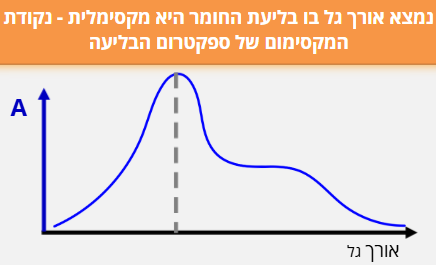{width="2.950353237095363in" height="1.7932195975503062in"} []{dir="rtl"}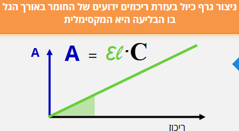{width="3.262154418197725in" height="1.79208552055993in"}

<figure>

<figcaption>
Figure 7- מציאת ריכוז תמיסת נעלם בשיטות ספקטרוסקופיות - שלב ראשון מציאת אורך הגל המקסימלי, שלב שני בניית גרף כיול, ושלב שלישי – מדידת הבליעה של תמיסת נעלם והסקת הערך המהגרף. 
כל התמונות מתוך הלומדה "ספקטרוסקופיה, מבוא למשוואת ביר למברט", ד"ר אלינה גולדשטיין לויטין, היחידה לקידום איכות ההוראה והלמידה באוניברסיטת בן גוריון
</figcaption>
</figure>

[לאחר שביצענו כיול וקיבלנו גרף המתאר את הקשר בין המשתנה הנמדד למשתנה הרצוי, נרצה להשתמש בו כדי לחשב ערכים חדשים]{dir="rtl"}. [עם זאת]{dir="rtl"}, **[לא כל מצב מחושב באותה דרך]{dir="rtl"}**: [לעיתים יש לנו רק שתי נקודות כיול סמוכות, ולעיתים סדרת נתונים שלמה שנראית לינארית או מתפזרת סביב קו מגמה. במקרים אחרים הקשר בין המשתנים כלל אינו לינארי, ולכן נידרש לבצע **לינאריזציה**]{dir="rtl"} -- [הגדרה מחדש של המשתנים, או שימוש בגרפים לוגריתמים/חצי לוגריתמים, על מנת שנוכל לעבד את הגרפים כגרפים ישרים.]{dir="rtl"}

### [אינטרפולציה ואקסטרפולציה]{dir="rtl"}

[במדידות ניסיוניות אנו אוספים נקודות נתונים המתארות את הקשר בין שני משתנים, אך לא תמיד נוכל למדוד את כל הערכים האפשריים. לעיתים נרצה להעריך את ערכו של המשתנה עבור נקודה **שלא נמדדה ישירות** --]{dir="rtl"} [בין שתי נקודות ידועות או מחוץ לתחום הנתונים]{dir="rtl"}

::: definition
.[**אינטרפולציה -** שיטה מקובלת כדי למצוא נתון חסר הנמצא בתוך תחום המוגדר על ידי שני ערכים נתונים, הקרובים זה לזה.]{dir="rtl"}
:::

::: definition
[**אקסטרפולציה-** אמידת ערך של פונקציה מחוץ לטווח שבו ערכיה ידועים.]{dir="rtl"}
:::

[שתי השיטות מבוססות על ההנחה שהקשר שנמצא בין המשתנים נמשך גם בנקודות שלא נמדדו, אך חשוב לזכור כי באקסטרפולציה גדל הסיכון לשגיאה]{dir="rtl"} -- [אין ודאות שהמגמה תישמר מעבר לגבולות הנתונים שנמדדו בפועל]{dir="rtl"}. [כדי לבצע חיזויים כאלה נדרש מודל מתמטי המתאר את הקשר בין המשתנים. מודל זה יכול להיות פשוט -- כמו קו ישר בין שתי נקודות -- או מורכב יותר, כמו עקומה לא ליניארית המותאמת לנתונים. במקרים אחרים נשתמש בטריקים מתמטיים כמו לינאריזציה או גרפים לוגיים כדי להציג קשרים מורכבים בצורה פשוטה וברורה]{dir="rtl"}.

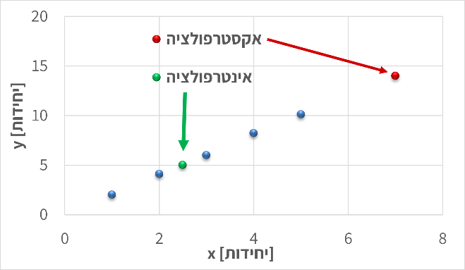{width="3.2085269028871393in" height="1.867361111111111in"} {width="3.174060586176728in" height="1.8474529746281714in"}

Figure [8 - בשני הגרפים מוצגות דוגמאות למדידה של ערכים שלא נמדדו ישירות: הנקודות הכחולות הן הערכים שנמדודו, הנקודות הירוקות מייצגות חיזוי בתוך תחום המדידות (אינטרפולציה), והנקודות האדומות -- חיזוי מחוץ לתחום המדידות (אקסטראפולציה), שבו גובר הסיכון לסטות מהמגמה האמיתית]{dir="rtl"}.

### [אינטרפולציה מקומית]{dir="rtl"}

[כאשר נרצה להעריך את ערכו של משתנה בנקודה שנמצאת בין שתי מדידות ידועות]{dir="rtl"}, [נשתמש ב-**אינטרפולציה מקומית**]{dir="rtl"} **(Local Interpolation)**.\
[הרעיון פשוט: אם שתי נקודות סמוכות מראות מגמה כמעט ישרה, ניתן להניח שהקשר ביניהן ליניארי בטווח הצר הזה. כך נוכל לחשב את ערך המשתנה המבוקש לפי קו ישר המחבר בין שתי הנקודות]{dir="rtl"}.

[אם הנקודות הן]{dir="rtl"} $(x_{1},y_{1})$[ו-]{dir="rtl"}$(x_{2},y_{2})$, [ניתן לחשב את]{dir="rtl"} $y$[עבור ערך ביניים של]{dir="rtl"} $x$[לפי]{dir="rtl"}:

$$y = y_{1} + \frac{x - x_{1}}{x_{2} - x_{1}}(y_{2} - y_{1})$$

[שיטה זו נוחה במיוחד בגרפים ניסיוניים או בטבלאות כיול, שבהם נרצה למצוא ערך חסר *בתוך* התחום שנמדד]{dir="rtl"}. [עם זאת, יש לזכור כי ההנחה הליניארית תקפה רק **בקרבת הנקודות, ובהנחה שהמדידות מדוייקות באופן יחסי.**]{dir="rtl"} [כאשר המרווחים גדולים, המדידות רועשות, ו/או הנתונים מתנהגים באופן שאינו לינארי, יש לעבור לשיטות מדויקות יותר כגון התאמת קו או התאמת עקומה]{dir="rtl"}.

![Figure [9 - חישוב אינטרפולציה לינארית בין שתי נקודות מדידה סמוכות לצורך הערכת ערך החסר בתוך טווח הנתונים.]{dir="rtl"}](media/media/image11.png){width="6.5in" height="1.9in"}

### [התאמת קו ישר]{dir="rtl"} (Linear Fit)[.]{dir="rtl"}

[כאשר ברשותנו מספר נקודות מדידה המתארות קשר כמעט ליניארי בין שני משתנים, נוכל לתאר את הנתונים באמצעות התאמת קו ישר]{dir="rtl"} (Linear Fit)[.]{dir="rtl"} [במקרה זה, אנו לא מסתכלים רק על האזור המסויים בו נמצא הערך שלנו, אלא משתמשים בנקודות על הגרף על מנת לייצר משוואת קו ישר]{dir="rtl"}.

[המודל המתמטי הוא]{dir="rtl"}:

$$y = ax + b$$
[אם נבחר כל שתי נקודות על הקו]{dir="rtl"}, $(x_{1},y_{1})$[ו-]{dir="rtl"}$(x_{2},y_{2})$, [נוכל לחשב את מקדמי המשוואה לפי]{dir="rtl"}:

$$a = \frac{y_{2} - y_{1}}{x_{2} - x_{1}},b = y_{1} - ax_{1}$$
[במקרה זה משוואת הקו מבוססת על הנקודות אותן בחרנו, לפי ההנחה שאלו שתי הנקודות שמייצגות את הישר בצורה הטובה ביותר (\"לפי העין\"). לאחר שמצאנו את משוואת הקו, נוכל להשתמש בה גם לצורך אינטרפולציה וגם לצורך אקסטרפולציה. עם זאת, חשוב לזכור כי ככל שנצא רחוק יותר מתחום המדידות]{dir="rtl"}, [האמינות של האקסטרפולציה פוחתת]{dir="rtl"}. [כאשר הנתונים מצייתים באופן הדוק לקו ישר, ניתן להתאים את הקו "בעין" או על סמך שתי נקודות בלבד. אך כאשר קיים פיזור או רעש מדידה, יש להיעזר בכלים סטטיסטיים מדויקים יותר.]{dir="rtl"}

<figure>

<figcaption>
Figure 10 הגרף מציג שתי התאמות לינאריות לסט נתונים זהה, כאשר כל אחת מבוססת על זוג נקודות שונה. 
השוואת הקווים מדגימה כיצד בחירת נקודות שונות משפיעה על שיפוע ונקודת החיתוך של המשוואה
</figcaption>
</figure>

### [רגרסיה לינארית]{dir="rtl"} (Linear Regression)

[במדידות אמיתיות כמעט תמיד קיימות שגיאות מדידה ורעש אקראי. לכן, גם אם הקשר בין המשתנים ליניארי באופן עקרוני, הנקודות בפועל אינן נופלות בדיוק על קו אחד אלא מפוזרות סביבו]{dir="rtl"}. [במצב כזה, לא ניתן לבחור שתי נקודות ולבנות מהן קו מייצג -- יש צורך בשיטה שתמצא את הקו "הכי מתאים]{dir="rtl"}" [לכל הנתונים יחד]{dir="rtl"}. [שיטה זו נקראת רגרסיה ליניארית]{dir="rtl"}, [והיא מבוססת על עיקרון ה-]{dir="rtl"}Least Squares[, \"שיטת הריבועים הפחותים\".]{dir="rtl"}\
[לפי עיקרון זה, נבחר את השיפוע]{dir="rtl"} $a$ [והחיתוך]{dir="rtl"} $b$ [של הקו]{dir="rtl"} $y = ax + b$ [כך שסכום הריבועים של ההפרשים בין הערכים הנמדדים]{dir="rtl"} $y_{i}$ [לערכים החזויים לפי הקו יהיה הקטן ביותר]{dir="rtl"}:

$$\text{מינימום\:\,\:\,}\sum_{i}^{}{(y_{i} - (ax_{i} + b))^{2}}$$
{width="2.690751312335958in" height="1.2792563429571304in"}

[כלומר, הקו שנבחר הוא זה שמייצג בצורה הטובה ביותר את כלל הנתונים, גם אם כל נקודה בודדת סוטה ממנו מעט]{dir="rtl"}.

[רגרסיה ליניארית אינה רק דרך ציור מדויקת יותר של קו; היא גם מספקת **מדדים כמותיים** לאיכות ההתאמה, כמו מקדם הקורלציה]{dir="rtl"} $R^{2}$, [המעיד עד כמה הקו מתאר את הנתונים היטב]{dir="rtl"}.

[במעבדות ובתעשייה, רגרסיה ליניארית משמשת לעיתים קרובות ליצירת **עקומות כיול אמינות**]{dir="rtl"} -- [למשל, במכשירי ספקטרופוטומטר, שבהם נבנה קו כיול על סמך מדידות רועשות ומחשבים את ריכוז הדגימה הלא ידועה לפי משוואת הקו שהתקבלה]{dir="rtl"}.

![Figure [11 - הנקודות המייצגות נתונים ניסיוניים, והקו מציג את קו הרגרסיה שנקבע לפי שיטת הריבועים הפחותים. ערך]{dir="rtl"}](media/media/image14.png){width="4.726663385826772in" height="2.630974409448819in"}

### [התאמת עקומה לא ליניארית]{dir="rtl"} (Nonlinear Curve Fitting)

[לא כל קשר בין משתנים הוא ליניארי. במקרים רבים -- במיוחד בתהליכים כימיים, ביולוגיים או פיזיקליים -- הנתונים מראים **עקומה ברורה**]{dir="rtl"}: [הקצב משתנה עם הזמן, הבליעה מתקרבת לערך רוויה, או הלחץ תלוי בריבוע הטמפרטורה. במצבים כאלה, קו ישר כבר אינו מתאים, ונדרש לבצע **התאמת עקומה לא ליניארית**]{dir="rtl"}.

[במקום להשתמש במשוואה מהצורה]{dir="rtl"} $y = ax + b$, [נבחר פונקציה שתואמת את האופי של הנתונים, למשל]{dir="rtl"}:

$$y = ae^{bx},y = ax^{b},y = a(x - x_{0})^{2} + c$$

[נחשב את הפרמטרים]{dir="rtl"} $a,b,c$[כך שהעקומה תתאים בצורה הטובה ביותר למדידות -- לעיתים בעזרת חישוב ממוחשב (למשל בשיטת הריבועים המינימליים הלא-ליניארית)]{dir="rtl"}. [לעיתים נבחר את הצורה של הפונקציה לפי ידע פיזיקלי מוקדם (למשל תגובה אקספוננציאלית או קצב תלוי חזקתית), ובמקרים אחרים פשוט נבחן איזו פונקציה מתאימה טוב יותר לנתונים]{dir="rtl"}.

<figure>
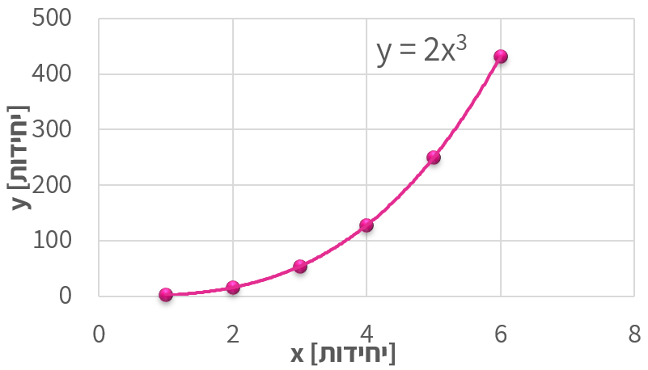
<figcaption>
Figure 12 - הגרף מציג נתונים המתואמים לעקומה מהצורה <em>y</em> = 2<em>x</em>3 כדוגמה למקרה שבו הקשר בין המשתנים אינו ליניארי.
</figcaption>
</figure>

[עם זאת, התאמות לא ליניאריות קשות יותר להערכה אינטואיטיבית: בעקומה מורכבת קשה לעין האנושית להבחין אם ההתאמה "מדויקת" או לא, במיוחד כשיש כמה פרמטרים חופשיים. לכן חשוב להיעזר גם בידע הפיזיקלי על התהליך וגם במדדים מספריים (כמו]{dir="rtl"} $R^{2}$[או סטיות תקן של הפרמטרים) כדי לוודא שההתאמה סבירה ולא רק מתמטית]{dir="rtl"}. [לבסוף, ככל שמספר הפרמטרים גדל, כך גם הסיכון ל-התאמה יתר]{dir="rtl"} (overfitting) -- [מצב שבו הפונקציה "מתאימה" את עצמה לכל נקודה אך מאבדת משמעות פיזיקלית]{dir="rtl"}.

### **[לינאריזציה]{dir="rtl"}** (Linearization)

[במקרים רבים נעדיף להמיר קשר לא ליניארי לקשר **ליניארי**]{dir="rtl"}, [כדי להקל על ניתוח הנתונים או על התאמת קו ישר. פעולה זו נקראת **לינאריזציה**]{dir="rtl"} -- [הפיכת המשוואה לצורה ישרה על-ידי שינוי המשתנים או הצירים]{dir="rtl"}.

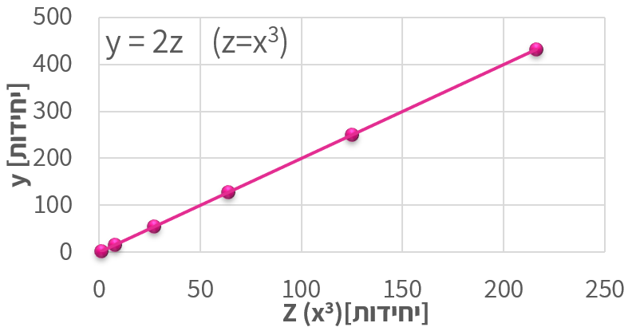{width="4.477087707786526in" height="2.31746719160105in"}

Figure [13 - לינאריזציה עבור הגרף מתמונה 11. על החלפת המשתנה]{dir="rtl"} x [במשתנה]{dir="rtl"} $z = x^{3}$ [קיבלנו גרף לינארי]{dir="rtl"}

[הרעיון פשוט: אם ניתן לכתוב את המשוואה כך שתתקבל הצגה מהצורה]{dir="rtl"} $f(x,y) = ag(x,y) + b$, [אז גרף של]{dir="rtl"} $f$[לעומת]{dir="rtl"} $g$[יניב **קו ישר**]{dir="rtl"}, [שממנו אפשר לחשב את השיפוע]{dir="rtl"} $a$[והחיתוך]{dir="rtl"} $b$.

[לדוגמה]{dir="rtl"}:

- [נניח שהקשר בין שני משתנים הוא]{dir="rtl"} $y = 3x^{3}$.\
  [אם נצייר גרף של]{dir="rtl"} $y$[מול]{dir="rtl"} $x$, [נקבל עקומה קמורה כלפי מעלה]{dir="rtl"}.\
  [אבל אם נחשב]{dir="rtl"} $x^{3}$[ונצייר את]{dir="rtl"} $y$[מול]{dir="rtl"} $x^{3}$, [נקבל **קו ישר** עם שיפוע 3 וחיתוך 0]{dir="rtl"}.\
  [זהו מקרה פשוט שבו שינוי המשתנה מאפשר לנו לנתח את הקשר הליניארי בקלות]{dir="rtl"}.

- [דוגמה נפוצה יותר: עבור]{dir="rtl"} $y = ae^{bx}$, [נחשב]{dir="rtl"} $\ln y$[ונצייר גרף של]{dir="rtl"} $\ln y$[מול]{dir="rtl"} $x$; [גם כאן מתקבל קו ישר, שממנו ניתן לקבוע את]{dir="rtl"} $a$[ו-]{dir="rtl"}$b$.

[השימוש בלינאריזציה מקל מאוד על זיהוי מגמות, על חישוב פרמטרים, ועל הערכת איכות ההתאמה בעין -- מאחר שקל לנו יותר לזהות "ישרות" של קו מאשר עקמומיות של עקומה]{dir="rtl"}.\
[עם זאת, יש לזכור שלינאריזציה משנה את יחידות הצירים ואת משמעות המשתנים, ולכן יש **להחזיר את התוצאה למשתנים המקוריים** בסיום הניתוח]{dir="rtl"}.

### [שימוש בגרפים לוגיים וסמילוגיים]{dir="rtl"}

[לפני עידן המחשבים, אחת הדרכים הנפוצות לנתח נתונים ניסיוניים הייתה שימוש בגרפים לוגיים]{dir="rtl"} (Log-- []{dir="rtl"}Log) [ו-סמילוגיים]{dir="rtl"} (Semi--Log)[. גרפים אלה שימשו להמחשה גרפית של קשרים מתמטיים לא ליניאריים -- בעיקר קשרים אקספוננציאליים ו-חזקתיים --]{dir="rtl"} [והיו כלי בסיסי בעבודתו של כל מהנדס או חוקר]{dir="rtl"}. []{dir="rtl"}

![Figure [14]{dir="rtl"} [- דפים לוגריתמים וסמי לוגריתמים. שימוש בגרפים מסוג זה מאפשר להציג קשרים אקספוננציאליים וחזקתיים כקווים ישרים, ולזהות בקלות את טיב הקשר בין המשתנים]{dir="rtl"}.](media/media/image17.png){width="6.5in" height="2.2847222222222223in"}

<figure>

<figcaption>
Figure 15השוואה בין גרף ליניארי, סמי-לוגריתמי ולוגריתמי-לוגריתמי.
</figcaption>
</figure>

  ----------------------------------------------------------------------------------------------------------------------------------------------------------------------------------------------------------------------------------------------------------------------------------------------------------------------------------------------------------------
  [סוג גרף]{dir="rtl"}                         [ליניארי]{dir="rtl"}                                                      [סמי-לוגריתמי]{dir="rtl"}                                                                        [לוג-לוגריתמי]{dir="rtl"}
  -------------------------------------------- ------------------------------------------------------------------------- ------------------------------------------------------------------------------------------------ ----------------------------------------------------------------------------------------------------------------------------------------
  [צירי הסקאלה]{dir="rtl"}                     [שני הצירים ליניאריים]{dir="rtl"}                                         [ציר אחד (בד\"כ]{dir="rtl"} (y)[) לוגריתמי, השני ליניארי]{dir="rtl"}                             [שני הצירים לוגריתמיים]{dir="rtl"}

  [סוג הקשר]{dir="rtl"}                        [קשר ישר]{dir="rtl"}                                                      [קשר אקספוננציאלי]{dir="rtl"}                                                                    [קשר חזקתי]{dir="rtl"}

  [צורת המשואה]{dir="rtl"}                     ( y = a + bx )                                                            ( y = a e\^{bx} )                                                                                ( y = a x\^b )

  [פירוש השיפוע (]{dir="rtl"}m[)]{dir="rtl"}   [קצב שינוי קבוע של (]{dir="rtl"}y[) ביחס ל-(]{dir="rtl"}x[)]{dir="rtl"}   [קצב הגידול או הדעיכה האקספוננציאלי]{dir="rtl"}                                                  [המעריך (]{dir="rtl"}b[) בקשר החזקתי]{dir="rtl"}

  [חישוב השיפוע בפועל]{dir="rtl"}              $$\left( m = \frac{\Delta y}{\Delta x} \right)$$                          $$\left( b = \frac{\ln\left( y_{2} \right) - \ln\left( y_{1} \right)}{x_{2} - x_{1}} \right)$$   $$\left( b = \frac{\log\left( y_{2} \right) - \log\left( y_{1} \right)}{\log\left( x_{2} \right) - \log\left( x_{1} \right)} \right)$$

  [משמעות פיזיקלית]{dir="rtl"}                 [השיפוע הוא השינוי המוחלט (כמו מהירות, קצב זרימה וכו')]{dir="rtl"}        [מציין שיעור שינוי יחסי קבוע (למשל קצב דעיכה רדיואקטיבית)]{dir="rtl"}                            [מתאר יחס קנה מידה -- איך (]{dir="rtl"}y[) משתנה כאשר (]{dir="rtl"}x[) מוכפל פי ערך קבוע]{dir="rtl"}
  ----------------------------------------------------------------------------------------------------------------------------------------------------------------------------------------------------------------------------------------------------------------------------------------------------------------------------------------------------------------

[כיום, בעידן התוכנות והחישובים הדיגיטליים, כמעט ואין צורך לצייר גרפים לוגריתמיים באופן ידני]{dir="rtl"}.\
[עם זאת]{dir="rtl"}, [הבנה של הצגה לוגית חשובה מאוד -- היא מאפשרת לנו להעריך בצורה נכונה שינויים לוגריתמיים או אקספוננציאליים (למשל גידול מעריכי או דעיכה מהירה), ולפרש נכונה גרפים מדעיים שבהם קני מידה כאלה עדיין נפוצים]{dir="rtl"}.

### [סיכום]{dir="rtl"}

[בעבודה הנדסית וניסויית, אנו כמעט תמיד נדרשים להסיק מסקנות מתוך מדידות חלקיות]{dir="rtl"}. [האתגר הוא לייצג את הנתונים בדרך שתאפשר לנבא ערכים חדשים ולבדוק אם הם סבירים מבחינה פיזיקלית]{dir="rtl"}. [לשם כך עומדים לרשותנו כלים ברמות שונות של מורכבות]{dir="rtl"}:

- [אינטרפולציה מקומית מאפשרת להעריך ערכים *בין* שתי נקודות סמוכות]{dir="rtl"}.

- [התאמת קו ישר יוצרת מודל פשוט שמתאר את המגמה הכללית של נתונים אשר נראים לינאריים באופן יחסי.]{dir="rtl"}

- [רגרסיה ליניארית מחשבת קו מייצג סטטיסטי כאשר קיימות סטיות ורעש מדידה]{dir="rtl"}.

- [התאמת עקומה לא ליניארית מרחיבה את הגישה למקרים שבהם הקשר בין המשתנים עוקב אחרי פונקציה מורכבת יותר]{dir="rtl"}.

- [לינאריזציה וגרפים לוגיים מאפשרים להפוך קשרים לא ליניאריים לייצוגים ישרים שקל לנתח בעין ובחישוב]{dir="rtl"}.

[בין אם מדובר בקו פשוט או בעקומה מורכבת, המטרה המשותפת היא אחת]{dir="rtl"} -- [למצוא תיאור מתמטי אמין של הנתונים ולבחון עד כמה הוא מייצג את המציאות]{dir="rtl"}. [גם בעידן שבו תוכנות מבצעות עבורנו את כל ההתאמות בלחיצת כפתור, חשוב להבין את העקרונות מאחורי השיטות: רק כך נוכל להעריך את אמינות התוצאות, לזהות מתי חיזוי הוא סביר ומתי מדובר באקסטרפולציה מסוכנת, ולשלב בין ניתוח מתמטי לבין שיקול הנדסי ופיזיקלי נכון]{dir="rtl"}.

[תרגיל]{dir="rtl"}

[בטבלת הכיול הבאה נמדדה בליעת אור]{dir="rtl"} ($y$) [עבור ריכוזים שונים של חומר]{dir="rtl"} ($x$):

  --------------------------------------------------------------------------------------------
  $$x\ \left( \frac{mol}{L} \right)$$   **0.10**   **0.20**   **0.30**   **0.40**   **0.50**
  ------------------------------------- ---------- ---------- ---------- ---------- ----------
  $$y\ (a.u.)$$                         0.48       0.96       1.45       1.94       2.44
  [יחידות שרירותיות]{dir="rtl"}                                                     

  --------------------------------------------------------------------------------------------

1.  [השתמשו באינטרפולציה מקומית כדי להעריך את ערך הבליעה עבור]{dir="rtl"} $y = 1.70$.

2.  [מצאו את משוואת הקו המתארת את הנתונים, בהנחה שהקשר ליניארי]{dir="rtl"}.

3.  [השתמשו במשוואה שמצאתם כדי למצוא את הריכוז עבור]{dir="rtl"} $y = 2.85\ $

4.  [הסבירו מדוע התוצאה האחרונה עלולה להיות פחות אמינה]{dir="rtl"}.

# [פרק 3-- תהליכים ומשתני תהליך]{dir="rtl"}

## [מה נלמד בפרק הזה]{dir="rtl"}?

- [**להגדיר ולהסביר** את המושגים הבסיסיים של צפיפות, משקל סגולי, יחידות מוליות]{dir="rtl"} [(]{dir="rtl"}mole gram-mole, pound-mole[), וגדלי טמפרטורה ולחץ]{dir="rtl"}.

- [**להמחיש ולזהות** משתנים בתרשים תהליך -- זרמים, משתני מצב והרכב -- ולתאר את תפקידם בתהליך הנדסי]{dir="rtl"}.

- [**להבדיל ולהשוות** בין סוגי לחצים (מוחלט, נמדד ואטמוספרי), ולנתח מצבים בהם הלחץ נמדד בעזרת מנומטר או עמוד נוזל]{dir="rtl"}.

- [**לבצע ולנמק** חישובים המקשרים בין מסה, נפח ומולים, בהתבסס על צפיפות ומשקל מולקולרי]{dir="rtl"}.

- [**להמיר ולפרש** הרכב תערובת בין שברי מסה לשברי מולים, ולחשב משקל מולקולרי ממוצע של תערובת מרובת רכיבים]{dir="rtl"}.

- [**להמיר ולהעריך** יחידות טמפרטורה בין קלווין, צלזיוס, פרנהייט וראנקין, ולהבין את משמעות הבחירה ביחידת מידה בתיאור תהליך פיזיקלי או ביוטכנולוגי]{dir="rtl"}.

## [מהו תהליך הנדסי?]{dir="rtl"}

::: definition
[תהליך הוא רצף של פעולות פיזיקליות או כימיות שבמהלכן חומרי גלם עוברים שינוי]{dir="rtl"} [בהרכבם, בצורתם או באנרגיה שלהם.]{dir="rtl"}
:::

[לעבודתם של מהנדסי ומהנדסות התהליך שלושה היבטים: תכנון, תפעול ואופטימיזציה של תהליכים במפעלי הייצור השונים, כך שהתהליכים יהיו יציבים, בטוחים, רווחיים ויעילים לאורך זמן.]{dir="rtl"}

**[תכנון התהליך]{dir="rtl"} (Process Design)** -- [הגדרה של יחידות הפעולה, תנאי ההפעלה והציוד הדרוש כך שהתהליך יעמוד במטרות הייצור ובדרישות הבטיחות]{dir="rtl"}.

**[תפעול התהליך]{dir="rtl"} (Process Operation)** -- [פיקוח יומיומי על תהליך קיים, ניטור נתונים בזמן אמת, וזיהוי חריגות או תקלות בתפקוד המערכת]{dir="rtl"}.

**[אופטימיזציה של התהליך]{dir="rtl"} (Process Optimization)** -- [ניתוח ביצועים וחיפוש מתמיד אחר דרכים לשפר יעילות, להפחית צריכת אנרגיה ולהגדיל תפוקה]{dir="rtl"}.

[שלושת השלבים הללו משקפים את עיקר העשייה של מהנדס ומהנדסת תהליך: לא רק להבין מה קורה במערכת, אלא גם **לדעת לשלוט בה ולכוון אותה**]{dir="rtl"}.

::: definition
[כל תהליך בנוי מיחידות פעולה]{dir="rtl"} (Unit Operations)
:::

::: definition
[יחידות פעולה]{dir="rtl"}- (Unit Operations) [רכיבים נפרדים שכל אחד מהם מבצע שינוי מסוים בחומר]{dir="rtl"}:
:::

![Figure [16- תיאור כללי של תהליך בדיאגרמת בלוקים]{dir="rtl"}](media/media/image19.png){width="6.5in" height="1.2215277777777778in"}

[יש סוגים רבים של יחידות פעולה, אך הבסיסיות ביותר, בהן נשתמש בספר זה, הן --]{dir="rtl"}

<figure>

<figcaption>
Figure 17 - יחידות פעולה בסיסיות בתהליך הכימי/ביולוגי
</figcaption>
</figure>

### [דיאגרמות לתכנון תהליך]{dir="rtl"}

[מהנדסים משתמשים בתרשימים שונים כדי לתאר תהליכים -- כל תרשים מתאים לרמת פירוט אחרת של התכנון]{dir="rtl"}.

1.  **Block Flow Diagram (BFD)**

[התרשים הפשוט ביותר]{dir="rtl"}. [כל יחידת פעולה מיוצגת כמלבן אחד, והחצים מראים את כיווני זרימת החומרים]{dir="rtl"}. [משמש להמחשה כללית של מבנה התהליך ושל הקשרים בין היחידות]{dir="rtl"}.

![Figure [18]{dir="rtl"} [-]{dir="rtl"} Block flow process diagram for the production of benzene (Turton et al., 2012)](media/media/image21.jpeg){width="5.353846237970254in" height="2.8359372265966756in"}

2.  **Process Flow Diagram (PFD)**

[תרשים מפורט יותר, המשמש לתכנון הנדסי]{dir="rtl"}. [כולל את כל יחידות הפעולה העיקריות, קווים לכל זרם חומר ואנרגיה, נתוני פעולה בסיסיים]{dir="rtl"} [(]{dir="rtl"}T, P[,]{dir="rtl"} [ספיקות), לעיתים גם ציוד עזר חשוב]{dir="rtl"}. [תרשימי]{dir="rtl"} PFD [משמשים לחישובי מאזן חומר ואנרגיה ולתכנון ראשוני של תהליך תעשייתי]{dir="rtl"}.

![Figure [19-]{dir="rtl"} Process Flow Diagram Detailing the Nitric Acid Process (Towler and Sinnott, 2013)](media/media/image22.jpeg){width="6.5in" height="3.361111111111111in"}

**Piping and Instrumentation Diagram (P&ID)**

[התרשים המפורט ביותר]{dir="rtl"}. [מכיל את כל הצנרת, השסתומים, החיישנים, מכשירי המדידה, יחידות הבקרה והאזעקות]{dir="rtl"}. [משמש למהנדסי מכשור ובקרה בעת בנייה והפעלה של מתקנים בפועל]{dir="rtl"}.

<figure>

<figcaption>
Figure 20 - תזרים צנרת ומכשור. Copyright © 2025 Edrawsoft
</figcaption>
</figure>

[[כיצד נצייר תהליך?]{.underline}]{dir="rtl"}

[כדי לנתח תהליך, נייצג אותו באופן סכמטי כ-תרשים בלוקים]{dir="rtl"} (Block Flow Diagram -- BFD)[. כל בלוק מייצג יחידת פעולה אחת]{dir="rtl"}. [חצים מייצגים זרמי חומר או אנרגיה הנכנסים ויוצאים מהבלוקים]{dir="rtl"}. [ליד כל חץ נציין את שם הזרם ואת המשתנים הפיזיקליים החשובים]{dir="rtl"}: [טמפרטורה]{dir="rtl"} (T), [לחץ]{dir="rtl"} (P), [ספיקת מסה]{dir="rtl"} (ṁ), [והרכב]{dir="rtl"} (xᵢ).[לעיתים מסמנים גם מסגרת גבולות מערכת]{dir="rtl"} (System Boundary), [המגדירה מה נכלל בתהליך ומה לא]{dir="rtl"}. [כך נוצר ייצוג גרפי של תהליך מורכב, שממנו נוכל בהמשך לגזור משוואות מאזן חומר ואנרגיה]{dir="rtl"}.

[דוגמה: תהליך תסיסה]{dir="rtl"} (Fermentation Process)

[כדי להמחיש את רעיון התרשים, נבחן תהליך פשוט של ייצור בירה]{dir="rtl"}.

[בתהליך זה מוזרמים שני חומרים למיכל תסיסה]{dir="rtl"} (Fermentation Reactor):

[תמיסת סוכר]{dir="rtl"} (Substrate Feed) -- [מהווה את מקור האנרגיה לשמרים]{dir="rtl"}.

[תמיסת שמרים]{dir="rtl"} (Cell Suspension) -- [מכילה תאים חיים המבצעים את התגובה הביולוגית]{dir="rtl"}.

[בתוך המיכל מתרחשת תגובה ביוכימית]{dir="rtl"}:\
[השמרים ממירים את הסוכרים ל-אתנול (מוצר רצוי) ו-פחמן דו-חמצני (תוצר לוואי)]{dir="rtl"}\
[הזרם היוצא מהמיכל הוא תערובת של מים, אתנול ותאים מתים]{dir="rtl"}.

[תרשים התהליך ייראה כך]{dir="rtl"}:

<figure>
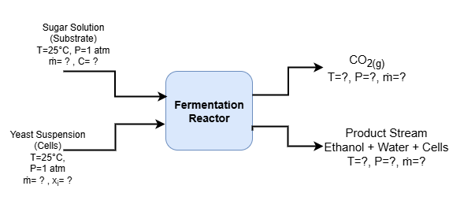
<figcaption>
Figure 21 - תרשים בלוקים - מערכת תסיסה
</figcaption>
</figure>

## [משתני תהליך]{dir="rtl"}

[אחר שזיהינו את שלבי התהליך ואת יחידות הפעולה המרכיבות אותו, נוכל להתחיל לבחון אותו לעומק. כל אחת מהיחידות בתהליך -- בין אם מדובר במיכל ערבוב, במחליף חום או במגדל ספיגה -- מאופיינת על-ידי משתני תהליך]{dir="rtl"} (process variables)[.]{dir="rtl"}

::: definition
**[משתני תהליך]{dir="rtl"} (Process Variables)** [הם גדלים פיזיקליים או כימיים הנמדדים או נשלטים במהלך פעולה של מערכת תהליכית, ומשמשים לתיאור מצבה בזמן נתון.]{dir="rtl"}
:::

[משתנים אלה כוללים גדלים כמו טמפרטורה, לחץ, ספיקה, ריכוז והרכב כימי]{dir="rtl"}, [והם אלה שמאפשרים לנו לכמת את מה שקורה בכל שלב של התהליך. במילים אחרות, אם תרשים הבלוקים מציג לנו את "מה קורה" בתהליך, משתני התהליך הם **השפה הכמותית** שבאמצעותה מהנדסים ומהנדסות מתארים מה מתרחש בתוך כל יחידת פעולה, וכיצד שינוי באחד מהם משפיע על שאר מרכיבי המערכת]{dir="rtl"}.

[דוגמאות למשתני תהליך]{dir="rtl"}

  ---------------------------- -------------------------------------------------------------- ------------------------------------------
  [סוג המשתנה]{dir="rtl"}      [דוגמאות]{dir="rtl"}                                           [מה הוא מתאר]{dir="rtl"}

  **[תרמודינמי]{dir="rtl"}**   [טמפרטורה (]{dir="rtl"}T[), לחץ (]{dir="rtl"}P[)]{dir="rtl"}   [מצבי אנרגיה והתנהגות חומרים]{dir="rtl"}

  **[זרימה]{dir="rtl"}**       [ספיקה מסה/נפח]{dir="rtl"} $(\dot{m},\dot{F})$                 [כמה חומר עובר ביחידת זמן]{dir="rtl"}

  **[הרכב]{dir="rtl"}**        [ריכוז, אחוז מסה, שבר מולרי]{dir="rtl"}                        [תכולת חומרים בתערובת]{dir="rtl"}
  ---------------------------- -------------------------------------------------------------- ------------------------------------------

## [מסה ונפח]{dir="rtl"}

[כאשר אנו ניגשים לתאר מערכת, שני הגדלים הראשונים שבהם נשתמש כמעט בכל תהליך הם **מסה**]{dir="rtl"}**(Mass) []{dir="rtl"}** [ו**נפח** ]{dir="rtl"}**(Volume)**[. הם מתארים כמה חומר יש לנו וכמה מקום הוא תופס]{dir="rtl"}. [הכמות שלהם תלויה בגודל המערכת איתה אנחנו עובדים. אם נסתכל על כוס שתייה, נפח המים (ובהתאם גם מסת המים) יהיו קטנים מאשר נפח המים בדלי או בבריכה. לכן אלו תכונות **תלויות במערכת,**]{dir="rtl"} [או במונחים הנדסיים]{dir="rtl"} -- **[תכונות אקסטנסיביות]{dir="rtl"} (Extensive Properties)**[.]{dir="rtl"}

[עם זאת, תכונות כאלה אינן נוחות כשאנחנו רוצים להשוות בין מערכות שונות או לתאר התנהגות של חומר שאינה תלויה בגודל המתקן. לצורך כך אנו מחפשים תכונות שאינן תלויות במערכת, תלויות אשר קבועות עבור חומר מסויים ללא תלות במערכת. אם נשווה טיפת מים, כוס מים ודלי מלא מים -- נראה שכמות המים משתנה, אבל היחס בין המסה לנפח נשאר כמעט קבוע]{dir="rtl"}. [למשל, ליטר אחד של מים שוקל בקירוב קילוגרם אחד]{dir="rtl"}. [גם אם נכפיל את הכמות פי עשרה או פי אלף, היחס הזה לא ישתנה: בכל פעם נקבל בערך קילוגרם לכל ליטר]{dir="rtl"}.

[כאשר היחס בין שני גדלים אקסטנסיביים נשאר קבוע עבור חומר מסוים, אפשר להגדיר ממנו **תכונה אינטנסיבית** ]{dir="rtl"}**(Intensive Properties)** []{dir="rtl"}-- [תכונה שמאפיינת את החומר עצמו, בלי קשר לגודל או לכמות]{dir="rtl"}. [לדוגמא -- היחס בין המסה לנפח של חומר מסויים בתנאי לחץ וטמפ\' מסויימים.\
]{dir="rtl"}

### [צפיפות]{dir="rtl"} []{dir="rtl"}(Density) [ונפח סגולי]{dir="rtl"} (Specific Volume)[.]{dir="rtl"}

::: definition
[היחס בין מסה לנפח נקרא **צפיפות** ומסומן באות היוונית]{dir="rtl"} ρ (rho):
:::

::: definition
$$\rho = \frac{m}{V}\ \ \ \ \ \ ;\ \ \ \ \lbrack\rho\rbrack\ :\ \ \ \frac{\lbrack M\rbrack}{\lbrack L\rbrack^{3}} \Longrightarrow \frac{kg}{m^{3}}\ ,\ \frac{g}{cm^{3}},\frac{lb_{m}}{{ft}^{3}}$$
:::

[הצפיפות היא בעצם המסה של יחידת נפח אחת של חומר. זהו גודל **אינטנסיבי,** מפני שהוא אינו תלוי בגודל המערכת אלא באופי החומר ובתנאים שהוא נמצא בהם (למשל בטמפרטורה ובלחץ)]{dir="rtl"}. [במילים אחרות -- בין אם ניקח גרם אחד של מים או קילוגרם שלם, הצפיפות שלהם תישאר זהה, כל עוד התנאים זהים]{dir="rtl"}. [למשל, הצפיפות של מים בטמפרטורה של]{dir="rtl"} $4℃$ [היא]{dir="rtl"}

$$\rho_{H_{2}O} = 1.000\frac{g}{cm^{3}} = 1000\frac{kg}{m^{3}} = 0.0624\frac{lb_{m}}{ft^{3}}$$
[באותו אופן הנפח הסגולי (]{dir="rtl"}specific Volume[) מגדיר מהו הנפח ליחידת מסה - ההיפוך של הצפיפות]{dir="rtl"}

$$v = \frac{V}{m} = \frac{1}{\rho}$$

[תכונות פיזיקליות כמו צפיפות]{dir="rtl"}, [נקודת רתיחה]{dir="rtl"}, [טמפרטורת התכה]{dir="rtl"}, [מקדם שבירה ועוד -- אינן נמדדות בכל פעם מחדש, אלא נלקחות לרוב ממקורות אמינים של נתונים ניסיוניים]{dir="rtl"}. [כמו]{dir="rtl"} [CRC Handbook of Chemistry and Physics,](https://hbcp-chemnetbase-com.bengurionu.idm.oclc.org/contents/ContentsSearch.xhtml?dswid=-9306) [ו-]{dir="rtl"} [*Perry's Chemical Engineers' Handbook*](https://primo.bgu.ac.il/discovery/fulldisplay?docid=alma990020411320204361&context=L&vid=972BGU_INST:972BGU&lang=he&search_scope=MyInst_and_CI&adaptor=Local%20Search%20Engine&tab=Everything&query=any,contains,Perry%E2%80%99s%20Chemical%20Engineers%E2%80%99%20Handbook&facet=tlevel,include,online_resources&mode=basic&offset=0).[, בהם מופיעים ערכים מדויקים של תכונות עבור אלפי חומרים -- אורגניים ואי-אורגניים כאחד. הספרים כולל טבלאות של צפיפויות בטמפרטורות שונות, מקדמי התפשטות תרמית, צמיגויות, חום סגולי ותכונות נוספות החיוניות לחישובים הנדסיים]{dir="rtl"}. []{dir="rtl"}

[בעזרת]{dir="rtl"} CRC Handbook of Chemistry and Physics [או]{dir="rtl"} *Perry's Chemical Engineers' Handbook*. [מצאו את ערכי הצפיפות]{dir="rtl"} (ρ) [בטמפרטורת החדר עבור החומרים הבאים]{dir="rtl"}:

**[אתנול]{dir="rtl"} (Ethanol)**

**[בנזן]{dir="rtl"} (Benzene)**

**[כלורופורם]{dir="rtl"} (Chloroform)**

**[גליצרול]{dir="rtl"} (Glycerol)**

**[א]{dir="rtl"}.** [ציינו את יחידות הצפיפות כפי שהן מופיעות בטבלה]{dir="rtl"}.\
**[ב]{dir="rtl"}.** [המירו את הערכים ליחידות מערכת]{dir="rtl"} SI (kg/m³).\
**[ג]{dir="rtl"}.** [השוו בין החומרים: מי מהחומרים צפוף יותר ממי, ומה ניתן להסיק על כך מבחינת הציפה במים]{dir="rtl"}?

### [משקל סגולי]{dir="rtl"} (Specific Gravity)

[לעיתים קרובות נוח להשוות את צפיפותו של חומר לצפיפות של חומר ייחוס]{dir="rtl"}, [במקום להשתמש בערכים מוחלטים]{dir="rtl"}. [לצורך כך משתמשים בגודל חסר-ממדים הנקרא משקל סגולי (]{dir="rtl"}Specific gravity[)]{dir="rtl"} [המסומן]{dir="rtl"} $SG$:

$$SG = \frac{\rho_{\text{חומר}}}{\rho_{\text{ייחוס}}}$$

[ברוב המקרים, החומר המשמש כייחוס הוא מים נוזליים בטמפרטורה של]{dir="rtl"} $4℃$ [ולץ של]{dir="rtl"} 1atm [אשר הצפיפות שלהם במערכת]{dir="rtl"} SI [היא]{dir="rtl"}

$$\rho_{H}^{2}O = 1.000\frac{g}{cm^{3}} = 1000\frac{kg}{m^{3}} = 62.43\frac{lb_{m}}{ft^{3}}$$

[היות ו-]{dir="rtl"}SG []{dir="rtl"} [הוא **יחס בין שתי צפיפויות**]{dir="rtl"}, [הוא חסר יחידות]{dir="rtl"}. [ואפשר לראות שבעת חישוב צפיפות באמצעות הצפיפות הסגולית ב]{dir="rtl"}SI [או]{dir="rtl"} GCS [הערך הנומרי של צפיפות החומר שווה לערך המשקל הסגולי שלו]{dir="rtl"}. [לדוגמא עבור]{dir="rtl"} $SG = 0.85$.

$$SG = 0.85 = \frac{\rho_{\text{חומר}}}{\rho_{\text{ייחוס}}}\  = < \ \ \rho_{חומר} = 0.85*\rho_{\text{ייחוס}}\  = 0.85*1.000\frac{g}{cm^{3}}$$

$$\ \rho_{חומר} = 0.85\frac{g}{cm^{3}}$$

[עם זאת, במערכת היחידות האמריקאית]{dir="rtl"} (AES), [הצפיפות של מים נמדדת שווה ל]{dir="rtl"} $62.43\frac{lb_{m}}{ft^{3}}$ [ולכן במקרה זה הערך המספרי של הצפיפות אינו שווה לערך ה]{dir="rtl"} SG[. מאחר וערך הייחוס שונה]{dir="rtl"}\
[לכן יש להמיר תחילה את הצפיפות ליחידות המתאימות לפני שמחשבים את ה-]{dir="rtl"}SG []{dir="rtl"} [לפי]{dir="rtl"}:

$$SG = \frac{\rho_{חומר}}{62.43\frac{lb_{m}}{ft^{3}}}$$
[לדוגמא אם הצפיפות של נוזל מסויים היא]{dir="rtl"} $78.0\frac{lb_{m}}{ft^{3}}$ [המשקל הסגולי שלו יהיה]{dir="rtl"}

$$SG = \frac{78.0\ \frac{lb_{m}}{ft^{3}}}{62.43\ \frac{lb_{m}}{ft^{3}}} = 1.25$$

[תרגיל: ערכי צפיפות של חומר מסויים הן]{dir="rtl"} $\rho = 800\frac{kg}{m^{3}}$ [(ב]{dir="rtl"} SI[)ו-]{dir="rtl"} $\rho = 49.9\frac{lb_{m}}{ft^{3}}$ [(ב]{dir="rtl"} AES[). חשבו את]{dir="rtl"} SG [על פי כל אחד מהנתונים בנפרד, מה ניתן להגיד על התוצאות?]{dir="rtl"}

[מכיוון שהמשקל הסגולי]{dir="rtl"} (Specific Gravity) [מוגדר כיחס בין שתי צפיפויות -- צפיפות החומר וצפיפות חומר הייחוס -- הוא אינו תלוי ביחידות המדידה]{dir="rtl"}. [כל שינוי ביחידות ישפיע באותו יחס על המונה והמחנה, ולכן הערך הנומרי של]{dir="rtl"} $SG$ [יישאר זהה בכל מערכת יחידות]{dir="rtl"}. [במילים אחרות, מדובר בגודל חסר ממדים]{dir="rtl"} (dimensionless) [המבטא השוואה טהורה בין צפיפויות וניתן להשתמש באותו הערך ללא תלות במערכת היחידות עימה אנו עובדים.]{dir="rtl"}

[כמו כן מאחר וה-]{dir="rtl"}SG [מבוסס על יחס, הוא מאפשר להעריך בקלות את התנהגות החומר ביחס לחומר הייחוס]{dir="rtl"}. [כאשר ערך ה-]{dir="rtl"}SG [קטן מ-1, המשמעות היא שהחומר קל יותר מהייחוס (לרוב מים) והוא ייטה לצוף]{dir="rtl"}; [כאשר הוא גדול מ-1, החומר צפוף יותר וייטה לשקוע]{dir="rtl"}. [תכונה זו הופכת את המשקל הסגולי לכלי שימושי ומהיר לזיהוי חומרים ולהבנה אינטואיטיבית של התנהגותם]{dir="rtl"}, [מבלי להזדקק לחישובי צפיפות מפורטים בכל מערכת יחידות]{dir="rtl"}.

[בכל טבלה של תכונות פיזיקליות חשוב לשים לב לתנאי המדידה של הנתונים]{dir="rtl"}. [בעמודות המציינות משקל סגולי]{dir="rtl"} (SG) [מופיעה לעיתים הכותרת]{dir="rtl"} SG (20°/4°) []{dir="rtl"} [שפירושה הוא]{dir="rtl"}: [\
***המשקל הסגולי של החומר בטמפרטורה של*** ]{dir="rtl"}$\mathbf{20℃}$ [***ביחס למים בטמפרטורה של***]{dir="rtl"} $\mathbf{4℃}$***[.]{dir="rtl"}***\
[עבור חלק מהחומרים, ערכי ה־]{dir="rtl"}SG [נמדדו בטמפרטורות שונות, ולכן מופיע ליד המספר סימון קטן לדוגמה]{dir="rtl"}: $SG = {0.783}^{18}$[מציין שהמדידה בוצעה ב]{dir="rtl"} $18℃$\
[ואילו]{dir="rtl"} $SG = {1.266}^{15}$ [נמדדה ב]{dir="rtl"} $15℃$\
[המספר הקטן אינו חזקה מתמטית, אלא מציין **את טמפרטורת המדידה**]{dir="rtl"}.

[מכיוון שהצפיפות -- ובהתאם גם המשקל הסגולי -- משתנים מעט עם הטמפרטורה]{dir="rtl"},\
[יש לוודא תמיד שהנתונים נלקחים באותם תנאים לפני שמשווים בין חומרים או מבצעים חישובי המרה]{dir="rtl"}.

### [ספיקות]{dir="rtl"} (Flow rate)

::: definition
[כאשר נתחיל לדבר על מערכות יהיו מקרים בהם תהיה לנו תנועה קבועה של חומר לתוך ומחוץ למערכת. על מנת לאפיין את התהליך נצטרך לדעת באיזה קצב חומרים נכנסים ויוצאים מהמערכת]{dir="rtl"}. [הגודל המתאר זאת נקרא ספיקה]{dir="rtl"} (Flow rate)[. ובהתאם:]{dir="rtl"}\
**[ספיקה מסה]{dir="rtl"} (Mass flow rate)** -- [כמות המסה העוברת בנקודה מסוימת ליחידת זמן]{dir="rtl"}.
:::

::: definition
[מסומנת בדרך כלל]{dir="rtl"} $\dot{m}$(m-dot), [ומוגדרת כ-]{dir="rtl"} $\dot{m} = \frac{dm}{dt}$
:::

::: definition
**[ספיקה נפחית]{dir="rtl"} (Volumetric flow rate)** -- [הנפח העובר ליחידת זמן]{dir="rtl"},
:::

::: definition
[מסומנת]{dir="rtl"} $\dot{V}$, [ומוגדרת כ]{dir="rtl"} $\dot{V} = \frac{dV}{dt}$
:::

> [שני סוגי הספיקה קשורים זה לזה דרך הצפיפות]{dir="rtl"}: []{dir="rtl"}$\rho = \frac{m}{V} = \frac{\overset{.}{m}}{\overset{.}{V}}$ []{dir="rtl"}
>
> [כמו כן, כאשר נדבר על מולים נוכל להגדיר גם ספיקה מולרית]{dir="rtl"}
>
> **[ספיקה נפחית -]{dir="rtl"} (Molar flow rate)** [כמות המולים העוברת יחידת זמן]{dir="rtl"}

[בצינור זורמים מים בטמפרטורה של]{dir="rtl"} $25℃$\
[הספיקה הנפחית הנמדדת היא]{dir="rtl"} $\dot{V} = 2.0 \times 10^{- 3}\text{ m³/s}$\
[וצפיפות המים בטמפרטורה זו היא]{dir="rtl"} $\rho = 997\text{ kg/m³}$\
[א. חשבו את **ספיקת המסה** של הזרימה.]{dir="rtl"}

[ב.]{dir="rtl"} [כמה זמן יידרש למלא מיכל בנפח של]{dir="rtl"} $0.5m^{3}$

## [הרכב כימי]{dir="rtl"}

[רוב החומרים בטבע ובמערכות תהליך הם תערובות. לתרכובת ולהרכב התערובת יש השפעה ישירה על תכונות פיזיקליות (צפיפות, צמיגות, נקודת רתיחה) ועל אופן החישוב ההנדסי. בפרק זה נסקור דרכי ייצוג נפוצות של הרכב, ונראה כיצד לעבור בין ייצוגים שונים.]{dir="rtl"}

### [מול ומשקל אטומי ומולקולרי]{dir="rtl"}

[כאשר אנו מאפיינים חומר הכי קל להתחיל מהמאפיין המוחשי ביותר שלו -- המסה. המסה מספרת לנו כמה "חומר" יש במערכת אבל היא אינה אומרת לנו כמה צורונים שונים יש בתוך המערכת. בדיוק כמו שאם יגידו לנו שבכיתה מסויימת יש 1,000 ק\"ג של תלמידים, לא נוכל לדעת כמה תלמידים יש לנו בפועל. מאחר וכמות הצורונים (אטומים/מולקולות/יונים/אלקטרונים/וכו\...) היא עצומה, היה צריך להגדיר יחידת מידה שתאפשר לנו לספור את כמות הצורונים בנוחות.]{dir="rtl"}

[מול]{dir="rtl"} (mol) [הוא יחידת מידה לכמות חומר. זוהי דרך לספור צורונים במספרים עצומים שאי אפשר לספור ישירות]{dir="rtl"}. [במערכת ה-]{dir="rtl"} SI [יחידת כמות החומר היא **מול** ]{dir="rtl"}**(mol)**[,]{dir="rtl"} [המוגדרת כך שמול אחד מכיל בדיוק]{dir="rtl"}

$$N_{A} = 6.02214076 \times 10^{23}\frac{particles}{mol}$$
[צורונים. המספר הזה נקרא מס\' אבוגדרו.]{dir="rtl"}

::: definition
[לכל מערכת יחידות יש יחידת כמות המותאמת לשאר היחידות במערכת.]{dir="rtl"}
:::

::: definition
[במערכת]{dir="rtl"} cgs [היחידות נקראות]{dir="rtl"} g-mol [והן שוות ל]{dir="rtl"}$1g - mol = 1mol$ [(זו למעשה ההגדרה המקבילה ל]{dir="rtl"}mol [המוכר מכימיה)]{dir="rtl"}
:::

::: definition
[במערכת]{dir="rtl"} SI [היחידות נקראות]{dir="rtl"} kg-mol [והן שוות ל]{dir="rtl"}$Kg - mol = kmol = 1000kmol$
:::

::: definition
[במערכת]{dir="rtl"} AES [היחידות הן]{dir="rtl"} lb-mol [והן שוות]{dir="rtl"} $1lb_{m} - mol = lbmol = 453.592mol$
:::

.

[כדי להשוות בין חומרים שונים ומערכות שונות, עלינו למצוא את התכונה אשר נשארת זהה עבור אותו החומר במערכות שונות*.*]{dir="rtl"} [תכונה זו נקראת משקל אטומי (לאטומים) או משקל מולקולרי (למולקולות), והיא מייצגת את המסה של מול אחד של אותם צורונים. זוהי תכונה אינטנסיבית, כלומר קבועה לחומר מסוים ואינה משתנה עם גודל המערכת.]{dir="rtl"}

[שימו לב- למרות שבספרות נהוג לדבר על משקל או]{dir="rtl"} weight [הכוונה היא למסת החומר ולא להגדרה הפיזיקלית של משקל - הכח המופעל על גוף באמצעות שדה הכבידה. נוכל לדעת בודאות האם מדובר במסה או במשקל על ידי היחידות.]{dir="rtl"}

[על מנת להפוך מס\' מולים למסה אנו משתמשים במשקל מולקולרי. את המשקלים האטומיים ניתן למצוא בטבלה המחזורית. באופן פורמלי, המספרים המופיעים בטבלה המחזורית מוגדרים כ**מסות אטומיות יחסיות** -]{dir="rtl"} [כלומר, יחסים חסרי ממד בין המסה של אטום אחד של היסוד לבין 1/12 מהמסה של אטום פחמן-12. לכן, מבחינה פורמלית, הם אינם בעלי יחידות.]{dir="rtl"} [עבור כל מערכת יחידות המשקל המולקולרי מוגדר כמסה האטומים היחסית עם יחידות התואמות למערכת בה אנחנו משתמשים]{dir="rtl"}

$$Mw\left\lbrack \frac{g}{gmol} \right\rbrack = Mw\left\lbrack \frac{kg}{kgmol} \right\rbrack = Mw\left\lbrack \frac{lb_{m}}{lbmol} \right\rbrack$$

::: definition
[המסה המולקולרית של תרכובת מתקבלת כסכום המסות האטומיות של האטומים שמרכיבים אותה]{dir="rtl"}, [והיא מייצגת את המסה של מול אחד של מולקולות מהתרכובת.]{dir="rtl"}
:::

[כך לדוגמא, המסה המולקולרית של גלוקוז]{dir="rtl"}

[]{dir="rtl"}$Mw\left( C_{6}H_{12}O_{6} \right) = 6*Mw(C) + 12*Mw(H) + 6*Mw(O)$

$$Mw\left( C_{6}H_{12}O_{6} \right) = 6*Mw(12.01) + 12*Mw(H1.01) + 6*Mw(15.99) = 180.18$$

[והיחידות תלויות במערכת היחידות בה אנו משתמשים]{dir="rtl"}

$$Mw\left( C_{6}H_{12}O_{6} \right) = 180.18\left\lbrack \frac{g}{gmol} \right\rbrack = 180.18\left\lbrack \frac{kg}{kgmol} \right\rbrack = 180.18\left\lbrack \frac{lb_{m}}{lbmol} \right\rbrack$$

[תרגיל]{dir="rtl"}

[מהי המסה המולרית של אלומינים ביחידות]{dir="rtl"} SI[? מהי המסה המולרית של אלומיניום ביחידות]{dir="rtl"} AES[?]{dir="rtl"}

[כמה מול אטומי אלומיניום יש ב100 גרם של אלומיניום? כמה פאונדמול]{dir="rtl"} lb-mol [יש ב100 גרם של אלומיניום?]{dir="rtl"}

### [תערובות והרכבן]{dir="rtl"}

[רוב החומרים בטבע ובמערכות תהליך אינם טהורים, אלא מורכבים ממספר חומרים שונים]{dir="rtl"}. [כאשר שני חומרים או יותר מצויים יחד במצב פיזיקלי אחיד (גז, נוזל או מוצק), אנו מכנים את המערכת תערובת]{dir="rtl"} (mixture)[. לדוגמה, אוויר הוא תערובת של גזים (חנקן, חמצן, ארגון ועוד), ומיץ פטל הוא תערובת נוזלית]{dir="rtl"}. [על מנת לתאר הרכב כימי של תערובתף לא מספיק להגדיר את כמות החומר הכוללת, אלא לתאר *כמה יש מכל מרכיב* יחסית לאחרים]{dir="rtl"}. [תיאור זה יכול להיעשות בדרכים שונות, בהתאם למה שנוח למדידה או לחישוב]{dir="rtl"}.

#### [שבר מסתי/מולי (]{dir="rtl"}Mass/Mole Fraction[) ואחוז מסתי/מולי (]{dir="rtl"}Mass/Mole Percentage[)]{dir="rtl"}

[שבר מסתי (]{dir="rtl"}Mass Fraction[)- היחס בין מסת רכיב מסוים למסה הכוללת של התערובת]{dir="rtl"}:

$$x_{A} = \frac{m_{A}}{\sum m_{i}}$$

[שבר מול]{dir="rtl"} (Mole Fraction)[- היחס בין מספר המולים של רכיב למספר הכולל של מולים בתערובת]{dir="rtl"}:

$$y_{A} = \frac{n_{A}}{\sum n_{i}}$$
[בשני המקרים נקבל ערך הנע בין 0-1 (1 מייצג את התערובת המלואה). אם נעדיף להציג את הערך באחוזים, ניתן לכפול את השבר ב100%. אין הבדל עקרוני בין הצגה של הרכב התערובת כשבר (ערך בין 0 ל־1) לבין הצגה באחוזים (ערך בין 0 ל־100%). שתי הדרכים **אקוויולנטיות לחלוטין מבחינה חישובית**]{dir="rtl"}, [אך חשוב להקפיד על עקביות לאורך כל החישוב -- כלומר, לא לערבב בין אחוזים לשברים באותה משוואה]{dir="rtl"}. [שני סוגי השברים --- מסה ומול --- הם גדלים חסרי מימד ויחסיים בלבד, ומאפשרים לתאר בדיוק את הרכב התערובת בלי קשר לגודלה]{dir="rtl"}.

#### [משקל מולקולרי ממוצע של תערובת]{dir="rtl"}

[כאשר תערובת מורכבת ממספר חומרים שונים, לכל אחד מהם יש **משקל מולקולרי שונה**]{dir="rtl"}.\
[אם נרצה לתאר את התערובת כולה בעזרת גודל יחיד, שיהיה אפשר להשתמש בו לחישובים עבור כלל המערכת, נשתמש ב־**משקל מולקולרי ממוצע**]{dir="rtl"}

::: definition
**[משקל מולקולרי ממוצע-]{dir="rtl"}** [גודל שמייצג את המסה הממוצעת של מול אחד של תערובת החומרים]{dir="rtl"}.
:::

[ניתן לחשב את את המשקל המולקולרי הממוצע במספר אופנים. אם אנו יודעים מהו **שבר המול** של כל רכיב]{dir="rtl"} ($y_{i}$) --- [כלומר, איזה חלק מהמולים בתערובת שייך לכל חומר --- נסכום את מכפלת השברים המוליים עם המסות המולריות של כל רכיב.]{dir="rtl"}

$$\overset{ˉ}{M} = \sum_{i}^{}{y_{i}{Mw}_{i}}$$

[אם במקום זאת נתון **שבר המסה** של כל רכיב (]{dir="rtl"}$x_{i}$[), כלומר איזה חלק מהמסה הכוללת שייך לכל חומר נוכל לחשב את הממוצע המשוקלל לפי המסות של הרכיבים.]{dir="rtl"}

$$\frac{1}{\overset{ˉ}{M}} = \sum_{i}^{}\frac{x_{i}}{M_{i}}$$
[שתי הדרכים נותנות את אותו ערך בסופו של דבר -- רק נקודת המוצא שונה (מולית או מסתית)]{dir="rtl"}.

**[דוגמה]{dir="rtl"}:**\
[אוויר יבש הוא תערובת של בערך 79% חנקן]{dir="rtl"} (N₂) [ו־21% חמצן]{dir="rtl"} (O₂) [לפי שברי מול]{dir="rtl"}.\
[המשקלים המולקולריים הם 28 ו־32 בהתאמה, ולכן]{dir="rtl"}:

$$\overset{ˉ}{M} = (0.79)\left( 28\frac{g}{mol} \right) + (0.21)\left( 32\frac{g}{mol} \right) = 29\frac{g}{mol}$$

[כלומר, נוכל להתייחס אל האוויר כולו כאילו \"מול אחד\" שלו שוקל בממוצע 29 גרם]{dir="rtl"}.

[מה יהיה המשקל המולקולרי הממוצע של אויר ביחידות]{dir="rtl"} AES[?]{dir="rtl"}

[כיצד חושבה הנוסחה לחישוב מסה מולרית של תערובת באמצעות שברים מסתיים?]{dir="rtl"}

[מאחר ואנו מחפשים תכונה שאינה תלויה בכמות, נשתמש בבסיס חישוב]{dir="rtl"}

[בסיס חישוב -- מאחר ואנחנו מחפשים יחס בין ערכים, נוכל לבצע את הניתוח על כל כמות של חומר, ולכן נבחר את הכמות שהכי נוחה לנו לחישוב]{dir="rtl"}

[נניח שבחרנו בסיס נוח של 1 ק\"ג תערובת]{dir="rtl"}. [אז]{dir="rtl"}:

[המסה של כל רכיב תהיה]{dir="rtl"} $m_{i} = x_{i} \times 1\text{ }kg$

[מספר המולים של כל רכיב הוא]{dir="rtl"}: []{dir="rtl"}$n_{i} = \frac{m_{i}}{M_{i}} = \frac{x_{i}}{M_{i}}$

[מספר המולים הכולל הוא]{dir="rtl"}: []{dir="rtl"}$n_{\text{total}} = \sum_{i}^{}n_{i} = \sum_{i}^{}\frac{x_{i}}{M_{i}}$

[כעת, נזכור שהתחלנו את החישוב עם מסה כוללת של]{dir="rtl"} $1Kg$ [ולכן אם נחשב את המסה הכוללת חלקי מספר המולים הכולל --- נקבל את המשקל המולקולרי הממוצע]{dir="rtl"}:

$$\overset{ˉ}{M\left\lbrack \frac{Kg}{Kmol} \right\rbrack} = \frac{m_{\text{total}}}{n_{\text{total}}} = \frac{1Kg}{\sum_{i}^{}{\frac{x_{i}}{M_{i}}Kmol}}$$

[וזה בדיוק מביא אותנו לצורה של הנוסחה]{dir="rtl"}:

$$\boxed{\frac{1}{\overset{ˉ}{M}} = \sum_{i}^{}\frac{x_{i}}{M_{i}}}$$

#### [ריכוזים]{dir="rtl"}

[כאשר תיארנו את הרכב התערובת באמצעות שברים מסתיים או שברים מולריים]{dir="rtl"}, [תיארנו *את היחס* בין הרכיבים בתערובת, אך לא *את הפיזור* של החומר במרחב]{dir="rtl"}. [שבר מולרי של 0.2 אומר שרכיב]{dir="rtl"} A [מהווה חמישית מהתערובת --- אבל לא אומר האם מדובר במערכת דלילה מאוד (למשל תערובת גזים בלחץ נמוך) או במערכת מרוכזת מאוד (תמיסה סמיכה או נוזל דחוס)]{dir="rtl"}. []{dir="rtl"}

[ההבדל הזה הוא קריטי בתהליכים הנדסיים]{dir="rtl"}:

- [קצב תגובה כימית תלוי בכמה מולקולות יש בנפח נתון]{dir="rtl"}.

- [מעבר מסה תלוי בהפרשי ריכוזים במרחב, לא ביחסי מסה]{dir="rtl"}.

- [תכנון זרימה דורש לדעת כמה קילוגרמים או מולים זורמים לשנייה דרך צינור נתון]{dir="rtl"}.

[על כן, במקרים מקרים אנחנו נעדיף להשתמש ביחידות של ריכוז לתיאור כמותי של חומר ביחס למרחב הפיזי]{dir="rtl"}.

::: definition
[[ריכוז מסתי]{dir="rtl"} (Mass Concentration)[-]{dir="rtl"}]{.underline} [הריכוז המסתי של רכיב בתערובת מתאר את כמות המסה של אותו רכיב ביחס לנפח הכולל של המערכת]{dir="rtl"}.
:::

::: definition
$$c_{A} = \frac{m_{A}}{V}\ \ \ \ \ ;\ \ \ \left\lbrack c_{A} \right\rbrack:\ \ \ \frac{kg}{m^{3}}\ \ ,\ \frac{g}{L}\ \ ,\ \ \ \frac{lb_{m}}{ft^{3}}\ $$
[כאשר]{dir="rtl"} $m_{A}$ [היא המסה של רכיב]{dir="rtl"} $A$ [ו]{dir="rtl"}$V$ [הוא הנפח הכולל של התערובת.]{dir="rtl"}
:::

[לדוגמה, בתמיסה שבה 10 גרם מלח מומסים ב]{dir="rtl"},[תמיסה בנפח 200 מ\"ל, הריכוז המסתי של המלח הוא]{dir="rtl"}:

$$c_{salt} = \frac{10g}{0.2L} = 50\frac{g}{L}$$

[כלומר, בכל ליטר תמיסה יש 50 גרם מלח]{dir="rtl"}.

::: definition
[[ריכוז מולרי]{dir="rtl"} (Molar Concentration) [-]{dir="rtl"}]{.underline} [מספר המולים של רכיב ביחס לנפח]{dir="rtl"}
:::

::: definition
$$C_{A} = \frac{n_{A}}{V}\ \ \ \ ;\ \ \ \ \ \ \left\lbrack C_{A} \right\rbrack:\ \ \ \frac{kmol}{m^{3}}\ \ ;\ \ \frac{mol}{L}\ \ \ ;\ \frac{lbmol}{ft^{3}}$$
[כלומר אם אנו יודעים שתמיסה מסויימת מכילה]{dir="rtl"} 0.5 [מול של]{dir="rtl"} NaOH [על כל ליטר תמיסה הריכוז המולרי יהיה]{dir="rtl"} $C_{NaOH} = \frac{0.5mol}{1L} = 0.5\frac{mol}{L} = 0.5M$
:::

[דרך נוספת לתאר את התמיסה היא באמצעות מולר (]{dir="rtl"}$M = \frac{mol}{L}$([. במקרה זה נגיד שהריכוז בתמיסה הוא]{dir="rtl"} 0.5 [מולר.]{dir="rtl"}

#### [תמיסות מהולות מאוד]{dir="rtl"} (Dilute Solutions)

[במקרים רבים בהרבה, אחד הרכיבים בתערובת נמצא בריכוז נמוך מאוד ביחס לאחרים --- למשל מזהמים באוויר, מלחים במי שתייה או חלבונים בתמיסות ביולוגיות]{dir="rtl"}. [בתערובות כאלה, שבהן הרכיב המבוקש מהווה חלק קטן מאוד מהמערכת, נוח להשתמש ביחידות ייחודיות המתאימות לתיאור ריכוזים קטנים במיוחד]{dir="rtl"}. []{dir="rtl"}

::: definition
[יחידות]{dir="rtl"} **ppm (parts per million) []{dir="rtl"}**[ו-]{dir="rtl"}**ppb (parts per billion)** [מבטאות כמה חלקים מהרכיב קיימים לכל מיליון או לכל מיליארד חלקים של התערובת]{dir="rtl"}.\
[הן ניתנות להגדרה על בסיס מסה או על בסיס מולים --- בהתאם לסוג המערכת]{dir="rtl"}:
:::

::: definition
$${\text{ppm}_{A} = y_{A} \times 10^{6\ \ }\text{או}{\ \ \ \ \ x}_{A} \times 10^{6}
}{\text{ppb}_{A} = y_{A} \times 10^{9}\text{       או}{\ \ \ \ x}_{A} \times 10^{9}
}$$
:::

[כאשר]{dir="rtl"} $y_{A}$[הוא שבר מולרי ו]{dir="rtl"}-$x_{A}$ [הוא שבר מסתי]{dir="rtl"}.

[לדוגמה, אם באוויר נמדדו]{dir="rtl"} ‎15 ppm‎ [של]{dir="rtl"} $SO_{2}$[,]{dir="rtl"} [המשמעות היא בכל מיליון מולים של אוויר יש 15 מולים של]{dir="rtl"} $SO_{2}$. [באופן דומה, אם דם מכיל]{dir="rtl"} ‎68 ppm‎ [של קריאטינין על בסיס מסה, המשמעות היא שבכל קילוגרם דם יש]{dir="rtl"} ‎68 [מיליגרם]{dir="rtl"}‎ [של קריאטינין]{dir="rtl"}.

[יחידות]{dir="rtl"} ppm [ו־]{dir="rtl"}ppb []{dir="rtl"} [נפוצות במיוחד בתחומים שבהם יש חשיבות רבה גם לכמויות זעירות של חומר]{dir="rtl"}:

- [ניטור איכות אוויר ומים (מזהמים, מתכות כבדות, תרכובות נדיפות)]{dir="rtl"}.

- [בקרה ביוטכנולוגית וביוכימית (ריכוזי אנזימים, חלבונים או תוצרים)]{dir="rtl"}.

- [תעשיות פרמצבטיות ומזון, שבהן יש להקפיד על עקבות של מזהמים]{dir="rtl"}.

[יחידות אלו נוחות מפני שהן מאפשרות להביע ריכוזים קטנים מאוד בערכים קריאים וברורים --- מבלי להשתמש במערכות יחידות גדולות או במספרים מדעיים]{dir="rtl"}.

### [סיכום]{dir="rtl"}

[בפרק זה עברנו מהתיאורים הפשוטים של "כמה יש" (מסה ונפח) לתיאורים שמאפשרים להשוות מערכות שונות -- מול, משקל מולקולרי וריכוזים]{dir="rtl"}.

**[[גדלים בסיסיים]{.underline} -]{dir="rtl"}**

**[מסה]{dir="rtl"} (m)** -- [כמה חומר יש במערכת שלנו]{dir="rtl"}

**[נפח]{dir="rtl"} (V)** -- [כמה מקום הוא תופס]{dir="rtl"}.

**[צפיפות]{dir="rtl"} (ρ = m/V)** -- [כמה חומר ביחידת נפח; תכונה של החומר עצמו.]{dir="rtl"}

**[צפיפות יחסית]{dir="rtl"} (SG)** -- [יחס בין צפיפות החומר לצפיפות המים; חסרת מימד]{dir="rtl"}.

**[[כמות חומר ברמת חלקיקים]{.underline}]{dir="rtl"}**

**[מול]{dir="rtl"} (mol)** -- [יחידת "ספירה" של]{dir="rtl"} $6.022 \times 10^{23}$[חלקיקים]{dir="rtl"}.

**[יחידות מותאמות למערכת]{dir="rtl"}: []{dir="rtl"}**$\mathbf{kmol\ }\left( \mathbf{SI} \right)\mathbf{,\ gmol\ }\left( \mathbf{gcs} \right)\mathbf{,\ lbmol\ (AES)}$

**[משקל מולקולרי]{dir="rtl"} (M)** -- [המסה של מול אחד של חומר]{dir="rtl"} (g/mol, kg/kmol, lbm/lb-mol).

**[[תערובות והרכב]{.underline}]{dir="rtl"}**

**[שבר מסתי]{dir="rtl"} (x):** [חלקו של רכיב לפי מסה]{dir="rtl"}.

**[שבר מולרי]{dir="rtl"} (y):** [חלקו של רכיב לפי מולים]{dir="rtl"}.

**[משקל מולקולרי ממוצע]{dir="rtl"}:** [מייצג את המסה של מול אחד של תערובת]{dir="rtl"}.

**[[ריכוזים]{.underline}]{dir="rtl"}**

**[ריכוז מסתי]{dir="rtl"}:** [מסה של רכיב ביחידת נפח]{dir="rtl"}.

**[ריכוז מולרי]{dir="rtl"}:** [מולים של רכיב ביחידת נפח]{dir="rtl"}.

**ppm / ppb[: ]{dir="rtl"}**[יחידות לריכוזים קטנים מאוד (חלקים למיליון / מיליארד)]{dir="rtl"}.

## [טמפרטורה]{dir="rtl"}

[ביומיום אנחנו משתמשים במילים *חום* ו־*טמפרטורה* כמעט באותו מובן אומרים \"היום חם\" או \"המרק איבד חום\". אבל מבחינה פיזיקלית, אלו שני מושגים שונים לגמרי]{dir="rtl"}. [טמפרטורה היא מדד למצב האנרגיה של הגוף - כמה אנרגיה קינטית יש *בממוצע* לחלקיקיו]{dir="rtl"}. [חום,]{dir="rtl"} [לעומת זאת, הוא אנרגיה בתנועה -]{dir="rtl"} [הכמות הכוללת של אנרגיה תרמית שעוברת מגוף אחד לאחר בגלל הפרש טמפרטורות]{dir="rtl"}. [כאשר אנו מחממים מים, אנחנו *מעבירים חום* מהגז/חשמל למים, כתוצאה מכך הטמפרטורה של המים עולה]{dir="rtl"}.

[מבחינה מיקרוסקופית, כל חומר מורכב מחלקיקים, אטומים או מולקולות, הנמצאים בתנועה מתמדת]{dir="rtl"}. [בגז הם נעים בחופשיות ומתנגשים זה בזה; בנוזל הם רוטטים ומחליקים זה לצד זה; ובמוצק הם רוטטים סביב מיקומם הקבוע בסריג]{dir="rtl"}. [המהירות והעוצמה של תנועות אלה קובעות את **האנרגיה הקינטית** של החלקיקים, וזו בדיוק מה שהטמפרטורה מודדת]{dir="rtl"}. [כאשר אנו אומרים שחומר "חם יותר", המשמעות היא שחלקיקיו נעים מהר יותר, כלומר האנרגיה הקינטית הממוצעת שלהם גבוהה יותר]{dir="rtl"}. [כאשר הוא "קר יותר", תנועת החלקיקים מואטת והאנרגיה קטנה]{dir="rtl"}. [במילים אחרות]{dir="rtl"}:

::: definition
[הטמפרטורה היא מדד לרמת התנועה המולקולרית במערכת -- ככל שהתנועה מהירה יותר, כך הטמפרטורה גבוהה יותר]{dir="rtl"}.
:::

[לאורך ההיסטוריה, בני האדם רצו למדוד "כמה חם" או "כמה קר" -- אבל לא הייתה דרך מוחלטת לעשות זאת]{dir="rtl"}. [החוויה האנושית של חום וקור היא יחסית: מה שנעים לנו בקיץ עשוי להיראות קפוא בחורף]{dir="rtl"}.\
[לכן נדרש היה סולם מוסכם שיתרגם את התחושה הסובייקטיבית למספר אובייקטיבי]{dir="rtl"}. [הניסיונות הראשונים נעשו עוד במאה ה־17, כשחוקרים גילו שחומרים שונים (כמו כספית, אלכוהול או אוויר) מתפשטים באופן עקבי כאשר הם מתחממים ומתכווצים כשהם מתקררים]{dir="rtl"}. [הם השתמשו בשינוי הגודל הזה כדי ליצור מד טמפרטורה]{dir="rtl"} --- [צינור זכוכית דק ובו נוזל שמתפשט או מתכווץ]{dir="rtl"}. [אבל כדי להשתמש במד חום כזה באופן עקבי, היה צורך להגדיר נקודות ייחוס קבועות: טמפרטורות שכולם יוכלו לשחזר]{dir="rtl"}.

### [סולמות טמפ\' יחסיים -- צלזיוס ופרנהייט]{dir="rtl"}

[כאן נכנסו לתמונה סולמות הטמפרטורה הראשונים]{dir="rtl"}:

- [**דניאל פרנהייט**]{dir="rtl"} (Fahrenheit) [בחר במאה ה־18 שתי נקודות שנראו לו יציבות --- הקפאת תערובת של מלח וקרח]{dir="rtl"} ($0\ {^\circ}F$) [וטמפרטורת הגוף של אדם בריא]{dir="rtl"} ($96\ {^\circ}F$)[, וחילק את הסקאלה ל96 חלקים שווים.]{dir="rtl"}

- **[אנדרס צלזיוס]{dir="rtl"}** (Celsius) [בחר בשתי נקודות אחרות:]{dir="rtl"} $0\ ℃$ [לקיפאון מים, ו]{dir="rtl"} $100\ ℃$[לרתיחה,]{dir="rtl"}\
  [המרווח בין שתי הנקודות חולק ל100 חלקים שווים, והתקבלה היחידה שהפכה לסטנדרט עולמי]{dir="rtl"}.

[שני הסולמות הללו הם יחסיים - האפס שלהם לא סימן "אין חום בכלל\"]{dir="rtl"}; [הם מבוססים על נקודות ייחוס נוחות, אך לא על עקרון פיזיקלי מוחלט]{dir="rtl"}. [רק בהמשך, עם התפתחות הפיזיקה התרמודינמית, נבנה סולם שבו נקודת האפס משקפת גבול פיזיקלי ממשי --- המקום שבו נפסקת כמעט כל תנועה של חלקיקים]{dir="rtl"}.

### [סולמות טמפ\' מוחלטים -- קלוין וראנקין]{dir="rtl"}

[במאה ה־19, עם התפתחות התרמודינמיקה]{dir="rtl"}, [גילו מדענים כי קיים גבול תחתון לטמפרטורה -- נקודה שבה כמעט כל תנועה מולקולרית נפסקת]{dir="rtl"}. [נקודה זו נקראת האפס המוחלט]{dir="rtl"}: [הטמפרטורה שבה לא ניתן עוד להוציא אנרגיה קינטית מן המערכת]{dir="rtl"}.[לא ניתן להגיע אליה בפועל, אך אפשר להתקרב אליה מאוד באמצעים ניסיוניים]{dir="rtl"}.

[על בסיס עיקרון זה פיתח הלורד קלווין]{dir="rtl"} (Lord Kelvin) [בשנת 1848 סולם חדש]{dir="rtl"} -- **[סולם קלווין]{dir="rtl"} (K)** -- [שבו האפס מייצג את האפס המוחלט, וכל יחידת קלווין שווה בדיוק למעלת צלזיוס אחת]{dir="rtl"}.\
[כלומר, השינוי של טמפרטורה נשמר, אך נקודת האפס הוזזה]{dir="rtl"}:

$$T(K) = T({^\circ}C) + 273.15\ \ \ \ \ \ ;\ \ \ 1℃ = 1K$$
[בהתאם, טמפרטורת קיפאון של מים היא]{dir="rtl"} $273.15℃$ [וטמפרטורת רתיחה היא]{dir="rtl"} $373.15℃$

[מאחר שבשלב זה סולם צלזיוס כבר היה בשימוש נרחב במדע ובתעשייה]{dir="rtl"}, [קלווין ביקש לשמור על תאימות מלאה עמו]{dir="rtl"}. [לכן נקבע כי גודל השינוי בין שתי טמפרטורות]{dir="rtl"} ΔT [יישאר זהה בשני הסולמות]{dir="rtl"}.\
[במילים אחרות, שינוי של מעלה אחת בקלווין שקול בדיוק לשינוי של מעלה אחת בצלזיוס, ורק נקודת האפס שונתה]{dir="rtl"}. [משמעות הדבר היא שכל הנוסחאות הפיזיקליות שתלויות [בשינוי טמפרטורה]{.underline} (הפרש בין טמפרטורות) נותרו נכונות ללא צורך בשינוי יחידות.]{dir="rtl"}

[באופן דומה, המהנדס הסקוטי ויליאם ראנקין הציע גרסה אבסולוטית לסולם פרנהייט, שנועדה לשמור על אותה נוחות חישובית במערכת היחידות האמריקאית]{dir="rtl"}. [ב־סולם ראנקין]{dir="rtl"} (°R)[,]{dir="rtl"} [נקודת האפס היא שוב האפס המוחלט, אך המרווח בין דרגות נשמר זהה למעלת פרנהייט]{dir="rtl"}:

$$T({^\circ}R) = T({^\circ}F) + 459.67\ \ \ \ \ \ ;\ \ \ \ \ \ 1\ ℉ = 1\ {^\circ}R$$
[סולמות קלווין וראנקין, אשר הוגדרו על בסיס עקרון פיסיקלי (האפס המוחלט), תוכננו כך שיישארו תואמים לסולמות היחסיים שקדמו להם]{dir="rtl"}. []{dir="rtl"}

### [שימוש בסולמות טמפ\' השונים]{dir="rtl"}

  ---------------------------------------------------------------------------------------------------------------------------------------------------------------------------------------------------------------------------
  [מאפיין]{dir="rtl"}             [צלזיוס]{dir="rtl"} (°C)         [קלווין]{dir="rtl"} (K)                                   [פרנהייט]{dir="rtl"} (°F)    [ראנקין]{dir="rtl"} (°R)
  ------------------------------- -------------------------------- --------------------------------------------------------- ---------------------------- -------------------------------------------------------------------
  [סוג הסולם]{dir="rtl"}          [יחסי]{dir="rtl"}                [אבסולוטי]{dir="rtl"}                                     [יחסי]{dir="rtl"}            [אבסולוטי]{dir="rtl"}

  [נקודת אפס]{dir="rtl"}          [קיפאון מים =]{dir="rtl"} $0℃$   [אפס מוחלט]{dir="rtl"} $0{^\circ}K$                       [קיפאון תערובת\              [אפס מוחלט]{dir="rtl"} $0{^\circ}K$
                                                                                                                             מלח־קרח =]{dir="rtl"} $0℉$   

  [קיפאון מים]{dir="rtl"}         0°C                              273.15 K                                                  32 °F                        491.67 °R

  [רתיחת מים]{dir="rtl"}          100°C                            373.15 K                                                  212 °F                       671.67 °R

  [גודל השינוי]{dir="rtl"} (ΔT)   1°C                              $$\mathrm{\Delta}1\ K\  = \ \mathrm{\Delta}1{^\circ}C$$   1 °F                         $$\mathrm{\Delta}1\ {^\circ}R\  = \ \mathrm{\Delta}1\ {^\circ}F$$
  ---------------------------------------------------------------------------------------------------------------------------------------------------------------------------------------------------------------------------

<figure>

<figcaption>
Figure 22- השוואה בין שלושת סרגלי טמפרטורה - פרנהייט, צלזיוס וקלווין 
מתוך LibreTexts Physics, לפי רישיון Creative Commons BY-NC-SA 4.0.
</figcaption>
</figure>

[כאשר מדברים על טמפרטורה עצמה -- למשל "הטמפרטורה בחדר היא]{dir="rtl"} $25℃$[\" המשמעות תלויה בסולם שנבחר]{dir="rtl"}. [אותו מצב פיזיקלי יתואר בערכים שונים בכל סולם, למשל]{dir="rtl"}:

$$25{^\circ}C = 298.15K = 77{^\circ}F = 536.7{^\circ}R$$
[אבל כאשר מדברים על **שינוי טמפרטורה** (למשל עלייה של]{dir="rtl"} $10℃$[, או ירידה של]{dir="rtl"} $5\ ℉$[) חשוב לזכור]{dir="rtl"}:

[המרווחים בסולמות קלווין וצלזיוס זהים, ולכן]{dir="rtl"} $\Delta T(K) = \Delta T({^\circ}C)$

[המרווחים בסולמות ראנקין ופרנהייט זהים, ולכן]{dir="rtl"} $\Delta T({^\circ}R) = \Delta T({^\circ}F)$

[כלומר, אם חומר מתחמם]{dir="rtl"} $10℃$ [זה שקול לעלייה של]{dir="rtl"} $10\ K$[, ואם הוא יורד]{dir="rtl"} $5\ ℉$ [זה שווה ערך לירידה של]{dir="rtl"} $5\ {^\circ}R$ [. על כן, חשוב להבחין בין **ערך מוחלט של טמפרטורה**, המשפיע על חישובי אנרגיה או נפח, לבין **שינוי טמפרטורה,**]{dir="rtl"} [הקובע זרימת חום, העברת אנרגיה או קצב תגובה]{dir="rtl"}.\
[רוב המשוואות התרמודינמיות דורשות שימוש בסולמות אבסולוטיים כמו]{dir="rtl"} K [או]{dir="rtl"} ${^\circ}R$ [בעוד שבחישובים יחסיים או במדידות שדה מקומיות ניתן להשתמש גם בצלזיוס או פרנהייט, כל עוד מבצעים את ההמרות הנכונות]{dir="rtl"}.

[תרגיל: נתונה טמפ\' של]{dir="rtl"} $200{^\circ}R$[. מה יהיה ערכה של הטמפרטורה בצלזיוס? פרנהייט? קלוין?]{dir="rtl"}

### [שיטות שונות למדידת וחישוב טמפרטורה]{dir="rtl"}

[לא ניתן למדוד ישירות את "האנרגיה הקינטית הממוצעת" של חלקיקי החומר -- אין מכשיר שמודד תנועה מולקולרית אחת לאחת]{dir="rtl"}. [לכן מדידת טמפ\' מבוססת על **תכונה פיזיקלית אחרת** של חומר שמשתנה באופן קבוע עם הטמפרטורה]{dir="rtl"}. [ברגע שהקשר בין התכונה לבין הטמפרטורה ידוע, אפשר לחשב ממנה את ערך הטמפרטורה הנדרש]{dir="rtl"}.

[באופן כללי קיימות **ארבע משפחות עיקריות של שיטות מדידה**]{dir="rtl"}**:**

#### [מדידת התפשטות תרמית]{dir="rtl"} (Thermal Expansion)

[אחת השיטות הוותיקות והפשוטות ביותר למדידת טמפרטורה היא באמצעות **מדחום נוזלי**]{dir="rtl"}.\
[מדחום כזה, שבו נוזל (בדרך כלל כספית או אלכוהול) כלוא בצינור זכוכית צר, מבוסס על התפשטות הנוזל עם עליית הטמפרטורה והתכווצותו כשהוא מתקרר]{dir="rtl"}.\
[השינוי בנפח מתורגם ישירות לשינוי בגובה עמוד הנוזל, שמסומן בסולם טמפרטורה]{dir="rtl"}.\
[מדחומים כאלה אמינים וזולים, ואינם דורשים מקור חשמל או תחזוקה מיוחדת, ולכן משמשים למדידות פשוטות ולבקרת טמפרטורה כללית]{dir="rtl"}.\
[עם זאת, הם מתאימים רק לטווח טמפרטורות מצומצם יחסית, מגיבים באיטיות, ושבירים -- ולכן כמעט ואינם בשימוש בתעשייה מודרנית]{dir="rtl"}.

#### [שינוי התנגדות חשמלית]{dir="rtl"} (Resistance Thermometry)

[שיטה מדויקת בהרבה מבוססת על **שינוי התנגדות חשמלית של חומרים**]{dir="rtl"}. [במכשירים כמו תרמיסטור או]{dir="rtl"} RTD (Resistance Temperature Detector) [מנצלים את העובדה שהתנגדותם של חומרים מסוימים, ובמיוחד של מתכות כגון פלטינה או ניקל, משתנה באופן צפוי עם שינוי הטמפרטורה]{dir="rtl"}. [ב]{dir="rtl"}RTD [השינוי כמעט ליניארי, מה שמאפשר מדידה מדויקת ויציבה לאורך זמן; בתרמיסטור השינוי חד יותר, ולכן הוא רגיש במיוחד לשינויים קטנים אך פחות מדויק בטווח רחב]{dir="rtl"}. [מכשירים אלו מתאימים למדידות רציפות ובקרה עדינה, ומשמשים למשל בבקרת תסיסות ביולוגיות, במערכות קירור או במכשור מעבדתי]{dir="rtl"}.\
[הם דורשים כיול ומיגון מפני רעשים חשמליים, אך מצטיינים בדיוק ובאמינות גבוהה]{dir="rtl"}.

#### [מדידת מתח תרמי]{dir="rtl"} (Thermocouple)

[במקרים שבהם נדרשת מדידה בתנאים קיצוניים או בתגובה מהירה, נעשה שימוש ב-**תרמוקפל**]{dir="rtl"} **(Thermocouple)**[. מכשיר זה מורכב משתי מתכות שונות המחוברות בקצה אחד]{dir="rtl"}. [כאשר הקצה המחובר נחשף לטמפרטורה שונה מהקצה החופשי, נוצר ביניהם מתח חשמלי קטן שתלוי בהפרש הטמפרטורות]{dir="rtl"}. [המתח הזה נמדד ומומר לטמפרטורה באמצעות כיול ידוע מראש]{dir="rtl"}. [תרמוקפלים אמנם פחות מדויקים מטווחים נמוכים, אך הם עמידים, מהירים, וזולים לייצור -- ולכן מתאימים במיוחד לתהליכים תעשייתיים, לתנורי בעירה, ולמדידות שבהן נדרש תגובה מהירה לשינויי טמפרטורה]{dir="rtl"}.

#### [מדידת קרינה תרמית]{dir="rtl"} (Radiation / Pyrometry)

[לבסוף, כאשר לא ניתן למדוד את הטמפרטורה במגע ישיר - למשל בתנורים בטמפרטורות גבוהות במיוחד, במתכות מותכות או במערכות בתנועה - משתמשים ב־**פירומטר (**]{dir="rtl"}**Pyrometer[). ]{dir="rtl"}**[פירומטרים מודדים את הקרינה האלקטרומגנטית הנפלטת מהגוף, בדרך כלל בתחום האינפרא־אדום, וממירים את עוצמת הקרינה או את אורך הגל לאומדן של טמפרטורה]{dir="rtl"}. [מדידה כזו מאפשרת להעריך את הטמפרטורה ללא מגע, אך היא מושפעת ממאפייני פני השטח של הגוף (כמו צבע וברק) ומן הסביבה שבה מתבצעת המדידה]{dir="rtl"}. [פירומטרים הם הכלי המועדף למדידות מרחוק, בייחוד בתעשיית המתכות, בזכוכית ובחומרים קרמיים]{dir="rtl"}.

  --------------------------------------------------------------------------------------------------------------------------------------------------------------------------------------------------------------------------------------------------------------------------------------------------------------------------------
  [סוג המכשיר]{dir="rtl"}           [עיקרון פעולה]{dir="rtl"}                                                            [יתרונות]{dir="rtl"}                                                  [חסרונות]{dir="rtl"}                                          [שימושים עיקריים]{dir="rtl"}
  --------------------------------- ------------------------------------------------------------------------------------ --------------------------------------------------------------------- ------------------------------------------------------------- ---------------------------------------------------------------------
  **[מדחום נוזלי]{dir="rtl"}**      [התפשטות נוזל (כספית או אלכוהול) עם שינוי טמפרטורה]{dir="rtl"}                       [מבנה פשוט, אמין, אינו דורש מקור חשמל]{dir="rtl"}                     [טווח טמפרטורות מוגבל, תגובה איטית, שביר]{dir="rtl"}          [מדידות בסיסיות, טמפרטורת סביבה ונוזלים בטמפרטורה נמוכה]{dir="rtl"}

  **RTD / [תרמיסטור]{dir="rtl"}**   [שינוי ההתנגדות החשמלית של מתכת או חומר קרמי כתלות בטמפרטורה]{dir="rtl"}             [מדויק מאוד, יציב לאורך זמן, מתאים למדידות רציפות]{dir="rtl"}         [רגיש לרעשים חשמליים, דורש כיול תקופתי]{dir="rtl"}            [מערכות בקרה, ביוריאקטורים, מעבדות]{dir="rtl"}

  **[תרמוקפל]{dir="rtl"}**          [יצירת מתח חשמלי קטן עקב הפרש טמפרטורה בין שתי מתכות שונות (אפקט סיבק)]{dir="rtl"}   [טווח מדידה רחב מאוד, תגובה מהירה, עמיד בתנאים קיצוניים]{dir="rtl"}   [דיוק מוגבל בטמפרטורות נמוכות, דורש נקודת ייחוס]{dir="rtl"}   [תנורים תעשייתיים, בעירה, תהליכי מעבר חום]{dir="rtl"}

  **[פירומטר]{dir="rtl"}**          [מדידת הקרינה האלקטרומגנטית הנפלטת מהגוף החם (בד\"כ אינפרא־אדום)]{dir="rtl"}         [מדידה ללא מגע, מתאימה לטמפרטורות גבוהות במיוחד]{dir="rtl"}           [מושפעת ממאפייני פני השטח ומהסביבה, יקרה יחסית]{dir="rtl"}    [תעשיית מתכות וזכוכית, מדידות מרחוק, תנורי התכה]{dir="rtl"}
  --------------------------------------------------------------------------------------------------------------------------------------------------------------------------------------------------------------------------------------------------------------------------------------------------------------------------------

  : Table [1 - השוואה בין שיטות למדידת חום]{dir="rtl"}

[הבחירה באיזו שיטה להשתמש תלויה בדרישות הדיוק, בטווח הטמפרטורות, במהירות התגובה ובאופי הסביבה התעשייתית שבה מתבצעת המדידה]{dir="rtl"}. [לעיתים נשלב כמה שיטות באותה מערכת]{dir="rtl"}: [למשל, תרמוקפל למדידת קצה ריאקטור ו-]{dir="rtl"}RTD[, למדידה רציפה באזור הבקרה]{dir="rtl"}.

### [סיכום]{dir="rtl"}

[טמפרטורה היא **מדד לאנרגיה הקינטית הממוצעת** של חלקיקי החומר, והיא מתארת את מידת החום או הקור של גוף]{dir="rtl"}. [יש להבחין בין **טמפרטורה** (מצב של מערכת) לבין **חום** (אנרגיה העוברת בין גופים עקב הפרש טמפרטורות).]{dir="rtl"}

[קיימים ארבעה סולמות מרכזיים למדידת טמפרטורה]{dir="rtl"}:

[צלזיוס]{dir="rtl"} (°C) [ופרנהייט]{dir="rtl"}(°F) [- סולמות יחסיים המבוססים על נקודות שרירותיות]{dir="rtl"}.

[קלווין]{dir="rtl"} (K) [וראנקין]{dir="rtl"} (°R) [-]{dir="rtl"} [סולמות אבסולוטיים המבוססים על האפס המוחלט]{dir="rtl"}.

[קלווין וראנקין שומרים על אותו מרווח בין דרגות כמו צלזיוס ופרנהייט, כדי להבטיח **תאימות נומרית** עם הסולמות הקודמים.]{dir="rtl"} [שינוי טמפרטורה זהה בין קלווין וצלזיוס]{dir="rtl"} (ΔK = Δ°C), [ובין ראנקין ופרנהייט]{dir="rtl"} (Δ°R = Δ°F).

[מדידת טמפרטורה מתבצעת באופן עקיף באמצעות **תכונה פיזיקלית משתנה** של חומר: נפח, התנגדות, מתח חשמלי או קרינה]{dir="rtl"}. [ארבעת המכשירים העיקריים למדידת טמפרטורה הם]{dir="rtl"}:

[**מדחום נוזלי** - מבוסס על התפשטות נוזל; פשוט אך מוגבל לטווחים צרים]{dir="rtl"}.

**RTD[/ תרמיסטור]{dir="rtl"}** [- מבוסס על שינוי התנגדות; מדויק ויציב למדידות רציפות]{dir="rtl"}.

[**תרמוקפל** - מודד מתח תרמי; מתאים לטווחים רחבים ולתהליכים מהירים]{dir="rtl"}.

[**פירומטר -** מודד קרינה תרמית; מאפשר מדידה ללא מגע בטמפרטורות גבוהות מאוד]{dir="rtl"}.

[הבחירה במכשיר המדידה תלויה בטווח הטמפרטורות, ברמת הדיוק הנדרשת, במהירות התגובה ובאפשרות למדידה ישירה או מרחוק]{dir="rtl"}.

## [לחץ]{dir="rtl"}

[כאשר נוזל או גז כלואים במיכל, הם אינם "שקטים". חלקיקי החומר נעים ומתנגשים ללא הרף בדפנות. כל התנגשות מפעילה דחיפה קטנה, וביחד נוצר כוח מצטבר על פני שטח הדופן - זהו בדיוק **הלחץ**]{dir="rtl"}. [הלחץ מתאר עד כמה החומר "דוחף" את סביבתו -- כמה כוח הוא מפעיל *ליחידת שטח*. כאשר אותו כוח מתפזר על שטח גדול, הלחץ קטן; וכשהוא מתרכז בשטח קטן -- הלחץ גדל. בהנדסת תהליכים, הלחץ הוא אחד הגדלים המרכזיים שמתארים את מצב החומר במערכת: הוא קובע אם נוזל יזרום או יישאר במקומו, כמה כוח נדרש כדי להזרים אותו, ואילו עומסים יפעלו על הציוד]{dir="rtl"}.

[נניח שזורם - נוזל או גז - כלוא במיכל סגור. בכל רגע, חלקיקי הזורם נעים ומתנגשים בדפנות. התוצאה הכוללת של כל ההתנגשויות האלה היא כוח שמופעל על שטח הדופן]{dir="rtl"}. [כדי לתאר את הכוח הזה באופן עצמאי מגודל המיכל או הצינור, אנו מחשבים כמה כוח פועל **על כל יחידת שטח** של הדופן.]{dir="rtl"}

::: definition
[גודל זה נקרא **לחץ** ומסומן]{dir="rtl"} $P$:
:::

::: definition
$$P = \frac{F}{A}$$
:::

::: definition
[כאשר]{dir="rtl"} F [הוא הכח המינימלי שצריך להפעיל על פקק חסר חיכוך כדי למנוע מהזורם לפרוץ החוצה דרך חור ששטחו]{dir="rtl"} A
:::

*[.]{dir="rtl"}*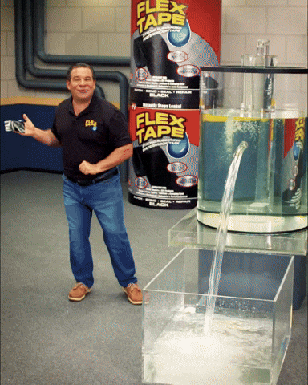{width="1.8400328083989501in" height="2.3000415573053368in"} []{dir="rtl"}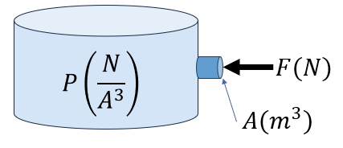{width="3.8591601049868767in" height="1.6629636920384951in"}

Figure [23- אטימת חור במיכל עם לחץ מים. מקור:]{dir="rtl"} flex seal

[הלחץ הוא **מאפיין של הזרם עצמו**]{dir="rtl"}, [ולא רק של נקודת המגע. במצב מנוחה, המולקולות דוחפות אחת את השנייה כך שהלחץ בכל נקודה באותו עומק או באותו מצב זרימה הוא זהה --- גם אם אין שם פתח או פקק ממשיים. לכן ניתן לדבר על "הלחץ במערכת" או "הלחץ בצינור", כאילו היה זה גודל אחיד המתאר את כל הזורם]{dir="rtl"}.

[יחידות הלחץ הן יחידות כוח חלקי יחידות שטח. ביחידות]{dir="rtl"} SI [נהוג למדוד לחץ בפסקל]{dir="rtl"} (Pa), [כאשר]{dir="rtl"}

$$1Pa = 1\frac{N}{m^{2}} = 1\frac{Kg}{m*s}$$

[ויחידות נוספות מוכרות הן]{dir="rtl"} torr[,]{dir="rtl"} atm [ו-]{dir="rtl"} psi $\left( \frac{lb_{m}}{in^{2}} \right)$[.]{dir="rtl"}

#### [לחץ אטמוספירי]{dir="rtl"}

[באותו האופן האוויר שסביבנו מפעיל עלינו לחץ. האוויר הוא תערובת של גזים שחלקיקיהם נעים ומתנגשים כל הזמן והתנגשויות אלה מפעילות כח עלינו ועל כל מה שנמצא סביבנו. הכוח הכולל שמפעילה האטמוספירה על כל יחידת שטח של פני הקרקע או של גוף כלשהו נקרא **לחץ אטמוספירי**]{dir="rtl"}.

::: definition
[הלחץ האטמוספירי בגובה פני הים הוא בערך]{dir="rtl"}:
:::

::: definition
$$P_{atm} = 1.013*10^{5}Pa = 1atm$$
:::

[כלומר, האוויר שסביבנו מפעיל על כל סנטימטר מרובע של הגוף שלנו כוח של כקילוגרם אחד -- ואיננו מרגישים זאת רק משום שהלחץ בתוך גופנו שווה לזה שבחוץ]{dir="rtl"}.

[אם נסתכל על פחית שתייה פתוחה \"ריקה\", אנו יודעים שהיא לא באמת ריקה, אלא מכילה אוויר באותו הלחץ כמו האוויר שסביבנו. אם נחבר פחית זו למשאבת ואקום כאשר נשאב את האויר מתוך הפחית, כבר לא תהיה התנגדות ללחץ שהאויר שמחוץ לפחית מפעיל, והפחית תקרוס פנימה.]{dir="rtl"}

![Figure [24 - פחית מחוברת למשאבת ואקום, הוצאת האויר גורמת ללחץ האטמוספירי למעוך את הפחית פנימה. נוצר בעזרת בינה מלאכותית]{dir="rtl"} (Nano Banana), 2025[.]{dir="rtl"}](media/media/image28.png){width="2.1297659667541557in" height="1.7727777777777778in"}

[הלחץ האטמוספירי איננו קבוע בכל מקום]{dir="rtl"}. [ככל שעולים לגובה רב יותר -- על פני הר, במטוס או בבלון מזג אוויר -- יש **פחות שכבות אוויר מעלינו**]{dir="rtl"}, [ולכן גם **פחות משקל של אוויר הלוחץ כלפי מטה**]{dir="rtl"}.\
[התוצאה היא ירידה הדרגתית בלחץ האטמוספירי עם העלייה בגובה]{dir="rtl"}. [כשאנו אומרים \"לחץ אטמוספירי\" אנו מתכוונים ללחץ בגובה פני הים - כ־1 אטמוספירה, אך בגובה של כ־5 ק\"מ (בערך מחצית גובה האוורסט) הלחץ יורד כמעט למחצית מערכו]{dir="rtl"}.

![Figure [25 - האטמוספירה בנויה משכבות של אוויר, שכל אחת מהן מפעילה משקל על השכבות שמתחתיה. לכן ככל שיורדים לגובה נמוך יותר - המולקולות נדחסות, והלחץ עולה בהתאם. נוצר בעזרת בינה מלאכותית]{dir="rtl"} (Nano Banana), 2025[.]{dir="rtl"}](media/media/image29.png){width="2.684491469816273in" height="2.684491469816273in"}

### [לחץ הידרוסטטי]{dir="rtl"}

[בדומה לאטמוספירה, גם בתוך נוזל או גז הנמצא במנוחה הלחץ משתנה עם הגובה. כל שכבה של זורם נושאת את משקל השכבות שמעליה, ולכן ככל שיורדים לעומק גדול יותר -- כך גדל המשקל המצטבר מעל הנקודה, והלחץ עולה]{dir="rtl"}. []{dir="rtl"}

![Figure [26- לחץ הידרוסטטי של מים, ככל שהחריר בנקודה יותר נמוכה, הלחץ גבוה יותר ולכן הזרימה החוצה מאותו החריר תהיה חזקה יותר.]{dir="rtl"}](media/media/image30.jpeg){width="4.430481189851268in" height="2.169326334208224in"}

[נניח עמוד זורם שגובהו]{dir="rtl"} $h$, [צפיפותו]{dir="rtl"} $\rho$, [ופתוח לאוויר. הלחץ בראש העמוד יהיה הלחץ האטמוספירי (]{dir="rtl"}$P_{0}$(

::: definition
*[הלחץ]{dir="rtl"} [בתחתית העמוד יהיה ]{dir="rtl"}*$P = P_{0} + \frac{\rho gh}{g_{c}}$
*[זהו הלחץ ההידרוסטטי]{dir="rtl"} -- [הלחץ הנובע ממשקל הזורם עצמו]{dir="rtl"}.*
:::

[הנוסחה תקפה לכל זורם במנוחה, בין אם מדובר בשמן במיכל, במים בצינור או באוויר בשכבות התחתונות של האטמוספירה]{dir="rtl"}. [עיקרון זה מסביר תופעות רבות שאנו פוגשים בחיי היומיום ובהנדסה]{dir="rtl"}:\
[מדוע צוללים חשים בלחץ גדל עם העומק, מדוע סכר נבנה עבה יותר בבסיסו, ומדוע תחתית מיכל תעשייתי חייבת לעמוד בעומסים גדולים בהרבה מחלקו העליון]{dir="rtl"}.

#### [ע֫ומד (במלעיל)]{dir="rtl"}

[אחת הדרכים לביטוי של לחץ לא ביחידות של כוח ליחידת שטח, אלא כגובה שקול של זורם שהיה מפעיל את אותו לחץ]{dir="rtl"}. [נניח עמוד זורם בגובה]{dir="rtl"} $h$, [בצפיפות]{dir="rtl"} $\rho$. [הלחץ בתחתיתו הוא]{dir="rtl"} $P = \rho gh$.\
[אפשר להביע את הלחץ בתחתית העמוד באמצעות הגובה נוזל מסויים (לרוב כספית או מים) שהיה גורם לאותו הלחץ. גודל זה נקרא **עומד לחץ** או **גובה שקול ללחץ (**]{dir="rtl"}**head[), ]{dir="rtl"}**[והוא מבטא את הלחץ ביחידות של אורך של נוזל. לדוגמה: לחץ של]{dir="rtl"} ‎1‎ [אטמוספירה ניתן לביטוי כעומד של]{dir="rtl"} ‎10.3‎ [מטר מים או]{dir="rtl"} ‎760‎ [מילימטר כספית]{dir="rtl"}.

$$1atm = 101325Pa = 760mmHg = 10.3mH_{2}O = 29.92inHg$$

[אנו יכולים למצוא את העומד על ידי חלוקת הלחץ בצפיפות הנוזל הרצוי]{dir="rtl"}

$$P_{head} = \frac{\rho_{fluid\ }\frac{g}{g_{c}}}{P\ \left( \frac{force}{area} \right)}$$

[יחידות העומד]{dir="rtl"} (Head) [נראות במבט ראשון זהות ליחידות של **אורך -** למשל מטרים או סנטימטרים - אך משמעותן הפיזיקלית שונה לחלוטין]{dir="rtl"}. [כאשר אנו אומרים "גובה של 2 מטרים", הכוונה היא למרחק פיזי במרחב]{dir="rtl"}. [לעומת זאת, כשאנחנו אומרים "עומד לחץ של 2 מטר מים", אין מדובר במרחק ממשי, אלא ב**גובה שקול של עמוד מים שהיה יוצר את אותו לחץ**]{dir="rtl"}.

$$P(mmHg) = P_{0}(mmHg) + h(mmHg)$$

[כיצד נזהה שמדובר בעומד ולא באורך אמיתי]{dir="rtl"}?\
[נבחן את **ההקשר הפיזיקלי** אם הגודל מופיע כחלק מביטוי של לחץ]{dir="rtl"} $(P = \rho gh)$ [ויחד עימו מוזכר נוזל מסויים (לרוב מים או כספית) -- מדובר בעומד]{dir="rtl"}. [אם הוא מתאר מיקום במרחב (כמו גובה מיכל, אורך צינור או מרחק בין נקודות) -- מדובר באורך]{dir="rtl"}.

### [לחץ אטמוספירי, לחץ מוחלט ולחץ יחסי]{dir="rtl"}

[עד עתה כשדיברנו על לחץ, התייחסנו ללחץ מוחלט - כלומר, לחץ שנמדד ביחס לואקום - מצב בו אין צורונים כלל, ולכן אין התנגשויות ולא מופעל כח. אבל למעט מקרים נדירים מופעל עלינו לחץ חיצוני קבוע - הלחץ האטמוספירי. במרבית המדידות המכשירים יראו לנו את הלחץ היחסי]{dir="rtl"} *(Gauge Pressure)* [- הלחץ הנמדד ביחס ללחץ האטמוספירי]{dir="rtl"}*.* [כאשר מד הלחץ מחובר לאוויר החופשי, הוא מציג ערך אפס, מפני שהלחץ שבתוכו שווה בדיוק ללחץ האטמוספירה שמחוצה לו]{dir="rtl"}*.* [רק כאשר הלחץ במערכת גדול או קטן מהלחץ החיצוני, המד מראה ערך חיובי או שלילי בהתאמה]{dir="rtl"}*.*

[הקשר בין שני סוגי הלחץ הוא פשוט]{dir="rtl"}*:*

$$P_{abs} = P_{\text{gauge}} + P_{\text{atmospheric}}$$
[כאשר]{dir="rtl"} $P_{\text{יחסי}} = 0$*,* [פירושו שהלחץ במערכת שווה ללחץ האטמוספירי]{dir="rtl"}*.\*
[כאשר הערך שלילי, משמעות הדבר שהלחץ במערכת קטן מהאטמוספירה -- מצב הנקרא **ואקום חלקי**]{dir="rtl"}*.\*
[במקרה זה מכשיר המדידה יראה ערך שלילי. והערך הזה מייצג את \"עוצמת הואקום\". כך לדוגמא אם המכשיר מראה ערך של]{dir="rtl"} $- 100mmHg$ [המשמעות היא שהלחץ האבסולוטי הוא]{dir="rtl"} $660mmHg$ [ויש לנו ואקום של 10 ס\"מ.]{dir="rtl"}

- [יחידות המיועדות רק ללחץ אבסולוטי:]{dir="rtl"} *atma, psia*

- [יחידות המיועדות רק ללחץ יחסי:]{dir="rtl"} *atmg, psig*

- [שאר היחידות (למשל]{dir="rtl"} *Pa* [או]{dir="rtl"} *mmHg*[) דורשות ציון מפורש]{dir="rtl"}

- [אם אין ציון מפורש ניתן להניח שמדובר בלחץ אבסולוטי]{dir="rtl"}

#### [ברומטר ולחץ ברומטרי]{dir="rtl"}

[כשאין מידע נוסף אנו מעריכים את הלחץ החיצוני המופעל עלינו כלחץ של]{dir="rtl"} 1atm[. אך הלחץ המדוייק תלוי בתנאים שבהם אנו נמצאים כמו הגובה מעל (או מתחת) פני הים והטמפ\' שאנו נמצאים בה. על מנת למדוד את הלחץ המופעל עלינו על ידי האטמוספירה בפועל בנקודה מסויימת בזמן מסויים,]{dir="rtl"} [נשתמש במכשיר שנקרא **ברומטר** ]{dir="rtl"}**(Barometer)[.]{dir="rtl"}** []{dir="rtl"}

[ברומטר כספית הוא מכשיר פשוט אך מדויק למדידת הלחץ על פני השטח. הוא מורכב מצינור זכוכית ארוך (בדרך כלל באורך של כ־90 ס״מ), שצידו האחד אטום וסגור]{dir="rtl"}, [והצד השני פתוח ומוטבל בתוך כלי המכיל כספית נוזלית]{dir="rtl"}. [את הצינור ממלאים לחלוטין בכספית, סוגרים את קצהו העליון, והופכים אותו כך שקצהו הפתוח ייטבל במיכל]{dir="rtl"}. [כאשר הצינור מונח כך, חלק מהכספית מחליקה החוצה אל המיכל, אך רובה נותרת בצינור]{dir="rtl"}. [בחלק העליון של הצינור נוצר חלל כמעט ריק]{dir="rtl"} -- [ואקום כמעט מושלם]{dir="rtl"} -- [משום שאין בו אוויר כלל]{dir="rtl"}. [במצב זה נוצר שיווי משקל בין שני כוחות]{dir="rtl"}: [הלחץ שמפעיל האוויר האטמוספירי על פני הכספית שבמיכל]{dir="rtl"} ,[ומשקל עמוד הכספית שבתוך הצינור]{dir="rtl"}. [שיווי המשקל מתואר על ידי]{dir="rtl"}:

$$P_{\text{barometer}} = \frac{\rho_{\text{Hg}}gh}{g_{c}}$$
[כאשר]{dir="rtl"} $\mathbf{h}$ [הוא גובה עמוד הכספית הנותר בצינור]{dir="rtl"}.

[מאחר והחלל שבחלק העליון של הצינור הוא למעשה וואקום, הלחץ בראש עמוד הכספית כמעט אפסי]{dir="rtl"}.\
[מכאן שהלחץ הנמדד בברומטר הוא לחץ מוחלט ביחס לוואקום זה, וניתן להשתמש בו כערך הייחוס (לחץ ברומטרי) לכל חישוב של לחצים יחסיים במכשירים אחרים]{dir="rtl"}.

$$P_{abs} = P_{\text{gauge}} + P_{\text{barometer}}$$

[תרגיל]{dir="rtl"}

[הסטודנטית החרוצה סתוונית בודקת אחראית על בדיקת תקינות מיכל גז במפעל בו היא עובדת.\
מד הלחץ (]{dir="rtl"}Gauge[) המותקן על המכל מראה]{dir="rtl"} $200KPa$

[הלחץ האטמוספרי באותו היום נמדד בברומטר כספית ועמד על]{dir="rtl"} $720mmHg$

[ידוע כי המיכל מתוכנן לעמוד בלחץ אבסולוטי מרבי של]{dir="rtl"} $310KPa$

[האם המכל נמצא בתחום התקין או שקיים חשש לחריגה מהלחץ המותר?]{dir="rtl"}

### . [מכשירים למדידת לחץ]{dir="rtl"}

[קיימות שיטות רבות למדידת לחץ, השונות זו מזו בעקרון הפעולה, בטווחי הלחצים המתאימים ובדיוק הנדרש]{dir="rtl"}. [לפי]{dir="rtl"} *Perry's Chemical Engineers' Handbook[,]{dir="rtl"}* [ניתן לחלק את מכשירי המדידה לשלוש קבוצות עיקריות]{dir="rtl"}:

1.  **[שיטות מבוססות עמוד נוזל]{dir="rtl"} (liquid-column methods)** -- [כמו המנומטר, שבהן הלחץ נמדד באמצעות גובה נוזל המאזן את הלחץ הפועל עליו. שיטות אלו פשוטות, מדויקות יחסית ומתאימות במיוחד למדידות לחץ נמוך]{dir="rtl"}.

2.  **[שיטות אלסטיות]{dir="rtl"} (elastic-element methods)** -- [מבוססות על עיוות מכני של רכיב מתכתי אלסטי, כמו בצינור בורדון, בדיאפרגמה או במפוח. הלחץ גורם לעיוות מבוקר שמומר לתנועה מכנית הניתנת לקריאה על גבי סקלת מד. שיטות אלו נפוצות בתעשייה למדידת לחצים בינוניים וגבוהים]{dir="rtl"}.

3.  **[שיטות חשמליות]{dir="rtl"} (electrical methods)** -- [משתמשות בחיישנים אלקטרוניים]{dir="rtl"} ([כגון]{dir="rtl"} strain gauges [או חיישנים פייזו־אלקטריים]{dir="rtl"}), [הממירים את העיוות המכני לאות חשמלי. שיטות אלו מאפשרות מדידה מדויקת ורציפה, ומתאימות במיוחד למערכות בקרה אוטומטיות]{dir="rtl"}.

[שלוש הקטגוריות הללו מתבססות על עקרון משותף: הפיכת הלחץ הפועל לגודל מדיד -- גובה נוזל, תזוזה מכנית, או אות חשמלי -- הניתן לכיול ביחידות של פסקל, בר או אטמוספירה]{dir="rtl"}.

#### [שיטות אלסטיות למדידת לחץ]{dir="rtl"}

[בשיטות אלסטיות נמדד הלחץ באמצעות עיוות מכני של רכיב מתכתי אלסטי]{dir="rtl"}**.** [כאשר נוזל או גז מפעילים לחץ על רכיב גמיש --- כמו צינור דק, קרום מתכת או מפוח --- הלחץ גורם לשינוי בצורתו. שינוי זה מומר לתנועה מדידה, לרוב באמצעות מנגנון מכני פשוט המחובר למחוג או חיישן]{dir="rtl"}. [השיטה הנפוצה ביותר היא צינור בורדון]{dir="rtl"} (Bourdon tube)[**.** צינור זה בנוי מצינור מתכתי קעור בעל חתך אליפטי, המעוקל בצורת חצי עיגול או סליל. הקצה הפתוח של הצינור מחובר אל מקור הלחץ, בעוד שהקצה השני סגור ויכול לנוע בחופשיות]{dir="rtl"}. [כאשר הלחץ הפנימי בצינור עולה, דפנות הצינור נמתחות והצורה הקמורה נוטה להתיישר. תנועה קטנה זו מועברת באמצעות מנגנון של מנוף וגלגל שיניים אל מחוג המורה את הלחץ על גבי סקלת המד]{dir="rtl"}.

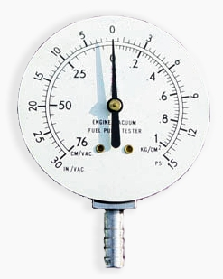{width="2.0508759842519684in" height="2.565670384951881in"} []{dir="rtl"}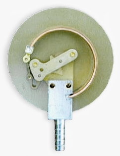{width="1.9857545931758531in" height="2.584763779527559in"}

Figure [27 - איור: מד לחץ מסוג בורדון (]{dir="rtl"}Bourdon Gauge[). מימין -- מראה חיצוני של מד הלחץ, שבו תנועת המחוג מציגה את ערך הלחץ על גבי סולם מכויל]{dir="rtl"}. [משמאל -- מבט פנימי של מנגנון המדידה: צינור מתכתי קמור בצורת]{dir="rtl"} C [(צינור בורדון) המחובר לקו הלחץ]{dir="rtl"}.

[מדי לחץ מסוג בורדון פשוטים, אמינים, ואינם דורשים מקור אנרגיה חיצוני. הם מתאימים למדידה של לחץ מדומה]{dir="rtl"} (Gauge Pressure) [ומספקים תוצאות מדויקות בטווח רחב מאוד של לחצים, החל ממאות קילו־פסקל ועד מאות מגה־פסקל]{dir="rtl"}. [חסרונם העיקרי הוא רגישות לשינויים מהירים בלחץ ולבלאי מכני לאורך זמן]{dir="rtl"}. [בזכות פשטותם ואמינותם, מדי בורדון נחשבים עד היום לאחד המכשירים הנפוצים ביותר למדידת לחץ במערכות תעשייתיות, במעבדות ובמתקני בקרה]{dir="rtl"}.

[מלבד צינור בורדון, קיימות שיטות נוספות למדידת לחץ המבוססות על אותו עיקרון של עיוות אלסטי של רכיב מתכתי]{dir="rtl"}. [במכשירי דיאפרגמה הלחץ מפעיל כוח על קרום מתכתי דק המתעוות בהתאם לעוצמת הלחץ, ובמכשירי מפוח]{dir="rtl"} (bellows) [הלחץ גורם להתפשטות או כיווץ של גליל מתקפל דק]{dir="rtl"}. [בכל המקרים מדובר בהמרה של שינוי מכני קטן --- כיפוף, מתיחה או התרחבות --- לתנועה מדידה, אשר מתורגמת להצגה אנלוגית או לאות חשמלי]{dir="rtl"}. [מכשירים אלה מאפשרים מדידה מדויקת גם בטווחי לחץ שונים מאוד, החל מהפרשי לחץ זעירים ועד ללחצים גבוהים בתעשייה, והם מהווים את הבסיס למרבית מדי הלחץ המכניים המודרניים]{dir="rtl"}.

#### [שיטות חשמליות למדידת לחץ]{dir="rtl"}

[בשיטות חשמליות נמדד הלחץ בעזרת חיישנים ההופכים עיוות מכני לאות חשמלי מדיד]{dir="rtl"}. [בכל השיטות העיקרון זהה: לחץ הפועל על רכיב גמיש גורם לשינוי פיזי (כיפוף, מתיחה או דחיסה), והמערכת האלקטרונית מתרגמת שינוי זה לשינוי במתח, בזרם או במטען]{dir="rtl"}. [היתרון המרכזי של שיטות אלו הוא האפשרות לשלב אותן במערכות בקרה ממוחשבות, ולקבל מדידה רציפה, מדויקת ומהירה של לחצים גם בתנאים משתנים]{dir="rtl"}. [קיימים שלושה סוגים עיקריים של חיישנים חשמליים]{dir="rtl"}:

- []{dir="rtl"}Strain Gauge [- חוט מתכתי דק או סרט מוליך שההתנגדות החשמלית שלו משתנה בהתאם למידת המתיחה או הדחיסה. שינוי ההתנגדות מומר ישירות לשינוי במתח החשמלי ומאפשר מדידת לחצים סטטיים לאורך זמן]{dir="rtl"}.

- Piezo-resistive Sensor [- מבוסס על שינוי בהתנגדות החשמלית של חומרים מוליכים למחצה (כמו סיליקון) כתוצאה מלחץ מכני. חיישנים אלה רגישים במיוחד ומתאימים למערכות מדידה מדויקות, כולל יישומים רפואיים ותעשייתיים]{dir="rtl"}.

- Piezo-electric Sensor [-]{dir="rtl"} [מבוסס על תופעת הפייזואלקטריות, שבה גבישים מסוימים (כמו קוורץ או חומרים קרמיים) מייצרים מטען חשמלי חדש כשהם נתונים ללחץ. המטען מומר לאות חשמלי באמצעות מעגל הגברה, ומאפשר מדידה של לחצים דינמיים מאוד -- כמו פיצוצים, רטט או פעימות מהירות במנועים]{dir="rtl"}. []{dir="rtl"} [יש לציין כי חיישנים אלו אינם מתאימים למדידת לחץ סטטי (קבוע) לאורך זמן, כיוון שהמטען החשמלי נוטה להתפוגג.]{dir="rtl"}

[החיישנים החשמליים משלבים בין רגישות גבוהה]{dir="rtl"}, [מהירות תגובה ויכולת אינטגרציה במערכות בקרה מתקדמות]{dir="rtl"}. [עם זאת, יש להבחין בין חיישנים המתאימים ללחצים קבועים לבין כאלה המשמשים למדידות רגעיות בלבד -- בהתאם לעקרון הפעולה של כל טכנולוגיה]{dir="rtl"}.

### [מנומטרים]{dir="rtl"}

**[מנומטרים]{dir="rtl"} (Manometers)** [הם מהמכשירים הפשוטים והמדויקים ביותר למדידת לחץ]{dir="rtl"}. [הם פועלים על עקרון בסיסי של שיווי משקל הידרוסטטי: כאשר עמודת נוזל נמצאת במנוחה, הפרש הגבהים בין שני צדדים של הצינור משקף את הפרש הלחצים ביניהם]{dir="rtl"}. [מנומטר טיפוסי הוא צינור בצורת]{dir="rtl"} U [המכיל נוזל מדידה (כמו כספית או מים). כאשר שני צדדיו חשופים ללחצים שונים, הנוזל נע עד שהפרשי הלחצים משתווים להפרש המשקלים של עמודות הנוזל בשני הצדדים. גובה עמודת הנוזל מהווה מדד ישיר להפרש הלחצים בין הנקודות]{dir="rtl"}.

#### [משוואת המנומטר הכללית]{dir="rtl"}

[העיקרון הפיזיקלי הבסיסי הוא שהלחץ זהה בכל שתי נקודות הנמצאות באותו גובה באותו נוזל רציף]{dir="rtl"}.\
[נניח שני לחצים בשני הקצוות]{dir="rtl"} $P_{1}$[ו-]{dir="rtl"}$P_{2}$, [ושני זורמים בצינור -- נוזל מדידה בצפיפות]{dir="rtl"} $\rho_{1}$ [וזורם (לרוב אוויר) בצפיפות]{dir="rtl"} $\rho_{2}$.

![Figure [28- משוואת המנומטר הכללית - נוזל המדידה בכחול (לרוב מים או כספית), זורם עליון בירוק (לרוב אויר, זניח), לחצים חיצוניים]{dir="rtl"} P1 [ו-]{dir="rtl"} P2[.]{dir="rtl"}](media/media/image33.png){width="1.4108508311461068in" height="2.0190627734033244in"}

[אם נעקוב לאורך הצינור מצד 1, דרך נוזל המדידה, ועד לצד 2 -- נוכל להשוות את הלחצים בנקודות שבאותו גובה]{dir="rtl"}.\
[נכתוב את הלחץ בכל זרוע ונשווה ביניהם]{dir="rtl"}:

$$P_{1} + \rho_{2}\frac{g}{g_{c}}(h_{1} + h_{2}) = P_{2} + \rho_{1}\frac{g}{g_{c}}h_{1} + \rho_{2}\frac{g}{g_{c}}h_{2}$$

[זוהי **משוואת המנומטר הכללית**]{dir="rtl"}, [המתארת את הקשר בין הלחצים, צפיפויות הנוזלים והפרשי הגבהים בצינור]{dir="rtl"}.

[במרבית היישומים הזורם העליון הוא גז (לרוב אוויר), שצפיפותו קטנה בהרבה מצפיפות נוזל המדידה]{dir="rtl"}.\
[במקרה זה ניתן להזניח את תרומתו, ואז נקבל את משוואת המנומטר בפועל]{dir="rtl"}:

$$P_{1} - P_{2} = \rho\frac{g}{g_{c}}h$$
[כאשר]{dir="rtl"} $\rho$[היא צפיפות נוזל המדידה בלבד]{dir="rtl"}.

[אם]{dir="rtl"} $h > 0$-- [הלחץ בצד 1 גבוה יותר]{dir="rtl"}; [אם]{dir="rtl"} $h < 0$-- [הלחץ בצד 2 גבוה יותר]{dir="rtl"}.

[נוסחה זו היא הצורה הפשוטה והנפוצה של **משוואת המנומטר** אם אחד הצדדים של המנומטר פתוח לאטמוספירה, ניתן להשתמש בו למדידת לחץ יחסי (]{dir="rtl"}Gauge []{dir="rtl"}Pressure[), ואם שני הצדדים מחוברים לנקודות שונות במערכת, הוא מודד הפרש לחצים]{dir="rtl"} (Differential Pressure)[. מנומטרים משמשים בעיקר ביישומים שבהם נדרש דיוק גבוה בטווחי לחץ נמוכים, כמו כיול חיישנים, ניסויי זרימה במעבדה, או מדידות בפרויקטים חינוכיים. לעומת זאת, במערכות תעשייתיות בלחצים גבוהים משתמשים לרוב במדי לחץ אלסטיים או אלקטרוניים, שהם קומפקטיים ועמידים יותר]{dir="rtl"}.

[תרגיל:]{dir="rtl"}

[נתונה המערכת הבאה:\
1. באיזה צד הלחץ יותר גבוה?\
2. מהו]{dir="rtl"} h[?]{dir="rtl"}

{width="2.010462598425197in" height="1.621340769903762in"}

#### [סוגי מנומטרים]{dir="rtl"}

![Figure [29]{dir="rtl"}- [סוגי מנומטרים]{dir="rtl"}](media/media/image35.png){width="6.5in" height="3.375in"}

**[מנומטר פתוח]{dir="rtl"} *(Open-End Manometer)***

[במנומטר פתוח צד אחד של הצינור חשוף לאטמוספירה, והצד השני מחובר לנקודה במערכת שברצוננו למדוד את הלחץ בה]{dir="rtl"}*.* [אם הלחץ במערכת גדול מהלחץ האטמוספרי, מפלס הנוזל בצד הפתוח יעלה; ואם הוא קטן יירד]{dir="rtl"}*.* []{dir="rtl"}

- [מאחר והמנומטר פתוח לאמוספירה הוא יראה לנו את הלחץ היחסי (]{dir="rtl"}*gauge*[)]{dir="rtl"} $P_{1g} = \rho\frac{g}{g_{c}}h$

- [אם נרצה לדעת את הלחץ האבסולוטי בצינור נצטרך להוסיף את הלחץ האטמוספירי]{dir="rtl"}

$$P_{1a} = P_{atm} + P_{1g} = P_{atm} + \rho\frac{g}{g_{c}}h$$

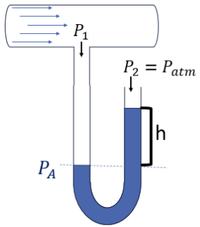{width="1.5080818022747156in" height="1.7115955818022748in"}

**[מנומטר סגור]{dir="rtl"} *(Sealed-End Manometer)***

[במנומטר סגור צד אחד של הצינור אטום ומכיל ריק כמעט מוחלט]{dir="rtl"} *(Vacuum)*[,]{dir="rtl"} [והצד השני מחובר למערכת. מכיוון שבצד האטום הלחץ אפסי בקירוב, הלחץ הנמדד הוא לחץ מוחלט]{dir="rtl"}

$$P_{1a} = 0 + \rho\frac{g}{g_{c}}h$$
{width="1.348231627296588in" height="1.698153980752406in"}

**[מנומטר דיפרנציאלי]{dir="rtl"} *(Differential Manometer)***

[במנומטר דיפרנציאלי שני הצדדים מחוברים לשתי נקודות שונות במערכת]{dir="rtl"}*.\*
[המכשיר מודד ישירות את **הפרש הלחצים** בין שתי הנקודות, ללא קשר ללחץ האטמוספרי]{dir="rtl"}*.\*
{width="1.5571347331583552in" height="1.73623031496063in"}

$$P_{1} + \rho\frac{g}{g_{c}}h = P_{2} + \rho_{f}\frac{g}{g_{c}}h\ \ \ \  \Longrightarrow \ \ \ \ \ \ \boxed{\mathrm{\Delta}P = P_{1} - P_{2} = \left( \rho_{f} - \rho \right)\frac{g}{g_{c}}h\text{~}}$$
[כאשר]{dir="rtl"} $\rho_{f}$[היא צפיפות נוזל המדידה ו־]{dir="rtl"}$\rho$ [היא צפיפות הזורם במערכת]{dir="rtl"}*.\*
[אם צפיפות הזורם נמוכה משמעותית מצפיפות נוזל המנומטר (למשל אם מדובר באוויר), נקבל:]{dir="rtl"}

$$P_{1} - P_{2} = \rho\frac{g}{g_{c}}h$$
**[מנומטר משופע]{dir="rtl"} *(Inclined Manometer)***

[במנומטר משופע אחת הזרועות של הצינור איננה אנכית אלא מונחת בזווית קטנה ביחס לאופק]{dir="rtl"}*.\*
[העיקרון הפיזיקלי זהה לזה של מנומטר רגיל, אך השיפוע מאפשר למדוד שינויים קטנים מאוד בלחץ בדיוק גבוה יותר]{dir="rtl"}*.* []{dir="rtl"}

[על כן, בהנחה וצפיפות הזורם במערכת זניחה]{dir="rtl"}

$$\Delta P = \rho\frac{g}{g_{c}}h = \rho\frac{g}{g_{c}}Lsin(\theta)$$
[כאשר]{dir="rtl"} $L$ [הוא המרחק הנמדד לאורך הצינור ו־]{dir="rtl"}$\theta$ [היא זווית ההטיה]{dir="rtl"}*.\*
[ככל ש]{dir="rtl"} $\theta$ [קטנה יותר, נוכל לשים לב לשינויים קטנים יותר.]{dir="rtl"}

[]{dir="rtl"}{width="2.146560586176728in" height="1.958814523184602in"}

**[מנומטר עם צד רחב]{dir="rtl"} *(Large-Reservoir Manometer)***

[במנומטר זה אחת הזרועות רחבה בהרבה מהשנייה]{dir="rtl"}*.\*
[כאשר הלחץ משתנה, מפלס הנוזל בצד הצר נע מעלה או מטה באופן מורגש, בעוד שהשינוי במאגר הרחב קטן משמעותית. לכן, יש להתחשב ביחס בין שטחי החתך של שני הצדדים]{dir="rtl"}*,* $A_{1}$[ו־]{dir="rtl"}$A_{2}$ [כדי לתקן את החישוב]{dir="rtl"}*.*

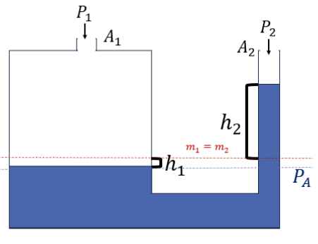{width="3.1321052055993in" height="2.40290135608049in"}

[אנו יודעים כי המסה שירדה בצד אחד חייבת להיות שווה למסה שעלתה בצד השני. לכן, אם נסתכל על הנפח שעלה וירד ביחס לקו האדום -]{dir="rtl"}

$$m_{1} = m_{2}\ \ ;\ \ \ m = \rho V$$

$$V_{1} = A_{1}h_{1}\ \ \ \ \ \ V_{2} = A_{2}h_{2}$$

$$m_{1} = \rho A_{1}h_{1}\ \ \ \ ;\ \ \ m_{2} = \rho A_{2}h_{2}\  \Rightarrow \ \rho A_{1}h_{1} = \rho A_{2}h_{2}\  \Rightarrow h_{1} = h_{2}\frac{A_{2}}{A_{1}}$$

*\*
[כדי לחשב את הלחץ]{dir="rtl"} $P_{1}$ [נניח כי צפיפות האויר זניחה, וכי הצד השני של המנומטר פתוח לאטמוספירה]{dir="rtl"}

$$P_{1} = P_{2} + \rho\frac{g}{g_{c}}\left( h_{1} + h_{2} \right)$$

$$\boxed{P_{1} = P_{atm} + \rho\frac{g}{g_{c}}h_{2}\left( 1 + \frac{A_{2}}{A_{1}} \right)}$$

[אם המאגר רחב מאוד יחסית לצינור הצר, ניתן להגיד ש]{dir="rtl"} $A_{1} \gg A_{2},\ h_{1} \ll h_{2}$ [והמשוואה מתלכדת עם המשוואה של מנומטר רגיל.]{dir="rtl"}

$$P_{1} = P_{atm} + \rho\frac{g}{g_{c}}h_{2}\left( 1 + \frac{A_{2}}{A_{1}} \right) = P_{atm} + \rho\frac{g}{g_{c}}h_{2}$$

[מבנה זה מאפשר **מדידה נוחה וקריאה מדויקת של הפרש גבהים**]{dir="rtl"}*,* [כיוון שהשינוי מתרכז כולו בצינור הצר]{dir="rtl"}*.* [מנומטרים כאלה נפוצים במעבדות ובמדידות כיול, שבהן נדרשת רגישות גבוהה אך שינוי לחץ מוגבל]{dir="rtl"}*.*

#### [סיכום מנומטרים]{dir="rtl"}

[מנומטרים הם מהמכשירים הפשוטים, המדויקים והמהימנים ביותר למדידת לחצים והפרשי לחצים]{dir="rtl"}*.\*
[הם מבוססים על עקרון **שיווי המשקל ההידרוסטטי**]{dir="rtl"}*,* [שלפיו הלחץ בנוזל במנוחה תלוי רק בצפיפותו, בתאוצת הכובד ובגובה עמודת הנוזל]{dir="rtl"}*.\*
[הפרש הגבהים בין פני הנוזל בשתי זרועות הצינור מתורגם ישירות להפרש לחצים על־פי המשוואה]{dir="rtl"}*:*

$$\Delta P = \rho gh$$

[צורתו של המנומטר -- פתוח, סגור, דיפרנציאלי, משופע או עם צד רחב -- נקבעת לפי סוג המדידה הרצויה: לחץ מוחלט, לחץ יחסי או הפרש לחצים בין שני מקומות במערכת]{dir="rtl"}*.*

[למרות פשטותם, מנומטרים משמשים עד היום במעבדות, בבדיקות כיול ובמערכות בקרה, בזכות רמת הדיוק הגבוהה והיכולת לספק מדידה ישירה וברורה של לחץ באמצעות גובה עמודת נוזל]{dir="rtl"}*.*

[במכון הנדסי נתון מיכל מלבני ברוחב]{dir="rtl"} $1.0\text{~}m$ [ואורך]{dir="rtl"} $3.0\text{~}m$[.]{dir="rtl"}\
[המיכל מלא עד לגובה]{dir="rtl"} $5.0\text{~}m$ [בחומר]{dir="rtl"} **Methyl Ethyl Ketone (MEK)** [,]{dir="rtl"}\
[נתון:]{dir="rtl"} $S.G = 0.805$[.\
הלחץ האטמוספירי באותו יום הוא]{dir="rtl"} $772\text{~}mmHg$[.]{dir="rtl"}

1.  [חשבו את הכוח]{dir="rtl"} $F\text{~}\lbrack N\rbrack$ [הפועל על תחתית המיכל.]{dir="rtl"}

2.  [מהו העומד במיכל ביחידות של]{dir="rtl"} mMEK[?]{dir="rtl"}

3.  [באחד הימים ירד גשם ונכנסו למיכל מים.]{dir="rtl"}

    - [האם ניתן לחשב את כמות המים שנכנסה למיכל באמצעות מדידת הלחץ בתחתית המיכל?]{dir="rtl"}

    - [כיצד ניתן להחזיר את המיכל למצבו המקורי (ללא מים).]{dir="rtl"}

### [סיכום]{dir="rtl"}

- [לחץ הוא הכוח הפועל בניצב ליחידת שטח:]{dir="rtl"}

> $$P = \frac{F}{A}$$

- [לחץ בזורם הוא הכוח שהנוזל או הגז מפעיל בניצב על כל יחידת שטח שבתוכו או על גבולות הכלי המכיל אותו.]{dir="rtl"}

- [לחץ נוזל במנוחה עולה עם העומק בהתאם לצפיפות הנוזל ולכוח הכובד:]{dir="rtl"}

> $$\Delta P = \rho\frac{g}{g_{c}}h$$

- [עומד]{dir="rtl"} (Head) [הוא הגובה השקול של עמודת נוזל שמייצרת לחץ נתון -- כלומר, גובה עמוד הנוזל שהיה יוצר את אותו לחץ במנוחה]{dir="rtl"}.

- [סוגי לחצים:]{dir="rtl"}

  - [לחץ מוחלט (]{dir="rtl"}Absolute Pressure[): נמדד מה]{dir="rtl"}Vacuum[.]{dir="rtl"}

  - [לחץ אטמוספירי (]{dir="rtl"}Atmospheric Pressure[): לחץ האוויר שמסביבנו.]{dir="rtl"}

  - [לחץ יחסי (]{dir="rtl"}Gauge Pressure[): ההפרש בין הלחץ המוחלט ללחץ האטמוספירי.]{dir="rtl"}

- $P_{\text{abs}} = P_{\text{gauge}} + P_{\text{atm}}$

- [מכשירים למדידת לחץ:]{dir="rtl"}

  - [ברומטר (]{dir="rtl"}Barometer[): מודד את הלחץ האטמוספירי בעזרת עמוד כספית סגור.]{dir="rtl"}

  - [מנומטר (]{dir="rtl"}Manometer[): מודד הפרשי לחצים באמצעות עמודת נוזל בצורת]{dir="rtl"} U[.]{dir="rtl"}

    - [פתוח ←לחץ יחסי]{dir="rtl"}

    - [סגור ← לחץ מוחלט]{dir="rtl"}

    - [דיפרנציאלי ← הפרש לחצים]{dir="rtl"}

    - [משופע / צד רחב ← דיוק גבוה למדידות קטנות]{dir="rtl"}

- [עקרונות מרכזיים לזכור:]{dir="rtl"}

  - [לחץ שווה בכל נקודה באותו גובה באותו נוזל.]{dir="rtl"}

  - [הפרש לחצים ניתן לחישוב לפי הפרש גבהים במנוחה.]{dir="rtl"}

  - [לרוב ניתן להזניח את צפיפות האויר שבתוך המנומטר]{dir="rtl"}

  - [מדידות לחץ הן הבסיס להבנת זרימה, מעבר חום ובקרה בתהליכים הנדסיים.]{dir="rtl"}

# [פרק 4 -- מאזן מסה]{dir="rtl"}

## [מה נלמד בפרק הזה]{dir="rtl"}?

- [**להגדיר ולהסביר** מושגים מרכזיים: תהליך מנה, חצי-מנה, רציף, מצב יציב ומצב לא יציב, מחזור, זרם פסילה, דרגות חופש, המרה של מגיב מגביל, אחוז עודף מגיב, תפוקה, בררנות, הרכב יבש, אוויר תיאורטי ואחוז עודף אוויר]{dir="rtl"}.

- [**לשרטט ולסמן** תרשימי זרימה, **לבחור** בסיס חישוב, **לזהות** תתי-מערכות]{dir="rtl"}

- [**לבצע** ניתוח דרגות חופש]{dir="rtl"}

- [**לנסח ולפתור** מאזני חומרים למערכות פשוטות ומורכבות (יחידה אחת או ריבוי יחידות, כולל מחזור, מעקף וזרם פסילה)]{dir="rtl"}.

- [**ליישם** שיטות שונות לכתיבת מאזנים בתהליכים עם תגובות: מאזן מולקולרי, מאזן אטומי או שימוש במידת תגובה]{dir="rtl"}.

- [**לחשב** חישובי בעירה: קצב הזנת אוויר מתוך אחוז עודף נתון או להפך, **לקבוע** קצב זרימה והרכב גזי מוצרים, כולל במצבים של חמצון חלקי.]{dir="rtl"}

## [מאזן מסה כללי]{dir="rtl"}

[בפרק הקודם הכרנו את מושגי היסוד של תהליך תעשייתי: חומרי גלם, יחידות פעולה ותרשימי זרימה]{dir="rtl"}.\
[ראינו שכל תהליך, פשוט או מורכב, ניתן לתאר כרצף של יחידות פעולה המחוברות ביניהן בזרמי חומר]{dir="rtl"}.\
[עד כה הסתפקנו בתיאור איכותי:]{dir="rtl"} *[מה קורה בכל שלב,]{dir="rtl"}* [ואילו משתנים (לחץ, טמפרטורה, ספיקה, הרכב) מאפיינים את הזרמים]{dir="rtl"}. [כעת אנו עושים את הצעד הבא]{dir="rtl"}: [לתאר את התהליך באופן כמותי]{dir="rtl"}. [נרצה לדעת לא רק *איזה תהליכים מתרחשים*]{dir="rtl"}, [אלא *כמה חומר* נכנס]{dir="rtl"}, *[כמה יוצא]{dir="rtl"}*, [ו־*מה קורה לו בדרך*]{dir="rtl"}. [כדי לענות על שאלות כאלה נשתמש באחד הכלים המרכזיים של ההנדסה]{dir="rtl"} **[מאזן המסה]{dir="rtl"} (Mass Balance)[.]{dir="rtl"}**\
[ובאמצעותו נוכל לתאר ולחשב את זרימות החומרים בכל חלק בתהליך -- ממכל בודד ועד למתקן תעשייתי שלם]{dir="rtl"}.

[מאזן מסה הוא ביטוי מתמטי לעיקרון פשוט ועמוק]{dir="rtl"}: **[חומר לא נעלם ואינו נוצר יש מאין]{dir="rtl"}.** [בכל מערכת --- ריאקטור, מיכל ערבוב, ביוריאקטור או מתקן תעשייתי שלם --- כל מה שנכנס אליה, יוצא ממנה, נוצר בתוכה או נצרך בה -- חייב "להסתדר בחשבון]{dir="rtl"}".

::: definition
[הצורה הכללית של מאזן מסה ניתנת לכתיבה כך]{dir="rtl"}:
:::

::: definition
$$\text{Input} - \text{Output} + \text{Generation} - \text{Consumption} = \text{Accumulation}$$
:::

[נניח שיש לנו מערכת --- למשל ריאקטור. אנחנו יכולים לעקוב אחרי החומר שנכנס אליו, אחרי מה שיוצא ממנו, אחרי מה שנוצר בו כתוצאה מתגובה, ואחרי מה שנצרך]{dir="rtl"}. [אם נחבר את כל אלה, נקבל את השינוי בכמות החומר בתוך המערכת לאורך זמן]{dir="rtl"}.

[במילים אחרות]{dir="rtl"}:\
[מה שנכנס, פחות מה שיצא, בתוספת מה שנוצר, פחות מה שנצרך -- שווה בדיוק למה שהצטבר]{dir="rtl"}.

[אחת הדרכים להבין את מאזן המסה היא לחשוב עליו כמו על ניהול חשבון בנק]{dir="rtl"}. [חשבון הבנק שלנו הוא \"מערכת\" אשר יש בה בתנועה של ה\"חומר\" שלנו, כסף. בכל רגע נכנס כסף, יוצא כסף, מצטברת ריבית, נגרעות עמלות --- ובסוף התקופה אנחנו רואים אם היתרה גדלה או קטנה]{dir="rtl"}.

1.  **[כניסה]{dir="rtl"} []{dir="rtl"}(Input)**\
    [כסף שנכנס לחשבון מבחוץ -- משכורת, החזר מס, העברה מחבר, או כל הפקדה חיצונית]{dir="rtl"}.\
    [זהו הזרם שנכנס למערכת מהסביבה]{dir="rtl"}.

2.  **[יצירה]{dir="rtl"} (Generation)**\
    [כסף שנוצר *בתוך* המערכת עצמה -- למשל ריבית על החיסכון או רווח מהשקעה]{dir="rtl"}.\
    [זה כמו חומר חדש שנוצר בתגובה כימית]{dir="rtl"}.

3.  **[הוצאה]{dir="rtl"} (Output)**\
    [תשלומים, קניות או העברות שביצענו -- כל מה שעוזב את החשבון ויוצא החוצה]{dir="rtl"}.\
    [זהו הזרם היוצא של המערכת]{dir="rtl"}.

4.  **[צריכה]{dir="rtl"} (Consumption)**\
    [כסף שנעלם "מבפנים" -- עמלות בנק, דמי ניהול או ריבית על האוברדראפט.]{dir="rtl"}\
    [הוא לא יצא החוצה, אבל הכמות שלו יורדת מאחר והוא נצרך על ידי המערכת.]{dir="rtl"}

5.  **[צבירה]{dir="rtl"} (Accumulation)**\
    [ההפרש בין כל מה שנכנס ונוצר לבין כל מה שיצא ונצרך]{dir="rtl"}. [אם יותר כסף נכנס ונוצר -- היתרה גדלה. אם ההוצאות והעמלות היו גדולות יותר -- היתרה קטנה]{dir="rtl"}.\
    \
    [זהו כלי החשיבה המרכזי של מהנדסי תהליך, והשלב הראשון בכל ניתוח של מערכת הנדסית]{dir="rtl"}

# [פרק 5 -- מערכות חד פאזיות]{dir="rtl"}

## [מה נלמד בפרק הזה]{dir="rtl"}?

- [להכיר את המושגים: נוזלים בלתי-דחיסים; חיבור נפחים בנוזלים; משוואת מצב; גז אידיאלי; נפח סגולי סטנדרטי; לחץ חלקי; שבר נפחי מול שבר מולרי בגזים אידיאליים; גורם דחיסות; משוואות מצב קוביות; טמפרטורה ולחץ קריטיים]{dir="rtl"}.

- [לחשב צפיפות או נפח של תערובת נוזלים מתוך הרכב נתון, בעזרת נתוני צפיפות או הנחת חיבור נפחים]{dir="rtl"}; [לגזור נוסחת אומדן צפיפות]{dir="rtl"}.

- [ליישם את משוואת הגז האידיאלי]{dir="rtl"}: [לחשב את המשתנה החסר, לקבוע את צפיפות הגז, ולבחון את תקפות ההנחה בעזרת גורם הדחיסות]{dir="rtl"}.

- [לפרש ולחשב ספיקות גזים ביחידות סטנדרטיות ובתנאי תהליך אמיתיים]{dir="rtl"}.

- [לקבוע הרכב תערובת גז אידיאלי מתוך לחצים חלקיים ולחץ כולל]{dir="rtl"}.

- [לבצע חישובי]{dir="rtl"} PVT [בעזרת משוואות מצב שונות]{dir="rtl"} ([ויריאל, ואן-דר-ואלס]{dir="rtl"}, SRK, compressibility factor).

- [לנתח ולפתור מערכות תהליך עם ספיקות נפחיות: לבצע ניתוח דרגות חופש, לנסח משוואות, לחשב ולרשום הנחות, ולבחון את סבירותן]{dir="rtl"}.
